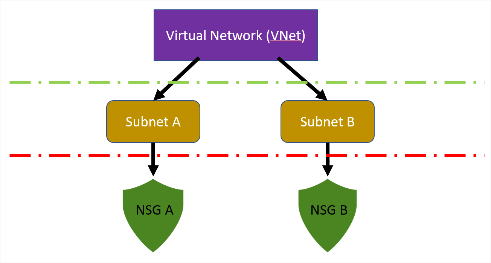

Your company plans to migrate the majority of its on-premises resources to Azure.  A small data center will remain on-premises and will need to be integrated into Azure network.  The architectural model needs to consider Azure network connectivity for several satellite offices.

You're going to produce a reference architectural pattern in Azure that can be used for the migration, and to provide a selection of the best options available in Azure that meets the organizations requirements for hybrid connectivity.

In this unit, you'll explore on-premises connectivity in the Azure platform, see an overview of Azure Virtual Networks, and how to use VPN Gateways to secure traffic to an on-premises network.

## About Azure Virtual Networks

The Azure virtual network (VNet) provides a framework of tools and resources to build a cloud-based network architecture for your organization.  Azure VNets are a secure virtual communication channel for all permitted Azure resources within your subscription. You'll use the VNet to:

- connect virtual machines to the internet,
- provide secure communications between Azure resources hosted in different datacenters and regions,
- isolate and manage Azure resources,
- connect to on-premises computers, and
- manage network traffic.

All Azure resources within a VNet, by default, have outbound connectivity to the internet.  External inbound communication is supplied via a public facing endpoint, and a private endpoint is used for internal resources.

The Azure VNet component model gives you the ability to configure each VNet into a highly sophisticated architecture. There are two components at the core of the VNet component model: **VNet Subnets (subnets)** and **Network Security Groups (NSGs)**.

- **VNet Subnet** - Let you segment your virtual network address space into usable sub-networks, each with their own allocated Azure resources.   As you would find in an on-premises network, VNet subnets are used to organize your network usage and access.
- **Network Security Groups** - Protect your subnets by acting as a firewall. They filter all traffic flow between Azure Resources, and the inbound and outbound requests to and from Azure resources.

## Traffic management and Azure VNets

Any network, whether on-premises or in the cloud, requires a method for managing the flow, direction, and type of traffic that passes through it. Think of traffic management like the traffic lights at a junction on a major road. Traffic lights control the flow and direction of traffic at the junction using a signaling system. Now imagine this road without the lights, it would be complete mayhem and most likely bring the entire road to a complete standstill. Network traffic for the IT estate is no different, traffic flow must be properly managed, the direction and type of network traffic properly configured.

Azure VNets give you this ability by automatically creating routing tables within each subnet, and adding default system routes to those tables. The default routes can't be created or removed, but custom routes can be added. Custom routes allow you to override the default system routes.

Azure automatically creates the below default routes within each subnet in the virtual network:

| Source | Address prefixes | Next Hop Type |
| ---- |---|---|
| Default | Unique to the virtual network | Virtual Network |
| Default | 0.0.0.0/0 | Internet |
| Default | 10.0.0.0/8 | None |
| Default | 172.16.0.0/12 | None |
| Default | 192.168.0.0/16 | None |
| Default | 100.64.0.0/10 | None |

## Connecting Azure VNets

VNets in Azure can be connected to each other directly using a method known as peering. VNets can be peered across subscriptions and Azure regions. Once peered, resources in these networks communicate with each other as if they are in the same network. The traffic gets routed between resources in a peered VNet using only private IP addresses. It does this by routing traffic through the Azure network, and keeping the connection private as part of the Azure backbone network. The backbone network provides low latency and high-bandwidth network connections.

## VPN Gateways on Azure

When working towards integrating your on-premises network with Azure, there needs to be a bridge between them. VPN gateways are one of the services in Azure that provide this functionality. A VPN gateway is a special type of gateway that can send encrypted traffic between the two networks. Gateways support multiple connections which route the VPN tunnels using the available bandwidth, although a VNet can only have one gateway assigned. It's also possible to use a VPN gateway for VNet-to-VNet connections in Azure.

A VPN gateway is made up of several virtual machines (two or more) that get deployed to specific subnets that you create when provisioning the VNet gateway, this subnet is known as the gateway subnet. The VMs get default configuration properties applied for routing and gateway services explicit to the provisioned gateway, these VMs can't be directly configured.

Authentication between the on-premises VPN device and the Azure VPN gateway uses a secret ASCII string up to 128 characters.

When deploying a gateway, it's worth noting that provisioning can take up to 45 minutes. When creating a gateway, there are several topologies available, known as the gateway type. These determine what will be configured and what the expected connection type will be:

- **Site-to-Site**
connections are used for cross-premises and hybrid network configurations. This connection topology requires an on-premises VPN device to have a publicly accessible IP address and it must be located outside the NAT. The connection uses a secret, an ASCII string up to 128 characters, to authenticate between the gateway and the vpn device.

- **Multi-Site**
connections are similar to site-to-site connections but have a slight variation. It supports more than one vpn connection to on-premises vpn devices, designed for multiple on-premises sites instead of having multiple gateways. This connection topology requires a RouteBased VPN known as the dynamic gateway, it's important to note that all connections route through and share the available bandwidth.

- **Point-to-Site**
connections are used for connecting from an individual client machine. This connection topology, once provisioned, gets established by a client computer starting the connection and is designed to connect remote locations. The client computer must be authenticated either through Azure AD or by using Azure Certificate Authentication. This model is typically used from home working or in the instance that only a few clients need to connect to the VNet in Azure.

- **VNet-to-VNet**
connections are used to connect between Azure VNets. This connection topology, unlike the others, doesn't require a public IP or VPN device. It can also be used in a multi-site configuration to establish combined cross-premises connections with inter-virtual network connectivity.

- **ExpressRoute**
creates a direct connection between your on-premises network and the Azure virtual network that does not use the internet. You can use it to seamlessly extend your local network across to the Azure virtual network space. The ExpressRoute service is offered by a number of third-party connectivity providers, and there are three different ExpressRoute connection types:

  - CloudExchange Co-location,
  - Point-to-point Ethernet Connection, and
  - Any-to-Any (IPVPN) Connection.

   

## VPN gateway deployment models

Setting up a VPN gateway requires the specific configuration and setup of multiple Azure resources. Some of resources can be configured separately, yet others have dependencies so the order of configuration is important.

A primary consideration when designing your VPN gateway is your choice of deployment tool.  Presently, there are two options available: classic and Resource Manager deployment models.

- The **classic** model required the setup and configuration of each resource independently and there was no grouping of related resources.   It required manual tracking of each resource and their dependencies used in your solution, which made it difficult to redeploy. This model now provides support for legacy gateways created before 2014.
- The **Resource Manager** model was introduced in 2014. It allowed resources to be grouped together, and brought with it the following improvements:
  - Grouping of resources,
  - Improved management of all resources for your solution,
  - Repeatability of your solution when redeploying,
  - Managing resource dependency.

Note, the two models are distinct from each other, and resources created in one model are not compatible with the other model.

Finally, the configuration will vary depending on the connectivity option that best suits your solution and should be considered against these factors:

- Azure supported services,
- Typical bandwidths,
- Protocols supported,
- Routing, and
- Connection resiliency.

You'll learn more about VPN gateway configuration and scenarios later in this module.

## VPN gateway reference architecture

The above image shows a reference architecture for connecting your on-premises network to Azure using a VPN Gateway. The chosen topology in this solution is a Site-to-Site connection so traffic flows through an IPsec VPN tunnel.

The architecture is composed of several components:

- The on-premises network,
- a VPN-appliance,
- an Azure Virtual Network, and
- an Azure VPN gateway.

The network architecture within Azure has been split across four areas: a web tier, a business tier, a data tier, and a management subnet.
