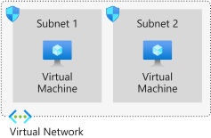
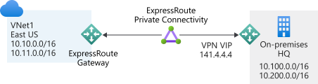
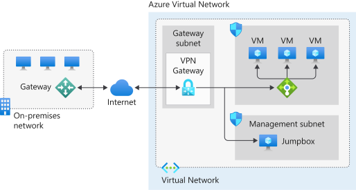

Your company plans to migrate most of its on-premises resources to Azure. However, a small datacenter must remain on-premises for integration into the Azure network. The architectural model needs to consider using Azure network connectivity for several satellite offices. You want to use a hybrid network architecture that grants access to both your on-premises and cloud-based resources.

To handle the migration, you'll produce a network integration plan for Azure that includes a selection of the best hybrid network options available in Azure. The options must meet the organization's requirements for hybrid connectivity.

In this unit, you explore on-premises connectivity on the Azure platform. You also get an overview of Azure Virtual Network, and see how to use Azure VPN Gateway to secure traffic to an on-premises network.

## About Azure Virtual Network

The Azure Virtual Network service has a specific set of tools and resources for building a cloud-based network architecture for your organization. Azure virtual networks provide a secure virtual communication channel for all permitted Azure resources within your subscription.

With an Azure virtual network, you can:

- Connect virtual machines to the internet.
- Provide secure communications between Azure resources hosted in various datacenters and regions.
- Isolate and manage Azure resources.
- Connect to on-premises computers.
- Manage network traffic.

By default, all Azure resources within a virtual network have outbound connectivity to the internet. External inbound communication must come through a public-facing endpoint. All internal resources use a private endpoint to access the virtual network.

A virtual network is composed of many elements. Including, but not limited to, network interfaces, load balancers, subnets, network security groups, and public IP addresses. These elements work together and enable secure, reliable network communication between your Azure resources, the internet, and on-premises networks.

  

## Traffic routing on an Azure virtual network

Outbound traffic from a subnet is routed based on the destination IP address. A routing table defines how the traffic routes and what happens next. A destination IP address can exist across multiple routing table prefix definitions (for example, 10.0.0.0/16 and 10.0.0.0/24). The router uses a sophisticated algorithm to find the longest prefix match. Traffic that's heading for a 10.0.0.6 address would resolve to the 10.0.0.0/24 prefix and is routed accordingly.

There are two principal routing tables: system and custom.

### System routing tables

Azure automatically creates a set of default routing tables for the virtual network and each subnet mask within the virtual network. These system routes are fixed and can't be edited or deleted. However, you can override the default settings by using a custom routing table.

A typical default routing table might look like this:

| Source | Address prefixes | Next hop type |
| ---- |---|---|
| Default | Unique to the virtual network | Virtual network |
| Default | 0.0.0.0/0 | Internet |
| Default | 10.0.0.0/8 | None |
| Default | 172.16.0.0/12 | None |
| Default | 192.168.0.0/16 | None |
| Default | 100.64.0.0/10 | None |

A routing table consists of a source, an address prefix, and a *next hop* type. All traffic that leaves the subnet uses the routing table to find out where it should go next. In effect, the traffic looks for the next hop in its journey.

A next hop defines what happens to the traffic flow next, based on the prefix. There are three types of next hop:

- **Virtual network**: The traffic is routed according to the IP address within the virtual network.
- **Internet**: The traffic is routed to the internet.
- **None**: The traffic is dropped.

### Custom routing tables

Apart from system-defined routing tables, you can also create custom routing tables. These user-defined routing tables override the default system table. There are limitations on the number of routing items you can have in a custom table.

The following table lists a few of the many limitations that apply to virtual networks:

| Resource | Default or maximum number |
| ---- | ---- |
| Virtual networks | 1,000 |
| Subnets per virtual network | 3,000 |
| Virtual network peerings per virtual network | 500 |
| Private IP addresses per virtual network | 65,536 |

Much like the system routing table, custom routing tables also have a next hop type. But the custom routing tables offer a few more options:

- **Virtual appliance**: This option is usually a virtual machine that runs a specific network application, such as a firewall.
- **Virtual network gateway**: Use this option when you want to send traffic to a virtual network gateway. A virtual network gateway type must be VPN. The type can't be Azure ExpressRoute, which requires setting a Border Gateway Protocol (BGP) routing process.
- **None**: This option drops the traffic rather than forwarding it.
- **Virtual network**: This option lets you override a default system routing.
- **Internet**: This option lets you specify that any prefix forwards traffic to the internet.

## Connect Azure virtual networks

You can connect your virtual networks in any of several ways. You can use Azure VPN Gateway or ExpressRoute, or you can use the peering method directly.

### Azure VPN Gateway

When you're working toward integrating your on-premises network with Azure, you need a bridge between them. VPN Gateway is an Azure service that provides this functionality. A VPN gateway can send encrypted traffic between the two networks. VPN gateways support multiple connections, which enable them to route VPN tunnels that use any available bandwidth. A virtual network can have only one gateway assigned. VPN gateways can also be used for connections between virtual networks in Azure.

Implementing a VPN gateway requires you to deploy two or more virtual machines to the subnet that you create when you set up the virtual network. In this instance, the subnet is also called the *gateway subnet*. Each virtual machine is assigned a default configuration for routing and gateway services, explicit to the provisioned gateway. You can't configure these virtual machines directly.

When you create a gateway, several topologies are available. These topologies, also known as *gateway types*, determine what's configured and the expected connection type.

#### Site-to-site

You use a site-to-site connection for cross-premises and hybrid-network configurations. This connection topology requires an on-premises VPN device to have a publicly accessible IP address, and must not be behind Network Address Translation (NAT). The connection uses a secret ASCII string of up to 128 characters, to authenticate between the gateway and the VPN device.

#### Multisite

A multisite connection is similar to a site-to-site connection, but with a slight variation. Multisite supports multiple VPN connections to your on-premises VPN devices. This connection topology requires a RouteBased VPN known as a dynamic gateway. It's important to note that, with a multisite configuration, all connections route through and share all available bandwidth.

#### Point-to-site

A point-to-site connection is suited to a remote individual client device that connects to your network. You must authenticate the client device either through Azure Active Directory or by using Azure certificate authentication. This model suits home working scenarios.

#### Network-to-network

You use a network-to-network connection to create connections between multiple Azure virtual networks. This connection topology, unlike the others, doesn't require a public IP or VPN device. You can also use a network-to-network connection in a multisite configuration to establish combined cross-premises connections with inter-virtual network connectivity.

### ExpressRoute

ExpressRoute creates a direct connection between your on-premises network and the Azure virtual network that doesn't use the internet. You use ExpressRoute to seamlessly extend your local network across to the Azure virtual network space. Many third-party connectivity providers offer the ExpressRoute service. There are three different ExpressRoute connection types:

- CloudExchange colocation
- Point-to-point Ethernet connection
- Any-to-any (IPVPN) connection

### Peering

Virtual networks can peer across subscriptions and Azure regions. After the virtual networks are peered, resources in these networks communicate with each other as if they're in the same network. The traffic is routed between resources in a peered virtual network by using only private IP addresses. Routing is achieved by routing traffic through the Azure network and keeping the connection private as part of the Azure backbone network. The backbone network provides low latency and high-bandwidth network connections.

## Site-to-site VPN gateway reference architecture

Although many reference architectures are available when you design a hybrid network, one popular architecture is the site-to-site configuration. The simplified reference architecture shown in the following diagram illustrates how you would connect an on-premises network to the Azure platform. The internet connection uses an IPsec VPN tunnel.

The architecture features several components:

- The **on-premises network** represents your on-premises Active Directory and any data or resources.
- The **gateway** is responsible for sending encrypted traffic to a virtual IP address when it uses a public connection.
- The **Azure virtual network** holds all your cloud applications and any Azure VPN gateway components.
- An **Azure VPN gateway** provides the encrypted link between the Azure virtual network and your on-premises network. An Azure VPN gateway consists of these elements:
  - Virtual network gateway
  - Local network gateway
  - Connection
  - Gateway subnet
- **Cloud applications** are the ones you've made available through Azure.
- An **internal load balancer**, located in the front end, routes cloud traffic to the correct cloud-based application or resource.

Using this architecture offers several benefits, including:

- Configuration and maintenance are simplified.
- Having a VPN gateway helps ensure that all data and traffic are encrypted between the on-premises gateway and the Azure gateway.
- The architecture can be scaled and extended to meet your organization's networking needs.

This architecture isn't applicable in all situations, because it uses an existing internet connection as the link between the two gateway points. Bandwidth constraints can cause latency issues that result from reuse of the existing infrastructure.
