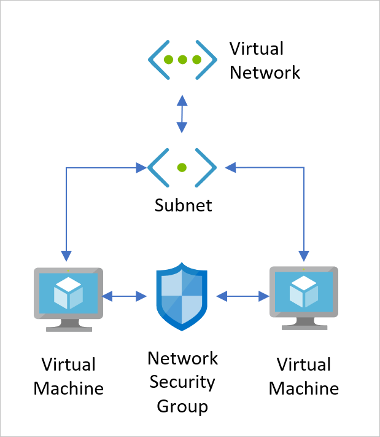

Your company plans to migrate the majority of its on-premises resources to Azure. A small data center will remain on-premises that will need to be integrated with the Azure network. The architectural model needs to consider Azure network connectivity for several satellite offices. You want to use a hybrid network architecture that grants access to both your on-premises, and cloud based, resources.

You're going to produce a network integration plan for Azure that can be used for the migration. The plan will include a selection of the best hybrid network options available in Azure that meet the organizations requirements.

In this unit, you'll explore on-premises connectivity in the Azure platform, see an overview of Azure Virtual Networks, and how to use VPN Gateways to secure traffic to an on-premises network.

## About Azure Virtual Networks

The Azure virtual network (VNet) is a service with a specific set of tools and resources for building a cloud-based network architecture for your organization. Azure virtual networks are a secure virtual communication channel for all permitted Azure resources within your subscription. With an Azure virtual network, you'll:

- connect virtual machines to the internet
- provide secure communications between Azure resources hosted in different datacenters and regions
- isolate and manage Azure resources
- connect to on-premises computers
- manage network traffic

By default all Azure resources within a virtual network have outbound connectivity to the internet. External inbound communication is supplied via a public facing endpoint, and a private endpoint is used for internal resources. You can configure and combine virtual networks into a highly sophisticated architecture.

While a virtual network is composed of many elements including virtual machines, nics, load balancers, and public IP addresses. There are two key features of any virtual network that should be mentioned. **Virtual Network Subnets (Subnets)** and **Network Security Groups (NSGs)**.

  

- **Virtual Network Subnet** - Let you segment your virtual network address space into usable sub-networks. As you would find in an on-premises network, virtual network subnets are used to organize your network usage and access.
- **Network Security Groups** - Protect your subnets by filtering all traffic flow between Azure Resources.

## Routing traffic on an Azure virtual network

Outbound traffic from a subnet is routed based on the destination IP address. A routing table defines how the traffic is routed and what happens next. Since a destination IP address could exist across multiple routing table prefix definitions, for example 10.0.0.0/16 and 10.0.0.0/24, it uses an algorithm to find longest prefix match. So traffic heading for a 10.0.0.6 address would resolve to the 10.0.0.0/24 prefix, and would be routed accordingly.

There are two principle routing tables: System and Custom.

### System routing tables

By default, Azure will automatically create a set of default routing tables for the virtual network, and for each subnet mask within the virtual network. These system routes are fixed and cannot be overridden or deleted. However you can override these default settings using a custom routing table.

A typical default routing table might look like this:

| Source | Address prefixes | Next Hop Type |
| ---- |---|---|
| Default | Unique to the virtual network | Virtual Network |
| Default | 0.0.0.0/0 | Internet |
| Default | 10.0.0.0/8 | None |
| Default | 172.16.0.0/12 | None |
| Default | 192.168.0.0/16 | None |
| Default | 100.64.0.0/10 | None |

A routing table is made up of a source, an address prefix and a next hope type. All traffic leaving the subnet uses the routing table to find out where it should go next, what the next hop in its journey will be.

There are three principal types of next hop. A next hop defines what happens to the traffic flow next, based on the prefix. The three types of next hop are:

- **Virtual network**: traffic is routed according to the IP address within the virtual network
- **Internet**: directs the traffic out to the internet
- **None**: the traffic is dropped

### Custom routing tables

As well as the system defined routing tables, you can also create custom routing tables. These user-defined routing tables can override the default system table. There are some limitations on the number of routing items you can have in a custom table.

| Resource | Default/Maximum |
| --- | --- |
| Virtual networks | 1,000 |
| Subnets per virtual network | 3,000 |
| Virtual network peerings per virtual network | 500 |
| Private IP addresses per virtual network | 65,536 |

Much like the system routing table, custom routing tables also have a next hop type. These differ from the system routing table as there are a few more options:

- **Virtual appliance**: this is usually a VM that runs a specific network application, for instance a firewall.
- **Virtual network gateway**: use this when you want to send traffic to a virtual network gateway. A virtual network gateway must be of a type VPN. It cannot be of type ExpressRoute, since this requires setting a BGP.

> [!NOTE]
> The limits were recently increased and may have changed. So please check the Microsoft docs website for the current virtual networking limits.

## Connecting Azure virtual networks

Virtual networks in Azure can be connected to each other via a VPN gateway, ExpressRoute, or directly using a method known as peering. Virtual networks can be peered across subscriptions and Azure regions. Once peered, resources in these networks communicate with each other as if they are in the same network. The traffic gets routed between resources in a peered virtual network using only private IP addresses. It does this by routing traffic through the Azure network, and keeping the connection private as part of the Azure backbone. The backbone network provides low latency and high-bandwidth network connections.

## VPN Gateways on Azure

When working towards integrating your on-premises network with Azure, there needs to be a bridge between them. VPN gateways are one of the services in Azure that provide this functionality. A VPN gateway is a special type of gateway that encrypts traffic between the two networks. Gateways support multiple connections which route the VPN tunnels using the available bandwidth, although a virtual network can only have one gateway assigned. It's also possible to use a VPN gateway for virtual network-to-virtual network connections in Azure.

A VPN gateway is made up of virtual machines (two or more) deployed to specific subnets that you create when provisioning the virtual network gateway, this subnet is known as the gateway subnet. The VMs get default configuration properties applied for routing and gateway services explicit to the provisioned gateway, these VMs can't be directly configured.

Authentication between the on-premises VPN device and the Azure VPN gateway uses a secret ASCII string up to 128 characters.

When creating a gateway, there are several topologies available, known as the gateway type. The topology determines what will be configured and what the expected connection type will be:

- **Site-to-Site** connections are used for cross-premises and hybrid network configurations. This connection topology requires an on-premises VPN device to have a publicly accessible IP address and it must not be located behind a NAT. The connection uses a secret, an ASCII string up to 128 characters, to authenticate between the gateway and the vpn device.

- **Multi-Site** connections are similar to site-to-site connections, but have a slight variation. Multi-site supports more than one vpn connection to on-premises vpn devices.  It's designed for multiple on-premises sites instead of having multiple gateways. This connection topology requires a RouteBased VPN known as the dynamic gateway. It's important to note that all connections route through and share all the available bandwidth.

- **Point-to-Site** connections are used for connecting from an individual client machine. This connection topology, once provisioned, gets established by a client computer starting the connection and is designed to connect remote locations. The client computer must be authenticated either through Azure AD or by using Azure Certificate Authentication. This model is typically used from home working or in the instance that only a few clients need to connect to the virtual network in Azure.

- **VNet-to-VNet** connections are used to connect between Azure virtual networks. This connection topology, unlike the others, doesn't require a public IP or VPN device. It can also be used in a multi-site configuration to establish combined cross-premises connections with inter-virtual network connectivity.

- **ExpressRoute** creates a direct connection between your on-premises network and the Azure virtual network that does not use the internet. You can use it to seamlessly extend your local network across to the Azure virtual network space. The ExpressRoute service is offered by a number of third-party connectivity providers, and there are three different ExpressRoute connection types:

  - CloudExchange Co-location
  - Point-to-point Ethernet Connection
  - Any-to-Any (IPVPN) Connection

   

## Using Resource Manager for VPN gateway deployment

Setting up a VPN gateway requires the specific configuration and setup of multiple Azure resources. Some of resources can be configured separately, yet others have dependencies so the order of configuration is important.

Resource Manager simplifies the setup and configuration of a VPN gateway and has the following features:

- Grouping of resources
- Improved management of all resources for your solution
- Repeatability of your solution when redeploying
- Managing resource dependency

Finally, the configuration will vary depending on the connectivity option that best suits your solution and should be considered against these factors:

- Azure supported services
- Typical bandwidths
- Protocols supported
- Routing
- Connection resiliency

You'll learn more about VPN gateway configuration and scenarios later in this module.

## VPN gateway reference architecture

The above image shows a reference architecture for connecting your on-premises network to Azure using a VPN Gateway. The chosen topology in this solution is a Site-to-Site connection so traffic flows through an IPsec VPN tunnel.

The network architecture within Azure has been split across four areas: a web tier, a business tier, a data tier, and a management subnet.

The architecture is composed of several components:

- **The on-premises network**
- **Azure Stack**, responsible for sending encrypted traffic to a virtual IP address when using a public connection.
- **A VPN appliance**, is the externally facing service that connects to your on-premises network.
- **A Virtual Network**, which connects any cloud applications, and any Azure VPN gateway components.
- **An Azure VPN gateway**, provides the link between the virtual network and the on-premises network.  It includes these elements:
  - Virtual network gateway
  - Local network gateway
  - Connection
  - Gateway subnet
- **Cloud application**, this is the Azure hosted application.
- **Internal load balancer** situated in the front-end, it routes cloud traffic through the application.
