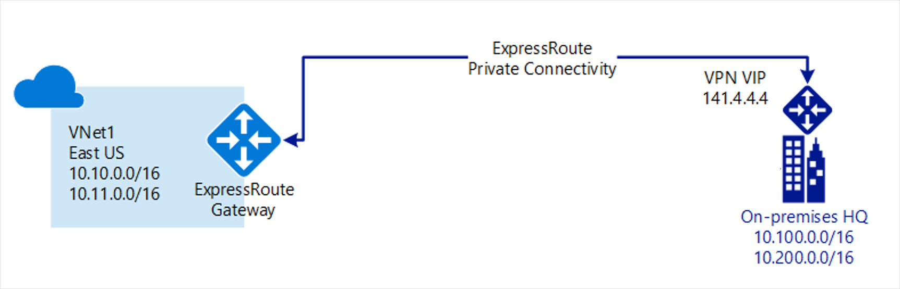

Your company is migrating some on-premises resources to Azure, as part of this migration there is a central datacenter that will remain on-premises but will need connectivity to Azure. The architectural model also needs to consider Azure network connectivity for several satellite offices.

Your work so far has identified a need for a resilient high-bandwidth connection from the on-premises network to Azure. As part of your initial investigations, you found ExpressRoute could suit your organizations hybrid network needs.

In this unit, you'll explore on-premises hybrid connectivity using Azure ExpressRoute, an overview of the components available in ExpressRoute, and walkthrough of a reference architecture supporting this topology.

## What is Azure ExpressRoute

Azure ExpressRoute is a service in Azure that allows you to extend your on-premises networks over a private connection. This connection is facilitated by a connectivity provider. ExpressRoute extends beyond Azure, and allows you to establish connections to other Microsoft cloud services like Office 365.

 

ExpressRoute connections do not go over the public internet thus giving greater resilience, faster speeds, higher security, and lower latency. The connections can be from:

- **any-to-any network** - This method allows you to integrate your WAN with Azure using an IPVPN provider. These providers offer connectivity between branch offices and datacenters. Once enabled the connection to Azure will be similar to any other branch office connected via the WAN.
- **point-to-point ethernet network** - This method connects on-premises datacenters and offices to Azure through a point-to-point ethernet link.
- **virtual cross-connection via a co-located facility (CloudExchange)** - This method allows you to cross-connect to Azure using the Ethernet exchange provided at your co-location.

## Azure ExpressRoute circuits

Traffic management and routing in ExpressRoute is configured using circuits. ExpressRoute circuits are the logical connection between on-premises infrastructure and Azure. You can have multiple circuits, which can exist across multiple regions. ExpressRoute circuits also support connections through multiple connectivity providers.

Each circuit has multiple routing domains and peerings associated to it: Azure Public, Azure Private, and Microsoft. Each peering has identical properties using a pair of routers (active-active or load sharing) for high availability purposes. Circuits don't map to anything physical.

- **Azure private peering**
Relates to Azure resources deployed into a virtual network. Private peering is a trusted extension of your core network in Azure with bi-directional connectivity. Peering in this model allows you to connect to virtual machines and cloud services directly on their private IP addresses.

- **Microsoft peering**
Provides connectivity to all Microsoft online services: Office 365, Dynamics 365, and Azure PaaS services. This model requires a public IP address owned by you or your connectivity provider, adhering to a set of pre-defined rules.

Each circuit is assigned a unique GUID called a service key. This key is the only information exchanged between the three parties and is a one-to-one mapping for each circuit.

The bandwidth available to each circuit is fixed to:

- 50 Mbps,
- 100 Mbps,
- 200 Mbps,
- 500 Mbps,
- 1 Gbps, or
- 10 Gbps.

This bandwidth gets shared across any peering in the circuit, and is mapped to the connectivity provider and peering location.

## Coexisting connections and Azure ExpressRoute

Using ExpressRoute, you can connect your WAN to Azure using a private connection.  This connection can exist in conjunction with any of your existing Site-to-Sites, Point-to-=Site or VPN-to-VPN connections.

You can use the existing connection, say a Site-to-Site VPN, as a failover should there be an issue.  Or you can use the existing connection to provide access to off-site connections.

## Azure ExpressRoute and virtual networks

ExpressRoute can be linked into a virtual network in Azure, each VNet allows up to four ExpressRoute circuits. The circuits connected to the VNet can be in different regions or subscriptions. Up to 10 VNets can be associated to an ExpressRoute circuit.

Each VNet should:

- have an associated VPN gateway.
- enable private peering for the ExpressRoute circuit.

This method is typically used to connect multiple subscriptions, for example, prod, dev, and test, into the on-premises network.

## Azure ExpressRoute reference architecture

The above image shows a reference architecture for connecting your on-premises network to Azure using ExpressRoute.

The architecture model includes of several components:

- The on-premises network,
- local-edge routers,
- an ExpressRoute Circuit,
- Microsoft-edge routers, and
- an ExpressRoute Gateway.

The network architecture shown here has been split across four areas: a web tier, a business tier, a data tier, and a management subnet.

## Gateway and vNET configurations

In a scenario where a VPN Gateway is to be configured for failover the following are important considerations:

- The ExpressRoute and VPN gateway resources must be in the same VNet.
- The same pre-requisites apply to this scenario as they do to ExpressRoute and VPN Gateways.

## Reference architecture for Azure ExpressRoute with VPN failover

The above image shows a reference architecture for connecting your on-premises network to Azure using ExpressRoute with a VPN failover. The chosen topology in this solution is a Site-to-Site connection with high traffic flow.

In this model, traffic will use the ExpressRoute private connection.  If there is a loss of connectivity through the ExpressRoute circuit; the gateway subnet will fail over to the Site-to-Site VPN gateway circuit.
