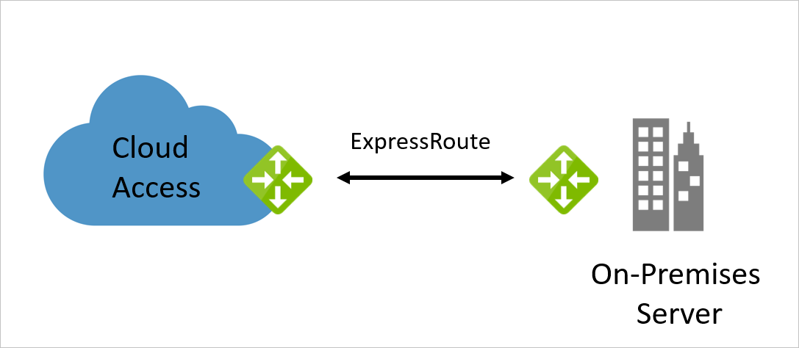

Your company is migrating some of its on-premises resources to Azure. As part of this migration, the central datacenter must remain on-premises with a connection to Azure. The architectural model also needs to consider Azure network connectivity for several satellite offices.

So far, you've identified a need for a resilient high-bandwidth connection from the on-premises network to Azure. In your initial investigations, you found ExpressRoute could suit your organization's hybrid network needs.

In this unit, you'll explore on-premises hybrid connectivity using ExpressRoute, an overview of the components available in ExpressRoute, and a walkthrough of a reference architecture supporting this topology.

## What is ExpressRoute?

ExpressRoute is an Azure service that allows you to extend on-premises networks over a private connection. A connectivity provider helps this connection. ExpressRoute extends beyond Azure and lets you establish connections to other Microsoft cloud services like Office 365.

 

ExpressRoute connections don't use the public internet. Using a dedicated connection between your on-premises network and Azure provides greater resilience, faster speeds, higher security, and lower latency.

### ExpressRoute connectivity types

There are three ExpressRoute connectivity types, each serving a different need.

**Any-to-any** 

The any-to-any network allows you to integrate your WAN with Azure using an IPVPN provider. This connection type offers links between branch offices and datacenters. When it's enabled, the connection to Azure is similar to any other branch office connected via the WAN.

**Point-to-point**

The point-to-point ethernet network method connects on-premises datacenters and offices to Azure through a point-to-point ethernet link.

**CloudExchange**

Use the CloudExchange method to cross-connect to Azure using the Ethernet exchange provided by your colocation facility.

## ExpressRoute circuits

With ExpressRoute, the logical connection between your on-premises network and your Azure network is called a circuit. Traffic management and routing in ExpressRoute is configured using circuits. You can have multiple circuits, which exist across various regions. ExpressRoute circuits also support connections through many connectivity providers.

Each circuit has multiple routing domains and peerings associated with it. For example, Azure Public, Azure Private, and Microsoft. Each peering has identical properties. Each circuit uses a pair of routers in either an active-active or load-sharing configuration, which creates a high availability environment. An ExpressRoute circuit doesn't map to anything physical.

### Azure private peering

Private peering is a trusted extension of your core network in Azure with bidirectional connectivity. Peering in this model allows you to connect to virtual machines and cloud services directly on their private IP addresses.

### Microsoft peering

Microsoft peering provides connectivity to all Microsoft online services: Office 365, Dynamics 365, and Azure PaaS. This model requires a public IP address, owned by you or your connectivity provider, which adheres to a set of predefined rules.

Each circuit is assigned a Globally Unique Identifier (GUID) called a service key. This key is the only information exchanged between the three parties and is a one-to-one mapping for each circuit.

### Circuit bandwidth

You can have as many circuits as you need, each matching the bandwidth required.  For example, you may want a higher bandwidth between your datacenter and the cloud, but a lower bandwidth for your satellite offices.  Bandwidth speeds come in fixed tiers:

- 50 Mbps
- 100 Mbps
- 200 Mbps
- 500 Mbps
- 1 Gbps
- 10 Gbps
- 100 Gbps

The bandwidth gets shared across any peering in the circuit, and is mapped to the connectivity provider and peering location.

### Coexisting connections and ExpressRoute

To use ExpressRoute, you must have a private connection, provided by a connectivity partner. However, ExpressRoute can exist alongside any of your current site-to-site, point-to-site, or VPN-to-VPN connections.

## ExpressRoute reference architecture

The reference architecture illustrated below shows how to connect your on-premises network to your Azure virtual networks.

The architecture model includes several components:

- The **on-premises network** is your local Active Directory managed network
- **Local-edge routers** connect your on-premises network to the connectivity provider's circuit
- An **ExpressRoute circuit**, supplied by your connectivity provider, operates as a Layer 3 circuit. It provides the link between the Azure edge routers and your on-premises edge router
- The **Microsoft-edge routers** are the cloud-side connection between your on-premises network and the cloud. There are always two edge routers providing a highly available active-active connection
- The **Azure virtual network** is where you'll segment your network and assets into tiers.  Each application tier, or subnet, can manage specific business operations. For example, web, business, and data

## Is ExpressRoute right for you?

There are many things to consider when evaluating whether to switch up to ExpressRoute.

### Benefits

The following benefits come from implementing ExpressRoute in your organization:

- ExpressRoute is better suited to high-speed and critical business operations
- ExpressRoute circuits support a maximum bandwidth of 100 Gbps
- It provides dynamic scalability to meet organizational needs
- ExpressRoute uses level 3 connectivity and security standards

### Considerations

The following list identifies a few key considerations:

- The setup and configuration for ExpressRoute is more complex, and will require collaboration with the connectivity provider
- ExpressRoute requires the on-premises installation of high-bandwidth routers
- The ExpressRoute circuit is handled, and managed by the connectivity provider
- ExpressRoute doesn't support the hot standby routing protocol (HSRP). You'll need to enable a BGP configuration
- ExpressRoute operates on layer 3 and requires a network security appliance to manage threats
- Monitoring the connectivity between your on-premises network and Azure must use the Azure Connectivity Toolkit
- To improve network security, ExpressRoute requires network security appliances between the provider's edge routers and your on-premises network
- ExpressRoute has some default maximum limits. Check the Microsoft website for Azure subscription service limits to get the current values, as these are subject to change as Azure improves
