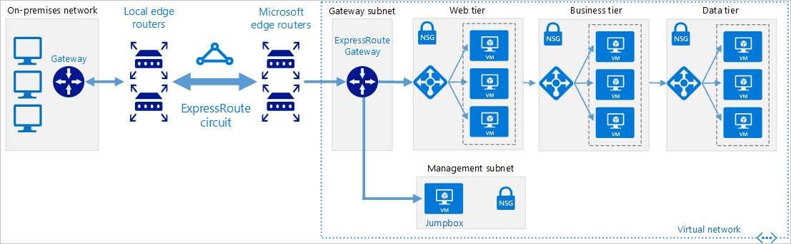

Your company is migrating some of its on-premises resources to Azure. As part of this migration, the central datacenter will remain on-premises with a connection to Azure. The architectural model also needs to consider Azure network connectivity for several satellite offices.

Your work so far has identified a need for a resilient high-bandwidth connection from the on-premises network to Azure. As part of your initial investigations, you found ExpressRoute could suit your organizations hybrid network needs.

In this unit, you'll explore on-premises hybrid connectivity using ExpressRoute, an overview of the components available in ExpressRoute, and walkthrough of a reference architecture supporting this topology.

## What is ExpressRoute

ExpressRoute is a service in Azure that allows you to extend your on-premises networks over a private connection. This connection is facilitated by a connectivity provider. ExpressRoute extends beyond Azure and enables you to establish connections to other Microsoft cloud services like Office 365.

 

ExpressRoute connections do not go over the public internet, thus giving greater resilience, faster speeds, higher security, and lower latency. The connections can be from:

- **any-to-any network** - This method allows you to integrate your WAN with Azure using an IPVPN provider. These providers offer connectivity between branch offices and datacenters. Once enabled the connection to Azure will be similar to any other branch office connected via the WAN.
- **point-to-point ethernet network** - This method connects on-premises datacenters and offices to Azure through a point-to-point ethernet link.
- **virtual cross-connection via a colocated facility (CloudExchange)** - This method allows you to cross-connect to Azure using the Ethernet exchange provided by your colocation.

## ExpressRoute circuits

Traffic management and routing in ExpressRoute is configured using circuits. ExpressRoute circuits are the logical connection between on-premises infrastructure and Azure. You can have multiple circuits, which can exist across various regions. ExpressRoute circuits also support connections through numerous connectivity providers.

Each circuit has multiple routing domains and peerings associated with it: Azure Public, Azure Private, and Microsoft. Each peering has identical properties using a pair of routers (active-active or load sharing) for high availability purposes. Circuits don't map to anything physical.

- **Azure private peering**
Relates to Azure resources deployed into a virtual network. Private peering is a trusted extension of your core network in Azure with bi-directional connectivity. Peering in this model allows you to connect to virtual machines and cloud services directly on their private IP addresses.

- **Microsoft peering**
Provides connectivity to all Microsoft online services: Office 365, Dynamics 365, and Azure PaaS services. This model requires a public IP address owned by you or your connectivity provider, adhering to a set of pre-defined rules.

Each circuit is assigned a unique GUID called a service key. This key is the only information exchanged between the three parties and is a one-to-one mapping for each circuit.

The bandwidth available to each circuit is fixed to:

- 50 Mbps
- 100 Mbps
- 200 Mbps
- 500 Mbps
- 1 Gbps
- 10 Gbps
- 100 Gbps

This bandwidth gets shared across any peering in the circuit, and is mapped to the connectivity provider and peering location.

## Coexisting connections and ExpressRoute

To use ExpressRoute, you must use a private connection, provided by a connectivity partner. However, ExpressRoute can exist alongside any of your existing site-to-site, point-to-site, or VPN-to-VPN connections.

## ExpressRoute reference architecture

The above image shows a reference architecture for connecting your on-premises network to Azure using ExpressRoute.

The architecture model includes several components:

- **The on-premises network**, your on-premises network.
- **Local-edge routers**, connects your on-premises network to the connectivity providers circuit.
- **An ExpressRoute Circuit**, a layer 2 or 3 circuit provided by the connectivity provider. It provides the link between the Azure edge routers and your on-premises edge router.
- **Microsoft-edge routers**, are the cloud-side connection between your on-premises network and the cloud. There are always two edge-routers in a highly available active-active connection.
- **An ExpressRoute Gateway**.

### Considerations

When evaluating the suitability of ExpressRoute, you should take into consideration:

- It doesn't support the hot standby routing protocol (HSRP). You will need to enable a BGP configuration.
- ExpressRoute operates on layer 3 and will require a network security appliance to manage threats.
- Monitoring the connectivity between your on-premises network and Azure must use the Azure Connectivity Toolkit.
- Network security appliances are needed between the provider's edge routers and your on-premises network. This will improve your network security.
- ExpressRoute has some default or maximum limits. Check the MS web set site for Azure subscription service limits for the most up-to-date values as these change as Azure is improved.

## Gateway and virtual network configurations

In a scenario where a VPN Gateway is to be configured for failover, the following are important considerations:

- The ExpressRoute and VPN gateway resources must be in the same virtual network.
- The same pre-requisites apply to this scenario as they do to ExpressRoute and VPN Gateways.

## Reference architecture for ExpressRoute with VPN failover

ExpressRoute comes with a high level of availability, with dual ExpressRoute gateways. However, even with this level of resiliency built into the Azure side of the network, connectivity can still be interrupted. One of the ways to remedy this is to provide a VPN failover service. 

Using the above reference architecture, you can see how to implement a VPN failover between your on-premises gateway and the Azure virtual network gateway.

The above image shows a reference architecture for connecting your on-premises network to Azure using ExpressRoute with a VPN failover. The chosen topology in this solution is a Site-to-Site connection with high traffic flow.

In this model, traffic will use the ExpressRoute private connection. If there is a loss of connectivity through the ExpressRoute circuit; the gateway subnet will fail over to the Site-to-Site VPN gateway circuit (as indicated by the dotted line from the gateway to the VPN Gateway in the Azure virtual network).

Once the connection via the ExpressRoute circuit is restored, traffic will automatically switch over.
