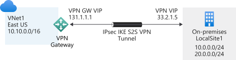
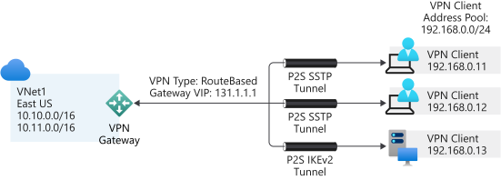
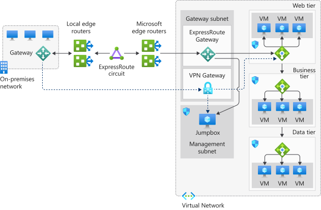
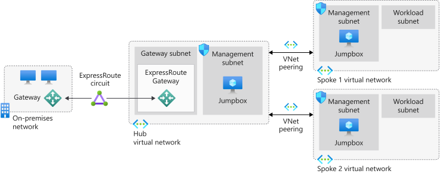

Your organization is keen to continue with migration to the cloud. You've explored the merits of using ExpressRoute to provide a dedicated and high-speed connection between your on-premises network and Azure.

Due diligence requires you to explore the other hybrid architecture options that are available to connect your on-premises network to Azure.

In this unit, you'll:

- Gain an understanding of virtual private network connections
- Look at a resiliency option for ExpressRoute
- Consider the merits of hub-spoke network topology

## What is a hybrid network architecture?

A hybrid network is a term used when two different network topologies combine to form a single cohesive network. With Azure, a hybrid network represents the merging or combination of an on-premises network with an Azure virtual network. It allows the continued use of your existing infrastructure while gaining all the benefits of cloud-based computing and access.

There are several reasons why you might want to adopt a hybrid network solution. The two most common are: migration from a pure on-premises network to a pure cloud-based network and an extension of your on-premises network and resources to support the cloud services.

Whatever your motivations for adding cloud services to your infrastructure, there are several architectures to consider.  We covered ExpressRoute in the previous unit. The others you'll find are:

- Azure VPN Gateway
- ExpressRoute with VPN failover
- Hub-spoke network topology

## Azure VPN Gateway

An Azure VPN gateway (virtual network gateway) allows site-to-site and point-to-site VPN connectivity between your on-premises network and Azure.  

A VPN or virtual private network is a well established and understood network architecture.

A VPN gateway uses your existing connection to the internet. However, all communication is encrypted using the Internet Key Exchange (IKE) and the Internet Protocol Security (IPsec) protocols. You can only have one virtual network gateway per virtual private network.  

When setting up a virtual network gateway, you must specify if it's either VPN or ExpressRoute.  

The VPN type depends on the type of connection topology you need. For example, if you want to create a point-to-site (P2S) or a point-to-point (P2P) gateway, you'll use a **RouteBased** type.  There are two VPN types:

- **PolicyBased**: this VPN type uses an IPsec tunnel to encrypt data packets.  Configuration of the policy uses address prefixes drawn from your Azure virtual network and your on-premises network
- **RouteBased**: this VPN type uses the routing or IP forwarding tables to route data packets to the correct tunnel. Each tunnel encrypts and decrypts all packets

After you've specified the **VPN type** for the virtual network gateway, it can't be altered. If you have to make a change, you'll need to delete the virtual network gateway and create it again.

### Site-to-site

All site-to-site gateway connections use an IPsec/IKE VPN tunnel to create a connection between Azure and your on-premises network. For a site-to-site connection to work, you'll need an on-premises VPN device with a publicly accessible IP address.

### Point-to-site

A point-to-site gateway connection creates a secured connection between an individual device and your Azure virtual network. This gateway type is suited to remote workers; for example, users attending a conference or working from home. A point-to-point network doesn't require a dedicated on-premises VPN device.

### Benefits

Here are some of the benefits of using a VPN connection:

- It's a well-known technology, which is easy to configure and maintain
- All data traffic is encrypted
- It's better suited to lighter data traffic loads

### Considerations

The following items should be considered when evaluating the use of this hybrid architecture.

- A VPN connection uses the internet
- Potential latency issues, depending on bandwidth size and usage
- Azure supports a maximum bandwidth of 1.25 Gbps
- For site-to-site connections, you need a local VPN device

## ExpressRoute with VPN failover

One of the guarantees of using ExpressRoute is that it provides a high level of availability. Each ExpressRoute circuit comes with dual ExpressRoute gateways. However, even with this level of resiliency built into the Azure side of the network, connectivity might be interrupted. One way to remedy this situation, and maintain connectivity, is to provide a VPN failover service.

The merging of the VPN connection and ExpressRoute improves the resiliency of your network connection. When operating under normal conditions, ExpressRoute behaves precisely like a regular ExpressRoute architecture, with the VPN connection remaining dormant. If the ExpressRoute circuit fails or goes offline, the VPN connection takes over, which ensures network availability under all circumstances. When the ExpressRoute circuit is restored, all traffic reverts to using the ExpressRoute connection.

### Reference architecture for ExpressRoute with VPN failover

The following image illustrates how to connect your on-premises network to Azure using ExpressRoute with a VPN failover. The chosen topology in this solution is a VPN-based site-to-site connection with high traffic flow.

In this model, all network traffic routes through the ExpressRoute private connection. When connectivity is lost on the ExpressRoute circuit, the gateway subnet automatically fails over to the site-to-site VPN gateway circuit. This scenario is indicated by the dotted line from the gateway to the VPN gateway in the Azure virtual network.

When the ExpressRoute circuit is restored, traffic automatically switches back from the VPN gateway.

### Benefits

The following benefit is available when you implement ExpressRoute with a VPN failover:

- It creates a resilient, high availability network

### Considerations

When you implement an ExpressRoute with VPN failover architecture, think about the following considerations:

- When a failover occurs, bandwidth reduces to VPN connection speeds
- The ExpressRoute and VPN gateway resources must be in the same virtual network
- There's a highly complex configuration
- Needs both an ExpressRoute connection and a VPN connection
- Requires a redundant Azure VPN gateway and local VPN hardware

    > Note: The redundant VPN gateway incurs payment charges even when it's not being used.

## Hub-spoke network topology

The hub-spoke network topology allows you to structure the workloads carried out by your servers. It uses a single virtual network as the hub, which is also connected to your on-premises network using either a VPN or ExpressRoute. The spokes are other virtual networks peered with the hub. Each spoke can be assigned specific workloads, while the hub is used for shared services.

The hub and each spoke can be implemented in separate subscriptions or resource groups and peered together.

This model uses one of the three previous approaches: VPN, ExpressRoute, and ExpressRoute with VPN failover. The respective benefits and challenges associated should be combined with the following.

### Benefits

Implementing a hub-spoke architecture has the following benefits:

- Use of sharing and centralized services on the hub might reduce the need for duplication on the spokes, which can reduce costs
- Subscription limits are overcome by peering virtual networks
- The hub-spoke model allows for the separation of organizational work areas into dedicated spokes, such as SecOps, InfraOps, and DevOps

### Considerations

Consider the following item when you evaluate the use of this hybrid architecture:

- Look at the services that are shared on the hub and what remains on the spokes
