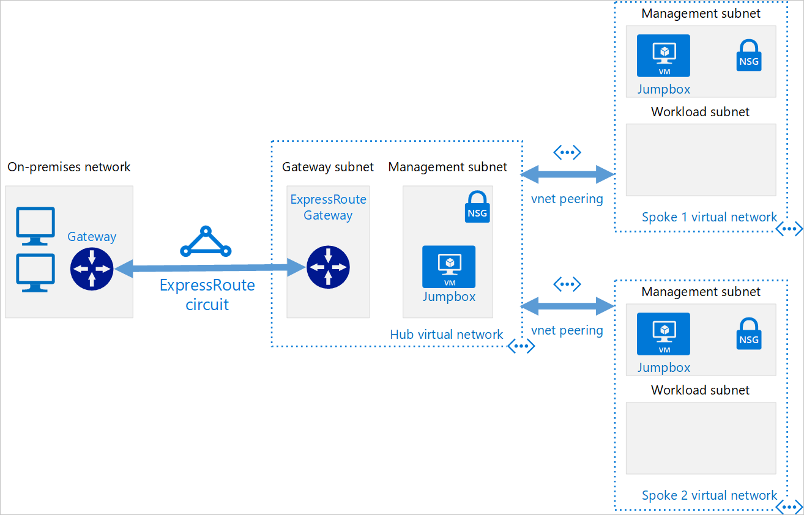

Your organization is keen to proceed with the migration to the cloud. You have explored the merits of using ExpressRoute to provide a dedicated and high-speed connection between your on-premises network and Azure.

Due diligence requires you to explore the other hybrid architecture options that are available to connect your on-premises network to Azure.

In this unit, you'll:

- Gain an understanding of VPN connections
- Touch on ExpressRoute benefits and considerations
- Look at a resiliency option for ExpressRoute
- Consider the merits of hub-spoke network topology.

## What is a hybrid network architecture

A hybrid architecture allows organizations to benefit from using both cloud and on-premises resources during a migration process. It provides the capability to move data assets and resources to the cloud immediately, while the on-premises servers are moved later.

There are several architectures to consider.  We covered ExpressRoute in the previous unit. The others you will find are:

- VPN Connections
- ExpressRoute with VPN failover
- Hub-spoke network topology

## VPN Connections

A VPN or virtual private network provides a secure connection between your on-premises network and the Azure virtual network. This is a well established and understood network architecture.

To establish a Site-to-Site (S2S) cross-premises connection, you will need to use a VPN gateway. A VPN gateway provides an encrypted connection between your on-premises and Azure virtual networks. The connection uses your existing internet connection.

This diagram shows a typical VPN connection.

### Benefits

Here are some of the benefits of using a VPN connection:

- It's a well know technology, which is easy to configure, and maintain.
- All data traffic is encrypted.
- Better suited to lighter data traffic loads.

### Considerations

The following should be considered when evaluating the use of this hybrid architecture.

- A VPN connection uses the internet.
- Potential latency issues depending on bandwidth size and usage.
- Azure supports a maximum bandwidth of 1.25 Gbps.
- A local VPN device is needed.

## ExpressRoute recap

While this hybrid architecture was discussed in the previous unit, for completeness, a brief summary of the benefits will be included here.

ExpressRoute provides a dedicated private connection that extends your on-premises network. The ExpressRoute circuit is provided by a third-party provider, also known as a connectivity provider.

This image shows a typical ExpressRoute architecture.

### Benefits

The following benefits can be had by implementing this hybrid architecture.

- Better suited to high-speed and critical business operations.
- Bandwidth limitations are improved, up to a maximum of 100 Gbps.
- Provides dynamic scalability to meet organizational needs.
- Uses level 3 connectivity standards.

### Considerations

The following should be considered when evaluating the use of this hybrid architecture.

- Setup and configuration are more complex and will require collaboration with the connectivity provider.
- Installation of high-bandwidth routers needed on-premises.
- The network connection is handled and managed by the connectivity provider.

## ExpressRoute with VPN failover

This is a mashup of the VPN connection and ExpressRoute that improves the resiliency of your network connection. When operating under normal conditions, it behaves exactly like a regular ExpressRoute architecture, with the VPN connection remaining dormant. If the ExpressRoute circuit fails or goes offline, the VPN connection takes over. This ensures the availability of the network under all circumstances. Once the ExpressRoute circuit has been restored, all traffic will revert to using the ExpressRoute connection.

### Benefits

The following benefits can be had by implementing this hybrid architecture.

- Creates a resilient, high availability network.

### Considerations

The following should be considered when evaluating the use of this hybrid architecture.

- When a failover occurs, bandwidth will reduce to VPN connection speeds.
- Highly complex configuration.
- Needs both an ExpressRoute connection and a VPN Connection.
- Requires a redundant Azure VPN gateway and local VPN hardware. Note, the redundant VPN Gateway will incur payment charges even when it is not being used.

## Hub-spoke network topology

The hub-spoke network topology allows you to structure the workloads carried out by your servers.  It uses a single virtual network as the hub, which is also connected to your on-premises network using either a VPN or ExpressRoute. The spokes are other virtual networks that are peered with the hub. Each spoke can be assigned specific workloads, while the hub is used for shared services.

The hub and each spoke can be implemented in separate subscriptions or resource groups and peered together.

Since this model utilizes one of the three previous approaches: VPN, ExpressRoute, and ExpressRoute with VPN failover. The respective benefits and challenges associated should be combined with the following.

### Benefits

The following benefits can be had by implementing this hybrid architecture.

- Using sharing and centralized services on the hub can reduce the need duplication on the spokes, which can reduce costs.
- Subscription limits can be overcome by peering virtual networks.
- Allows for the separation of organizational work areas into dedicated spokes, such as SecOps, InfraOps, and DevOps.

### Considerations

The following should be considered when evaluating the use of this hybrid architecture.

- Consider what services are shared on the hub and what remains on with the spokes.
