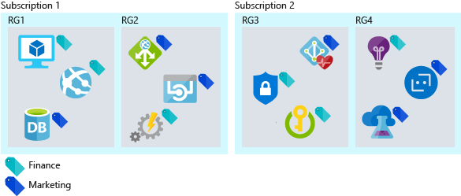
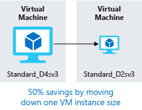

You are a solution architect. Your organization, Lamna Healthcare has moved its workloads to the cloud. Recently, the bill for these resources and workflows has increased more than Lamna had anticipated. You have been asked to determine whether the increase is natural, efficient growth, or whether the cost can be reduced by being more efficient with the organization's cloud resources.

#### Maximize efficiency of cloud spend

> [!VIDEO https://www.microsoft.com/videoplayer/embed/RWjTgy]

## How the cloud changes your expenses

One of the differences between the public cloud and on-premises infrastructure is how you pay for the services you use. In an on-premises datacenter, hardware procurement time is long, hardware is sized for maximum capacity, and some of the costs, such as power and space, can be hidden from the business unit consuming the resources. Purchasing physical infrastructure ties up investments in long-term assets, hindering your ability to be agile with your resources.

Shifting to the cloud introduces a pay-for-what-you-use cost model. You no longer need to tie up investments in assets, and if your resource requirements change, you can respond by adding, moving, or removing resources. Workloads vary between and within services, demand can be unpredictable, and your growth patterns shift over time. Since you only pay for what you use in the cloud, your cost structure can move in sync with the changes in resources.

Cloud infrastructure can handle fluctuating resource usage scenarios. Resources that have significant periods of inactivity can be shut down when not in use and not incur any cost at all. Resources can grow with a successful service as it grows, rather than having to wait for the next procurement cycle. More resources can be dynamically added and removed to respond to predictable and unpredictable bursts of demand. The following illustration shows why the on-premises infrastructure cannot handle all these fluctuating scenarios.

In an efficient architecture, provisioned resources match the demand for those resources. If a virtual machine is less than 10% utilized the majority of the time, you are wasting resources, both in compute and cost. Conversely, a virtual machine that is running 90% utilized is using the majority of the available resources and is an efficient use of money. Running a system to 100% utilization runs the risk of introducing performance issues. It is important to ensure that maximizing efficiency doesn't negatively impact the performance of your system. Demand is rarely constant, so adjusting resources when possible to match demand is important to ensure efficiency.

## Track your cloud spend

In order to make intelligent decisions, you need data. By looking at where your money is going, you can start comparing that to utilization to uncover where you may have waste within your environment.

An export of your billing data is available at any time. Using your billing data, you can track where your costs are going and how they're allocated across your resources. The challenge is that the billing data shows cost but not utilization. You'll have data that indicates you're paying for that large VM, but how much are you actually using it?

Azure Cost Management gives you insights where your spend is going, as well as underutilized resources. Azure Cost Management tracks your total spend, cost by service, and cost over time. You can drill down into resource types and instances. You can also break down your costs by organization or cost center by tagging resources with those categories.

Azure Advisor also has a cost component. It recommends VM resizing, buying reserved instances when more cost effective than pay-as-you-go instances. It identifies unused ExpressRoute circuits and idle virtual network gateways. Advisor makes additional recommendations in the areas of performance, high availability, and security.

The important part is to take time to review your spend and evaluate where your money is going. Identify areas of inefficiency to ensure you're operating as efficiently as possible.

## Organize to optimize

Putting some organization to your resources can help track where some of your costs are going. There are ways to group resources together, establishing a relationship so you know where your costs are related. From a billing perspective, resources can be easily grouped by:

- Assigning resources to different subscriptions.
- Assigning resources to different resource groups.
- Applying tags to resources.

Using subscriptions and resource groups to organize resources is an easy way to logically group resources and can be leveraged when going through billing data. Tags come into play when resource relationships span the boundaries of subscriptions and resource groups. Tags are key/value pairs that can be added to any resource, and are exposed in billing data, allowing you to associate a department or cost center with your resource. Tags improve your ability to report on cost, as well as giving each department in your organization accountability for their own costs. The following illustration shows how you can apply the same tag to resources in different resource groups and even in different subscriptions.

Adding some organization to your resources can go a long way and can really aid in your ability to understand where your costs are going. Now let's take a look at some ways to optimize costs.

## Optimizing IaaS costs

When using Infrastructure as a Service (IaaS) resources such as virtual machines (VM) as part of your solution, the cost associated with VMs is often the biggest portion of spend. The compute costs are typically the biggest piece, followed by storage. Taking time to optimize pay-for-what-you-use resources can have a large impact on the size of your monthly bill.

Let's take a look at best practices to reduce your compute and storage costs.

### Compute

There are different options available to achieve cost savings for virtual machines.

- Choose a smaller virtual machine instance size.
- Reduce the number of hours a virtual machine runs.
- Use discounts for the compute costs.

#### Right size virtual machines

Right sizing a virtual machine is the process of matching the virtual machine size with the resource demand required of the VM. If a VM is running 25% idle, reducing the size of the VM will immediately reduce your cost. Virtual machine costs are linear within an instance family; each next size larger will double your cost. Conversely, reducing a VM by a single instance size will reduce your cost in half. The following illustration shows a 50% savings achieved by moving one size down within the same series.

Azure Advisor identifies which virtual machines are underutilized. Advisor monitors your virtual machine usage for 14 days and then identifies underutilized virtual machines. Virtual machines whose CPU utilization is 5 percent or less and network usage is 7 MB or less for four or more days are considered underutilized virtual machines.

#### Implement shutdown schedules for virtual machines

If you have VM workloads that are only used periodically, but are running continuously, you're wasting money. These VMs can be shut down when not in use saving you compute costs while the VM is deallocated. For example, a development environment is a good candidate because development generally happens only during business hours.

You have several options to deallocate a VM. You can use Azure Automation to run your VMs only during those times that your workloads require. You can use the auto-shutdown feature on a virtual machine to schedule a one-off automated shutdown. Finally, you can stop a VM manually in the Azure portal. You should always use the Azure controls to stop your VMs; shutting down the OS from inside a VM does not deallocate its Azure resource so you will continue to accrue costs.

#### Apply compute cost discounts

The Azure Hybrid Benefit allows you to further optimize your costs for both Windows Server and SQL Server by allowing you to use your on-premises Windows Server or SQL Server licenses with Software Assurance to be used as a discount toward the compute cost of these VMs, eliminating the costs for Windows and SQL Server on enabled instances.

Some virtual machines need to be up and running all the time. Maybe you have a web application server farm for a production workload or maybe a domain controller supporting various servers on a virtual network. If you know with certainty that these virtual machines will run over the coming year or maybe longer, you can get further cost savings by purchasing a reserved instance. Azure Reserved Virtual Machine Instances can be purchased for one year or three years of compute capacity, at a discount compared to pay-as-you-go compute resources. Azure Reserved Virtual Machine Instances can significantly reduce your virtual machine costs, up to 72 percent on pay-as-you-go prices, with one-year or three-year upfront commitment. The following illustration shows savings achieved when you combine your on-premises license with the Azure Hybrid Benefit and when you combine your on-premises license with both Azure RI and the Azure Hybrid Benefit.

### Virtual machine disk storage cost optimization

For workloads that do not require high reliability and performance disks, you can use the reduced-cost standard storage. You might choose to use standard storage for development and test environments that are not required to be an identical match for a production workload.

Ensure you don't have any orphaned disks remaining in your environment. Disks that aren't associated with a VM still incur storage costs. If you've removed a VM but not the disks, the orphaned disks may be a place to reduce your storage cost.

Similar to orphaned disks, if you have any orphaned snapshots lingering around, take some time to clean them up. Pricing for these is lower than the disks themselves, but it's still a good practice to eliminate costs of unnecessary resources.

## Optimizing PaaS costs

Platform as a Service (PaaS) services are typically optimized for costs over IaaS services, but there are opportunities to identify waste and optimize for minimal costs. Let's take a look at ways to reduce Azure SQL Database and Azure Blob storage costs.

### Optimizing Azure SQL Database costs

When creating an Azure SQL database, you have to select an Azure SQL Server and decide on a performance tier. Each tier provides a performance level either in database transaction units (DTUs) or virtual cores (vCores). For database loads that are steady, it's easy to optimize by selecting the properly sized tier for the needed performance. But what if your database has unpredictable bursts or spikes in activity? Elastic pools can reduce costs for unpredictable workloads.

SQL Database elastic pools are a simple, cost-effective solution for managing and scaling several databases that have varying and unpredictable usage demands. The databases in an elastic pool are on a single Azure SQL Database server and share a set number of resources at a set price. Pools are well suited for a large number of databases with specific utilization patterns. For a given database, this pattern is characterized by low average utilization with relatively infrequent utilization spikes.
The more databases you can add to a pool, the greater your savings become. The following illustration shows the capabilities of the three types of Elastic Database Pools: basic, standard, and premium.  Basic auto scales up to 5 eDTUs per DB, standard auto scales up to 100 eDTUs per DB, and Premium that auto scales up to 1000 eDTUs per DB.

Elastic pools are a great way to spread costs across multiple databases and can make a significant impact on reducing your Azure SQL Database costs.

### Optimizing Blob storage costs

Blob storage is a cost-effective way to store data, but as the amount of data grows, your bill can benefit from optimizing how the data is stored.

Let's return to Lamna Healthcare. You have a medical-imaging application that stores images in blob storage. Due to the quantity and size of the images, the storage ends up being a notable cost for the application. When an image has been taken for a patient, it's likely that in the first week, that image will be viewed several times, and the performance of image retrieval is expected to be high. Conversely, an image taken two years ago may be accessed infrequently and has a lower retrieval performance expectation. You can use storage tiering to optimize the cost of image retrieval, given the reduced performance required as the image ages.

Azure Storage offers three storage tiers for blob object storage. The Azure hot storage tier is optimized for storing data that is accessed frequently. The Azure cool storage tier is optimized for storing data that is infrequently accessed and stored for at least 30 days. The Azure archive storage tier is optimized for storing data that is rarely accessed and stored for at least 180 days with flexible latency requirements.

- **Hot access tier** - Highest storage costs but the lowest access costs.
- **Cool access tier** - Lower storage costs and higher access costs compared to hot storage. This tier is intended for data that will stay in the cool tier for at least 30 days.
- **Archive access tier** - Lowest storage cost and highest data retrieval costs compared to hot and cool storage. This tier is intended for data that can tolerate several hours of retrieval latency and will stay in the archive tier for at least 180 days.

For Lamna Healthcare, keeping new images on the hot access tier for a month makes sense, so that viewing the most recent images performs as fast as possible. You could then move images over one year old to the archive tier since it is likely that these images will not be retrieved. This would reduce their costs associated with storing these images.

### Leverage consumption pricing models

Moving to PaaS services can also take the pay-as-you-go model even further into a true consumption pricing model. Services such as Azure Functions have the ability to use _Consumption plans_. When you're using a Consumption plan, instances of the Azure Functions host are dynamically added and removed based on the number of incoming events. This serverless plan scales automatically, and you're charged for compute resources only when your functions are running. On a Consumption plan, a function execution times out after a configurable period of time.

Billing is based on number of executions, execution time, and memory used. Billing is aggregated across all functions within a function app.

Moving to services that use a consumption pricing model can bring a new approach to cost savings into your architecture.

## Cost optimization at Lamna Healthcare

Lamna Healthcare is making strides on reducing their costs. They have organized a monthly review of their costs, and each department has access to Azure Cost Management, where they can review their costs throughout the month. They've identified a number of places where reserved instances can be used and have purchased several to take advantage of this discount. They have implemented automated processes to stop development environments in off-hours, saving them additional costs during times when these resources were not being used. 

Along with the optimization of blob storage for their imaging storage, they've managed to drop their bill notably over the past couple of months.

## Summary

Optimizing the cost of your cloud infrastructure involves tracking your spend and ensuring that your resource utilization matches the demands of your workloads. Using the right quality and performance tier for your resources can further optimize your cloud spend.
