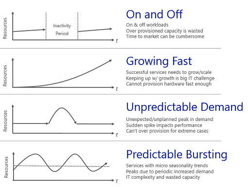

As you move to the cloud, your costs are going to play a large role in your success. Spend too much money and you jeopardize the health of your business. Let's imagine Lamna Healthcare has moved several workloads to the cloud but has seen their bill increase more than they anticipated over the last few months. They aren't sure if this increase is natural, efficient growth or if it's due to waste and inefficiencies. How do you make sure you're being as efficient as possible? What does efficiency even look like? Let's look at some ways to ensure your architecture is making best use of your money.

## How the cloud changes your expenses

One of the fundamental differences between the public cloud and on-premises infrastructure is how you pay for the services you use. In an on-premises data center hardware procurement time is typically long, costs are hidden, and hardware is typically spec'd out for maximum capacity. Purchasing physical infrastructure ties up investments in long-term assets, hindering your ability to be agile with the resources you actually need.

Shifting to the cloud introduces a true pay-for-what-you-use cost model and costs are fully transparent. You no longer need to tie up investments in assets, and if your resource requirements change you can quickly and easily shift your costs along with them. Workloads are going to vary between and within services, demand can be unpredictable, and your growth patterns will shift over time. Since you only pay for what you use on the cloud, your cost structure can move in sync with these changes in resources.

What does efficiency look like? In an efficient architecture, provisioned resources match the demand of those resources. If a virtual machine is sitting less than 10% utilized the majority of the time, we're wasting resources, both in compute and cost. Conversely, a virtual machine that is running 90% utilized is using the majority of the available resources and is an efficient use of money. Running a system to 100% utilization runs the risk of introducing performance issues, so it's a bit of a balancing act to ensure that maximizing efficiency doesn't negatively impact the performance of your system. Demand is rarely constant, so adjusting resources when possible to match demand is important to ensure efficiency.

Now that we've talked through how the cloud changes your expenses and what efficiency is, there's some best practices to follow to ensure you're efficient, and maintain your efficiency. 

## Track your cloud spend

In order to make intelligent decisions, you need data. By looking at the data of where your money is going, you can start comparing that to utilization to uncover where you may have waste within your environment. On Azure, there are a few ways to get that data.

An export of your billing data is available at any time, and there are even APIs you can call to get this information programmatically. With this data, you can track where your costs are going and how they're allocated across your resources. The challenge is that this data doesn't reflect actual utilization. You'll have data that indicates you're paying for that large VM, but how much are you actually using it?

This is where [Azure Cost Management](https://docs.microsoft.com/en-us/azure/cost-management/overview) can help. Azure Cost Management will give you insights into not only where your spend is going, but what resources are overprovisioned and could benefit from some right-sizing. Azure Cost Management provides an assortment of reports to slice and dice your cloud spend, and is a great place to look for places to optimize your costs.

Azure Advisor will also make cost recommendations on resizing VMs, unused ExpressRoute circuits, and recommendations for Reserved Instances. Advisor makes additional recommendations in the areas of performance, high availability, and security. It's a great place to look not only for cost recommendations, but ways to improve the overall health of your resources as a whole.

## Organize to optimize

Putting some organization to the data can help track where some of your costs are going. There are ways to group resources together, establishing a relationship so you know where your costs are related. From a billing perspective, resources can be easily grouped by:

* Putting resources in different subscriptions
* Putting resources in different resource groups
* Applying tags to resources

Using subscriptions and resource groups to organize resources is an easy way to logically group resources together and can be leveraged when going through billing data, but where tags come in to play is where resources relationships span the boundaries of subscriptions and resource groups. Tags are key/value pairs that can be added to any resource, and are exposed in billing data, allowing you to do things like associate a department or cost center to your resource. This improves your ability to report on this data, as well as allowing for chargebacks within your organization.

Adding some organization to your resources can go a long way, and can really aid in your ability to understand where your costs are going. Now let's take a look at some ways to optimize costs.

## Optimizing IaaS Costs

For organizations that are leveraging virtual machines, the cost associated with virtual machines is often the biggest portion of spend. Of these, the compute costs typically are the biggest piece, followed by storage. Since these are pay-for-what-you-use resources, taking time to optimize them can have a large impact on what your bill ends up being each month.

Let's take a look at best practices to reduce your compute and storage costs.

### Compute

There are different options available to achieve cost savings for virtual machines.

* Choose a smaller virtual machine instance size
* Reduce the number of hours a virtual machine runs
* Use discounts for the compute costs

#### Right-size virtual machines

Right-sizing a virtual machine is the process of matching the virtual machine size with the resource demand required of the VM. If a VM is running 25% idle, reducing the size of the VM will immediately reduce your cost. Virtual machine costs are linear within an instance family; each next size larger will double your cost. Conversely, reducing a VM by a single instance size will reduce your cost in half.

[Azure Advisor](https://docs.microsoft.com/en-us/azure/advisor/advisor-cost-recommendations#optimize-virtual-machine-spend-by-resizing-or-shutting-down-underutilized-instances) can be a great help in identifying which virtual machines are underutilized. Advisor monitors your virtual machine usage for 14 days and then identifies low-utilization virtual machines. Virtual machines whose CPU utilization is 5 percent or less and network usage is 7 MB or less for four or more days are considered low-utilization virtual machines.

#### Implement shutdown schedules for virtual machines

If you have VM workloads that are only used during certain periods of time, but are running them every hour of every day, you're wasting money. These are great candidates to shut down when not in use, and start back up on a schedule, saving you compute costs while the VM is deallocated.
This is a great strategy for development environments. It's often the case that development may happen only during business hours, giving you the flexibility to deallocate these systems in the off hours, stopping your compute costs from accruing. Azure now has an automation solution fully available for you to leverage in your environment.

You can also use the Auto-shutdown feature on a virtual machine to schedule automated shutdowns.

#### Apply compute cost discounts

The [**Azure Hybrid Benefit**](https://azure.microsoft.com/en-us/pricing/hybrid-benefit/) allows you to further optimize your costs for both Windows Server and SQL Server by allowing you to use your on-premises Windows Server or SQL Server licenses with Software Assurance to be used as a discount towards to the compute cost of these VMs, eliminating the costs for Windows and SQL Server on enabled instances.

Some virtual machines need to be up and running all the time. Maybe you have a web application server farm for a production workload or maybe a domain controller supporting various servers on a virtual network. If you know with certainty that these virtual machines will run over the coming year or maybe longer, you can get further cost savings by purchasing a Reserved Instance. [**Azure Reserved VM Instances**](https://docs.microsoft.com/en-us/azure/billing/billing-save-compute-costs-reservations) helps you save money by pre-paying for one-year or three-years of compute capacity allowing you to get a discount on the virtual machines you use. Azure reserved instances can significantly reduce your virtual machine costs, up to 72 percent on pay-as-you-go prices, with one-year or three-year upfront commitment.

[Azure Advisor](https://docs.microsoft.com/en-us/azure/advisor/advisor-cost-recommendations#buy-virtual-machine-reserved-instances-to-save-money-over-pay-as-you-go-costs) will review your virtual machine usage over the last 30 days and determine if you could save money by buying reserved instances. Advisor will show you the regions and sizes where you potentially have the most savings and will show you the estimated savings from buying reserved instances. Azure Cost Management also provides recommendations on where reserved instances could be beneficial.

### Virtual machine disk storage cost optimization

For storage associated with virtual machines, there are a few ways to reduce your costs. 

Premium storage is recommended for all production workloads due to the increased performance and reliability that comes with it. For non-production workloads, however, standard storage is a great way to reduce your costs. With a lower performance target comes a lower price tag, and development or test systems are a great place where standard storage can save you money.

Ensure you don't have any orphaned disks remaining in your environment. Even if disks aren't associated with a VM they will still be billed for storage costs. If you've removed a VM but have the disks, this can be a place to reduce your storage cost.

Similarly to orphaned disks, if you have any orphaned snapshots lingering around, take some time to clean them up. Pricing for these is lower than the disks themselves, but it's still a good practice to eliminate costs of unnecessary resources.

## Optimizing PaaS costs

PaaS services are typically optimized for costs over IaaS services, but there's still opportunities to identify waste and optimize for minimal costs. Let's take a look at ways to reduce Azure SQL Database and Azure blob storage costs.

### Optimizing Azure SQL Database costs

When creating an Azure SQL database, you have to select an Azure SQL Server and decide on a performance tier. Each tier provides a performance level either in data base transaction units (DTUs) or virtual cores (vCores). For database loads that are steady it's easy to optimize by selecting the properly sized tier for that has provides the needed performance. But what if your database has unpredictable bursts or spikes in activity? This is where elastic pools can reduce your costs.

[SQL Database elastic pools](https://docs.microsoft.com/en-us/azure/sql-database/sql-database-elastic-pool) are a simple, cost-effective solution for managing and scaling several databases that have varying and unpredictable usage demands. The databases in an elastic pool are on a single Azure SQL Database server and share a set number of resources at a set price. Pools are well suited for a large number of databases with specific utilization patterns. For a given database, this pattern is characterized by low average utilization with relatively infrequent utilization spikes.
The more databases you can add to a pool the greater your savings become.

Elastic pools are a great way to spread costs across multiple databases, and can make a big impact on reducing your Azure SQL Database costs.

### Optimizing blob storage costs

Blob storage is a cost-effective way to store data, but as the amount of data grows, your bill can benefit from optimizing how this data is stored. 

Let's look at an example from Lamna Healthcare. They have medical imaging application that stores  images on blob storage. Due to the quantity and size of the images, this ends up being a notable cost for the application. When an image has been taken for a patient, it's likely that in the first week that image will be viewed several times and the performance of image retrieval is expected to be high. Conversely, an image taken two years ago may be accessed infrequently, and has a lower retrieval performance expectation. This is a great scenario for the usage of storage tiering.

Azure storage offers [three storage tiers](https://docs.microsoft.com/en-us/azure/storage/blobs/storage-blob-storage-tiers) for blob object storage allowing you to drive efficiency out of your storage costs. The Azure hot storage tier is optimized for storing data that is accessed frequently. The Azure cool storage tier is optimized for storing data that is infrequently accessed and stored for at least 30 days. The Azure archive storage tier is optimized for storing data that is rarely accessed and stored for at least 180 days with flexible latency requirements.

When storing data on blob storage, there are costs for both storage and retrieval. Each of these tiers has a different cost:

* **Hot access tier** - highest storage costs, but the lowest access costs.
* **Cool access tier** - lower storage costs and higher access costs compared to hot storage. This tier is intended for data that will stay in the cool tier for at least 30 days.
* **Archive access tier** - lowest storage cost and highest data retrieval costs compared to hot and cool storage. This tier is intended for data that can tolerate several hours of retrieval latency and will stay in the archive tier for at least 180 days.

For Lamna Healthcare, keeping new images on the hot access tier for a month makes sense so that viewing the most recent images performs as fast as possible. They could then move images over one year old to the archive tier, since it's likely that these images will not be retrieved. This would reduce their costs associated with storing these images.

## Summary

We've walked through a number of ways to ensure your environment is as efficient as possible. From going through the data to identify where there may be waste, to leveraging tools and best practices, there are a number of ways to drive efficiency into your architecture, ultimately lowering your bill. Next up, we'll take a look at how to use monitoring and analytics to get insights into your environment.

## Knowledge Check

What happens with the Reserved Instance if you delete a VM and create another one

* it still applies if you create it in the same region
* it still applies if you create it with the same size
* **it still applies if you create it in the same region and the same size**
* it only applies if you give the VM the same name
* it no longer applies

When does VM compute cost stop from being charged

* when you shut down the VM from inside the guest
* **when you stop the VM from the Portal**
* When you shut down the VM from inside the guest or from the Portal 