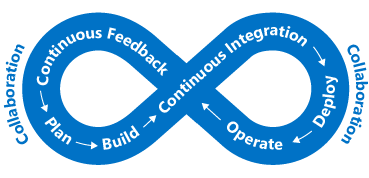

End users are expecting more from their applications. They want to have a great user experience and not be impacted by performance issues. How do you integrate performance bottleneck identification into your architecture? In this unit, we will look at both processes and tools that can help ensure that your application performs well, and help you track down why if it doesn't.

## Importance of requirements

Before we talk about performance, it's important to talk about requirements. In theory, we could keep improving scalability and performance further and further without end. At some point, however, more improvement is prohibitively expensive, difficult, and doesn't have enough business impact to be worthwhile. 

Our **non-functional requirements** help us find that point. These particular requirements don't tell us what our app must *do*. Instead, they tell us what quality levels it must meet. As examples, we can define these non-functional requirements to tell us:

- How fast a transaction must return under a given load.
- How many simultaneous connections we need to support before we start returning errors.
- In the event of server failure, what is the maximum amount of time our application is allowed be down before a back-up is online.

Defining these requirements in advance of building your solution is critical to ensure that the application meets expectations but doesn't require more effort or expend more money than necessary. We can also plan our monitoring and operations rules around these non-functional requirements. 

Discuss requirements with your stakeholders or customers, document them, and communicate them broadly to ensure that everyone agrees on what "good performance" means.

## DevOps and application performance

The idea behind DevOps is that we don't have development and infrastructure silos in our organization. Instead, they work together to effectively build, deploy, monitor, and maintain apps in streamlined process.

The planning, development, testing, and monitoring is carried out in an iterative approach. Performance and quality of our application become a part of our software development life cycle, rather than an afterthought as we deploy into a live environment. The following illustration shows where opportunities for collaboration exist in the software development lifecycle.

This approach aligns with a DevOps concept called "shifting left". In other words, bring your quality control checks earlier into your deployment and release process. This allows you to catch end-user impacting issues earlier in the process. As we operate in a continuous cycle, we limit the amount of manual interaction and automate as much as possible. 

One way we make performance part of our DevOps process is to carry out performance or load tests to validate that the application meets the non-functional requirements prior to a deployment into production.

Ideally, we could carry out performance and load tests in an environment that is exactly like production while not impacting our actual production servers. When leveraging the cloud, you fully have this ability. You can automate the creation of a production-like environment, perform testing, and then destroy the environment to minimize cost. This approach to automation can provide reassurance that your application can handle the scale you require now, as well as respond to future growth.

Application performance monitoring becomes a core part of this. If we're running performance and load tests on our application or want to keep our production performance in check, we want to understand what parts of our application may be performing non-optimally. Let's take a look at some ways to do this.

## Performance monitoring options in Azure

Monitoring is the act of collecting and analyzing data to determine the performance, health, and availability of your business application and associated resources.

We want to be kept informed that our application is running smoothly. Proactive notifications can be used to inform about critical issues that arise. There are many layers of monitoring to consider, mainly the infrastructure layer and the application layer.

### Azure Monitor

Azure Monitor provides a single management point for infrastructure-level logs and monitoring for most of your Azure services. It collects metrics, activity logs, and diagnostic logs and more. Azure Monitor provides us with a range of features including:

- Azure alerts to proactively notify or take action on any breaches to metrics or activities arising.
- Use Azure Dashboards to combine many monitoring sources into one view of our application.

Azure Monitor is the place to start for all your near real-time resource metric insights. Many Azure resources will start outputting metrics automatically once deployed. For example, Azure Web App instances will output compute and application request metrics. Metrics from Application Insights are also collated here in addition to VM host diagnostic metrics. VM guest diagnostic metrics will also appear once you opt in.

### Log Analytics

Centralized logging can help you uncover hidden issues that may be difficult to track down. With Log Analytics you can query and aggregate data across logs. This cross-source correlation can help you identify issues or performance problems that may not be evident when looking at logs or metrics individually. The following illustration shows how Log Analytics acts as a central hub for monitoring data. Log Analytics receives monitoring data from your Azure resources and makes it available to consumers for analysis or visualization.

You can collate a wide range of data sources, security logs, Azure activity logs, server, network, and application logs. You can also push on-premises System Center Operations Manager data to Log Analytics in hybrid deployment scenarios and have Azure SQL Database send diagnostic information directly into Log Analytics for detailed performance monitoring.

Centralized logging can be massively beneficial for troubleshooting all types of scenarios, including performance issues. It's a key part of a good monitoring strategy for any architecture.

## Application performance management

Deep application issues are often tricky to track down. This is where integrating telemetry into an application by using an application performance management solution (APM) to track down low-level application performance and behavior can be beneficial. This telemetry can include individual page request times, exceptions within your application, and even custom metrics to track business logic. This telemetry can provide a wealth of insight into what is going on within your application.

On Azure, Application Insights is a service that provides this deep application performance management. You install a small instrumentation package in your application, and set up an Application Insights resource in the Microsoft Azure portal. The instrumentation monitors your app and sends telemetry data to the portal.

Telemetry from the host environments, such as performance counters, Azure diagnostics, and Docker logs, can be ingested. You can also set up web tests that periodically send synthetic requests to your web service. You could even configure your application to send custom events and metrics that you write yourself in the client or server code. For example, application-specific events such as items sold or games won.

Application Insights stores its data in a common repository, and metrics are shared with Azure Monitor. It can take advantage of shared functionality such as alerts, dashboards, and deep analysis with the Log Analytics query language.

A common pattern used in determining the availability of a web application is the health endpoint monitoring pattern. This pattern is used to monitor web applications and associated back-end services, to ensure that they're available and performing correctly. The pattern is implemented by querying a particular uri. The endpoint checks on the status of many components, including the back-end services that the app depends on, rather than just the availability of the front end itself. This acts as a service-level health check that returns an indication of the overall health of the service.

Use an APM solution such as Application Insights to gain a deep understanding of your application and correlate activity across your application. This can help you understand how a specific action works in the client browser, on the server, and through to downstream services. It will also provide insight into trends, provide notifications when there is a problem, and help identify where the problem is and how to fix it, before your users are aware.

## Performance monitoring at Lamna Healthcare

Lamna Healthcare has implemented a web-based patient booking system using virtual machines and an Azure SQL database across two Azure regions. They've decided to use the VM Agent and Log Analytics to monitor the performance of the underlying front-end virtual machines.

They use Azure Monitor to understand the performance of their Azure SQL databases and capture key performance metrics including CPU % and deadlocks.

Application Insights has been configured to capture availability and telemetry information. The team has changed their new booking functionality to send custom event telemetry to Application Insights. The team now has an approach to understanding the volume of business-related events taking place, and they can get much better insight into what's going on within their application.

We've looked at some processes, tools, and best practices to help you track down performance issues and ensure that your application is performing at its best.