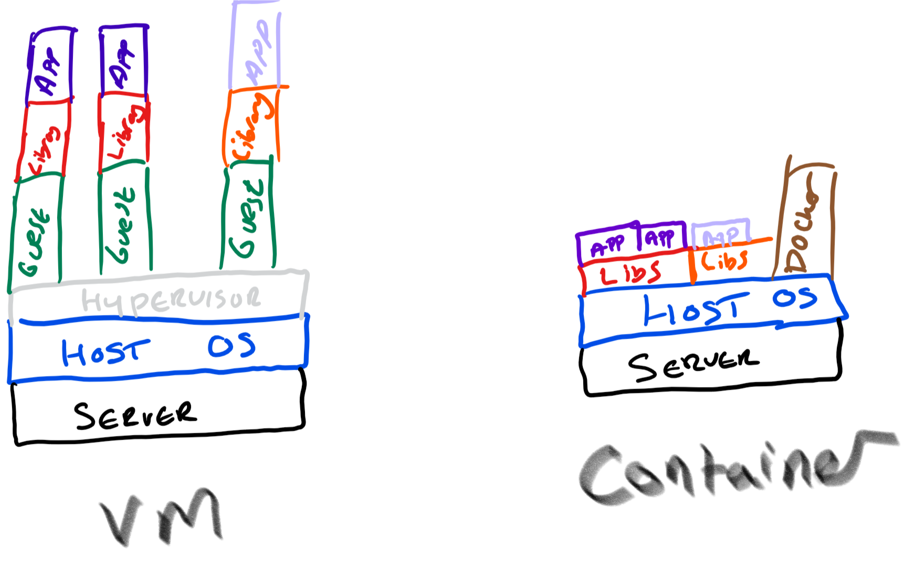

# Scaling up and scaling out

## Motivation

It's rare that we can exactly predict the load on our system: public facing applications might grow rapidly or an internal application might need to support a larger user base as the business grows. Even when we can predict load, it's rarely flat: retailers have more demand during the holidays and sports websites peak during playoffs. In this unit, we'll: 

* Define _scaling up/down_ and _scaling out/in_
* Discuss why scaling out is preferred, and see how Azure implements scale out strategies
* Look at how serverless and container technologies can improve your architecture's ability to scale

## What is scaling?

_Scaling_ is the process of managing your resources to help your application meet a set of performance requirements.  When we have too many resources serving users, we won't be using it efficiently and wasting money. Too few resources available means that the performance of our application could be impacted. The goal is to meet our defined performance requirements while optimizing for cost.

In a world where application demand is constant, it's easy to predict the needed level of resource. In the real world, the demands of our applications change over time, so it can be harder to predict. If you're lucky, then that change will be predictable (or seasonal), but that is not typical of all applications. Ideally, you want to provision the right amount of resources to meet demand and adjust as demand changes. 

Scaling is difficult in an on-premises scenario, where you purchase and manage your own servers. Adding resources can be costly and often takes extended amounts of time to bring online, sometimes much longer than your actual need for the increased capacity. Once load has dropped it can be difficult to then reduce provisioned capacity during times of low-demand on the system and minimize your cost.

Effortless, dynamic scaling is a key benefit of Azure. Most Azure resources let you easily add or remove instances as demand changes, and many services have automated options so they monitor demand and adjust for you automatically. This automatic scaling capability, commonly known as autoscaling, lets you set thresholds for the minimum and maximum level of instances that should be available, and will add or remove instances based upon a performance metric (for example, CPU utilization).

## What is scaling up and down?

Scaling up is the process where we increase the capacity of a given instance. A virtual machine could be increased from 1 vCPU and 3.5 GB of RAM to 2 vCPUs and 7 GB of RAM to provide more processing capacity. On the other hand, scaling down is the process where we lower the capacity of a given instance. For example, reducing a virtual machine's capacity from 2 vCPUs and 7 GB of RAM to 1 vCPU and 3.5 GB of RAM, reducing both capacity and cost.

Let's take a look at what scaling up/down means in the context of Azure resources:

* In Azure virtual machines, you scale based upon a virtual machine size. That size has a certain amount of vCPUs, RAM, and local storage associated with it. For example, we could scale up from a Standard_DS1_v2 virtual machine (1 vCPU and 3.5 GB of RAM) to a Standard_DS2_v2 virtual machine (2 vCPUs and 7 GB of RAM).
* Azure SQL Database is a platform as a service (PaaS) implementation of Microsoft SQL Server.  You can scale up a database based upon the number of database transaction units (DTUs) or vCPUs. DTUs are an abstraction of underlying resources and are a blend of CPU, IO, and memory. You could scale your database instance from 500 DTUs to 250 DTUs.
* Azure App Service is a PaaS website hosting service on Azure. Web sites run on a virtual server farm, also known as an App Service Plan. You can scale the App Service Plan up or down between tiers and have capacity options within tiers. For example, an S1 app service plan has 1 vCPU and 1.75 GB of RAM per instance. We could scale up to an S2 app service plan, which has 2 vCPUs and 3 GB of RAM per instance.

To have these capabilities in an on-premises environment you would typically have to wait for procurement of the needed hardware and installation before you can start using the new level of scale. In Azure, the physical resources are already deployed and available for you, you simply need to select the alternate level of scale that you are looking to use.

You may need to consider the use of scaling up in your solution, depending upon the cloud services that you have chosen.

For example, if you choose to scale up in Azure SQL Database, then the service deals with scaling up individual nodes and continues the operation of your service. Changing the service tier and/or performance level of a database creates a replica of the original database at the new performance level, and then switches connections over to the replica. No data is lost during this process and there's only a brief interruption (typically less than 4 seonds) when the service switches over to the replica. 

Alternatively, if you choose to scale up or down a virtual machine, you do so by selecting a different instance size. In most cases this requires a restart of the VM, so best to have the expectation that a reboot will be required and you'll need to account for when performing this activity.

Finally, you should always look for places where scaling down is an option. This can lead to cost optimizations in your solution, and ultimately a lower Azure bill. That said, you should always consider this in line with the performance requirements of your project and ensure you're providing ample capacity to keep your customers happy.

## What is scaling out and in?

Where scaling up and down adjusts the amount of resources a single instance has available, scaling out and in adjusts the total number of instances.

_Scaling out_ is the process of adding more instances to support the load of your solution. For example, if our website frontend was hosted on virtual machines, then we could increase the number of virtual machines to serve the level of load on the system.

_Scaling in_ is the process of removing instances that are no longer needed to support the load of your solution. If the website front ends have low usage, then we may want to lower the number of instances to save cost.

Here are some examples of what scaling out/in means in the context of Azure resources:

* For the infrastructure layer, you would likely use virtual machine scale sets to automate the addition and removal of extra instances.
  * Virtual machine scale sets let you create and manage a group of identical, load balanced VMs.
  * The number of VM instances can automatically increase or decrease in response to demand or a defined schedule.
* In an Azure SQL Database implementation, you could share the load across database instances by sharding. _Sharding_ is a technique to distribute large amounts of identically structured data across a number of independent databases.
* In Azure App Service, the App Service Plan is the virtual web server farm hosting your content. Scaling out in this way means that you're increasing the number of virtual machines in the farm. As with virtual machine scale sets, the number of instances can be automatically raised or lowered in response to certain metrics or a schedule.

Scaling out is typically easily performed in the Azure portal, command-line tools or Resource Manager templates, and in most cases is seamless to the end user.

### Autoscale

You can configure some of these resources to use a feature called [autoscale][what-is-autoscale]. With autoscale you no longer have to worry about scaling resources manually. Instead, you can set a minimum and maximum threshold of instances and scale based upon specific metrics (queue length, CPU utilization) or schedules (weekdays between 5:00 PM and 7:00 PM).

### Considerations when scaling in and out

When scaling out, the startup time of your application can impact how quickly your application can scale. If your web app takes 2 minutes to start up and be available for users, that means each of your instances will take 2 minutes until they are available to your users. You'll want to take this startup time into consideration when determining how fast you want to scale.

You'll also need to think about how your application handles state. When the application scales in, any state stored on the machine is no longer available. If a user connects to an instance that doesn't have it's state, it could force them to log in, or re-select data, leading to a poor user experience. A common pattern is to externalize state to another service like Redis Cache or SQL Database, making your web servers stateless. Now that our web front ends are stateless we don't need to worry about which individual instances are available. They are all doing the same job and are deployed in the same way.

## Throttling

We've established that the load on an application will vary over time. This may be due to the number of active or concurrent users and the activities being performed. While we could use autoscaling to add capacity, we could also use a throttling mechanism to limit the number of requests from a source. We can safeguard performance limits by putting known limits into place at the application level, preventing the application from breaking. Throttling is most frequently used in applications exposing API endpoints.

Once the application has identified that it would breach a limit, throttling could begin and ensure the overall system SLA isn't breached. For example, if we exposed an API for customers to get data, could limit the number of requests to 100 per minute. If any single customer exceeded this limit, we'd could respond with an HTTP 429 status code, including the wait time before another request can succesfully be submitted.

Examples on how to implement the [throttling pattern][throttling-pattern] are discussed on the architecture center.

## Scenario: Scaling on Azure

Lamna Healthcare operates a patient management and booking system. The management system handles appointment bookings and patient records across dozens of hospitals and local doctors surgeries. The local health service is running at full capacity and no growth is expected at the moment. The system is running on a PHP Website hosted in Azure App Service.

The load pattern of the application is predictable, as they primarily operate Monday to Friday between the hours of 9 to 5.  From Tuesday through to Friday, the system averages at 1,200 transactions per hour across the entire system. During the weekend, it handles 500 transactions per hour. After the quiet of the weekend, Mondays are busy with an average of 2,000 transactions per hour.

The application is hosted on an S1 App Service Plan, but the operations team have noticed a high level of CPU utilization (over 95%) across all instances. The high usage is having an impact on the processing and loading times of the application. In a cloud environment, having highly utilized resources is not necessarily a bad thing. It means that they are getting value for their money, as the resources deployed are being well used. 

The team decide to _scale up_ the App Service Plan level for the deployed instances from S1 (1 vCPU and 1.75 GB of RAM) to S2 (2 vCPUs and 3 GB of RAM). They easily achieve this by [scaling out using the Azure portal][app-service-cli-scale], but could have achieved the same thing using a single command in the [Azure CLI][app-service-cli-scale], Azure PowerShell, or using Resource Manager templates.

The team decide that they want to automate the number of instances deployed based upon a schedule, as their load profile is predictable. They configure the app service plan's autoscale schedule. Let's assume two instances sufficiently handle 500 transactions per hour. The team could then scale to six instances for Tuesday - Friday and eight instances for a Monday to meet the requirements (based upon insight and monitoring from load tests).

Autoscale also gives them an added benefit, preparing for those unforeseen scenarios. The site may suddenly take higher than expected load on the weekend (more appointments in the winter season because of colds and flu). The team can set up autoscale to increase by one instance when CPU percentage is above 90% and reduce by one instance when usage is below 15%.

The team have used the throttling pattern inside of the patient booking API they have exposed behind an Azure API Management instance. This helps prevent the system from performing poorly by only allowing a certain volume of throughput through the system.

## Serverless

Imagine if you could spend your time building and deploying apps, not having to manage underlying servers or even worry which service to run. That's the aim of serverless computing. Serverless computing is typically event driven, meaning some code, workflow, or operation will trigger as a reaction to some event happening in near-real time.

With serverless computing you only pay for the resources that you use, and they are typically designed to handle large amounts of scale. [Azure Functions][azure-functions-overview], [Azure Container Instances, and [Logic Apps][azure-logicapps-overview] are some great examples of serverless computing available on Azure.

Think about services like Azure Storage, Event Grid, and Data Lake. Those services are considered consumption-based services, as you pay for the amount of storage per GB or the number of events routed through the resource. You don't worry about the underlying configuration or what servers are deployed to help you achieve the activity. You just use the service and build your solution. Sometimes these types of services are also referred to as serverless.

Let's revisit the Lamna Healthcare example. There could be some potential for cost saving and ease of management. Consider an API endpoint, or some function that does not run frequently. Instead of hosting the API in Azure App Service or a on virtual machine, they could use an Azure Function App using a consumption-based plan. Azure functions would enable the team to only pay for the resources required to process transactions, and scale would be directly in line with the number of transactions in the system.

## Containers

A container is a method running applications in a virtualized environment. A virtual machine is virtualized at the hardware level, where a hypervisor makes it possible to run multiple virtualized operating systems on a single physical server. Containers take the virtualization up a level, the virtualization is done at the OS level, making it possible to run multiple identical application instances within the same OS.

Containers are well suited to scale out scenarios, particularly because you do not need to wait for a VM to boot up. Their characteristics also allow for a consistent environment (all container instances will be deployed alike), they can be run anywhere and have good portability and have predictable performance due to resource isolation at the operating system level.

Let's consider the above Lamna Healthcare example. Instead of running Azure App Service or Azure Functions, they could use containers to host the web front-end website and backend API endpoints. Those containers would be hosted on a number of worker machines called nodes. Each of those nodes can have many containers running on top of them. They host many instances of their front-end website and back-end API to allow for higher volume of load in the system.

While you can run containers on virtual machines, there are a couple of Azure services that focus on easing the management and scaling of containers:

* **Azure Kubernetes Service (AKS)**

  Azure Kubernetes Service allows you to set up virtual machines to act as your nodes. Azure hosts the Kubernetes management plane and only bills for the running worker nodes that host your containers.

  To increase the number of nodes (your worker VMs in Azure), you could use the [Azure CLI to increase that manually][aks-scale]. At time of writing, there is a preview [Cluster Autoscaler on AKS][aks-cluster-autoscaler] available to enable auto-scaling of your worker nodes. On your Kubernetes cluster, you could use the [Horizontal Pod Autoscaler][kubernetes-horizontal-pod-autoscaler] to scale up the number of instances of the container to be deployed.

* **Azure Container Instances (ACI)**
  
  [Azure Container Instances][aci-overview] is a serverless approach that lets you create and execute containers on-demand. You're charged only for the execution time **per second**!

  You can use [Virtual Kubelet][virtual-kubelet] to connect Azure Container Instances into your Kubernetes environment. Azure Container Instances could allow for extra bursting scale, as you wouldn't have to  wait for extra worker nodes (VMs) to be provisioned. At time of writing, the Virtual Kubelet is described as experimental software and should not be used in production scenarios.

## Summary

We've talked about scaling up and down and scaling in and out, and how you can leverage these options in your architecture. We've also looked at how serverless technologies and containers can help evolve your scaling capabilities. In the next unit, we'll take a look at how network performance can impact your application, and different ways we can optimize the network.

## Knowledge Check

Which is the most accurate description of "Scaling Out"?

* Increasing the amount of resource on an instance
* Increasing the number of instances (Correct)
* Making scaling someone elses problem
* Reaching the maximum level of scale for your application

Which is the most accurate description of "Scaling Down"?

* Decreasing the number of instances
* Taking ownership of how your application scales
* Decreasing the amount of resource on an instance (Correct)
* Not yet reaching the maximum level of scale for your application

What points should you consider when building a scaling strategy into your application?

* The version of the PaaS service you are using
* State management on your instances (Correct)
* Startup time of your instances (Correct)
* Automating the scaling of your instances based on some metric or schedule (Correct)

<!-- links -->
[aci-overview]: https://docs.microsoft.com/en-gb/azure/container-instances/container-instances-overview
[aks-scale]: https://docs.microsoft.com/en-us/azure/aks/scale-cluster]
[aks-cluster-autoscaler]: https://docs.microsoft.com/en-us/azure/aks/autoscaler
[app-service-autoscale]: https://docs.microsoft.com/en-gb/azure/monitoring-and-diagnostics/monitoring-autoscale-get-started
[app-service-cli-scale]: https://docs.microsoft.com/en-us/azure/app-service/scripts/app-service-cli-scale-manual
[app-service-portal-scale]: https://docs.microsoft.com/en-us/azure/app-service/web-sites-scale#scale-up-your-pricing-tier
[azure-container-instances-overview]: https://docs.microsoft.com/en-gb/azure/container-instances/container-instances-overview
[azure-functions-overview]: https://docs.microsoft.com/en-us/azure/azure-functions/functions-overview
[azure-logicapps-overview]: https://docs.microsoft.com/en-gb/azure/logic-apps/logic-apps-overview
[kubernetes-horizontal-pod-autoscaler]: https://kubernetes.io/docs/tasks/run-application/horizontal-pod-autoscale/
[virtual-kubelet]: https://github.com/virtual-kubelet/virtual-kubelet
[what-is-autoscale]: https://docs.microsoft.com/en-us/azure/monitoring-and-diagnostics/monitoring-overview-autoscale
