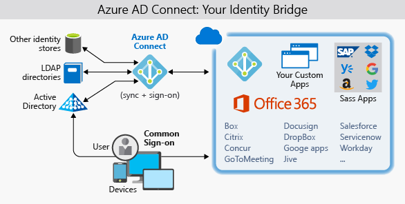

Lamna Healthcare hosts a legacy internal application and web portal for its clinicians to manage patient health data. The organization has received many requests for this application to be available to caregivers who are often on-site with patients and therefore outside of the network. 

A recent data leak by malicious agents has forced the company to tighten its password policies. They are now requiring users to change their passwords more frequently and use longer, more complex passwords. This has led to the unwanted side-effect of users recording complex passwords insecurely as they struggle to remember multiple sets of credentials created for different administrative roles. 

Here, we'll discuss identity as a security layer for internal and external applications, the benefits of single sign-on (SSO) and multi-factor authentication (MFA) to provide identity security, and why to consider replicating on-premises identities to Azure Active Directory.

## Identity as a layer of security

Digital identities are an integral part of today's business and social interactions on-premises and online. In the past, identity and access services were restricted to operating within a company's internal network, using protocols such as Kerberos and LDAP that were designed for this purpose. More recently, mobile devices have become the primary way people interact with digital services. Customers and employees alike expect to be able to access services from anywhere at any time, which has driven the development of identity protocols that can work at internet scale across many disparate devices and operating systems.

As they evaluate the capabilities their architecture has around identity, Lamna Healthcare is looking at ways they can bring the following capabilities into their application:

- Provide single-sign on to application users
- Enhance the legacy application to use modern authentication with minimal effort
- Enforce multi-factor authentication for all logins outside the company's network
- Develop an application to allow patients to enroll and securely manage their account data

## Single sign-on

The more identities a user has to manage, the greater the risk of a credential-related security incident. More identities mean more passwords to remember and change. Password policies can vary between applications, and as complexity requirements increase, it makes it more difficult for users to remember them.

On the other side is the management required for all those identities. Additional strain is placed on help desks as they deal with account lockouts and password reset requests. If a user leaves an organization, tracking down all those identities and ensuring they are disabled can be challenging. If an identity is overlooked, this could allow access when it should have been eliminated.

With single sign-on, users only need to remember one ID and one password. Access across applications is granted to a single identity tied to a user, simplifying the security model. As users change roles or leave an organization, access modifications are tied to the single identity, greatly reducing the effort needed to change or disable accounts. Using single sign-on for accounts will make it easier for users to manage their identities, and will increase the security capabilities in your environment.

### SSO with Azure Active Directory

Azure Active Directory (AD) is a cloud-based identity service. It has built-in support for synchronizing with your existing on-premises Active Directory or can be used stand-alone. This means that all your applications, whether on-premises, in the cloud (including Office 365), or even mobile can share the same credentials. Administrators and developers can control access to data and applications using centralized rules and policies configured in Azure AD.

By leveraging Azure AD for SSO you'll also have the ability to combine multiple data sources into an intelligent security graph. This security graph enables the ability to provide threat analysis and real-time identity protection to all accounts in Azure AD, including accounts that are synchronized from your on-premises AD. By using a centralized identity provider, you'll have centralized the security controls, reporting, alerting, and administration of your identity infrastructure.

### Synchronize directories with AD Connect

Azure AD Connect will integrate your on-premises directories with Azure Active Directory. Azure AD Connect provides the newest capabilities and replaces older versions of identity integration tools such as DirSync and Azure AD Sync.

It's a single tool to provide an easy deployment experience for synchronization and sign in.

Lamna Healthcare requires that authentication occurs primarily against on-premises DCs, but also requires cloud authentication in a disaster recovery scenario. They don't have any requirements not already supported by Azure AD.

Lamna Healthcare has made the decision to move forward with the following configuration:

- Use Azure AD Connect to synchronize groups, user accounts, and password hashes stored in their on-premises Active Directory to Azure AD
  - This can be used as a backup if pass-through authentication is unavailable
- Configure pass-through authentication using an on-premises authentication agent installed on an on-premises Windows Server
- Use the seamless single sign-on feature of Azure AD to automatically sign in users from on-premises domain-joined PCs
  - Reduces user friction by suppressing multiple authentication requests

## Authentication & access

Lamna Healthcare's security policy requires that all logins occurring outside the company's perimeter network are authenticated with an additional factor of authentication. This requirement combines two aspects of the Azure AD service: multi-factor authentication and conditional access policies.

### Multi-factor authentication

Multi-factor authentication (MFA) provides additional security for your identities by requiring two or more elements for full authentication. These elements fall into three categories:

- *something you know*
- *something you possess*
- *something you are*

**Something you know** would be a password, or the answer to a security question. **Something you possess** could be a mobile app that receives a notification or a token generating device. **Something you are** is typically some sort of biometric property such as a fingerprint or face scan used on many mobile devices.

Using multi-factor authentication increases security of your identity by limiting the impact of credential exposure. An attacker who has a user's password would also need to have possession of their phone or their face in order to fully authenticate. Authentication with only a single factor verified is insufficient and the attacker would be unable to use those credentials to authenticate. The benefits this brings to security are huge, and it can't be repeated enough to enable MFA wherever possible.

Azure AD has MFA capabilities built in, and will integrate with other third-party MFA providers. It's provided free of charge to any user who has the Global Administrator role in Azure AD, as these are highly sensitive accounts. All other accounts can have MFA enabled by purchasing licenses with this capability and assigning a license to the account.

### Conditional access policies

Along with MFA, ensuring that additional requirements are met before granting access can add another layer of protection. Blocking logins from a suspicious IP address, or denying access from devices without malware protection could limit access from risky sign ins.

Azure Active Directory provides a conditional access policies (CAP) feature that includes support for access policies based on group, location, or device state. The location feature allows Lamna to differentiate IP addresses that don't belong to their network, and satisfies their security policy to require multi-factor authentication from all such locations.

Lamna Healthcare has created a [conditional access policy](https://docs.microsoft.com/azure/active-directory/conditional-access/overview) that requires users accessing the application from an IP address outside of the company network to be challenged with MFA.

## Securing legacy applications

Lamna Healthcare employees require secure remote access to their administrative application hosted on-premises. Users currently authenticate to the application using Windows Integrated Authentication (WIA) from their domain-joined machines, behind the corporate firewall. Although a project to incorporate modern authentication mechanisms into the application has been planned, there's considerable business pressure to enable remote access capabilities as soon as possible. Azure Application Proxy can quickly, easily, and securely allow the application to be accessed remotely without any code changes.

Azure AD Application Proxy is:

- Simple
  - You don't need to change or update your applications to work with Application Proxy.
  - Your users get a consistent authentication experience. They can use the MyApps portal to get single sign-on to both SaaS apps in the cloud and your apps on-premises.
- Secure
  - When you publish your apps using Azure AD Application Proxy, you can take advantage of the rich authorization controls and security analytics in Azure. You get cloud-scale security and Azure security features like conditional access and two-step verification.
  - You don't have to open any inbound connections through your firewall to give your users remote access.
- Cost-effective
  - Application Proxy works in the cloud, so you can save time and money. On-premises solutions typically require you to set up and maintain DMZs, edge servers, or other complex infrastructures.

Azure AD Application Proxy is comprised of two components: a connector agent that sits on a Windows server within your corporate network and an external endpoint, either the MyApps portal or an external URL. When a user navigates to the endpoint, they authenticate with Azure AD and are routed to the on-premises application via the connector agent.

## Working with consumer identities

Since integrating modern authentication with their existing application, Lamna Healthcare has quickly acknowledged the power a managed identity system such as Azure AD can bring to their organization. The leadership team is now interested in exploring other ways Microsoft identity services can add business value. They have now focused their attention on external customers and how modernization of existing customer interactions could provide tight integration with third-party identity providers such as Google, Facebook, and LinkedIn.

Azure AD B2C is an identity management service built on the solid foundations of Azure Active Directory that enables you to customize and control how customers sign up, sign in, and manage their profiles when using your applications. This includes applications developed for iOS, Android, and .NET, among others. Azure AD B2C provides a social identity login experience, while at the same time protecting your customer identity profile information. Azure AD B2C directories are distinct from standard Azure AD directories and can be created in the Azure portal.

## Identity management at Lamna Healthcare

We've seen here how Lamna Healthcare has used identity management solutions on Azure to improve the security of their environment. They've started by providing users a single sign-on experience to minimize the accounts users have to deal with, and reduce the operational complexity that excess accounts bring. They have enforced MFA for access to their application and have updated a legacy application to use modern authentication with minimal effort. They've also learned how they can improve their ability to work with consumer identities, improving the application's usability for their patients.

## Summary

In this unit, we have seen how a number of Azure Active Directory features can be combined to provide a solid identity solution for securing access to applications, regardless of their location. Identity is a critical layer of security. When designed well and included in your architecture, you can ensure your environment is secure.