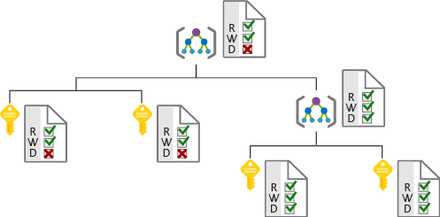

Lamna Healthcare recently experienced a significant outage to a customer-facing web application. An engineer was granted full access to a resource group containing the production web application. This person accidentally deleted the resource group and all child resources, including the database hosting live customer data. 

Fortunately, the application source code and resources were available in source control and regular database backups were running automatically on a schedule. Therefore, the service was reinstated relatively easily. Here, we will explore how this outage could have been avoided by utilizing capabilities on Azure to protect the access to infrastructure.

## Criticality of infrastructure

Cloud infrastructure is becoming a critical piece of many businesses. It is critical to ensure people and processes have only the rights they need to get their job done. Assigning incorrect access can result in data loss, data leakage, or cause services to become unavailable. 

System administrators can be responsible for a large number of users, systems, and permission sets. So correctly granting access can quickly become unmanageable and can lead to a 'one size fits all' approach. This approach can reduce the complexity of administration, but makes it far easier to inadvertently grant more permissive access than required.

## Role-based access control

Role-based access control (RBAC) offers a slightly different approach. Roles are defined as collections of access permissions. Security principals are mapped to roles directly or through group membership. Separating security principals, access permissions, and resources provides simplified access management and more fine-grained control.

On Azure, users, groups, and roles are all stored in Azure Active Directory (Azure AD). The Azure Resource Manager API uses role-based access control to secure all resource access management within Azure.

<!-- 
 -->

### Roles and management groups

Roles are sets of permissions, like "Read-only" or "Contributor", that users can be granted to access an Azure service instance. Roles can be granted at the individual service instance level, but they also flow down the Azure Resource Manager hierarchy. Roles assigned at a higher scope, like an entire subscription, are inherited by child scopes, like service instances. 

Management groups are an additional hierarchical level recently introduced into the RBAC model. Management groups add the ability to group subscriptions together and apply policy at an even higher level.

The ability to flow roles through an arbitrarily defined subscription hierarchy also allows administrators to grant temporary access to an entire environment for authenticated users. For example, an auditor may require temporary read-only access to all subscriptions.

### Privileged Identity Management

In addition to managing Azure resource access with RBAC, a comprehensive approach to infrastructure protection should consider including the ongoing auditing of role members as their organization changes and evolves. Azure AD Privileged Identity Management (PIM) is an additional paid-for offering that provides oversight of role assignments, self-service, and just-in-time role activation and Azure AD & Azure resource access reviews.

## Providing identities to services

It's often valuable for services to have identities. Often times, and against best practices, credential information is embedded in configuration files. With no security around these configuration files, anyone with access to the systems or repositories can access these credentials and risk exposure.

Azure AD addresses this problem through two methods: service principals and managed identities for Azure services.

### Service principals

To understand service principals, it's useful to first understand the words **identity** and **principal** as they are used in Identity management world.

An **identity** is just a thing that can be authenticated. Obviously, this includes users with username and password, but it can also include applications or other servers, which might authenticate with secret keys or certificates. As a bonus definition, an **account** is data associated with an identity.

A **principal** is an identity acting with certain roles or claims. Consider the use 'sudo' on a bash prompt or on Windows using "run as Administrator". In both of those cases, you are still logged in as the same identity as before, but you've changed the role under which you are executing.

So, a **Service Principal** is literally named. It is an identity that is used by a service or application. Like other identities, it can be assigned roles.

For example, Lamna Healthcare can assign its deployment scripts to run authenticated as a service principal. If that is the only identity that has permission to perform destructive actions, Lamna will have gone a long way toward making sure they don't have a repeat of the accidental resource deletion.

### Managed identities for Azure resources

The creation of service principals can be a tedious process, and there are a lot of touch points that can make maintaining them difficult. Manage identities for Azure resources are much easier and will do most of the work for you.

A managed identity can be instantly created for any Azure service that supports it (the list is constantly growing). When you create a managed identity for a service, you are creating an account on the Azure AD tenant. Azure infrastructure will automatically take care of authenticating the service and managing the account. You can then use that account like any other AD account including securely letting the authenticated service access other Azure resources.

Lamna Healthcare takes their identity management a step further and uses managed identities for all supported services that need the ability to perform infrastructure management and deployments.

## Infrastructure protection at Lamna Healthcare

We've seen how Lamna Healthcare has addressed issues from their incident where infrastructure was inadvertently deleted. They've used role-based access control to better manage the security of their infrastructure, and are using managed identities to keep their credentials out of code and ease administration of the identities needed for their services.

## Summary

To ensure the availability and integrity of infrastructure, it's important to properly secure your infrastructure. Properly using features such as RBAC and managed  identities will help protect your Azure environment from unauthorized or unintended access, and will enhance the identity security capabilities in your architecture.