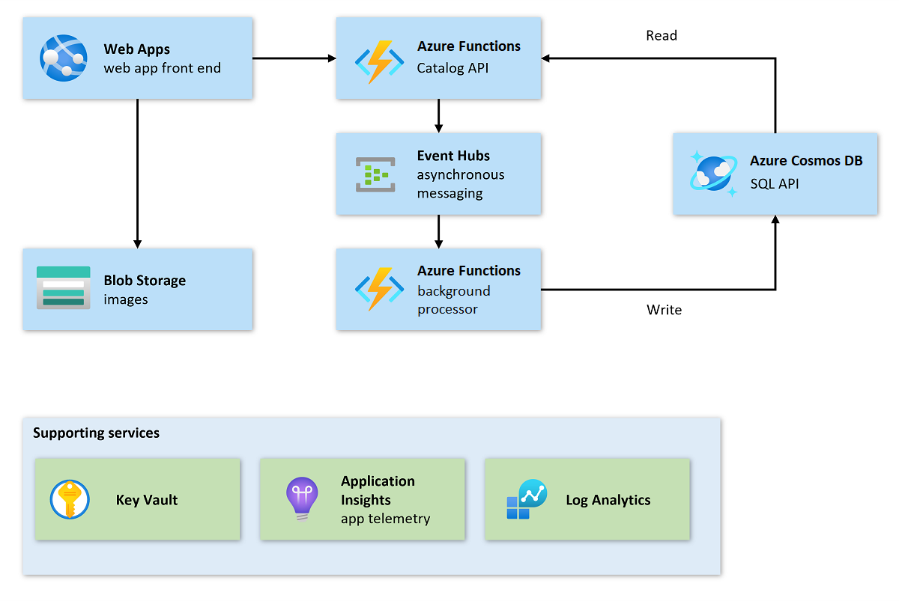

In a mission-critical workload, it's important to continuously monitor application components to ensure any degradations are caught early to prevent an outage. A well-designed health model gives you that ability based on metrics and their thresholds. Through optimized queries and visualization, you can identify the cascading impact of degraded components and troubleshoot issues early before they can cause an outage.

## Example scenario

After Contoso Shoes successfully applied the principles of mission-critical architecture in their main customer-facing application, the organization identified a gap in awareness of the health and availability of their internal web application. This website is used by Contoso Shoes employees to update the item catalog, which is then displayed on the main shop site. This existing application was designed according to the quality pillars of [Microsoft Azure Well-Architected Framework](https://learn.microsoft.com/azure/architecture/framework).

The organization is looking to perform health modeling on this workload and develop queries and dashboards for better observability.

## Learning objectives

By the end of this module, you'll be able to:

- Identify user flows and key application components of a given architecture
- Identify key metrics for the foundation of the health model of a given architecture
- Visualize the health model in a dashboard

## Architecture

The following diagram shows the architecture of the Contoso Shoes application. Make sure you have a good understanding of the individual components and their role within the functionality of the system.

### Components

The components of this architecture are as follows:

- Front-end web application: The user interface of this workload, which runs on Azure Web Apps.
  - Reads: Catalog API
  - Writes: End user

- Catalog API: The REST API layer used by the front-end web application to perform data operations (for example, load catalog, create item, update item, delete item). Hosted on Azure Functions.
  - Reads: Azure Cosmos DB
  - Writes: Azure Event Hubs

- Background Processor: A component without any public endpoint, which is used for asynchronous processing of database updates. Hosted on Azure Functions.
  - Reads: Azure Event Hubs
  - Writes: Azure Cosmos DB

- Messaging bus: The messaging bus uses Azure Event Hubs to pass messages between the Catalog API and the background processor.

- Database: The data that's persisted in Azure Cosmos DB. The Catalog API reads from the database directly, and writes are handled by the background processor.

- Secrets: Application components of this workload use secrets to authorize access. The Catalog API and background processor use connection strings to access the database and Azure Event Hubs, while the front-end application uses an API key to call the Catalog API. Secrets are stored in Azure Key Vault.

- Monitoring: Application components send all telemetry to Application Insights, backed with a Log Analytics Workspace. The same workspace is used to collect other logs and metrics for this workload.

## What is the main goal?

By the end of this module, you'll have demonstrated your ability to design a health modeling system in a production-ready, mission-critical solution.

## What will you be doing?

- Design a health endpoint in the application to check the health at the API level and its dependencies.
- Expand the solution into multiple regions to survive a regional outage.
- Build a health model and visualize the observability data through operational dashboards.

> [!IMPORTANT]
>
> The exercises do not cover all aspects of health modeling for mission-critical workloads. After you complete this module, you're encouraged to continue exploring health modeling principles given in [**Health modeling for mission-critical workloads**](/azure/architecture/reference-architectures/containers/aks-mission-critical/mission-critical-health-modeling), so that you have a complete perspective for your own designs.
