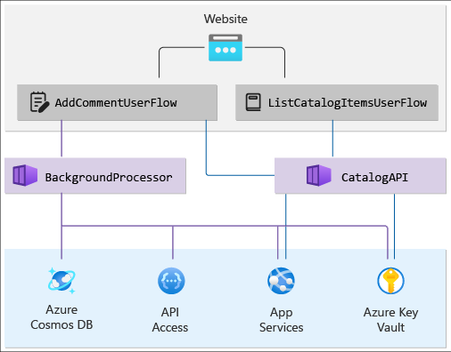

Health modeling and observability are essential concepts to maximize reliability, which focuses on robust and contextualized instrumentation and monitoring. These concepts provide critical insight into application health, promoting the swift identification and resolution of issues.

## Problem context

Most mission-critical applications are significant in terms of both scale and complexity and therefore generate high volumes of operational data, which makes it challenging to evaluate and determine optimal operational action.

Health modeling ultimately strives to maximize observability by augmenting raw monitoring logs and metrics with key business requirements to quantify application health and drive automated evaluation of health states.

## Advantages of health monitoring

To help you determine whether your environment is working as expected, it's important to monitor your application's health and the key metrics of its Azure resources. To understand these metrics and evaluate the overall health of your workload, you need a holistic understanding of all of the data monitored. A health model can assist with the evaluation of the overall health status by displaying a clear indication of the health of the workload, as opposed to raw data metrics. Representation of a health model with set indicators makes it intuitive for an operator to understand the overall health of the workload and respond quickly to any issues that might arise. Health status is typically presented as *traffic light* indicators, such as red, green, or yellow.

## Layered health model

To build a health model, first define application health in the context of key business requirements by quantifying *healthy* and *unhealthy* states in a layered and measurable format. A layered health model is reflective of the application structure and enables application health to be traced back to its lower level dependencies, which helps to quickly find the root cause of service degradation.

In a layered health model:

- The foundational layer should consider individual application components, such as Azure resources.
- Foundational components are aggregated alongside key non-functional requirements to build a business-contextualized lens into the health of system flows.
- System flows should be aggregated with appropriate weights based on business criticality to build a meaningful definition of overall application health. Financially significant or customer-facing user flows should be prioritized.
- Each layer of the health model captures what its healthy and unhealthy states represent. The health model uses these layered health definitions to inform critical monitoring metrics across all system components and validate operational subsystem composition.

For more information about layered health models, see [Layered application health](/azure/architecture/framework/mission-critical/mission-critical-health-modeling#layered-application-health). For an example of a layered health model, see [Example - Layered health model](/azure/architecture/framework/mission-critical/mission-critical-health-modeling#example---layered-health-model).

## Who's responsible for health modeling?

Users with any of the following roles typically design and use a health model:

- Administrator
- Solution Architect
- Support Engineer
- DevOps Engineer
- Network Engineer
- Security Engineer

## How to get started

The process of modeling health is a top-down design activity, based on deep understanding of the system and its expected performance. It starts with defining all user flows and mapping dependencies between functional and logical components, thereby implicitly mapping dependencies between Azure resources.
