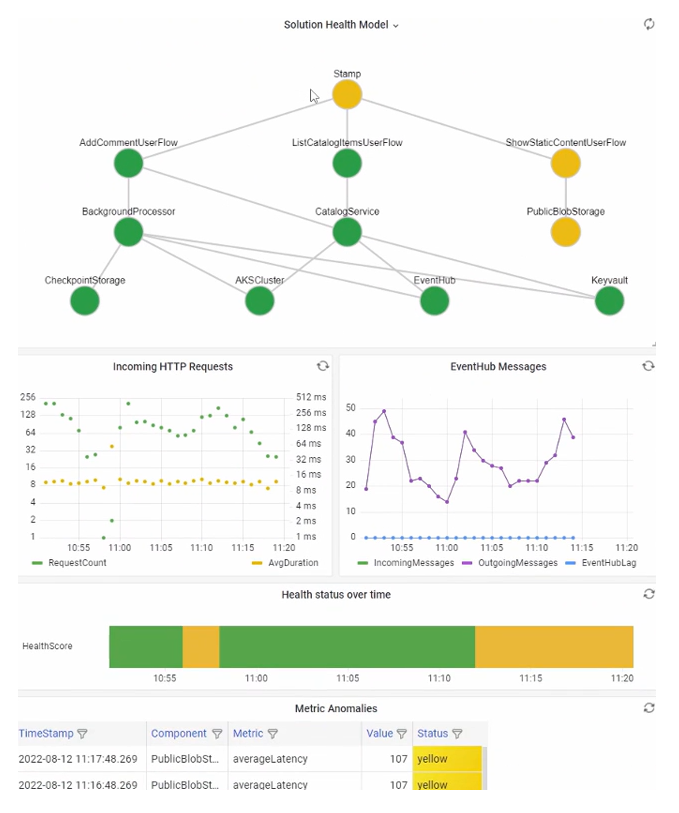

To accurately represent a health model, various datasets must be gathered from the system. These datasets include logs and performance metrics from application components and underlying Azure resources. It's important to correlate data across these datasets to be able to build the layered representation of health.

## Instrumenting code and infrastructure

A *unified data sink* is required to ensure all operational data is stored and made available for a single location where all telemetry is collected. Azure provides several data monitoring technologies under the umbrella of [Azure Monitor](/azure-monitor/overview#overview). Azure Monitor Log Analytics serves as the core Azure-native unified data sink to store and analyze operational data:

- Use Application Insights as a consistent Application Performance Monitoring (APM) tool across all application components to collect application logs, metrics, and traces.

- Deploy Application Insights in a workspace-based configuration to ensure each regional Log Analytics workspace contains logs and metrics from both application components and the underlying Azure resources.

- Use a dedicated Log Analytics workspace and an Application Insights instance for each stamp and globally shared resource (Azure Cosmos DB, for example), as per the [mission-critical guidance](/azure/architecture/framework/mission-critical/mission-critical-health-modeling#unified-data-sink-for-correlated-analysis). Doing so eliminates a single point of failure, in case a region is down. All stamps are short-lived and continuously replaced with each new release. The per-stamp Log Analytics workspaces are deployed as a global resource in a separate monitoring resource group as the stamp Log Analytics resources. These resources don't share the lifecycle of a stamp.

- Configure every service used in the architecture to send data collection to the same Log Analytics workspace, to make analysis and health calculations easier.


It's recommended that you use Application Insights with one of the supported SDKs. The key benefit is transparent end-to-end tracing so you can track requests from the client through all layers of the system. For example, when a user creates a comment in their web-browser, the operator is able to find this operation in Application Insights and see that the request went through the Catalog API to Azure Event Hubs, where it was picked up by the background processor and stored in Azure Cosmos DB.

Contoso Shoes uses Azure Functions on Microsoft .NET 6 for their back-end services to make use of native integration. Because the back-end applications already exist, the team creates only a new Application Insights resource in Azure and configures the `APPLICATIONINSIGHTS_CONNECTION_STRING` setting on both Function Apps. The Azure Functions runtime registers the Application Insights logging provider automatically, so that telemetry appears in Azure without additional effort. For more customized logging, they could use `ILogger`.

## Health monitoring queries

Log Analytics, Application Insights, and Azure Data Explorer all use [Kusto Query Language (KQL)](/azure/data-explorer/kusto/query) for their queries. With KQL, you can build queries and use functions to fetch metrics and calculate health scores.

For individual services that calculate the health status, see the following sample queries.

### Catalog API

The following sample demonstrates a [Catalog API query](https://github.com/Azure/Mission-Critical-Online/blob/feature/reactflowtest/src/infra/monitoring/queries/stamp/CatalogServiceHealthStatus.kql):

```kql
let _maxAge = 2d; // Only include data from the last two days
let _timespanStart = ago(_maxAge); // Start time for the timespan
let _timespanEnd = now(-2m); // there is some ingestion lag, so we account for this by stripping the last 2m
// For the timeframe, compare the averages to the following threshold values:
let Thresholds=datatable(MetricName: string, YellowThreshold: double, RedThreshold: double) [
    // Failed requests. Anything non-200. We allow a few more than 0 for user-caused errors like 404s. 
    "failureCount", 10, 50,
    // Average duration of the request, in ms
    "avgProcessingTime", 150, 500
    ];
//
// Calculate average processing time for each request
let avgProcessingTime = AppRequests
| where AppRoleName startswith "CatalogService"
| where OperationName != "GET /health/liveness" // Since the liveness requests don't do any processing, including them would skew the results. 
| make-series Value = avg(DurationMs) default=0 on TimeGenerated from _timespanStart to _timespanEnd step 1m
| mv-expand TimeGenerated, Value
| extend TimeGenerated = todatetime(TimeGenerated), Value=toreal(Value), MetricName= 'avgProcessingTime';
// Calculate failed requests
let failureCount = AppRequests
| where AppRoleName startswith "CatalogService"
| where OperationName != "GET /health/liveness" // Since the liveness requests don't do any processing, including them would skew the results. 
| make-series Value=countif(Success != true) default=0 on TimeGenerated from _timespanStart to _timespanEnd step 1m
| mv-expand TimeGenerated, Value
| extend TimeGenerated = todatetime(TimeGenerated), Value=toreal(Value), MetricName= 'failureCount';
// Union all together and join with the thresholds
avgProcessingTime
| union failureCount
| lookup kind = inner Thresholds on MetricName
| extend IsYellow = iff(todouble(Value) > YellowThreshold and todouble(Value) < RedThreshold, 1, 0)
| extend IsRed = iff(todouble(Value) > RedThreshold, 1, 0)
| project-reorder TimeGenerated, MetricName, Value, IsYellow, IsRed, YellowThreshold, RedThreshold
| extend ComponentName="CatalogService"
```

### Azure Key Vault

The following sample demonstrates an [Azure Key Vault](https://github.com/Azure/Mission-Critical-Online/blob/feature/reactflowtest/src/infra/monitoring/queries/stamp/KeyvaultHealthStatus.kql) query:

```kql
let _maxAge = 2d; // Only include data from the last two days
let _timespanStart = ago(_maxAge); // Start time for the timespan
let _timespanEnd = now(-2m); // there is some ingestion lag, so we account for this by stripping the last 2m
//
let Thresholds = datatable(MetricName: string, YellowThreshold: double, RedThreshold: double) [
    // Failure count on key vault requests
    "failureCount", 3, 10
    ];
//
let failureStats = AzureDiagnostics
| where TimeGenerated > _timespanStart
| where ResourceProvider == "MICROSOFT.KEYVAULT"
// Ignore Authentication operations with a 401. This is normal when using Key Vault SDK, first an unauthenticated request is done then the response is used for authentication.
| where Category=="AuditEvent" and not (OperationName == "Authentication" and httpStatusCode_d == 401)
| where OperationName in ('SecretGet','SecretList','VaultGet') or '*' in ('SecretGet','SecretList','VaultGet')
| where ResultSignature != "Not Found" // Exclude Not Found responses as these happen regularly during 'terraform plan' operations, when TF checks for the existence of secrets
// Create ResultStatus with all the 'success' results bucked as 'Success'
// Certain operations like StorageAccountAutoSyncKey have no ResultSignature, for now set to 'Success' as well
| extend ResultStatus = case ( ResultSignature == "", "Success",
                               ResultSignature == "OK", "Success",
                               ResultSignature == "Accepted", "Success",
                               ResultSignature);
//
//
failureStats
| make-series Value=countif(ResultStatus != "Success") default=0 on TimeGenerated from _timespanStart to _timespanEnd step 1m
| mv-expand TimeGenerated, Value
| extend TimeGenerated = todatetime(TimeGenerated), Value=toreal(Value), MetricName="failureCount", ComponentName="Keyvault"
| lookup kind = inner Thresholds on MetricName
| extend IsYellow = iff(todouble(Value) > YellowThreshold and todouble(Value) < RedThreshold, 1, 0)
| extend IsRed = iff(todouble(Value) > RedThreshold, 1, 0)
```

### Catalog Service health score

Eventually, various health **status** queries can be tied together to calculate a health **score** of a component. The following sample query shows how to calculate a [Catalog Service health score](https://github.com/Azure/Mission-Critical-Online/blob/feature/reactflowtest/src/infra/monitoring/queries/stamp/CatalogServiceHealthScore.kql) in the Mission-critical Online reference implementation:

```kql
CatalogServiceHealthStatus()
| union AksClusterHealthStatus()
| union KeyvaultHealthStatus()
| union EventHubHealthStatus()
| where TimeGenerated < ago(2m)
| summarize YellowScore = max(IsYellow), RedScore = max(IsRed) by bin(TimeGenerated, 2m)
| extend HealthScore = 1 - (YellowScore * 0.25) - (RedScore * 0.5)
| extend ComponentName = "CatalogService", Dependencies="AKSCluster,Keyvault,EventHub" // These values are added to build the dependency visualization.
| order by TimeGenerated desc
```

> [!TIP]
>
> For more [query examples](https://github.com/Azure/Mission-Critical-Online/tree/feature/reactflowtest/src/infra/monitoring/queries), see the Mission-critical Online GitHub repository.

## Set up query-based alerts

Alerts are an important part of the overall operations strategy. Use proactive monitoring, such as the use of dashboards, with alerts that raise immediate attention to issues.

These alerts form an extension of the health model, by alerting the operator to a change in health state, either to a degraded/yellow state or to an unhealthy/red state. By setting the alert to the root node of the health model, the operator is immediately aware of any business-level effect to the state of the solution. The operator can then direct their attention to the health model visualization for troubleshooting.

Azure Monitor provides an extensive alerting framework to detect, categorize, and respond to operational signals through Action Groups. Use Azure Monitor alerts to drive automated actions in response to current or potential deviations from a healthy application state.

## Use dashboards for visualization

You must visualize your health model and the data it continuously collects. Operators will be able to see the dependency tree and understand quickly the effect of a component outage on the whole system. The ultimate goal of a health model is to facilitate swift diagnosis by providing informed view into deviations from steady state.

A common way to visualize system health information is to use dashboards as a way to combine the layered health model view with telemetry drill-down capabilities if needed.



Microsoft provides several data visualization technologies, including Azure Dashboards, Power BI, and Azure Managed Grafana. Azure Dashboards provides a tightly integrated out-of-the-box visualization solution for operational data within Azure Monitor. However, if you can't use Azure Dashboards to accurately represent the health model, then consider using Grafana as an alternative visualization solution. Grafana provides market-leading capabilities and an extensive open-source plugin ecosystem.
