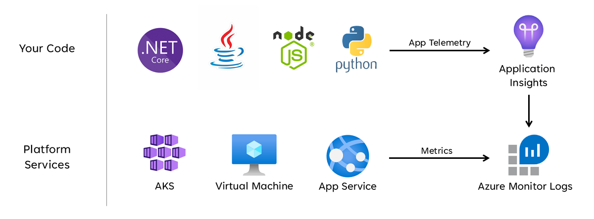
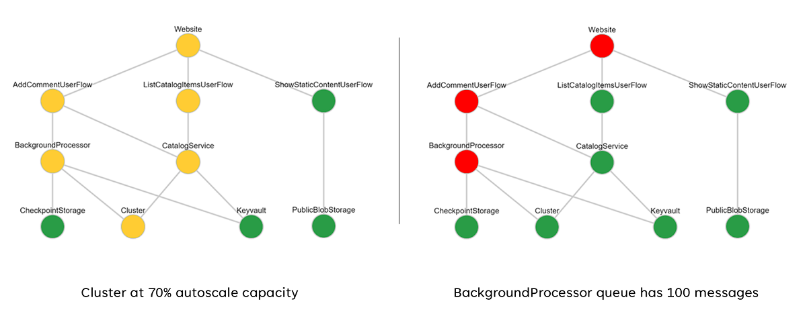

To monitor health states, follow these guidelines in your health model:

- Use an application performance monitoring (APM) to collect application logs, metrics, and traces.
- Store metrics in a Log Analytics workspace.
- Build KQL queries and functions to fetch metrics and calculate scores.
- Set up query-based alerts.
- Set up dashboards for visualization.

## Monitoring

To collect application logs, metrics, and traces consistently across all application components, use Application Insights as an APM tool. Deploy Application Insights in a workspace-based configuration to ensure each regional Log Analytics Workspace contains logs and metrics from both application components and underlying Azure resources.

### Store metrics in a Log Analytics workspace

Use Azure Log Analytics as the central store for logs and metrics for all application and infrastructure components.

Use Azure Application Insights for all application monitoring data. Each stamp in the infrastructure has a dedicated Log Analytics workspace and Application Insights instance. Use a separate Log Analytics workspace for globally shared resources, such as Azure Front Door and Azure Cosmos DB.

Use Azure Monitor Logs (Log Analytics) as a unified data sink to provide a "single pane" across all operational data sets. To make analysis and health calculations easier, all resources within a stamp should use the stamp workspace for logging. As per the [mission-critical guidance](https://learn.microsoft.com/azure/architecture/framework/mission-critical/mission-critical-health-modeling#unified-data-sink-for-correlated-analysis), each stamp and global resource uses their own Log Analytics workspace to eliminate a single point of failure, in case a region is down.



All stamps are short-lived and continuously replaced with each new release. The per-stamp Log Analytics workspaces are deployed as a global resource in a separate monitoring resource group as the stamp Log Analytics resources. These resources don't share the lifecycle of a stamp.

### Design considerations

- Although Azure Monitor is enabled by default for all Azure subscriptions, you must deploy and configure Azure Monitor for Logs (Log Analytics) and Azure Application Insights resources to incorporate data collection and querying capabilities.

- Azure Monitor supports three types of observability data: logs, metrics, and distributed traces.
  
- Logs are stored in Azure Monitor Logs workspaces based on Azure Data Explorer. Log queries are stored in query packs that can be shared across subscriptions, and are used to drive observability components such as dashboards, workbooks, or other reporting and visualization tools.

- Metrics are stored in an internal time-series diagnostic service database. For most Azure resources, the retention period is 93 days. Configure metric collection through resource diagnostic settings.

- All Azure resources expose logs and metrics, but resources must be appropriately configured to route diagnostic data to your desired data sink.

- Azure provides various [built-in policies](https://learn.microsoft.com/azure/azure-monitor/policy-reference) that can be applied to ensure deployed resources are configured to send logs and metrics to an Azure Monitor instance.

- Azure Monitor Logs Dedicated Clusters provides a deployment option that enables Availability Zones for protection from zonal failures in supported Azure regions. Dedicated Clusters require a minimum daily data ingest commitment.

- Azure Monitor for Logs resources, including underlying log and metrics storage, are deployed into a specified Azure region.

- To protect against loss of data from unavailability of an Azure Monitor for Logs workspace, you can configure resources with multiple Diagnostics configurations. Each Diagnostic configuration can target metrics and logs at a separate Azure Monitor for Log workspace.

- Azure Monitor Logs workspace data can be exported to Azure Storage or Azure Event Hubs on a continuous, scheduled, or one-time basis. Data export allows for long-term data archiving and protects against possible operational data loss due to unavailability. Data export destinations must be within the same Azure region as the Azure Monitor Logs workspace.

- Azure Monitor Logs has user query throttling limits, which may appear as reduced availability to clients, such as observability dashboards.

- Query Packs are Azure Resource Manager resources, which can be used to protect and recover Azure Monitor Logs queries if Azure Monitor Logs workspace is unavailable. Query Packs contain queries as JSON and can be stored external to Azure similar to other infrastructure-as-code assets.

- You can deploy Application Insights in a workspace-based deployment model, underpinned by a Log Analytics Workspace where all the data is stored.

- Enable sampling within Application Insights to reduce the amount of telemetry sent and optimize data ingest costs.

- Log Analytics and Application Insights charge based on the volume of data ingested and the duration that data is retained for.

## Build KQL queries

Azure Mission-Critical uses different Kusto Query Language (KQL) queries to implement custom queries as functions to retrieve data from Log Analytics. These queries are stored as individual files in our code repository, separated for global and stamp deployments. They're imported and applied automatically via Terraform as part of each infrastructure pipeline run.

This approach separates the query logic from the visualization layer. The Log Analytics queries are called directly from code, for example from the HealthService API. Another example is from a visualization tool such as Azure Dashboards, Monitor Workbooks, or Grafana.

Log Analytics, Application Insights, and Azure Data Explorer all use [KQL](https://learn.microsoft.com/azure/data-explorer/kusto/query/) for their queries. With KQL, you can build queries and use functions to fetch metrics and calculate scores. For sample queries, see [Samples for Kusto Queries](/azure/data-explorer/kusto/query/samples?pivots=azuremonitor).

This definition of health can be represented by a KQL query, as demonstrated by the following example AKS query, which aggregates InsightsMetrics (AKS Container insights) and AzureMetrics (Azure diagnostics) and compares (inner join) against modeled health thresholds.

```KQL
// ClusterHealthStatus
let Thresholds=datatable(MetricName: string, YellowThreshold: double, RedThreshold: double) [
    // Disk Usage:
    "used_percent", 50, 80,
    // Average node cpu usage %:
    "node_cpu_usage_percentage", 60, 90,
    // Average node disk usage %:
    "node_disk_usage_percentage", 60, 80,
    // Average node memory usage %:
    "node_memory_rss_percentage", 60, 80
    ];
InsightsMetrics
| summarize arg_max(TimeGenerated, *) by Computer, Name
| project TimeGenerated,Computer, Namespace, MetricName = Name, Value=Val
| extend NodeName = extract("([a-z0-9-]*)(-)([a-z0-9]*)$", 3, Computer)
| union (
    AzureMetrics
    | extend ResourceType = extract("(PROVIDERS/MICROSOFT.)([A-Z]*/[A-Z]*)", 2, ResourceId)
    | where ResourceType == "CONTAINERSERVICE/MANAGEDCLUSTERS"
    | summarize arg_max(TimeGenerated, *) by MetricName
    | project TimeGenerated, MetricName, Namespace = "AzureMetrics", Value=Average
    )
| lookup kind=inner Thresholds on MetricName
| extend IsYellow = iff(Value > YellowThreshold and Value < RedThreshold, 1, 0)
| extend IsRed = iff(Value > RedThreshold, 1, 0)
| project NodeName, MetricName, Value, YellowThreshold, IsYellow, RedThreshold, IsRed
```

The resulting table output can then be transformed into a health score for easier aggregation at higher levels of the health model.

```KQL
// ClusterHealthScore
ClusterHealthStatus
| summarize YellowScore = max(IsYellow), RedScore = max(IsRed)
| extend HealthScore = 1-(YellowScore*0.25)-(RedScore*0.5)
```

These aggregated scores can then be represented as a dependency chart using visualization tools such as Grafana to illustrate the health model.



## Set up query-based alerts

Alerts are an important part of the overall operations strategy. Proactive monitoring such as the use of dashboards should be used with alerts that raise immediate attention to issues.

These alerts form an extension of the health model, by alerting the operator to a change in health state, either to degraded/yellow state or to unhealthy/red state. By setting the alert to the root node of the Health Model, the operator is immediately aware of any business level affect to the state of the solution: After all, this root node will turn yellow or red if any of the underlying user flows or resources report yellow or red metrics. The operator can direct their attention to the Health Model visualization for troubleshooting.

While the visual representations of application health provide invaluable operational and business insights to support issue detection and diagnosis, it relies on the readiness and interpretations of operational teams, as well as the effectiveness of subsequent human-triggered responses. Therefore, to maximize reliability it's necessary to implement extensive alerting to detect proactively and respond to issues in near real-time.

Azure Monitor provides an extensive alerting framework to detect, categorize, and respond to operational signals through Action Groups. Use Azure Monitor alerts to drive automated actions in response to current or potential deviations from a healthy application state.

Alerting and automated action is critical to effectively detect and swiftly respond to issues as they happen, before greater negative impact can occur. Alerting also provides a mechanism to interpret incoming signals and respond to prevent issues before they occur.

### Design considerations

- Alert rules are defined to fire when conditional criteria are satisfied for incoming signals, which can include various data sources, such as metrics, log search queries, or availability tests.

- Alerts can be defined within Log Analytics or Azure Monitor on the specific resource.

- You can use the Azure Monitor Alerts API to retrieve active and historic alerts.

## Use dashboards for visualization

Visually representing the health model with critical operational data is essential to achieve effective operations and maximize reliability. Use dashboards to provide near-real time insights into application health for DevOps teams, facilitating the swift diagnosis of deviations from steady state. A robust dashboard is essential to diagnose issues that have already occurred, and supports operational teams in detecting and responding to issues as they happen.

Microsoft provides several data visualization technologies, including Azure Dashboards, Power BI, and Azure Managed Grafana. Azure Dashboards is positioned to provide a tightly integrated out-of-the-box visualization solution for operational data within Azure Monitor. It therefore has a fundamental role to play in the visual representation of operational data and application health for a mission-critical workload. However, there are several limitations in terms of the positioning of Azure Dashboards as a holistic observability platform, and as a result consideration should be given to the supplemental use of market-leading observability solutions, such as Grafana, which is also provided as a managed solution within Azure.

Use Azure Dashboards to create operational lenses for global resources and regional deployment stamps, representing key metrics such as request count for Azure Front Door, server side latency for Azure Cosmos DB, incoming/outgoing messages for Event Hubs, and CPU utilization or deployment statuses for Azure Kubernetes Service (AKS). Dashboards should be tailored to drive operational effectiveness, infusing learnings from failure scenarios to ensure DevOps teams have direct visibility into key metrics.

If Azure Dashboards can't be used to accurately represent the health model and requisite business requirements, then it's recommended to consider Grafana as an alternative visualization solution. Grafana provides market-leading capabilities and an extensive open-source plugin ecosystem. Evaluate the managed Grafana preview offering to avoid the operational complexities of managing Grafana infrastructure. If you deploy self-hosted Grafana, employ a highly available and geo-distributed design to ensure critical operational dashboards can be resilient to regional platform failures and cascading error scenarios.

### Design considerations

- When you visualize the health model using Log Analytics queries, be aware of Log Analytics limits on concurrent and queued queries, as well as the overall query rate, with subsequent queries queued and throttled.

- You can write and execute queries to retrieve operational data used to calculate and represent health scores in either Azure Monitor Log Analytics or Azure Data Explorer. For sample queries, see [Samples for Kusto queries](/azure/data-explorer/kusto/query/samples?pivots=azuremonitor).

- Log Analytics imposes several query limits, which you must account for when you design operational dashboards.

- The visualization of raw resource metrics, such as CPU utilization or network throughput, requires manual evaluation by operations teams to determine health status impacts, which can be challenging during an active incident.

- If multiple users use dashboards within a tool like Grafana, the number of queries sent to Log Analytics multiplies quickly.

- Reaching the concurrent query limit on Log Analytics will queue subsequent queries, making the dashboard experience feel slow.

- Collect and present queried outputs from all regional Log Analytics Workspaces and the global Log Analytics Workspace to build a unified view of application health. If you're deploying into an Azure landing zone, consider querying the central platform Log Analytics Workspace if key dependencies on platform resources exist, such as ExpressRoute for on-premises communication.
