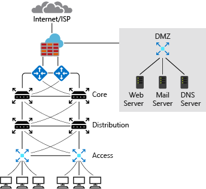
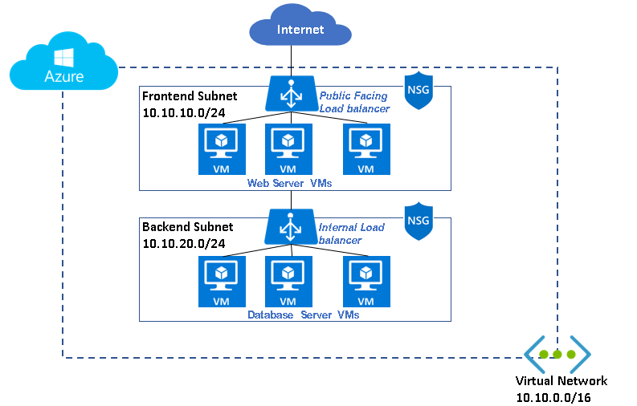

To integrate resources in an Azure virtual network with resources in your on-premises network, you must understand how you can connect those resources and how to configure IP addresses.

Your manufacturing company wants to migrate a business-critical database to Azure. Client applications on desktop computers, laptops, and mobile devices need constant access to the database as if the database remained in the on-premises network. You want to move the database server without affecting users.

In this unit, you will look at a typical on-premises network design and compare it to a typical Azure network design. You also will learn about requirements for IP addressing when integrating an Azure network with on-premises networks.

## On-premises IP addressing

A typical on-premises network design includes these components:

- Routers
- Firewalls
- Switches
- Network segmentation

The diagram shows a simplified version of a typical on-premises network. On the routers facing the internet service provider (ISP), you have public IP addresses that are used by your outbound internet traffic as their source. These addresses also are used for inbound traffic across the internet. The ISP might assign you a block of IP addresses to assign to your devices, or you might have your own block of public IP addresses that your organization owns and controls. These addresses can be assigned to systems that you would like to make accessible from the internet, such as web servers.

The perimeter network and internal zone have private IP addresses. In the perimeter network and internal zone, the IP addresses that are assigned to these devices aren't accessible over the internet. The administrator has full control over the IP address assignment, name resolution, security settings, and security rules. There are three ranges of non-routable IP addresses that are designed for internal networks that won't be sent over internet routers:

- 10.0.0.0 to 10.255.255.255
- 172.16.0.0 to 172.31.255.255
- 192.168.0.1 to 192.168.255.255

The administrator can add or remove on-premises subnets to accommodate network devices and services. The number of subnets and IP addresses you can have in your on-premises network depends on the Classless Inter-Domain Routing (CIDR) for the IP address block.

## Azure IP addressing

Azure virtual networks use private IP addresses. The ranges of private IP addresses are the same as for on-premises IP addressing. Like on-premises networks, the administrator has full control over the IP address assignment, name resolution, security settings, and security rules in an Azure virtual network. The administrator can add or remove subnets depending on the CIDR for the IP address block.

In a typical Azure network design, we usually have these components:

- Virtual networks
- Subnets
- Network security groups
- Firewalls
- Load balancers

In Azure, the network design has features and functions that are similar to an on-premises network, but the structure of the network is different. The Azure network does not follow the typical on-premises hierarchical network design. The Azure network provides the ability to scale up and scale down infrastructure based on demand. Provisioning in the Azure network happens in a matter of seconds. There are no hardware devices, like routers or switches. The entire infrastructure is virtual and you slice it into chunks that suit your requirements.

In Azure, you typically would implement a network security group and a firewall. You use subnets to isolate front-end services, including web servers and DNS, and back-end services like databases and storage systems. Network security groups filter internal and external traffic at the network layer. A firewall has more extensive capabilities for network layer filtering and application layer filtering. By deploying both network security groups and a firewall, you get improved isolation of resources for a secure network architecture.

## Basic properties of Azure virtual networks

A virtual network is your network in the cloud. You can divide your virtual network into multiple subnets. Each subnet has a portion of the IP address space that is assigned to your virtual network. You can add, remove, expand, or shrink a subnet if there are no VMs or services deployed in it.

By default, all subnets in an Azure virtual network can communicate with each other. However, you can use a network security group to deny communication between subnets. The smallest subnet that is supported uses a /29 subnet mask. The largest supported subnet uses a /2 subnet mask.

## Integrate Azure with on-premises networks

Before you start integrating Azure with on-premises networks, it's important to identify the current private IP address scheme used in the on-premises network. There can be no IP address overlap for interconnected networks.

For example, you can't use 192.168.0.0/16 on your on-premises network and use 192.168.10.0/24 on your Azure virtual network. These ranges both contain the same IP addresses and won't be able to route traffic between each other.

You can, however, have the same class range for multiple networks. For example, you can use the 10.10.0.0/16 address space for your on-premises network and the 10.20.0.0/16 address space for your Azure network because they don't overlap.

It is vital to check for overlaps when you're planning an IP address scheme. If there's an overlap of IP addresses, you can't integrate your on-premises network with your Azure network.
