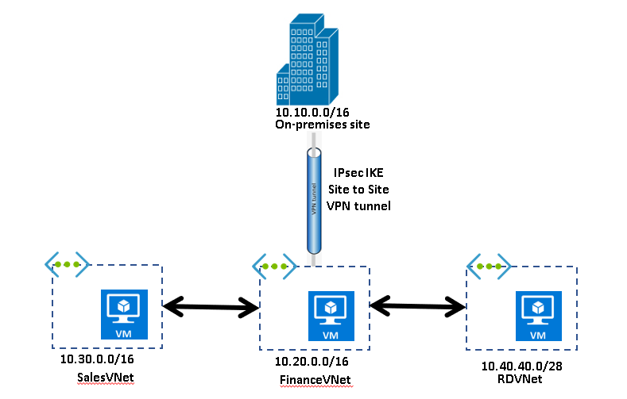

Now you're ready to create and deploy some virtual networks with the IP addresses that you planned.

In this unit, you will implement three virtual networks.

The **FinanceVnet** virtual network is deployed in the **US West** region. The finance team uses this virtual network to process data that's added after a customer is acquired by the sales team. The finance team wants access to Sales data in branch2.

The **SalesVnet** virtual network is deployed in the **North Europe** region. The sales team uses this virtual network. Members of the sales team regularly communicate with the finance team. To share their data with the finance team, they must download or send it because the sales and finance branches are not connected.

The **RdVnet** virtual network is deployed in the **West India** regions. The research and development team uses this virtual network. Members of the research and development team have a working relationship with the finance team, but they don't want the sales team to have direct access to their data.



You will create the following resources:

| Virtual network | Region | Virtual network address space | Subnet | Subnet address space |
| --- | --- | --- | --- | --- |
| FinanceVnet | West US | 10.20.0.0/16 | FinanceFrontendSubnet | 10.20.1.0/24 |
| SalesVnet | North Europe | 10.30.30.0/24 | SalesFrontendSubnet | 10.30.30.0/25 |
| RDVnet | West India | 10.40.40.0/28 | RdSubnet | 10.40.40.0/28 |
| | | | | |

## Create the virtual networks

1. In Cloud Shell, run the following command to create the virtual network and subnet for the **Finance** branch:

    ```azurecli
    az network vnet create \
        --resource-group <rgn>[sandbox resource group name]</rgn> \
        --name FinanceVnet \
        --address-prefix 10.20.0.0/16 \
        --subnet-name FinanceFrontendSubnet \
        --subnet-prefix 10.20.1.0/24 \
        --location westus
    ```

1. Run this command to create the virtual network and subnet for the **Sales** branch:

    ```azurecli
    az network vnet create --resource-group <rgn>[sandbox resource group name]</rgn> \
        --name SalesVnet \
        --address-prefix 10.30.30.0/24 \
        --subnet-name SalesFrontendSubnet \
        --subnet-prefix 10.30.30.0/25 \
        --location northeurope
    ```

1. Run this command to create the virtual network and subnet for the **Research and Development** branch:

    ```azurecli
    az network vnet create --resource-group <rgn>[sandbox resource group name]</rgn> \
        --name RdVnet \
        --address-prefix 10.40.40.0/28 \
        --subnet-name RdSubnet \
        --subnet-prefix 10.40.40.0/28 \
        --location westindia
    ```

## Verify the virtual network configuration

Let's take a quick look at what you created.

1. In Cloud Shell, run this command to view the virtual networks:

    ```azurecli
    az network vnet list --output table
    ```

    You should see an output like this:

    ```output
    Name ResourceGroup Location NumSubnets Prefixes DnsServers DDOSProtection VMProtection
    -------------- ------------------------------------ ----------- ------------ ----------- ------------ ---------------- --------------
    FinanceVNet <rgn>[sandbox resource group name]</rgn> WestUS 1 10.20.0.0/16 False False
    SalesVNet <rgn>[sandbox resource group name]</rgn> NorthEurope 1 10.30.30.0/24 False False
    RDVNet <rgn>[sandbox resource group name]</rgn> WestIndia 1 10.40.40.0/28 False False
    ```

Now that you have created the virtual networks and subnets, you have the infrastructure on which you can deploy resources.

These networks can be further integrated through virtual network peering and through VPN gateway to connect to on-premises networks.
