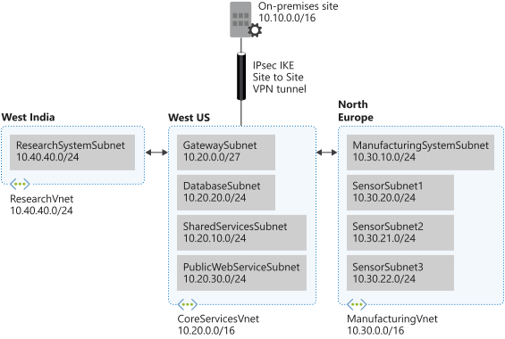

Now, you're ready to create and deploy some virtual networks with the IP addresses that you planned.

In this unit, you will implement three virtual networks and subnets to support resources in those virtual networks.

The **CoreServicesVnet** virtual network is deployed in the **US West** region. This virtual network will have the largest number of resources. It will have connectivity to on-premises networks through a VPN connection. This network will have web services, databases, and other systems that are key to the operations of the business. Shared services, such as domain controllers and DNS also will be located here. A large amount of growth is anticipated, so a large address space is necessary for this virtual network.

The **ManufacturingVnet** virtual network is deployed in the **North Europe** region, near the location of your organization's manufacturing facilities. This virtual network will contain systems for the operations of the manufacturing facilities. The organization is anticipating a large number of internal connected devices for their systems to retrieve data from, such as temperature, and will need an IP address space that it can expand into.

The **ResearchVnet** virtual network is deployed in the **West India** region, near the location of the organization's research and development team. The research and development team uses this virtual network. The team has a small, stable set of resources that is not expected to grow. The team needs a small number of IP addresses for a few virtual machines for their work.



You will create the following resources:

| Virtual network | Region | Virtual network address space | Subnet | Subnet address space |
| --- | --- | --- | --- | --- |
| CoreServicesVnet | West US | 10.20.0.0/16 | - | - |
| | | | GatewaySubnet | 10.20.0.0/27 |
| | | | SharedServicesSubnet | 10.20.10.0/24 |
| | | | DatabaseSubnet | 10.20.20.0/24 |
| | | | PublicWebServiceSubnet | 10.20.30.0/24 |
| ManufacturingVnet | North Europe | 10.30.0.0/16 | - | - |
| | | | ManufacturingSystemSubnet | 10.30.10.0/24 |
| | | | SensorSubnet1 | 10.30.20.0/24 |
| | | | SensorSubnet2 | 10.30.21.0/24 |
| | | | SensorSubnet3 | 10.30.22.0/24 |
| ResearchVnet | West India | 10.40.40.0/24 | - | - |
| | | | ResearchSystemSubnet | 10.40.40.0/24|
| | | | | |

These virtual networks and subnets are structured in a way that accommodates existing resources yet allows for projected growth. Let's create these virtual networks and subnets to lay the foundation for our networking infrastructure.

## Create the *CoreServicesVnet* virtual network

1. In Azure Cloud Shell, run the following command to create the **CoreServicesVnet** virtual network:

    ```azurecli
    az network vnet create \
        --resource-group <rgn>[sandbox resource group name]</rgn> \
        --name CoreServicesVnet \
        --address-prefix 10.20.0.0/16 \
        --location westus
    ```

1. Now, let's create the subnets that we need for the planned resources in the virtual network:

    ```azurecli
    az network vnet subnet create \
        --resource-group <rgn>[sandbox resource group name]</rgn> \
        --vnet-name CoreServicesVnet \
        --name GatewaySubnet \
        --address-prefixes 10.20.0.0/27

    az network vnet subnet create \
        --resource-group <rgn>[sandbox resource group name]</rgn> \
        --vnet-name CoreServicesVnet \
        --name SharedServicesSubnet \
        --address-prefixes 10.20.10.0/24

    az network vnet subnet create \
        --resource-group <rgn>[sandbox resource group name]</rgn> \
        --vnet-name CoreServicesVnet \
        --name DatabaseSubnet \
        --address-prefixes 10.20.20.0/24

    az network vnet subnet create \
        --resource-group <rgn>[sandbox resource group name]</rgn> \
        --vnet-name CoreServicesVnet \
        --name PublicWebServiceSubnet \
        --address-prefixes 10.20.30.0/24
    ```

1. Let's take a look at what we have created. Run this command to show all the subnets that we configured:

    ```azurecli
    az network vnet subnet list \
        --resource-group <rgn>[sandbox resource group name]</rgn> \
        --vnet-name CoreServicesVnet \
        --output table
    ```

    You should see the following subnets listed:

    ```output
    AddressPrefix    Name                    ProvisioningState    ResourceGroup
    ---------------  ----------------------  -------------------  -------------------------------------------
    10.20.0.0/27     GatewaySubnet           Succeeded            <rgn>[sandbox resource group name]</rgn>
    10.20.10.0/24    SharedServicesSubnet    Succeeded            <rgn>[sandbox resource group name]</rgn>
    10.20.20.0/24    DatabaseSubnet          Succeeded            <rgn>[sandbox resource group name]</rgn>
    10.20.30.0/24    PublicWebServiceSubnet  Succeeded            <rgn>[sandbox resource group name]</rgn>
    ```

## Create the *ManufacturingVnet* virtual network

1. In Cloud Shell, run the following command to create the **ManufacturingVnet** virtual network:

    ```azurecli
    az network vnet create \
        --resource-group <rgn>[sandbox resource group name]</rgn> \
        --name ManufacturingVnet \
        --address-prefix 10.30.0.0/16 \
        --location northeurope
    ```

1. Now, let's create the subnets that we need for the planned resources in the virtual network:

    ```azurecli
    az network vnet subnet create \
        --resource-group <rgn>[sandbox resource group name]</rgn> \
        --vnet-name ManufacturingVnet \
        --name ManufacturingSystemSubnet \
        --address-prefixes 10.30.10.0/24

    az network vnet subnet create \
        --resource-group <rgn>[sandbox resource group name]</rgn> \
        --vnet-name ManufacturingVnet \
        --name SensorSubnet1 \
        --address-prefixes 10.30.20.0/24

    az network vnet subnet create \
        --resource-group <rgn>[sandbox resource group name]</rgn> \
        --vnet-name ManufacturingVnet \
        --name SensorSubnet2 \
        --address-prefixes 10.30.21.0/24

    az network vnet subnet create \
        --resource-group <rgn>[sandbox resource group name]</rgn> \
        --vnet-name ManufacturingVnet \
        --name SensorSubnet3 \
        --address-prefixes 10.30.22.0/24
    ```

1. Let's take a look at what we have created. Run this command to show all the subnets that we configured:

    ```azurecli
    az network vnet subnet list \
        --resource-group <rgn>[sandbox resource group name]</rgn> \
        --vnet-name ManufacturingVnet \
        --output table
    ```

    You should see the following subnets listed:

    ```azurecli
    AddressPrefix    Name                       ProvisioningState    ResourceGroup
    ---------------  -------------------------  -------------------  -------------------------------------------
    10.30.10.0/24    ManufacturingSystemSubnet  Succeeded            <rgn>[sandbox resource group name]</rgn>
    10.30.20.0/24    SensorSubnet1              Succeeded            <rgn>[sandbox resource group name]</rgn>
    10.30.21.0/24    SensorSubnet2              Succeeded            <rgn>[sandbox resource group name]</rgn>
    10.30.22.0/24    SensorSubnet3              Succeeded            <rgn>[sandbox resource group name]</rgn>
    ```

## Create the *ResearchVnet* virtual network

1. In Cloud Shell, run the following command to create the **ResearchVnet** virtual network:

    ```azurecli
    az network vnet create \
        --resource-group <rgn>[sandbox resource group name]</rgn> \
        --name ResearchVnet \
        --address-prefix 10.40.40.0/24 \
        --location westindia
    ```

1. Now, let's create the subnets that we need for the planned resources in the virtual network:

    ```azurecli
    az network vnet subnet create \
        --resource-group <rgn>[sandbox resource group name]</rgn> \
        --vnet-name ResearchVnet \
        --name ResearchSystemSubnet \
        --address-prefixes 10.40.40.0/24
    ```

1. Let's take a look at the final virtual network. Run this command to show all the subnets that we configured:

    ```azurecli
    az network vnet subnet list \
        --resource-group <rgn>[sandbox resource group name]</rgn> \
        --vnet-name ResearchVnet \
        --output table
    ```

    You should see the following subnets listed:

    ```azurecli
    AddressPrefix    Name                  ProvisioningState    ResourceGroup
    ---------------  --------------------  -------------------  -------------------------------------------
    10.40.40.0/24    ResearchSystemSubnet  Succeeded            <rgn>[sandbox resource group name]</rgn>
    ```

Now that you have created the virtual networks and subnets, you have the infrastructure on which you can deploy resources.

These networks can be further integrated through virtual network peering and through Azure VPN Gateway to connect to on-premises networks. You can use network security groups to filter traffic and control access within and between virtual networks.
