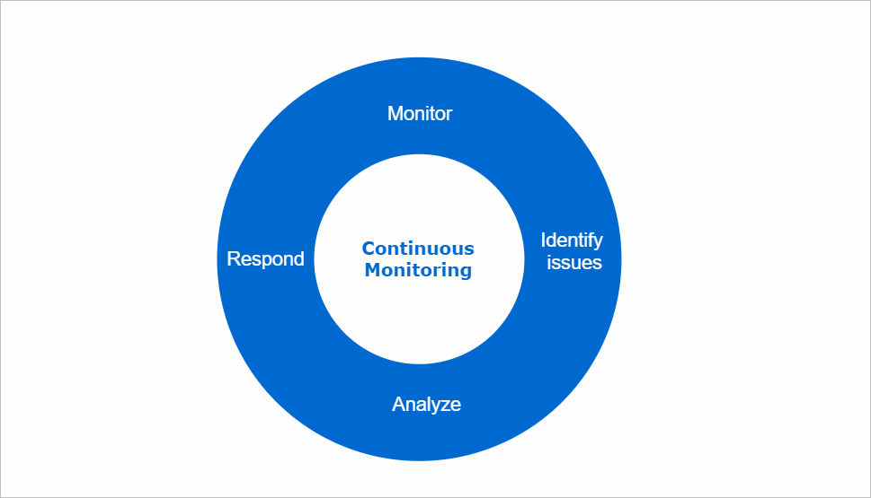
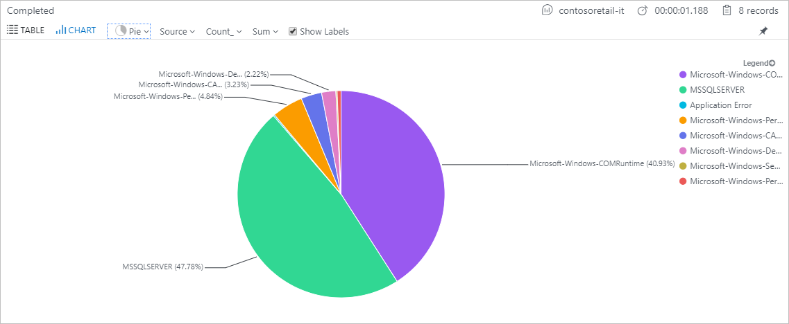

Your organization is moving all its systems from an on-premises location to Azure. You've been asked to implement a monitoring strategy. 

In this unit, you'll learn why a continuous monitoring strategy can improve your ability to identify issues within your applications, and improve customer experience.

## Why use continuous monitoring?

Your applications and the infrastructure could face different kinds of potentially damaging issues. You might have to deal with issues such as security risks, fluctuating usage rates, or errors and exceptions.

Your response must be appropriate to the kind of issue. You may respond with security patches or by adding new features. You might also respond with changes in the configuration and code of your application or infrastructure. You'll need to monitor continuously for these issues.

With the right tools, you can monitor the performance of your infrastructure and applications. You can also monitor for security risks and suspicious activity. You can collect information on issues as soon as they arise, analyze the information you've collected, and respond appropriately.

By monitoring your applications and infrastructure continuously, you respond to changes and issues appropriately, and on time. In the long run, your organization will become more productive, cost-effective, secure, and competitive.

## Why monitor your applications?

You want to improve your application's health, and build better applications in the future. You'll want to configure alerts and automated responses to deal with issues that affect your application during development, and when it's in production.

By monitoring your application for issues as it's being developed, you prevent errors and exceptions later, when your application goes to production. You ensure your code only gets pushed to the next stage of the development cycle if it has successfully passed the necessary checks. This way, you're improving your development lifecycle.

You also monitor your application when it's live and in use. As you can see above, you might be faced with failing requests, or issues that cause an application to be unavailable altogether. By monitoring for live issues, you'll identify these types of problems and risks promptly, and respond effectively to keep your application healthy.

## Why monitor your infrastructure?

Different kinds of issues may affect your infrastructure. You might have to deal with performance issues, or problems that could render your entire infrastructure unavailable, or threats to your security. Any of these issues could result in an impact on productivity, financial loss, or damage to your organization's reputation. Monitor the health of your infrastructure to ensure that it remains protected and available at all times.

You want to deal with any issues that arise in a timely and effective manner. Configure alerts on your infrastructure to monitor for various issues. Configure alerts for risks to the security of your infrastructure, such as suspicious user accounts, or malicious IP addresses. You also configure alerts for the availability and health of your infrastructure, among other things. These alerts help you start a process where a person receives a notification, and then takes appropriate action. You can trigger automated responses to alerts with playbooks and webhooks.

You'll also want to gather the data for analysis. As the example above shows, you can collect the types of errors identified for an entire infrastructure. You can put them into a single chart to help you make decisions. The example above shows the MSSQLSERVER type error makes up around 48 percent of errors from the Contoso retail infrastructure. As a result, you understand that you need to focus on improving the SQL Server setup.

Continuously monitoring your infrastructure in this way helps you respond appropriately and more effectively to issues. It also helps you gain better insight, and you'll learn from the issues affecting your infrastructure. You can strengthen your protection, and build improved infrastructure.
