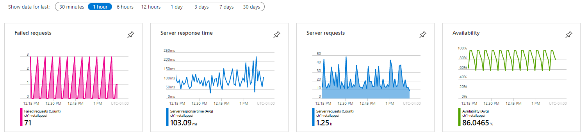
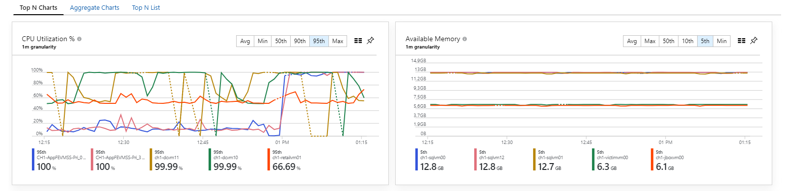
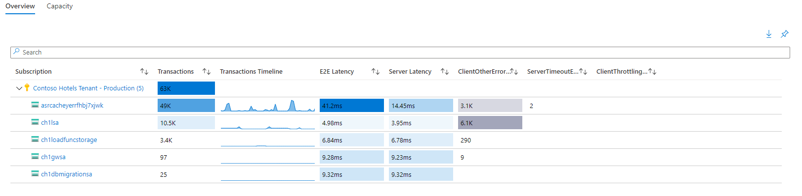

Your organization is moving all its systems from an on-premises location to Azure. You've been asked to implement monitoring strategy.

In this unit, you'll learn why a full-stack monitoring strategy can improve your ability to identify and mitigate issues across all the layers of your applications and infrastructure to improve the customer experience.

## Why use full stack monitoring?

Full stack monitoring is a complete approach to the monitoring, triage, and diagnosis of application, infrastructure, and security issues that includes telemetry collection, tracking key performance indicators and the capability to isolate problems and perform root cause analysis.

Your applications and the infrastructure might face different kinds of potentially damaging issues. You might have to deal with issues such as poor response times, changing usage rates, exceptions, and security risks.

Your response must be appropriate to the kind of issue. You might respond with scaling up capacity to meet increased load. You might also respond with changes in the configuration and code of your application or infrastructure to improve performance and reduce errors.

With the right tools, you can monitor the performance of your infrastructure and applications. You may also monitor for security risks and suspicious activity. Finally, you can collect information on issues as soon as they arise, analyze the information you've collected, and respond.

By monitoring your applications and infrastructure with a full stack approach, you respond to changes and issues appropriately and on time. Over time, your organization will become more productive, cost-effective, secure, and competitive.

## Why monitor your applications?

You want to improve your application's health and build better applications in the future. Configuring alerts and automated responses will help you deal with issues that affect your application.

By monitoring your application for issues as it's being developed, you prevent errors and exceptions later, when your application goes to production. You ensure your code only gets pushed to the next stage of the development cycle if it has successfully passed the necessary checks. This way, you're improving your development lifecycle.

You also monitor your application when it's live and in use. As you can see in the charts, you might be faced with failing requests, high server response times, or issues that cause an application to be unavailable altogether. By monitoring for live issues, you'll identify these types of problems and risks promptly. You'll respond effectively to keep your application healthy.

## Why monitor your infrastructure?

Different kinds of issues can affect your infrastructure. You might have to deal with performance issues, or problems that could render your services unreachable or entire infrastructure unavailable. Any of these issues can result in decreased productivity, financial loss, or damage to your organization's reputation.

You want to deal with any issues that arise in a timely and effective way. You configure alerts on your infrastructure to monitor for various issues. For example, you configure alerts for:

- Resource utilization of your infrastructure.
- Availability and health of your infrastructure.
- Occurrence of a specific event at the Operating System level.

These alerts help you start a process where a person receives a notification, and then takes appropriate action. You can also trigger automated responses to alerts with playbooks and webhooks.

You'll also want to use the data for operational analysis and capacity planning. As the preceding example shows, you can collect performance data from the virtual machine guest operating systems. You can put them into charts for comparison and trending purposes to inform decision making.

## Why monitor your Azure platform resources?

In addition to monitoring your deployed applications and infrastructure resources, you should also use Azure's built-in capabilities to monitor your Azure platform resources. Azure resources such as Storage Accounts, Key Vaults, Cosmos DBs all have performance metrics and resource logs that can be viewed and analyzed to track performance and availability. Additionally, many Azure resources have dedicated Insights that offer pre-defined monitoring experiences across multiple subscriptions, resource groups and resources for the specific resource type.

As shown in the example, this Azure Monitor storage insight displays the usage and latency for multiple storage accounts across two subscriptions. You can also view, and collect logs related Active Directory for your Azure tenant, and Service Health and Activity logs for Azure subscriptions. A full stack monitoring solution includes visibility into Azure platform resources on which your application and infrastructure depend.

## Why perform security monitoring?

While the previous sections in this unit focus on performance and availability monitoring, it is essential to monitor the security of your applications and infrastructure to ensure that they always remain protected and available. For example, you should monitor and alert on:

- Risks to the security of your infrastructure, such as suspicious user accounts or malicious IP addresses.
- Data exfiltration.

Your security monitoring solution should include strong automated anomaly detection and event management to combine multiple related events into a single actionable alert.

Taking a full stack approach to monitoring your applications and infrastructure in this way helps you respond appropriately and more effectively to issues. It also helps you gain situational awareness, and you'll learn from the issues that affect your environment. You can strengthen your protection and build improved applications and infrastructure.
