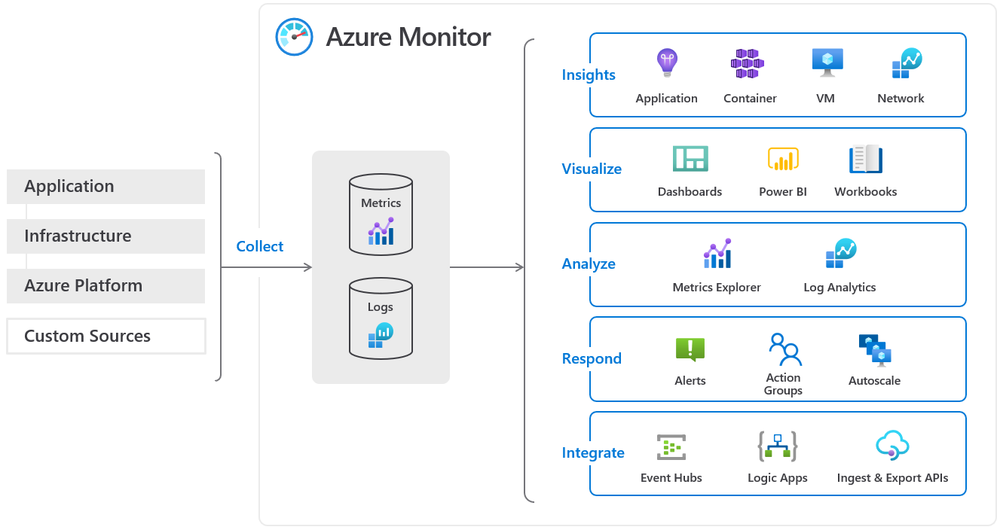
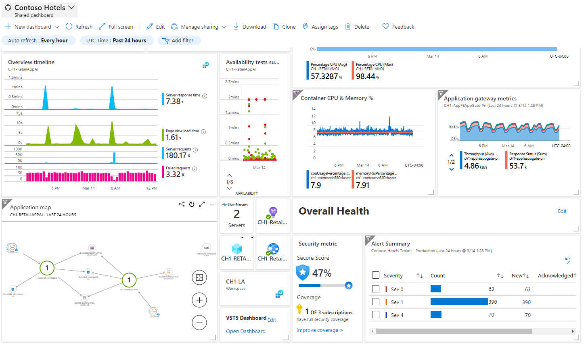
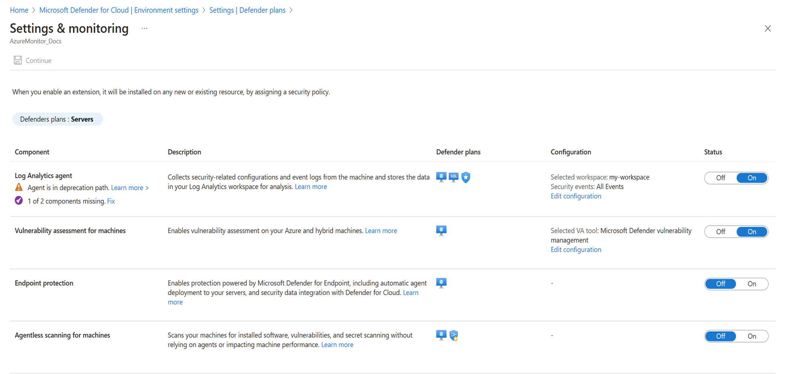
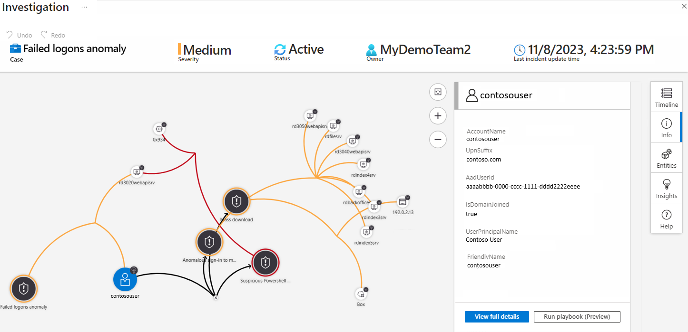
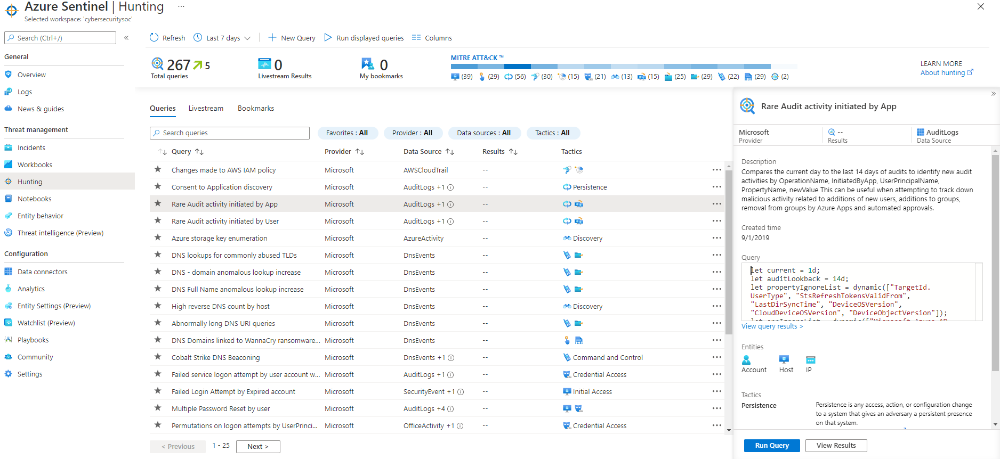

Your organization's reputation depends on its systems' performance, reliability, and security. For example, if your payment system is unable to process user transactions during a high-volume holiday sales period, your customers might lose confidence in your business. It's critical to monitor your systems closely to identify any performance problems or attacks before they can affect users.

This unit describes the Azure solutions that help you monitor your organization's services.

## Azure Monitor

[Azure Monitor](https://azure.microsoft.com/products/monitor) is a service for collecting, analyzing, and acting on telemetry from your cloud and on-premises environments. You can analyze metrics and logs from monitored resources. Azure Monitor helps you maximize the availability and performance of your applications and services by detecting and diagnosing application, infrastructure, and platform issues. Azure Monitor also supports operational workflows with alerts and automated actions and lets you create visualizations such as dashboards and reports.

Azure Monitor collects telemetry directly from Azure platform resources, and you can also ingest custom data by using APIs. Azure Monitor can also collect application-layer data and infrastructure-performance data from VM guest operating systems and containers.

Azure Monitor stores the collected data in centralized and fully managed data stores: *Azure Monitor Metrics* for numerical time-series values and *Azure Monitor Log Analytics workspaces* for resource logs. Metrics are automatically collected and stored for most Azure resources, but user configuration is required to send and store resource logs. You can choose how to consume, analyze, and respond to the collected data.

In most cases, you should start with Insights, which are guided monitoring and troubleshooting experiences for Azure resources. For example, you can use Azure Monitor container insights for your Kubernetes workloads. You might also visualize the data yourself with Azure dashboards in the Azure portal, create business views with Power BI, or create interactive reports by using workbooks. Use Azure Monitor for a detailed view of your application's health and your infrastructure's health on a single screen.

You can further analyze the collected data by using Metrics Explorer for charting and visual correlation and Log Analytics for ad hoc queries, trending, and pattern recognition. Azure Monitor lets you manage and create alerts, notifications, and actions such as runbooks and autoscale based on metrics and logs. You can also integrate Azure Monitor with other tools by using Azure Event Hubs to export data or APIs for ingestion and export.

## Microsoft Defender for Cloud

[Microsoft Defender for Cloud](https://azure.microsoft.com/products/defender-for-cloud/) is a service that manages your infrastructure's security from a centralized location. You can use Defender for Cloud to monitor the security of your workloads, whether they're on-premises or in the cloud.

Attacks are becoming more intelligent, and the number of people with the right security skills is low. Defender for Cloud helps you deal with these challenges by providing you with tools that improve your protection against security threats. Use Defender for Cloud to monitor your resources' health and implement recommendations.

Defender for Cloud helps streamline your security configuration. Defender for Cloud is natively integrated with other Azure PaaS services like Azure SQL Database. For IaaS services, you can enable automatic provisioning in Defender for Cloud.

Defender for Cloud creates an agent on each supported VM when the VM is created. Defender then automatically starts collecting data from the machine. This Defender for Cloud capability reduces the complexity of configuring security.

## Microsoft Sentinel

Microsoft Sentinel is a security information and event management (SIEM) system that collects data on devices, users, infrastructure, and applications across your enterprise. Built-in threat intelligence for detection and investigation can help reduce false positives. You can use Microsoft Sentinel to proactively hunt for threats and anomalies, and respond by using orchestration and automation.

You can connect your data sources to Microsoft Sentinel. These data sources include Microsoft services such as Office 365 and Azure Advanced Threat Protection, and can also include external solutions such as AWS CloudTrail or on-premises sources. The dashboard shows detailed information collected from your sources.

Incidents help you group and combine related alerts. You can use incidents to reduce the noise generated because of the scale of the data. Incidents also help you to further investigate anomalous activities or threats that have raised alerts.

You can use playbooks to automate your response to alerts in Microsoft Sentinel. You configure playbooks by using Azure Logic Apps. Your playbook details the steps to take when an alert is triggered in Microsoft Sentinel.

You can use hunting queries to look for threats across your enterprise before alerts are raised. Microsoft security researchers maintain built-in hunting queries that act as bases for you to build your own queries.

You can use notebooks to automate your investigations. Notebooks are playbooks that can consist of investigation or hunting steps that you reuse or share with others. Use Azure Notebooks for Microsoft Sentinel to develop and run your notebooks. For example, you might use the **Guided hunting - Anomalous Office365 Exchange Sessions** notebook to hunt for anomalous activities in Office 365 across your enterprise.

## Log Analytics workspaces

Microsoft Sentinel and Microsoft Defender for Cloud use Azure Monitor Logs as their underlying logging data platform, and store their data in Log Analytics workspaces. Log Analytics workspaces are centralized storage and management locations that collect and aggregate your application, infrastructure, and security logs for analysis, troubleshooting, and auditing.

This centralized approach lets you use a single user interface and query language to correlate and investigate across application performance, infrastructure performance, and security logs within the same data analytics service. It's best to use as few workspaces as possible, and manage user and team access to subsets of log data by using resource or workspace permissions. For more information, see [Design a Log Analytics workspace architecture](/azure/azure-monitor/logs/workspace-design).
