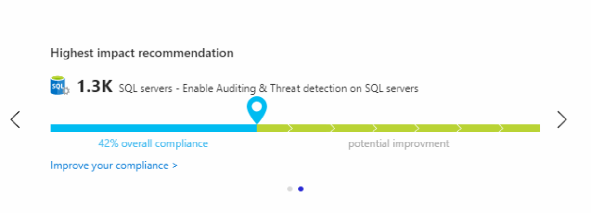
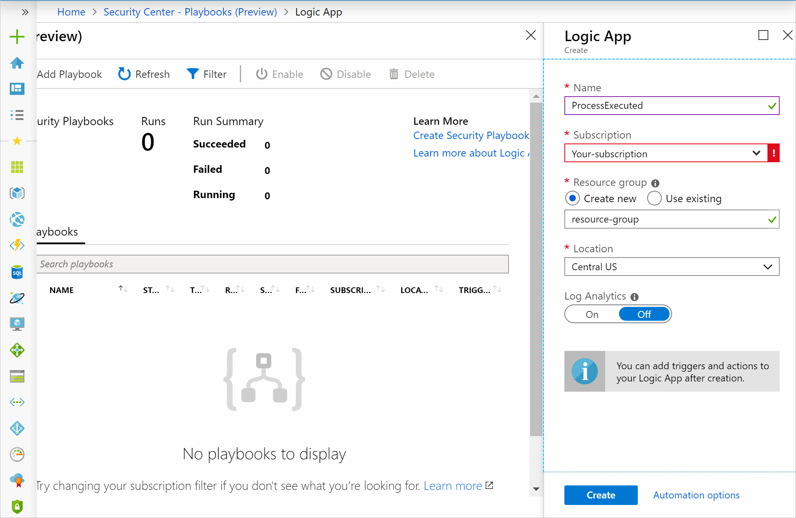
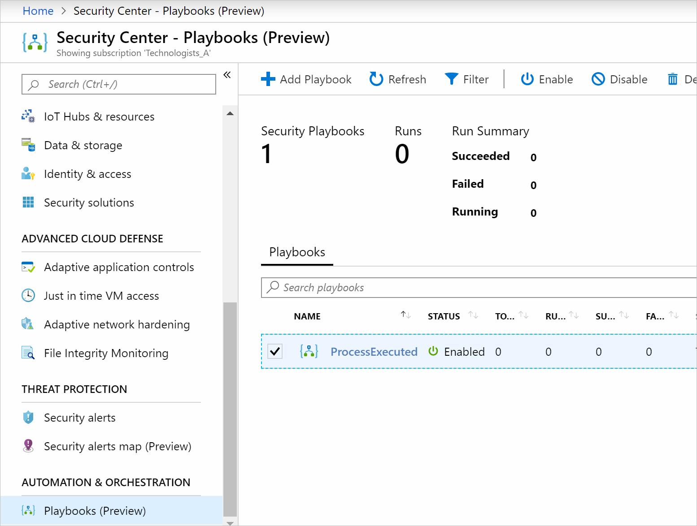
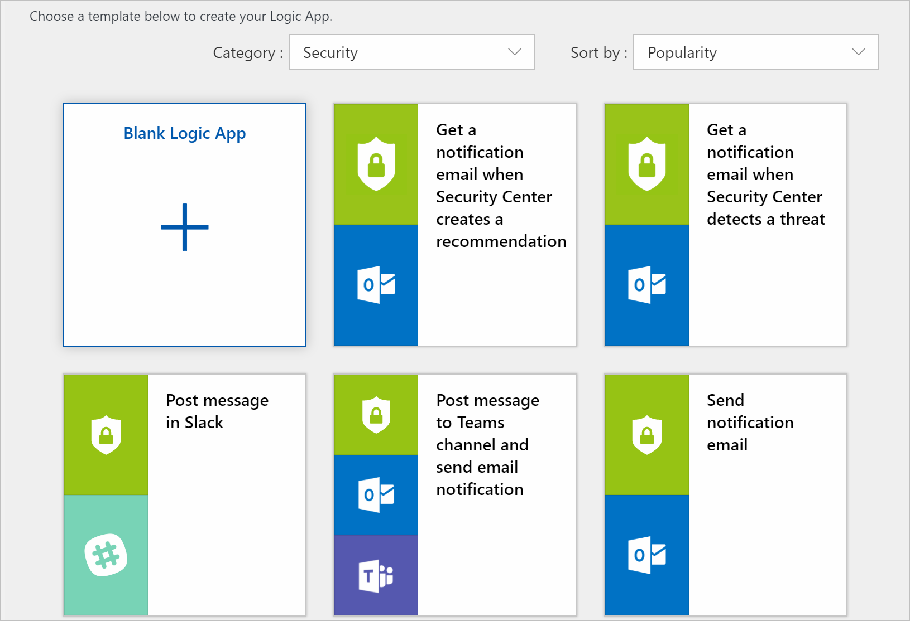
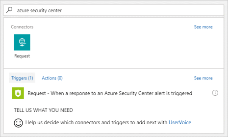
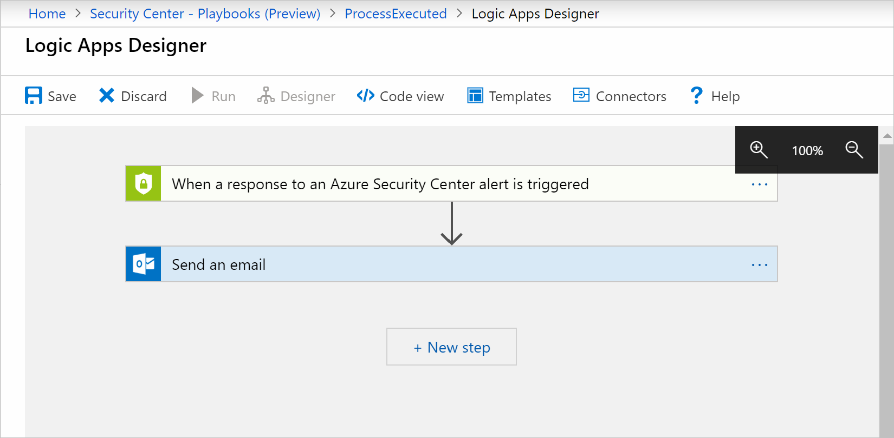
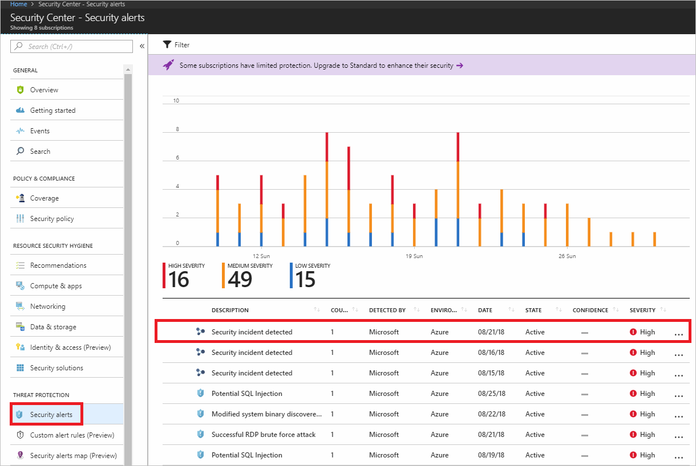
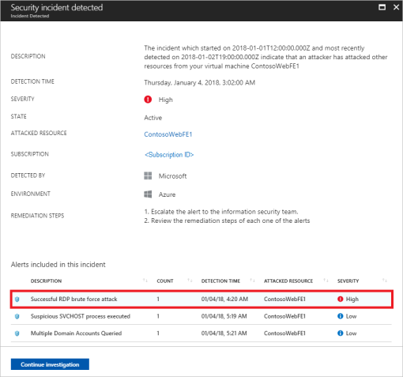
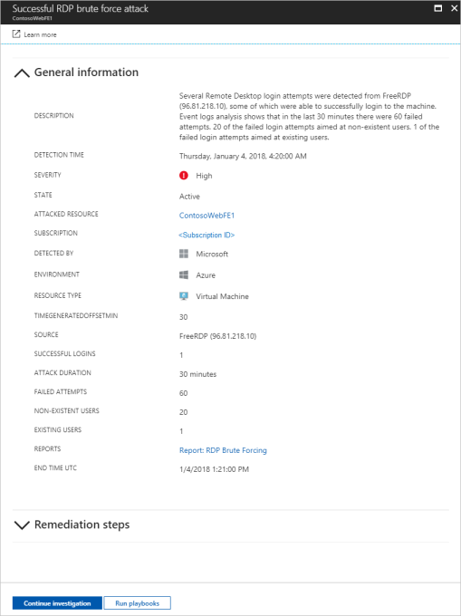

Because your company is a financial organization, it will need to meet the highest standards for security. Each transaction initiated by a customer or partner must be entirely protected from threats. Your company must also respond effectively to each potential threat. For example, if a virtual machine is compromised, you must be able to act rapidly and address the issue.

You'll provide information on how to protect resources, and respond to threats using Azure Security Center.

## Criteria for assessing Azure Security Center

You use Security Center if:

- You want to identify and address risks and threats to your infrastructure.
- You don't have the traditional in-house skills and capital needed to secure a complex infrastructure.
- You want to secure an infrastructure that may consist of on-premises and cloud resources.

## Understand the security posture of your architecture

Security Center gives detailed analyses of different components of your environment. These components include data security, network security, identity and access, and application security. This way, it helps you understand the security of your architecture. You can then build and maintain better infrastructures.

Security Center recommends how to address the issues and risks it has uncovered. You use recommendations like the one below to improve the security and compliance of your architecture.

## Protect against threats with Azure Security Center

Use Security Center's access and application controls to protect your resources. These controls block suspicious activity. For example, you protect your virtual machines through just-in-time (JIT) virtual machine access. JIT is a feature that will block persistent access to virtual machines. Your virtual machines are only accessed based on audited access that you configure.

You enable JIT through the **Just in time VM access** option in the **ADVANCED CLOUD DEFENSE** section of Security Center in the Azure portal. You'll see all virtual machines that already have JIT enabled, and a list of recommended virtual machines that should have JIT enabled. Choose a virtual machine in the recommended list then use the **Enable JIT on (number) VM** option to configure JIT for the virtual machine. Security Center will show you a list of default ports that JIT will target, but you can configure your own as shown below.

You can control which applications are allowed to run on your virtual machines through adaptive application controls. In the background, Security Center is using machine learning to look at the processes running on your virtual machine. It will then create whitelisting rules for each resource group holding your virtual machines, and give recommendations.

You can configure adaptive controls using the **Adaptive application controls** option under the **ADVANCED CLOUD DEFENSE** section of the Azure Security Center menu. You'll see resource groups that contain your virtual machines.  Use the **Recommended** section to view the list of resource groups that Security Center recommends for adaptive application controls.  

When you select a resource group, you use the **Create application control rules** to target the virtual machines, along with the processes, which should have the rule applied.

## Respond to threats with Azure Security Center

You'll have the responsibility to dismiss alerts if no action is required, such as if there are false positives. You also need to act to address known attacks and block, for example, known malicious IP addresses. Also, you must decide which alerts require more investigation.

Security Center gives a centralized view of all of your security alerts. Security Center ranks security alerts based on their severity. Security Center will also try to combine all related alerts as much as possible into a single security incident.

Security Center helps you respond to threats faster, and in an automated fashion, through playbooks. Playbooks are automated procedures that you run against alerts. You configure a playbook in the **Playbooks** pane of the Azure Security Center menu. A playbook is created by configuring a Logic App.

Your created playbook will appear in a list as shown below.

Edit your playbook by selecting it, and using the Logic App Designer that appears.

You'll need to create a new blank Logic App. The designer will then let you search for Security Center connectors and triggers for your playbook. For example, look for *Azure Security Center* and see all the triggers you can use. You then choose a trigger that details what should happen when the playbook has been triggered, as shown below.

You then define actions that should be taken and which conditions must be met for these actions. Your action can be one that specifies that an email should be sent when an alert is triggered.

View your security alerts through the **Security alerts** pane under the **THREAT PROTECTION** section in the main menu.  

You drill further into specific security incidents by selecting an incident.

From here, you'll see the list of alerts that the incident holds. You request more information about a specific alert by selecting one, as shown below.

You can then choose to run your configured playbooks against your alert.

You can also further investigate the alert using the **Continue investigation** option. You'll have an investigation map, which shows all of the entities that are related to this alert.

You request more information about a specific entity in the map by selecting it. Entities include things like devices or even users. The map will expand with new entities and the selected entity will have its properties displayed on the right. Use it to better understand a particular path an attack might have taken.
