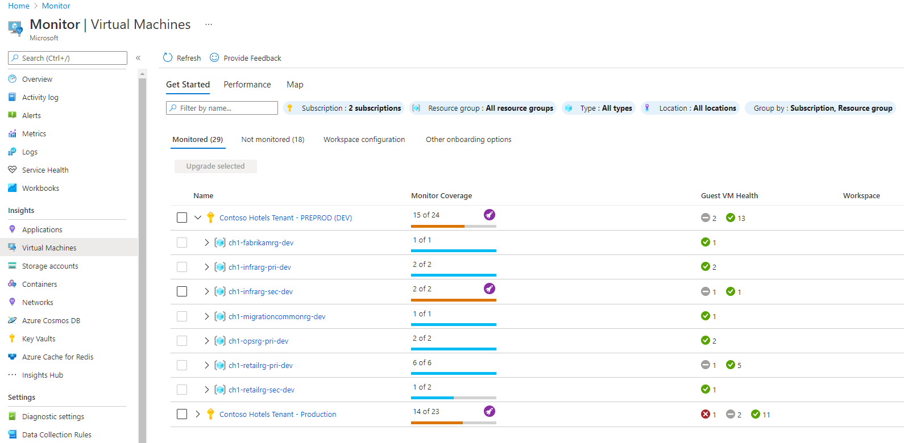
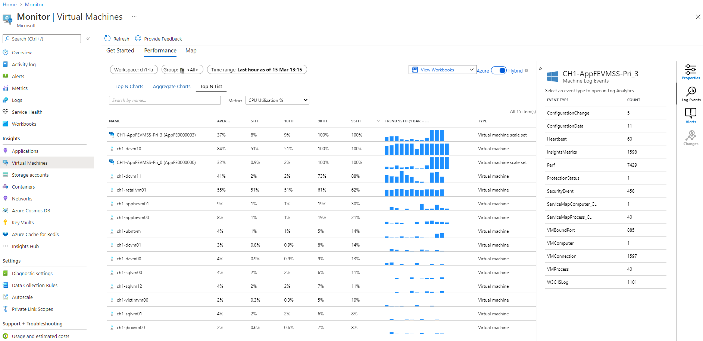
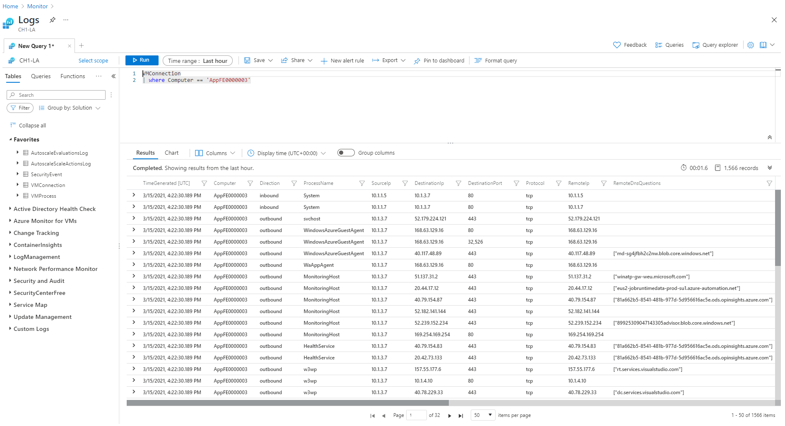
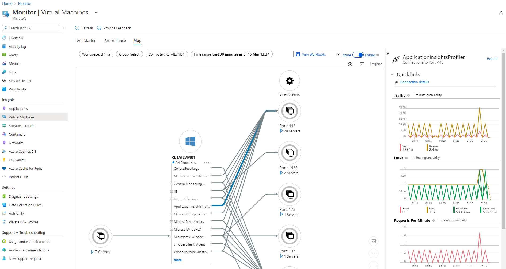
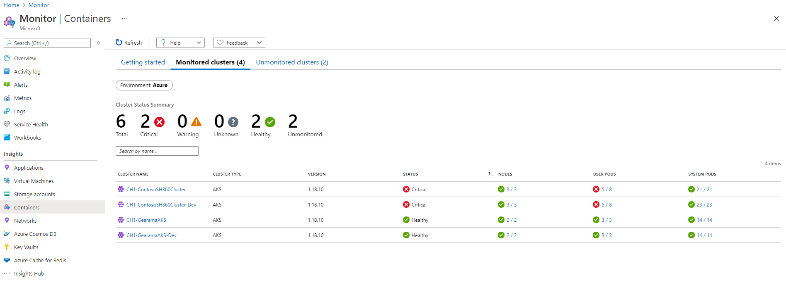
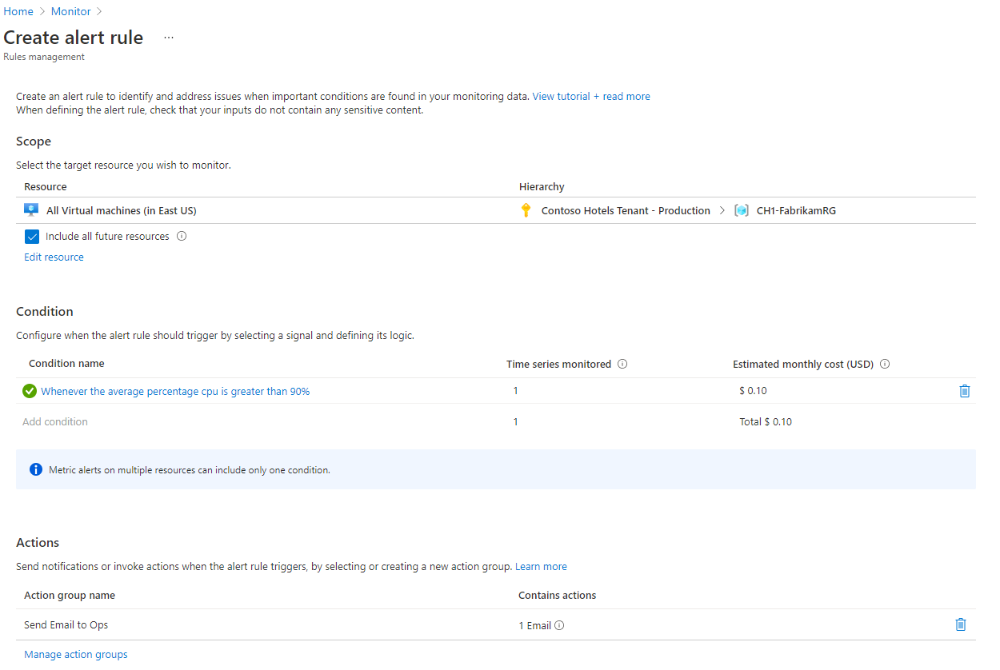
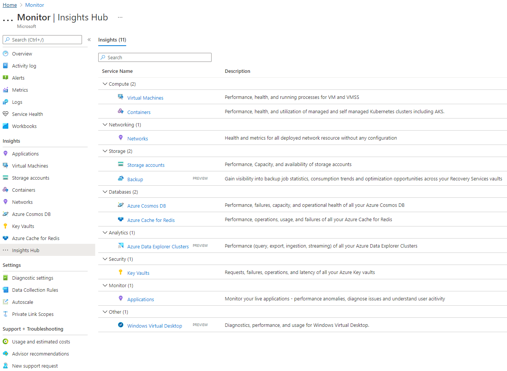

Your financial organization has successfully migrated several applications from on-premises to Azure virtual machines (VMs) and Azure Kubernetes Services. Your organization wants to keep track of resource usage to ensure the cloud resources have been adequately provisioned and their performance meets the business requirements. However, there are hundreds of resources currently deployed across several subscriptions, so you need a monitoring approach that provides broad visibility and the ability to triage and isolate problems when they arise.

In this unit, you learn how to use Azure Monitor VM insights, Azure Monitor container insights, and other insights for an at-scale view across all your resources. You can drill into specific nodes and containers to continue troubleshooting.

## Azure Monitor VM insights

You can use Azure Monitor VM insights to:

- View your VMs' health and performance.
- Monitor your VMs at-scale across multiple subscriptions and resource groups.
- Get a topology view that shows the processes and network connection details of your VMs and scale sets.

To enable Azure Monitor VM insights, select **Insights** from the Azure Monitor portal page, select the **Get Started** tab, and then select **Enable**. Enabling Azure Monitor VM insights adds the required extensions and configuration to your VMs and VMs scales sets to collect and store a fixed set of usage and performance measurements.

## Monitor your virtual machines at scale

Once you enable VM insights, you can view the VMs and scale sets with the highest resource usage in **Top N Charts** and the **Top N list** on the **Performance** tab. These charts allow you to quickly identify outliers and performance hot spots where the allocated resources might be insufficient to support the existing load. From this view, you can access more VM details, including its properties, links to extra performance and connection workbooks, collected logs, and alerts.

As shown in the preceding example, you can drill down to Azure Monitor Logs by selecting an event type from the list shown under **Log Events**. For example, selecting the **VMConnection** event type automatically opens the relevant Log Analytics workspace with the appropriate table and filter applied.

Access the Azure Monitor VM insights Map tab to show network connections for an entire resource group, scale set, or individual VM. Use the filters at the top of the view to select the resources of interest. You can expand the number of processes for a complete list and to view the network connections per process. Select the arrow representing the connection for other network usage and performance details.

## Azure Monitor container insights

You use Azure Monitor container insights to:

- View your Kubernetes workloads' health and performance at scale across multiple subscriptions and resource groups.
- Get visibility into memory and processor performance metrics from controllers, nodes, and containers.
- View and store container logs for real-time and historical analysis.

You can enable Azure Monitor container insights when you create your cluster or by using the **Unmonitored clusters** tab. After you enable container insights, the **Monitored clusters** tab provides an at-scale view of the health and status of all your clusters, nodes, system pods, and user pods. You can use this view as a starting point to drill into problematic areas.

## Monitor Kubernetes clusters at scale

You can view your Kubernetes workloads' performance and resource utilization from different perspectives. You might want to investigate an over-utilized node, view the state of pods by controller, or look at the number of restarts and CPU or memory utilization of a specific container. Container insights also allow you to filter by namespace, access logs, and enable commonly used alerts.

## Get notifications and take action

You also need to configure alert rules for your infrastructure's performance and availability. Use alert rules and action rules to dictate how alerts should be handled. In some cases, insights include recommended alert templates, but you can also specify the conditions that should trigger an alert in your environment.

You can base Azure Monitor alerts on the same metrics or log data used to populate insights. For example, insights can send an alert if a VM exceeds a utilization threshold, or if a specified number of container restarts are observed. You can also specify who should be notified. Insights can send notifications through email or text message, or use runbooks and webhooks to automatically respond to alerts.

You can use Azure Monitor insights when you want to monitor resource utilization and performance at-scale with guided troubleshooting to triage and isolate issues. Insights exist for several Azure resources, including networks, storage accounts, and Cosmos DBs. See a complete list by selecting **Insights Hub** in the Azure Monitor left navigation.

