The last time issues arose on your financial organization's application, customers couldn't access their accounts. Also, the issues with the application weren't resolved on time, so customer satisfaction was affected. Your organization wants to avoid a repeat of these issues when it moves to Azure.

You'll detail how to integrate Azure Application Insights with your applications. You'll explore how to use it to check the health of applications continuously and resolve issues faster. And you'll cover how to monitor release pipelines continuously to improve the development lifecycle of your applications.

## Criteria for assessing Application Insights

You use Application Insights if:

- You want to analyze and address issues and problems that affect your application's health.
- You want to improve your application's development lifecycle.
- You want to analyze users' activities to help understand them better.

## Integrate Application Insights with your applications

To integrate Application Insights with your applications, you set up an Application Insights resource in the Azure portal. You also install an instrumentation package in your application. The package will monitor your application and send log data to the Log Analytics workspace.

For example, in your JavaScript web applications, you use a Node.js SDK as the instrumentation package. You need the Application Insights resource's instrumentation key from the Azure portal. You're going to use the key in your application's code.

 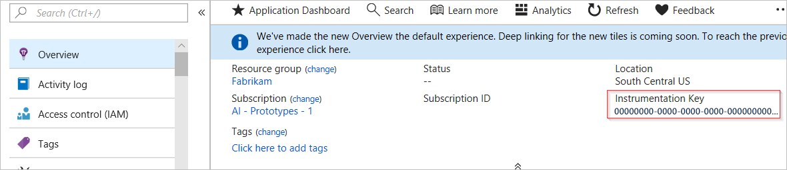

You then need to add the Node.js library via the package.json file as a dependency, by using npm.

``` bash
npm install applicationinsights --save
```

Your code needs to load the library. You load it before everything else, including other `require` statements. You need to add the following code to your top-level .js file:

```javascript
const appInsights = require("applicationinsights");
appInsights.setup("<your-instrumentation_key>");
appInsights.start();
```

You also use the environment variable *APPINSIGHTS_INSTRUMENTATIONKEY* to hold your key. The environment variable helps keep the key invisible in commits when you're using version control.

The SDK automatically gathers data about your Node.js runtime as you use your application. You can view this data in the Application Insights dashboard, in the Azure portal. From there you can, for example, get a list of all failures that have been collected and drill down into each one.

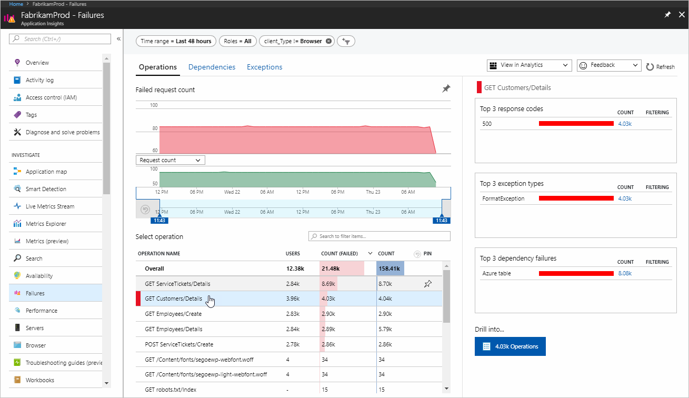

The SDK also analyzes your application for a typology. You see this typology through the **Application map** option. View more details of each component in the map by selecting it. You can, among other things, view the slowest requests for an instance and investigate performance further. These detailed analytics help you understand the application better and respond to its needs.

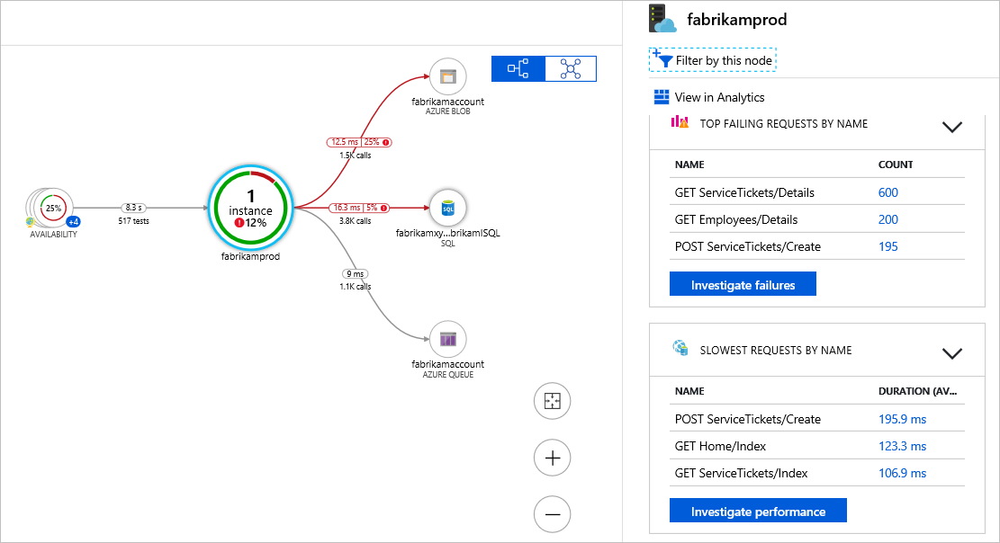

## Monitor your applications continuously

Application Insights can send alerts for issues like failures or unavailability of your application. You can create availability tests to monitor the health of your applications continuously. Availability tests allow you to check the health of your application from different geographic locations.

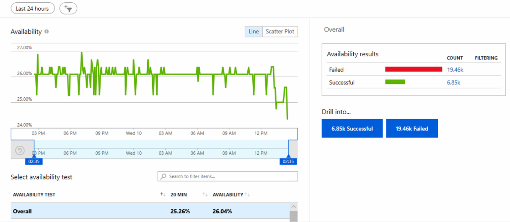

You can create an availability test in the Azure portal. You need to specify details like the frequency, the URL of your application, and locations from which to test it.


The preceding example shows the configuration of a test that will send a request to an application every five minutes. The test is done from five geographic locations.  

You also need to configure an alert rule for your availability test. Use alert rules to dictate how alerts should be handled for your tests.

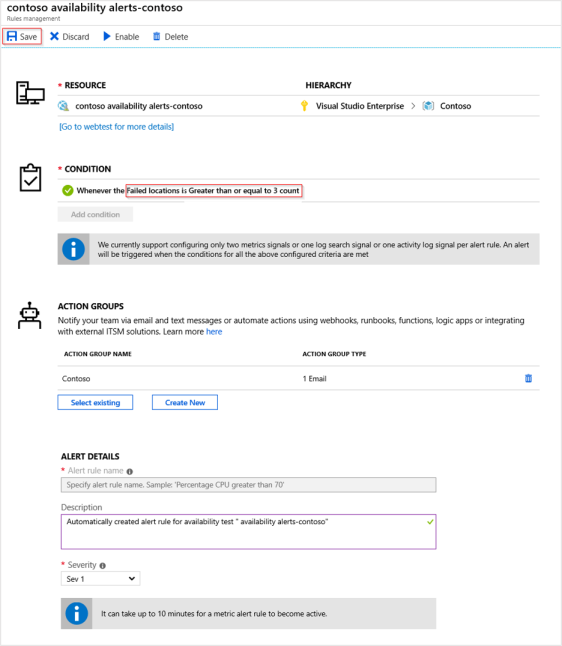

You specify the conditions that should trigger an alert. For example, Application Insights can send an alert if a certain number of locations are unavailable. And you specify who should be notified. Send notifications through email or text message. Or use runbooks and webhooks to respond to alerts in an automated way.

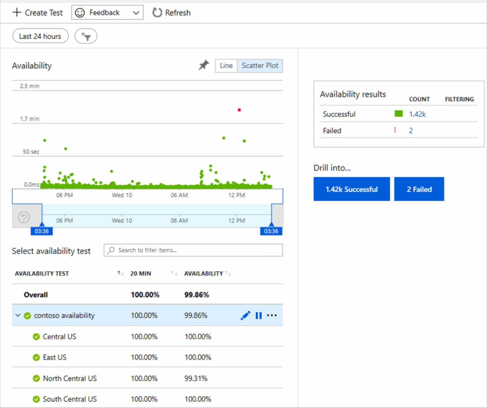

When you've created your availability test, you'll see how your application is doing across different locations. Each dot in the preceding example represents a test that was run. A red dot means that a test failed. You can find more information about a failed test when you select a dot.

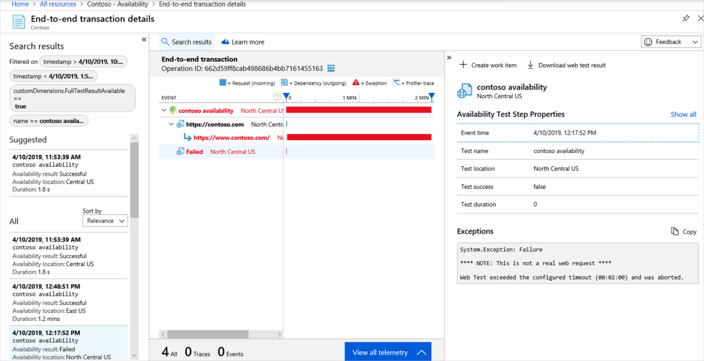

You'll then see a detailed breakdown of the test failure, including information on what might have caused it. Use the information to respond appropriately.

## Continuously monitor your release pipelines

Application Insights works with Azure Pipelines. Use them together to improve your development lifecycle. When an Azure Pipelines release pipeline receives an alert from Application Insights that something went wrong, it can stop the deployment. It then rolls back the deployment until the issue that caused the alert is resolved. This way, you respond much earlier and more effectively to issues as they arise in the development lifecycle.

When you create a new release pipeline in Azure Pipelines, you need to use the **Azure App Service deployment with continuous monitoring** template and apply it to your pipeline.

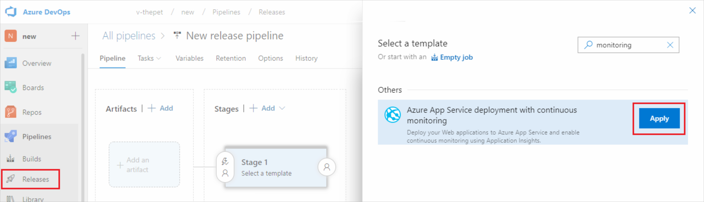

The template automatically creates a pipeline stage. View the tasks in your stage to configure the connection between your pipeline and Application Insights.

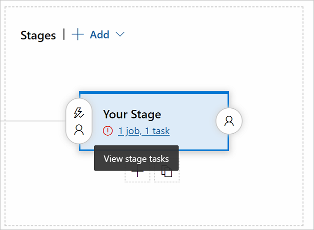

You need to provide details about your application and the Application Insights resource, and then save your configuration.

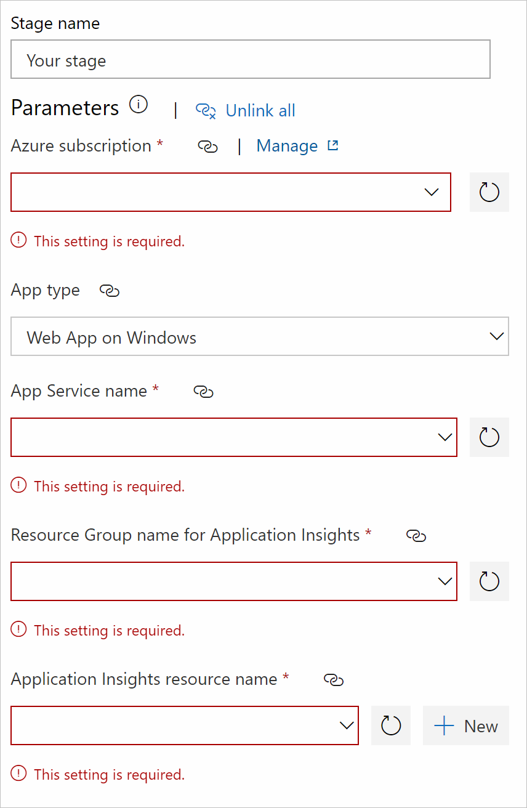

The **Azure App Service deployment with continuous monitoring** template provides alert rules for server exceptions, failed requests, server response times, and availability. You can also modify alert rules and customize them for your specific needs.

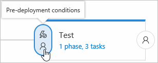

Add a continuous monitoring gate to your release pipeline. Use the gate to stop deployment when an issue has been identified, and continue deployment automatically when the issue is resolved. 

First, you need to enable gates in the configuration of pre-deployment conditions. Then add the gate that you want. You can, for example, add a gate that will listen for active alerts:

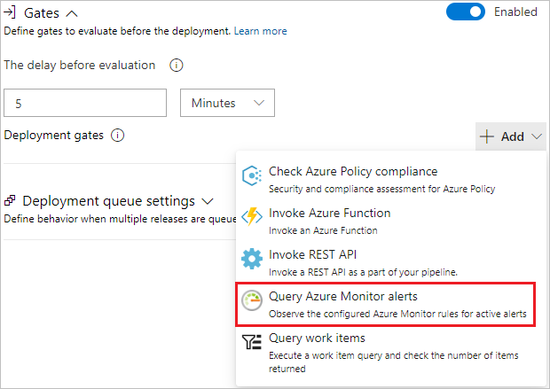

Analyze your release by viewing the logs in the release summary. You'll see all of your release steps, and whether each has succeeded or failed. You'll also see details of what caused a failure.

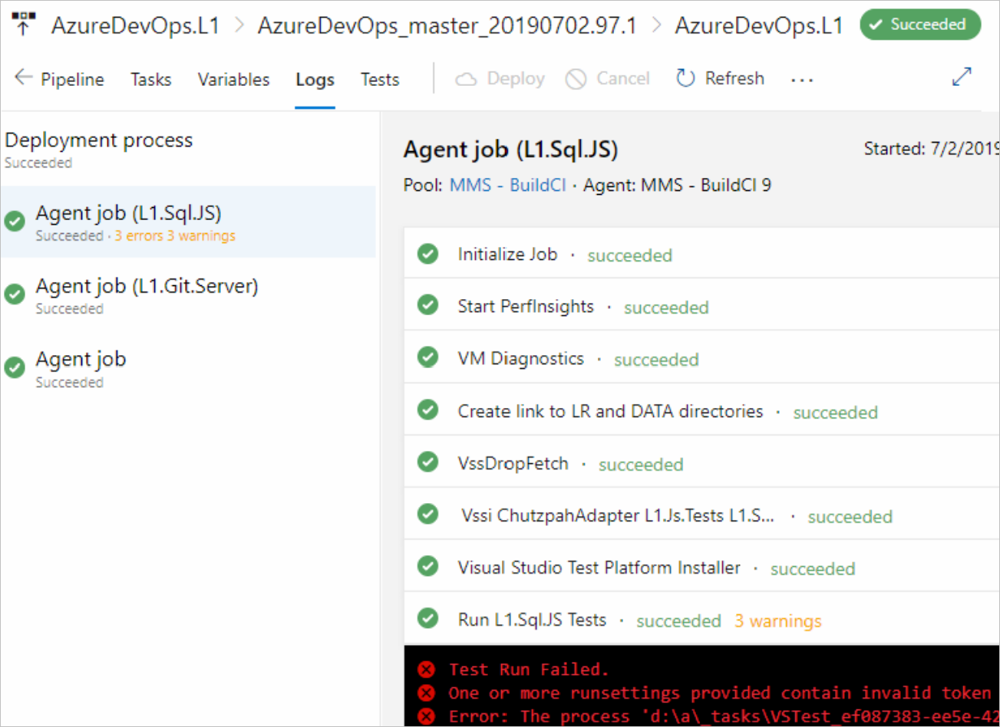
