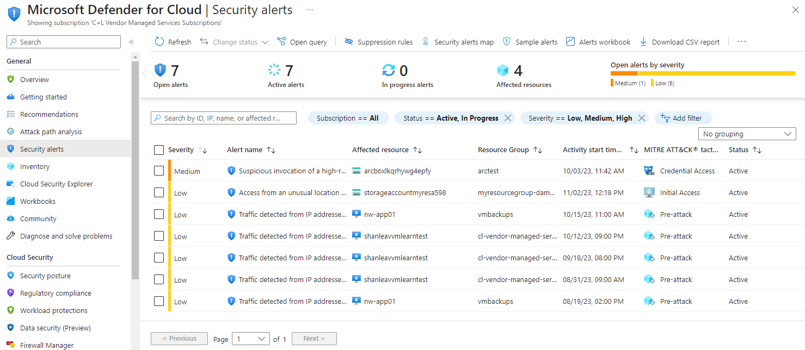
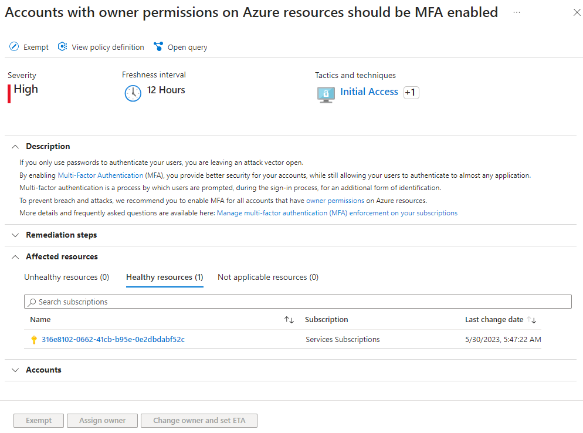
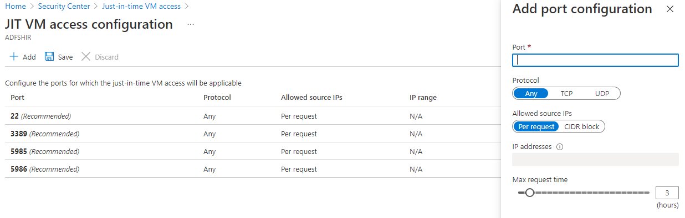
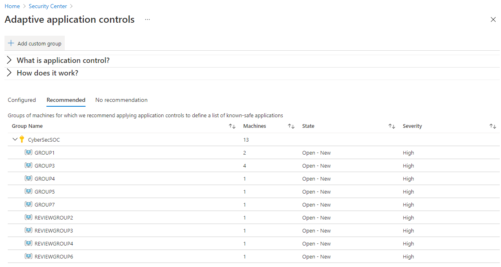
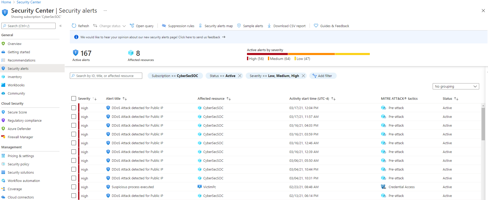
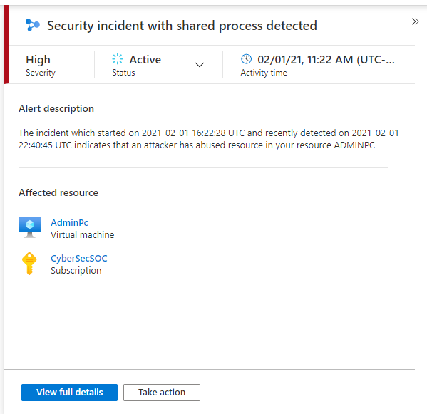
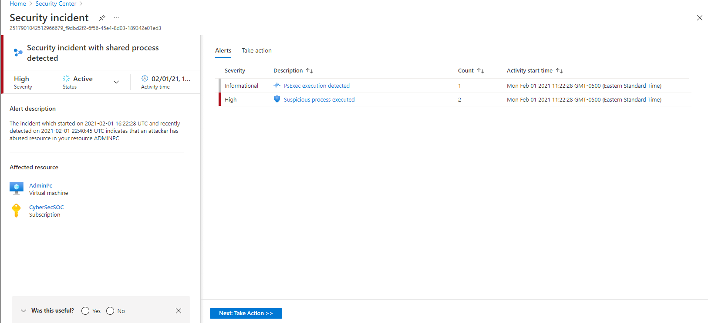
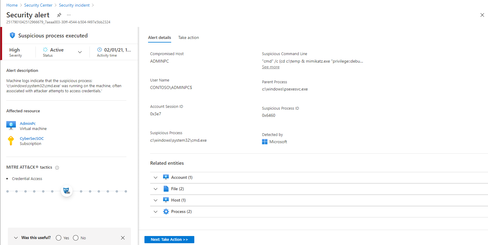
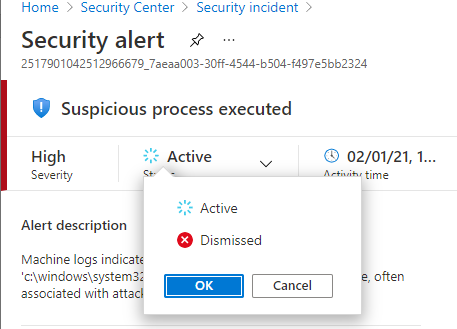
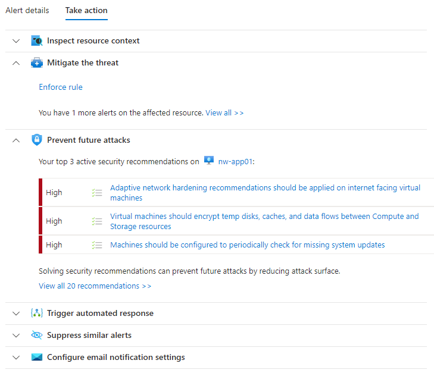

Microsoft Defender for Cloud ensures that you are making the security configuration of your resources as secure as possible. Because your company is a financial organization, it needs to meet the highest standards for security. Each transaction that a customer or partner starts must be entirely protected from threats. Your company must also respond effectively to each potential threat. For example, if a virtual machine is compromised, you must act rapidly and address the issue.

You'll provide information about how to protect resources, and respond to threats by using Microsoft Defender for Cloud.

## Criteria for assessing Microsoft Defender for Cloud

You use Defender for Cloud to:

- Understand the security posture of your architecture.
- Identify and address risks and threats to your infrastructure.
- Secure a complex infrastructure with traditional in-house skills and capital.
- Secure an infrastructure that consists of on-premises and cloud resources.

## Understand the security posture of your architecture

Defender for Cloud gives detailed analyses of different components of your environment. These components include data security, network security, identity and access, and application security. This way, Defender for Cloud helps you understand the security of your architecture. You can then build and maintain better infrastructures. Defender for Cloud collects data from your machines to monitor for security vulnerabilities and threats using Azure Monitor Logs. Data is collected using the Log Analytics agent, which reads various security-related configurations and event logs from the machine, and copies the data to your Log Analytics workspace for analysis.

Defender for Cloud recommends how to address the issues and risks that it has uncovered. You use recommendations like the following one to improve the security and compliance of your architecture.

## Protect against threats with Microsoft Defender for Cloud

Use access and application controls in Defender for Cloud to help protect your resources. These controls block suspicious activity. For example, you protect your virtual machines through just-in-time (JIT) virtual machine access. JIT is a feature that blocks persistent access to virtual machines. Your virtual machines are only accessed based on audited access that you configure.

You enable JIT through the **Just in time VM access** option in the **Microsoft Defender for Cloud, Advanced protection** section of Defender for Cloud in the Azure portal. You'll see all virtual machines that already have JIT configured, and a list of virtual machines where JIT is not configured. Choose a virtual machine in the not configured list, and then select the **Enable JIT on (number) VM** option to configure JIT for the virtual machine.

Defender for Cloud shows you a list of default ports that JIT will target. You can also configure your own, as shown in the following example.

You can control which applications are allowed to run on your virtual machines through adaptive application controls. In the background, Defender for Cloud uses machine learning to look at the processes running on your virtual machine. It creates exception rules for each resource group that holds your virtual machines, and it gives recommendations.

You can configure adaptive controls by selecting the **Adaptive application controls** option in the **Microsoft Defender for Cloud, Advanced protection** section of the Microsoft Defender for Cloud menu. You'll see resource groups that contain your virtual machines. See the **Recommended** section to view the list of resource groups that Defender for Cloud recommends for adaptive application controls.

When you select a resource group, you use **Create application control rules** to target the virtual machines. You also use it to target the processes, which should have the rule applied.

## Respond to threats with Microsoft Defender for Cloud

Defender for Cloud gives a centralized view of all of your security alerts. Defender for Cloud ranks security alerts based on their severity. Defender for Cloud also combines related alerts as much as possible into a single security incident.

View your security alerts through the **Security alerts** pane under the **General** section on the main menu.

You drill down into specific security incidents by selecting an incident.

From here, you can see the list of alerts that the incident holds.

You request more information about a specific alert by selecting one.

You have the responsibility to dismiss alerts if no action is required, such as if there are false positives. You also need to act to address known attacks and block, for example, known malicious IP addresses. Also, you must decide which alerts require more investigation.

Defender for Cloud helps you respond to threats faster, and in an automated way by taking action. Actions include mitigating the threat, preventing future attacks, triggering an automated response with Logic Apps, or suppressing similar alerts.

