Your financial organization deals with customers and partners on a constant basis. Your organization is also active across different regions in the world. Many transactions happen every day. Each transaction must be monitored and protected regardless of its type, and regardless of the device or users involved. You've been asked to extend your earlier investigation, to focus on enterprise-wide security and monitoring.

You'll detail how Microsoft Sentinel will help monitor and respond to security threats across your organization.

## Criteria for assessing Microsoft Sentinel

You use Microsoft Sentinel to:

- Get a detailed overview of your organization, potentially across multiple clouds and on-premises locations.
- Avoid reliance on complex and disparate tools.
- Use enterprise-grade AI, built by experts, to identify and handle threats across your organization.

## Connect your data sources

You create a Microsoft Sentinel resource in the Azure portal. The process for creating this resource involves creating a Log Analytics workspace, and then adding it to Sentinel.

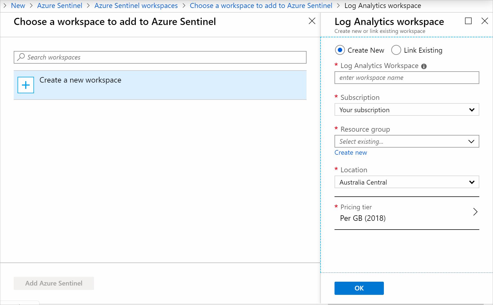

When you've created a Sentinel resource, you need to connect data sources for your enterprise. Sentinel integrates with Microsoft solutions, including Azure Active Directory and Office 365, through connectors. It also comes with connectors for non-Microsoft solutions. Sentinel also has a REST API that allows you to connect to other data sources.

Use the Sentinel dashboard to view all of your data connectors.  

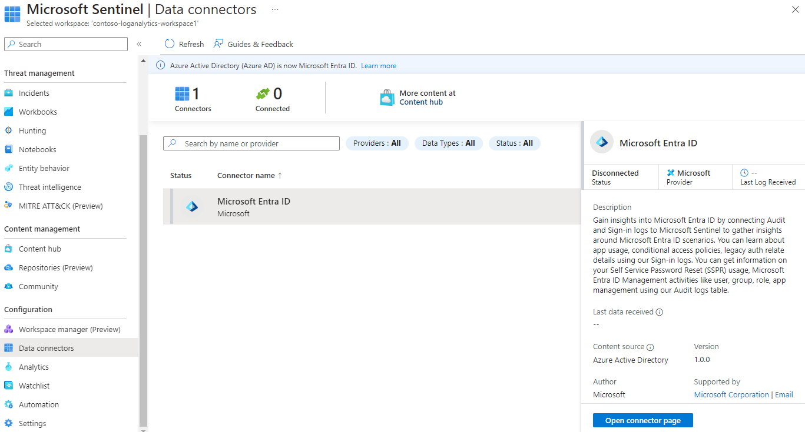

Choose the appropriate data connector for your data source. Next, look at the prerequisites for your connector, and address them to successfully connect your data source.

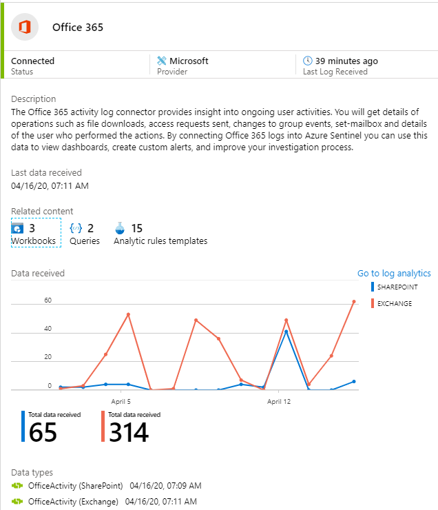

When you connect the data source, your logs will be synced to Sentinel. You'll see a summary of the data that has been collected in the **DATA RECEIVED** graph for your connector. You'll also see the different data types that have been collected for the source. For example, the Azure Active Directory connector collects sign-in logs and audit logs for you.

## Use alerts to monitor your enterprise

When your data sources have been connected, Sentinel begins to monitor your enterprise. You can configure alert rules to investigate anomalies and threats more intelligently.

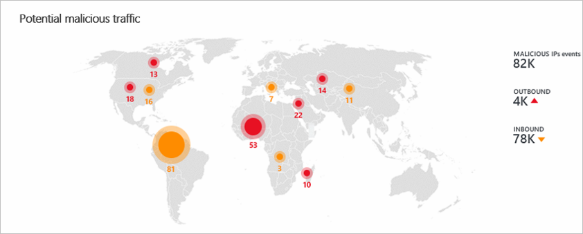

You need to create alert rules. These rules allow you to specify the threats and activities that should raise alerts. You can respond manually or by using playbooks for automated responses.

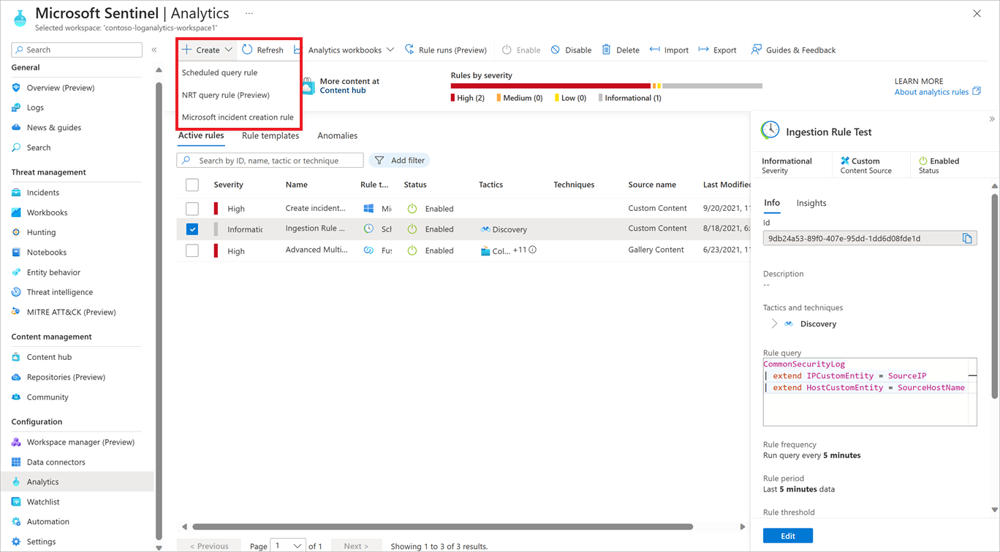

In the analytics pane of your Sentinel dashboard, you can view all the rules that you have in place. You can also create new rules there.

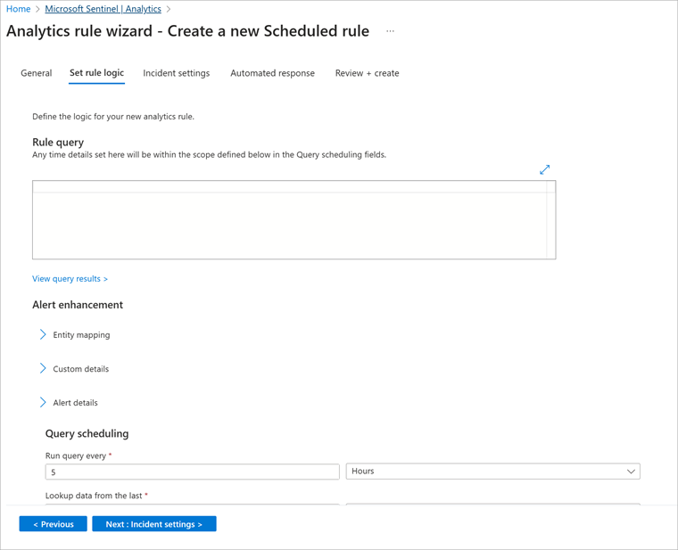

When you create a rule, you need to specify whether it should be enabled or disabled at the outset. You also specify the severity of the alert, along with a rule query.

For example, you run the following query to discover if a suspicious number of virtual machines are created or updated on Azure. You also use it to discover if a suspicious number of deployments for resources have occurred.

```kusto
AzureActivity
 | where OperationName == "Create or Update Virtual Machine" or OperationName == "Create Deployment"
 | where ActivityStatus == "Succeeded"
 | make-series dcount(ResourceId)  default=0 on EventSubmissionTimestamp in range(ago(7d), now(), 1d) by Caller
```

In the query scheduling section, you set how often the query should run, and which period of data to look up. In the alert threshold section, you specify when an alert is raised.

## Investigate incidents

Sentinel combines your generated alerts into incidents for further investigation.

Use the **Incidents** pane to see details about your incidents, such as how many you've closed, and how many remain open. You also use the pane to find out when an incident happened and to determine its severity.

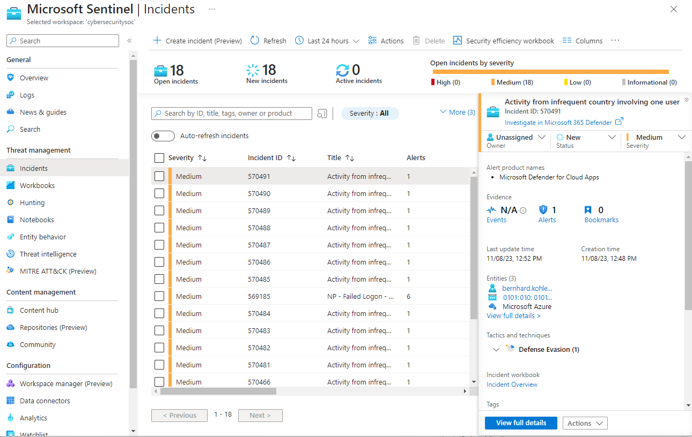

You select an incident to start to investigate it. You see information about the incident on the right side. Select **View full details** to get more information.

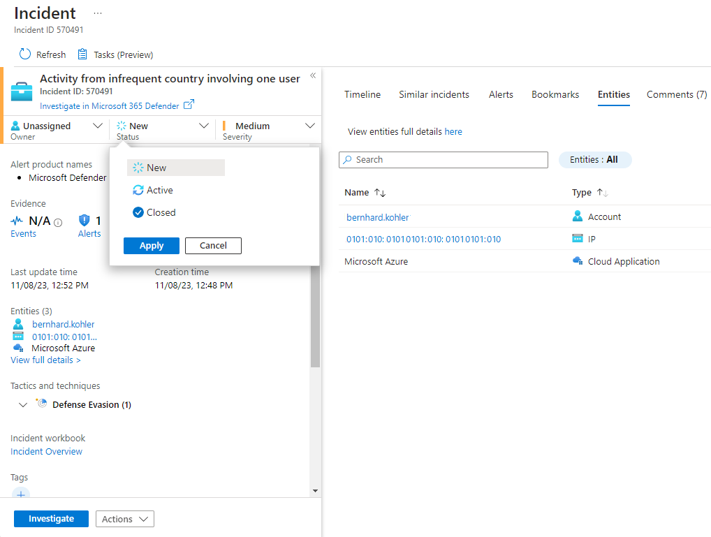

You see that multiple entities have been mapped to this incident. When you want to investigate an incident, you set its status from **New** to **In progress** and assign it to an owner.


You're then ready to investigate. When you select **Investigate**, you get an investigation map. You use the map to better understand what caused an incident and the affected scope. You also use the map to correlate data surrounding an incident.

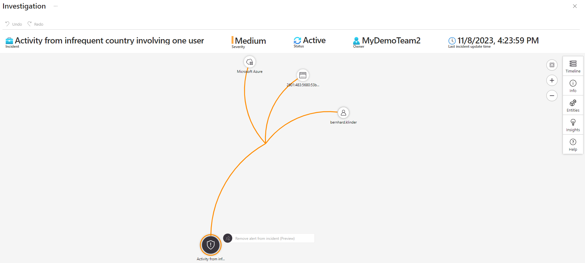

The investigation map lets you drill down into an incident. You can, for example, get details about a user who is identified as part of the incident.

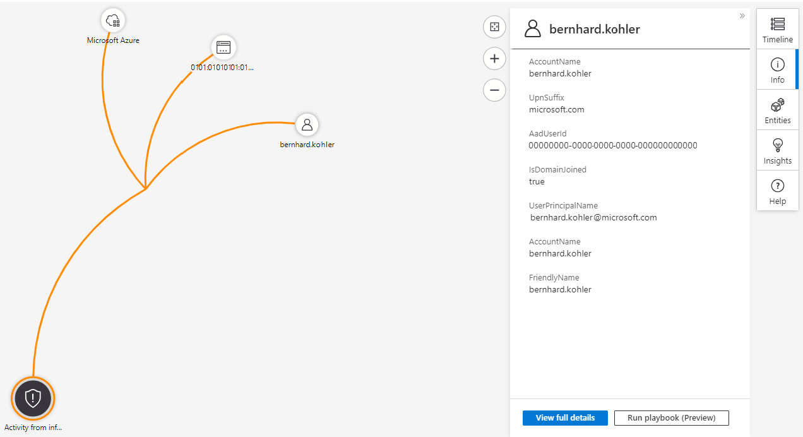

If you hover over an entity, you also see a list of *exploration queries* that were designed by Microsoft security analysts and experts. You use exploration queries to investigate more effectively.

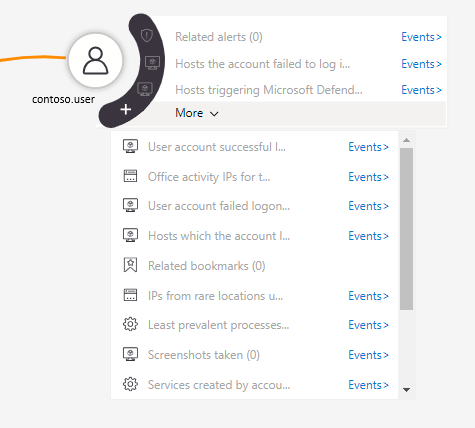

The investigation map also gives you a timeline that helps you understand which event occurred at a particular time. Use the timeline feature to understand the path that a threat might have taken over time.

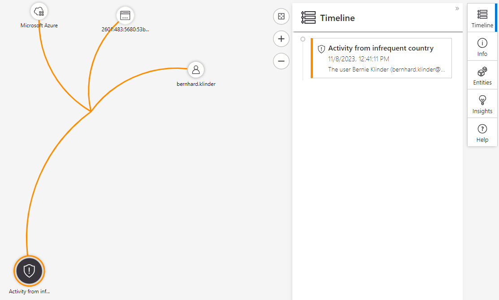

## Respond to threats with playbooks

Playbooks can help you automatically respond to threats in Sentinel. You create a new playbook through the **Playbooks** pane in your Sentinel dashboard.

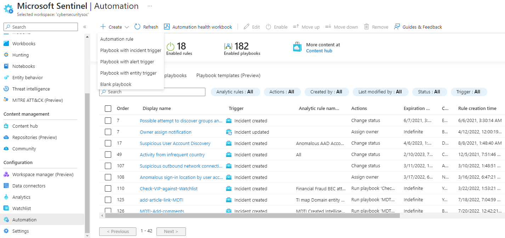

You add a new playbook by creating a logic app.


 You use the Azure Logic Apps Designer to configure a new blank logic app.

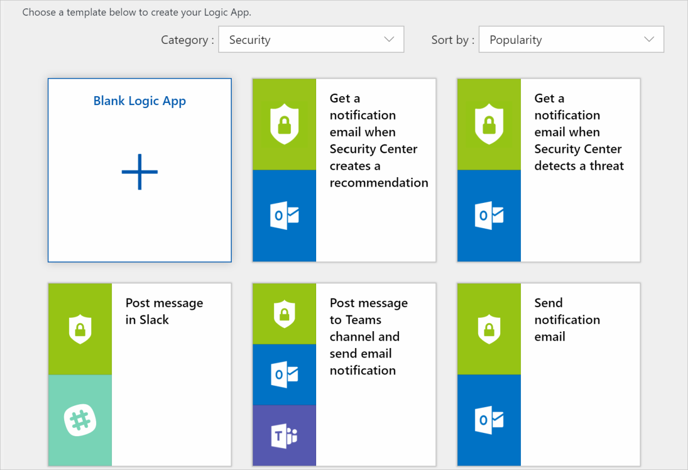

Search for *Microsoft Sentinel* to find its related connectors and triggers.


Choose the trigger that you want. You can then put together a step-by-step process that details what should happen when a response to a Sentinel alert is triggered. You've then configured a playbook.


When you've configured your playbook, you can point to it in your alert rules. The following alert rule, for example, triggers a playbook called **ProcessExecuted**.


