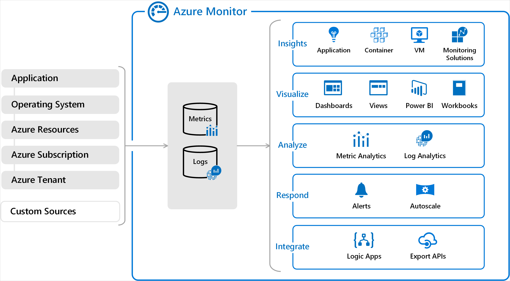
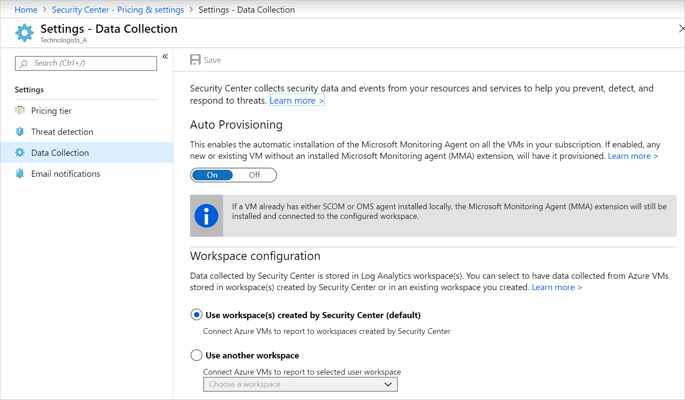
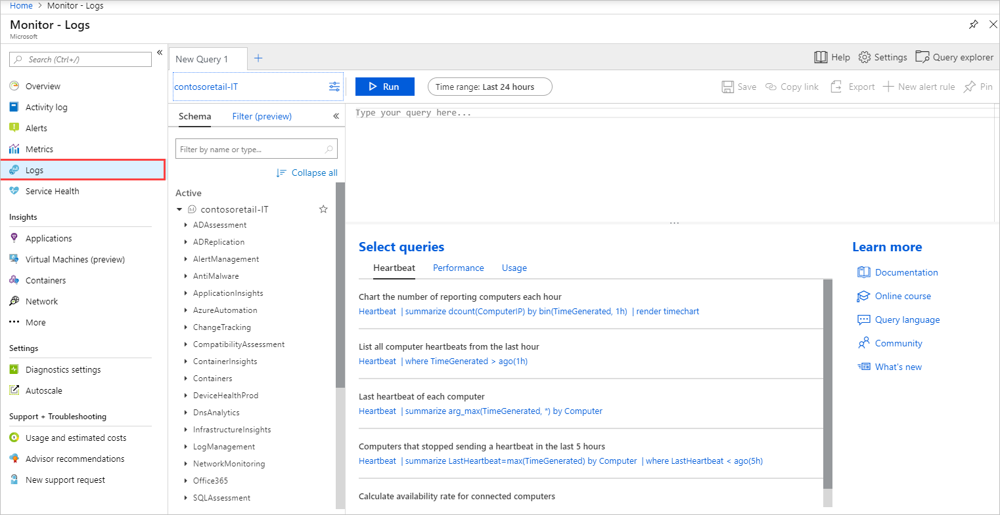
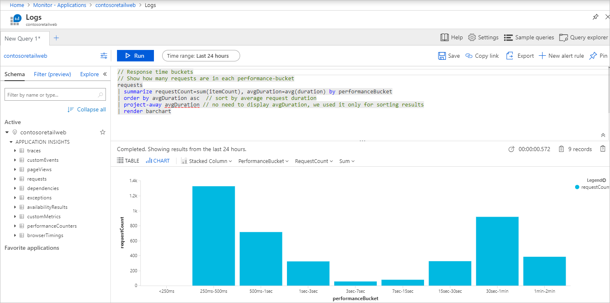
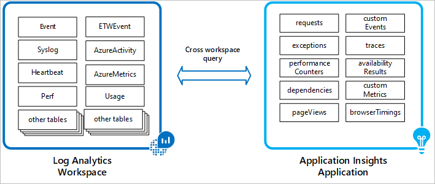
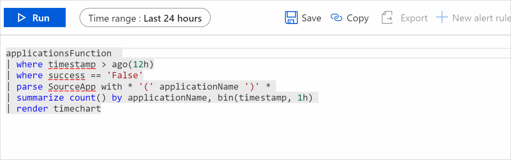
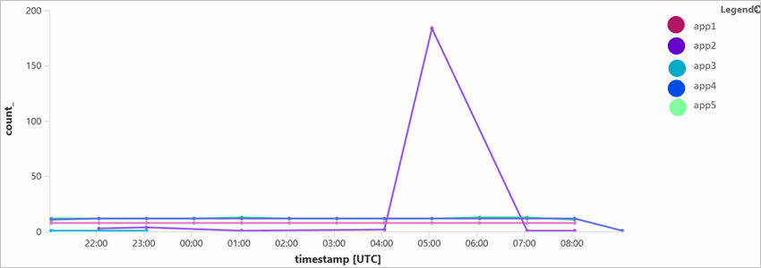

Your organization is ready to start migration. They've previously relied on separate systems to provide monitoring, with mixed results. To improve decision-making, your organization wants a unified monitoring solution across applications, infrastructure, and security.

You'll detail how Azure Monitor can be used to unify the monitoring solutions for your applications and infrastructure.

## Criteria for assessing Azure Monitor

You use Azure Monitor if:

- You need a single solution to help you collect, analyze, and act on log data collected from both cloud and on-premises.
- You're using services such as Azure Application Insights and Azure Security Center. Those services store their collected data in workspaces for Azure Monitor, and enable you to use Azure Monitor Log Analytics to interactively query the data.

## Benefits of Azure Monitor

Azure Monitor centralizes and combines your metrics and log data from different sources. In the diagram below, on the left, you'll see the different sources that Azure Monitor supports. On the right, you'll see what Azure Monitor lets you do with the data collected from those sources. You can analyze data, respond to alerts, and visualize using different tools.



Additionally, you can run a single query over the logs collected from your different services. You can then analyze log data collected from several different sources, and have a unified understanding of all of your data.

Azure Monitor requires little to no configuration to get started. For example, Azure Monitor automatically makes log data available to you from your virtual machines. That's because Azure Security Center's Log Analytics Agent automatically collects all the data into a workspace for Azure Monitor. The agent is enabled and deployed on all your virtual machines using a switch on the portal.

## Integration with Azure Security Center

Azure Security Center collects data from resources such as virtual machines by using the Log Analytics Agent. The agent gathers security-related information from resources like your virtual machines, and puts it into a workspace you can use for analysis. Information such as operating system logs, and running processes, are copied to the workspace along with any crash dump files. Your workspace consists of multiple tables, each of which stores data from a specific source.

The Log Analytics Agent can be installed automatically on all virtual machines. You'll need to set automatic provisioning to **On** in Azure Security Center under **Settings - Data Collection**.



From that point, your data will be stored in a Log Analytics workspace you choose. A workspace is created for you, or you choose an existing one. A workspace can be used with multiple subscriptions. You can then gather data from machines across multiple subscriptions, and analyze it together from one central location.

Log data in workspaces can be analyzed using Log Analytics. Log Analytics is an interactive tool in Azure that you use to write and test queries for your logs, and analyze results.



## Integration with Application Insights

Azure Application Insights and Azure Monitor come integrated. Your Application Insights data is collected and stored in logs that you can view and analyze using Log Analytics. You can open Log Analytics from your Application Insights by selecting **Analytics** from the **Overview** pane of your application.



From here, you create and run queries on your logs and view results.

Queries for logs are written in the Kusto query language (KQL). A KQL query might look like this:

```kusto
SecurityEvent
| where TimeGenerated > ago(7d)
| where EventID == 12345
| summarize count() by Computer, bin(TimeGenerated, 1h)
| render timechart
```

This query filters for specific records based on how long ago an event was generated and renders the summarized result to a time chart.

You can use cross-resource querying to analyze the log data collected from other sources such as Security Center, together with your Application Insights data. Use cross-resource querying to gain a deeper understanding of your applications and environment.



Your cross-resource-query might look like the query below.

```kusto
union Update, workspace("contosofinance-it").Update, workspace("c65g7445-914x-4h7j-6nbv-w876499056").Update
| where TimeGenerated >= ago(24h)
| where UpdateState == "Needed"
| summarize dcount(Computer) by Classification
```

You reference workspaces using `workspace()`.

Cross-resource-querying can result in complex queries. To avoid complex queries, you'll need to save your query as a function in Log Analytics. It will help you reduce the complexity of your query structure. Below is a query that queries different workspaces from multiple applications for requests. The query is saved as a function.


From this point on, we can use this function for cross-resource-querying. In the cross-resource-query below, the *applicationFunction's* returned result is further filtered by the new query for any requests that have failed.



The query renders its results to a time chart.


