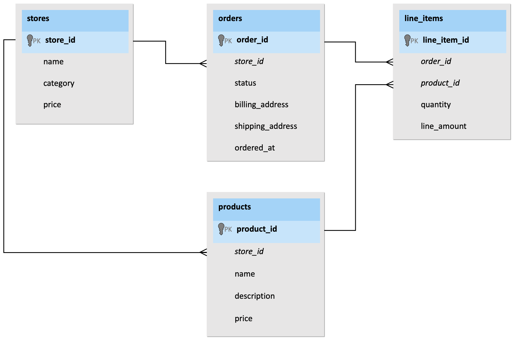
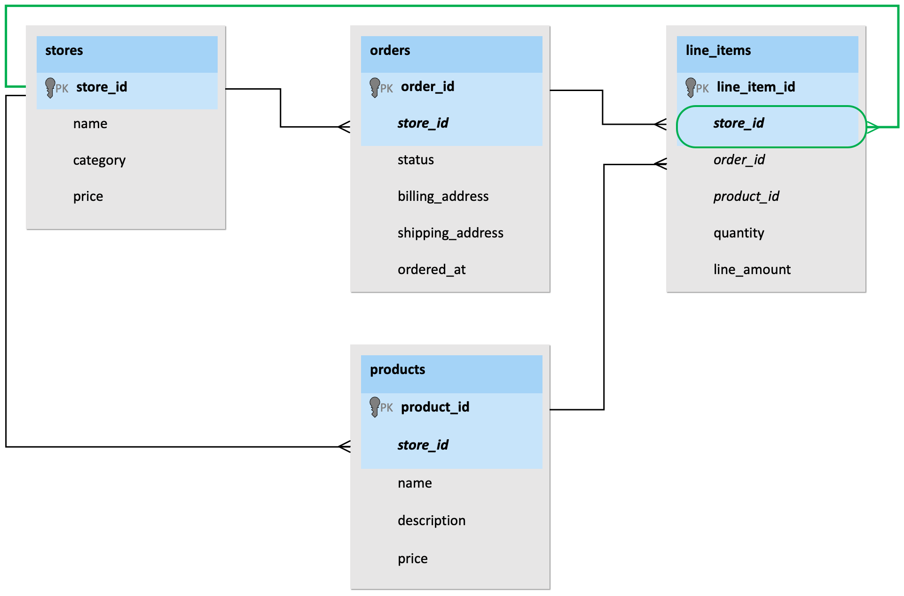

To accommodate the recent increase in toy stores hosting their websites in Tailspin Toys' multi-tenant SaaS application, you have decided to migrate their Azure Cosmos DB for PostgreSQL single-node database to a multi-node cluster. The Azure portal enables you to do this quickly and with minimal to no downtime by horizontally scaling the database. However, to ensure this is done efficiently and with minimal disruption, you must complete some additional work and planning to prepare your database for distribution before taking this step.

Tailspin Toys has provided the following diagram, representing the structure and relationships between tables in their current single-node database. Bolded fields with a light blue background represent primary keys, and italicized items are foreign keys.



You can reference this diagram as you evaluate the best way to distribute their table data across multiple nodes.

## Plan for horizontal scaling

Azure Cosmos DB for PostgreSQL allows you to run PostgreSQL at any scale, from a single-node database to a multi-node distributed database on a cluster with up to twenty workers. For multi-tenant SaaS application providers starting with a single node, planning for future growth when initially selecting the size of your cluster can help avoid downtime when the need to scale arises.

Horizontally scaling to a multi-node cluster can be accomplished with zero downtime, but this capability depends upon the configuration of the coordinator node. The minimum compute and storage sizes for the coordinator node in a multi-node cluster are 4 vCores with 16 GiB RAM and 512 GiB, respectively. You can create a single-node database with compute and storage settings smaller than this minimum requirement. Scaling a single-node cluster when the coordinator compute size is less than 4 vCores with 16 GiB RAM or the storage size is less than 512 GiB requires the coordinator compute and storage to be scaled, resulting in a restart of the server and a short period of downtime.

Horizontally scaling a single-node database and distributing table data across nodes can provide tremendous performance benefits. However, failure to properly plan and restructure tables may lead to misconfigurations that can negatively impact query performance. When distributing multi-tenant data, you must consider how table data gets distributed, the specified distribution column, table co-location, and common query patterns.

## Understand the multi-tenant architecture of Azure Cosmos DB for PostgreSQL

Azure Cosmos DB for PostgreSQL uses a form of hierarchical database modeling to distribute table data across nodes in the cluster. For multi-tenant SaaS applications, the internal identifier for each tenant, commonly referred to as the tenant id, is at the top of this hierarchy. This structure is driven by the fact that most queries from the SaaS application request data only for a single tenant by filtering on the tenant id column. Reviewing the single-node table structure they provided, the `stores` table seems to be the best first for hosting tenant data, making the column that most logically fits as their tenant id the `store_id`.

Azure Cosmos DB for PostgreSQL can efficiently process cross-shard queries, but this is not the typical query pattern in multi-tenant SaaS applications. In multi-tenant SaaS apps, practically every query sent to the database filters on the tenant id. Queries are inspected to determine which tenant id it involves, and the coordinator node routes the query to a single worker node for processing. Specifically, the query is sent to the node which hosts the shard associated with the specified tenant id. Placing all related data on the same node is called table co-location, which can significantly improve query performance when joining related tables.

## Select a distribution column

Tables in a single-node database may have primary and foreign keys, but they do not need to specify a distribution column. The first step when planning a migration to a multi-node distributed database is to identify the best distribution column and plan table distribution accordingly.

After examining the most common query patterns against Tailspin Toys' database, you have determined that most queries executed against the database relate to a single store rather than joining information across stores. This pattern is typical in databases associated with multi-tenant SaaS applications, including online transaction processing (OLTP) workloads for web clients and online analytical processing (OLAP) workloads serving per-tenant analytical queries. As a result, multi-tenant SaaS applications have a natural dimension on which to distribute data across nodes. You can just shard by tenant id. For Tailspin Toys, this means specifying `store_id` as the distribution column on each distributed table.

## Classify tables

Now that you have identified the `store_id` column as the logical distribution key for Tailspin Toys' database, you need to review the schema and relationships to determine how each table should be handled and whether any modifications to table layouts are required.

When working with tables in a single-node multi-tenant SaaS database, they will generally fall into one of the following categories:

1. **Ready for distribution**. These tables already contain the distribution key and are ready to be distributed without changes. Looking at the schema provided, the `stores`, `orders`, and `products` tables already contain the `store_id` column and fall into this category.

2. **Needs backfill**. These tables can be logically distributed by the chosen key but do not contain a column directly referencing it. Tables in this category require modification to add the selected distribution column. Tailspin Toys' `line_items` table can be linked to the `store` table by joining through the `orders` or `products` tables, but it does not contain the `store_id` column. To enable table data to be distributed across worker nodes and co-located for maximum query efficiency, this table needs to be denormalized to include the `store_id` column, and the new column must be populated with the appropriate `store_id` for each line item.

3. **Reference table**. These tables are typically small, do not contain the distribution key, are commonly joined by distributed tables, and are shared across tenants. A full copy of each reference table's data is duplicated and maintained on every node in the cluster, available for quick access by queries on any node.

4. **Local table**. These are typically not joined to other tables and do not contain the distribution key. They are maintained exclusively on the coordinator node and are often used for administrative purposes, such as user authentication.

## Backfill tables

By referencing the table schema Tailspin Toys provided, you will observe that the `stores`, `orders`, and `products` tables already contain the `store_id` column. However, the `line_items` table does not. To prepare this table for distribution, the `store_id` column needs added and populated, or backfilled, with values. This operation will allow data within the `line_items` table to be co-located with related tenant data in the other tables. Unfortunately, this process denormalizes the table but is required to take full advantage of the distributed capabilities of Azure Cosmos DB for PostgreSQL.

You can add the distribution column to the `line_item` table by executing an alter table command as follows:

```sql
ALTER TABLE line_items ADD COLUMN store_id bigint;
```

Once the table has been updated to include the distribution column, you need to populate it with the appropriate `store_id` value for each row in a process referred to as backfilling. Backfilling the `store_id` column in the `line_items` table can be accomplished using a join operation, retrieving the value from another table that contains the `store_id` value. For example, you can join `line_items` with `orders` to get the `store_id` associated with the order related to each row in `line_items`.

Tailspin Toys requested that you look for methods that minimize any operational disruption when making database changes. The `line_items` table is one of the most active transactional tables in the database. You are concerned that performing a bulk operation to backfill the missing values might result in a heavy load on the database and potentially impact other queries.

To fulfill Tailspin Toys' request to horizontally scale the database with _minimal disruption_, you have decided to take a more conservative approach and update the `line_items` table in small batches. To accomplish this, you will use the `pg_cron` extension, which allows you to schedule a user-defined function to run on a recurring schedule until the table has been completely updated.

You determine you can safely update one hundred thousand rows at a time without causing any noticeable database impact and define the update function as follows:

```sql
CREATE OR REPLACE FUNCTION backfill_batch(batch_size bigint)
RETURNS void
LANGUAGE PLPGSQL
AS
$$
BEGIN
    WITH batch AS (
        SELECT line_item_id, order_id
        FROM line_items
        WHERE store_id IS NULL
        LIMIT batch_size
            FOR UPDATE
            SKIP LOCKED
    )
    UPDATE line_items AS li
        SET store_id = orders.store_id
    FROM batch, orders
    WHERE batch.line_item_id = li.line_item_id
        AND batch.order_id = orders.order_id;
END;
$$;
```

Using `pg_cron`, which comes preinstalled in every Azure Cosmos DB for PostgreSQL database, you decide to schedule the function to run every five minutes by running the following command:

```sql
SELECT cron.schedule('backfill', '*/5 * * * *', 'SELECT backfill_batch(100000)');
```

This approach allows you to incrementally update the table while minimizing the impact of many updates on database performance.

Migrating to a multi-node cluster can be accomplished with minimal application changes. Still, once the distribution column has been added to tables where it is missing, you also need to update queries from the application to ensure they are populating the column when writing new records to the database. For Tailspin Toys, this would involve updating any queries that write to or read from the `line_items` table to include the `store_id` column.

## Update table keys

Azure Cosmos DB for PostgreSQL cannot enforce uniqueness constraints across nodes unless a table's unique index or primary key contains its distribution column. As part of your steps to prepare tables for a migration to a multi-node database, you must drop and recreate any primary and foreign key constraints on the Tailspin Toys tables, adding the `store_id` distribution column into each.

By default, creating an index on a table will lock the table being indexed and block write operations to the table until the index build has been completed. To honor Tailspin Toys' request to implement database changes in a way that results in minimal disruption to ongoing operations, you can avoid this by using the `CONCURRENTLY` option of `CREATE INDEX`.

When the `CONCURRENTLY` option is specified, normal operations against the table can continue while the index is built. It can, however, require significantly more time to complete. To update table keys with the least disruption, you can concurrently create a unique index on the table and then swap out the primary key to use it. For example, on the `line_items` table, you would use the following to create a new unique index that includes the `store_id` distribution column:

```sql
CREATE UNIQUE INDEX CONCURRENTLY line_items_tmp_idx ON line_items (store_id, line_item_id);
```

While the unique indexes are creating, you can view any impact the operation is having on database health and identify any resulting locks by querying the `citus_stat_activity` table:

```sql
SELECT wait_event_type, count(*)
  FROM citus_stat_activity
 WHERE state != 'idle'
 GROUP BY 1
 ORDER BY 2 DESC;
```

Locks, if they exist, will appear in the output as follows:

```text
 wait_event_type | count 
-----------------+-------
                 |     2
 lock            |     1
```

If you do see locks in the output, you can get more information about specific blocked queries using the `citus_lock_waits` table:

```sql
SELECT * FROM citus_lock_waits;
```

The `citus_lock_waits` table provides details about which process is blocked and which process is blocking it. The output, displayed in the extended view below (enabled by running `\x` on the command line), looks similar to the following:

```text
-[ RECORD 1 ]-------------------------+--------------------------------------
waiting_gpid                          | 10000024055
blocking_gpid                         | 10000019266
blocked_statement                     | CREATE UNIQUE INDEX CONCURRENTLY line_items_tmp_idx ON orders (store_id, order_id);
current_statement_in_blocking_process | SELECT create_orders(20000);
waiting_nodeid                        | 1
blocking_nodeid                       | 1
```

Reviewing the above output, you will see that using the `CONCURRENTLY` option allows write operations against the table to continue. The scheduled job sending batches of new orders to the database has temporarily blocked the creation of the unique index on the `line_items` table, allowing new orders to continue being written to the database throughout the `CREATE UNIQUE INDEX` process.

After the new unique index creation completes, you must drop and recreate the primary and foreign key constraints on the `line_items` table. For the primary key, you will switch out the primary key for the unique index you created above. This step is ideally done within a transaction to ensure there is no time when the constraints are not enforced. You would execute the following `ALTER TABLE` statements to complete this work:

```sql
BEGIN;
    
-- Swap out the primary key for the unique index
ALTER TABLE line_items
  DROP CONSTRAINT line_items_pkey,
  ADD CONSTRAINT line_items_pkey PRIMARY KEY USING INDEX line_items_tmp_idx;

-- Create a foreign key to the stores table (this did not exist previously)
ALTER TABLE line_items
  ADD CONSTRAINT line_items_store_id_fkey FOREIGN KEY (store_id) REFERENCES stores (store_id);

-- Recreate the foreign keys to the orders and products tables
ALTER TABLE line_items
  ADD CONSTRAINT line_items_order_fkey FOREIGN KEY (store_id, order_id) REFERENCES orders (store_id, order_id),
  ADD CONSTRAINT line_items_product_fkey FOREIGN KEY (store_id, product_id) REFERENCES products (store_id, product_id);

-- Drop the original foreign key references
ALTER TABLE line_items
    DROP CONSTRAINT line_items_order_id_fkey,
    DROP CONSTRAINT line_items_product_id_fkey;

COMMIT;
```

You must consider the relationships between tables when dropping and recreating primary and foreign keys. To ensure existing constraint checks do not block operations when dropping keys, you should begin at the bottom of the relationship hierarchy and work your way up. Likewise, when recreating keys, start at the top and work your way down to ensure any referenced objects exist. For example, in the Tailspin Toys database, the `orders` and `products` tables sit above `line_items` in the hierarchy. The `line_items` table has foreign key references to each of those tables. Attempting to drop and recreate the primary keys on either `orders` or `products` before the foreign key constraints are removed from `line_items` will result in an error, so the order of operations matters. To avoid these errors, start by removing the foreign key references for tables lower in the hierarchy, like `line_items`, and then work your way up the hierarchy.

Another technique to avoid worrying about foreign key relationships defined in other tables is to include the `CASCADE` option when dropping the primary key constraints from your tables. The `CASCADE` option ensures any related foreign key constraints are removed from other tables further down in the hierarchy.

By modifying each of Tailspin Toys' tables in this manner, the schema for the multi-node distributed database should now resemble the following diagram, which highlights the new `store_id` column in the `line_items` table and the newly defined foreign key relationship with `stores` in green. Bolded fields with a light blue background represent primary keys, and italicized items are foreign keys.


