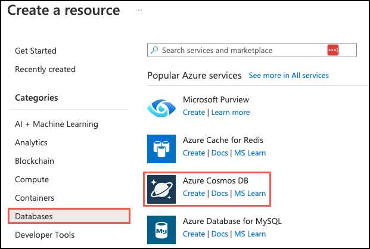
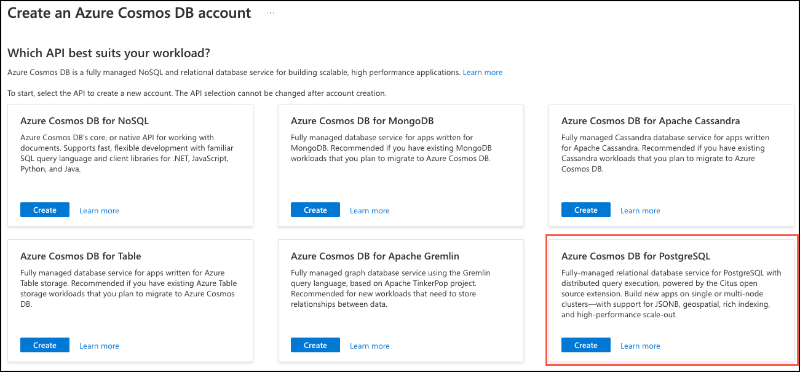
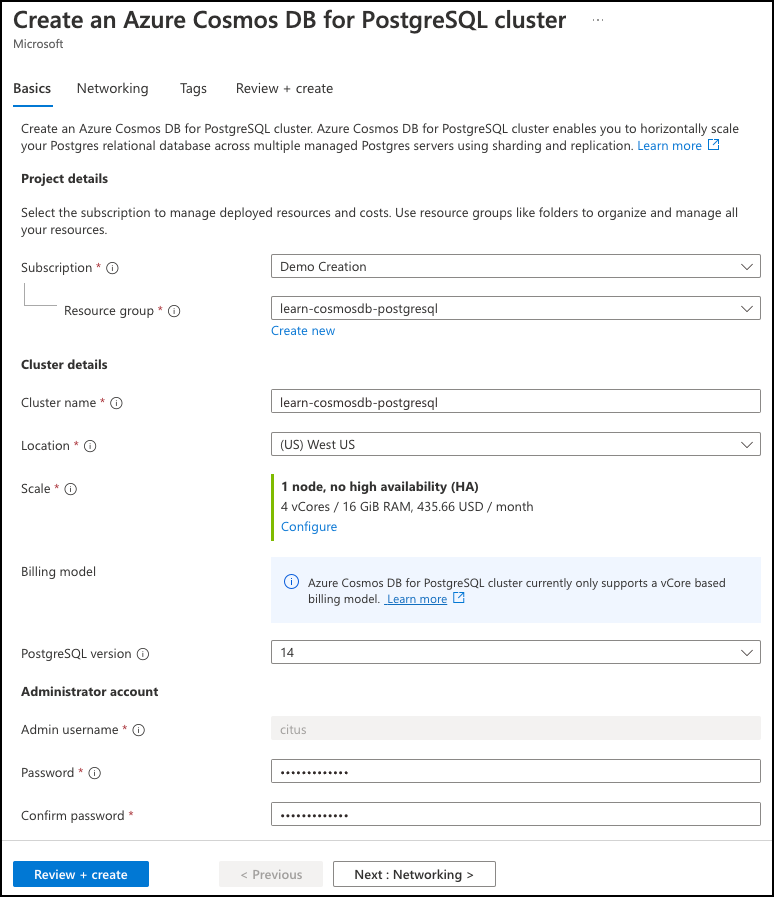
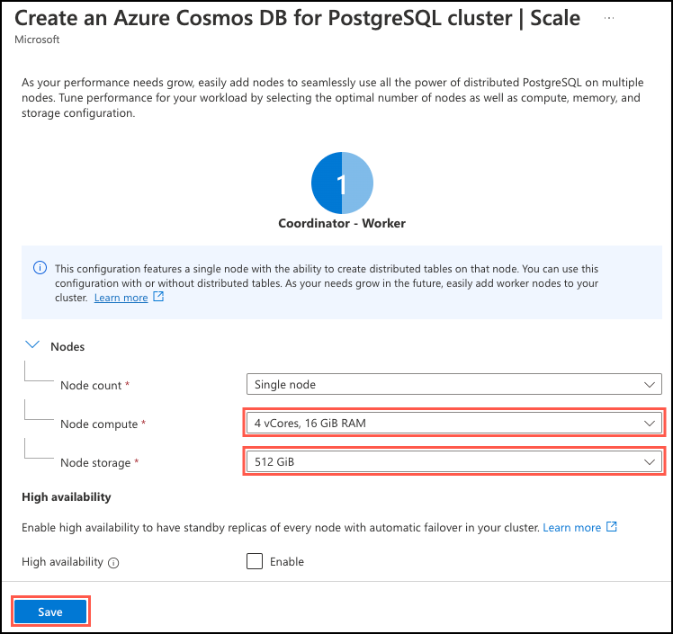
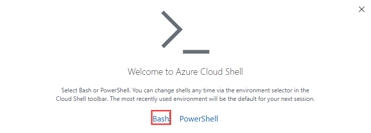
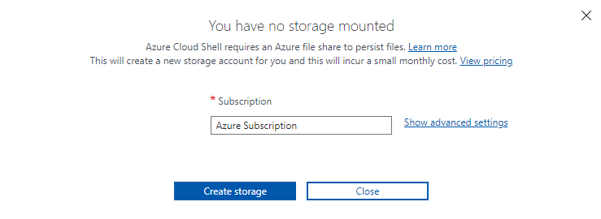

Before you can migrate a single-node database to a multi-node, distributed cluster, you must prepare the tables in the database for distribution. In this exercise, you provision a single-node Azure Cosmos DB for PostgreSQL database, create and populate several tables, and then prepare them for migration to a multi-node distributed database.

## Provision an Azure Cosmos DB for PostgreSQL database

To ensure you can modify the Tailspin Toys database and measure the impact those updates may have on the multi-tenant SaaS application, you first want to set up a development database to test the necessary changes to migrate from a single to a multi-node cluster. You start by provisioning an Azure Cosmos DB for PostgreSQL single-node database that mimics the configuration of Tailspin Toys' current production database. The selected node compute and storage sizes allow you to scale the database horizontally without downtime.

1. Navigate to the [Azure portal](https://portal.azure.com/) in a web browser.

2. In the Azure portal, select **Create a resource**, **Databases**, and **Azure Cosmos DB**. You can also use the **Search** functionality to find the resource.

    

3. On the **Which API best suits your workload?** screen, select **Create** within the **Azure Cosmos DB for PostgreSQL** tile.

    

    After selecting **Create**, the portal will display a resource configuration screen.

4. On the **Basics** tab, enter the following information:

    | Parameter       | Value |
    | --------------- | ----- |
    | **Project details** |       |
    | Subscription    | Leave as the default subscription for the sandbox environment.  |
    | Resource group  | Select **Create new** and name your resource group `learn-cosmosdb-postgresql`. |
    | **Cluster details** |       |
    | Cluster name    | _Enter a globally unique name_, such as `learn-cosmosdb-postgresql`. |
    | Location        | Leave the default, or use a region close to you. |
    | Scale           | See configuration settings in the next step. |
    | PostgreSQL version | Leave the default version (14) selected. |
    | **Administrator account** | |
    | Admin username  | This is set to `citus` and can't be edited. |
    | Password        | Enter and confirm a strong password. |

    

    Make a note of the password you assign, as you need it later to connect to the database.

5. For the **Scale** setting, select **Configure**, and on the cluster configuration page, set the following and select **Save** to return to the cluster configuration page:

    | Parameter        | Value |
    | ---------------- | ----- |
    | **Nodes**            |       |
    | Node count       | Choose **Single node**. |
    | Compute per node | Select **4 vCores, 16 GiB RAM**. |
    | Storage per node | Select **512 GiBM**. |

    The high availability and automatic failover capabilities are out of scope for this exercise, so leave the **High availability** checkbox unchecked.

    

6. Select the **Review + create** button, and on the review screen, select **Create** to provision your cluster. If the **Configure IP address in firewall rules** message appears, select **Create cluster without firewall rules**.

    

    It can take 10-15 minutes for your cluster to provision.

7. Once your cluster has finished provisioning, navigate to the resource in the Azure portal.

8. Select **Networking** under **Settings** from the left-hand navigation menu. On the networking blade, check the box to **Allow public access from Azure services and resources within Azure to this cluster** and select **Save** on the toolbar.

    

## Connect to the database using psql in the Azure Cloud Shell

You'll use `psql` from the command line to make your database changes. `psql` is a command line tool that allows you to interactively issue queries to a PostgreSQL database and view the query results.

1. From your Azure Cosmos DB for PostgreSQL Cluster page in the Azure portal, select **Connection strings** under **Settings** in the left-hand navigation menu, then copy the connection string labeled **psql**.

    

2. Paste the connection string into a text editor, such as Notepad.exe, and replace the `{your_password}` token with the password you assigned to the `citus` user when creating your cluster. Copy the updated connection string for use below.

3. From the **Connection strings** page in the Azure portal, open an Azure Cloud Shell dialog by selecting the Cloud Shell icon on the toolbar in the Azure portal.

    

    The Cloud Shell opens as an embedded panel at the bottom of your browser window. Alternatively, you can open the [Azure Cloud Shell](https://shell.azure.com/) in a different web browser.

4. If necessary, select **Bash** as the environment in the Cloud Shell window.

    

5. If this is the first time you open the Cloud Shell, you may be prompted to mount a storage account. Select the subscription you used for your database account, then select **Create storage**.

    

6. Now, use the `psql` command-line utility to connect to your database. Paste your updated connection string (the one containing your correct password) at the prompt in the Cloud Shell, and then run the command, which should look similar to the following:

    ```bash
    psql "host=c.learn-cosmosdb-postgresql.postgres.database.azure.com port=5432 dbname=citus user=citus password={your_password} sslmode=require"
    ```

## Create tables in the database

Now that you're connected to your database, you can begin populating the database. You'll use `psql` to create the table schema provided by Tailspin Toys in your development database.

1. In the Cloud Shell, run the following query to create the `stores`, `products`, `orders`, and `line_items` tables.

    ```sql
    CREATE TABLE stores
    (
        store_id bigserial PRIMARY KEY,
        name text,
        category text
    );
    
    CREATE TABLE products
    (
        product_id bigserial PRIMARY KEY,
        store_id bigint REFERENCES stores (store_id),
        name text,
        description text,
        price numeric
    );
    
    CREATE TABLE orders
    (
        order_id bigserial PRIMARY KEY,
        store_id bigint REFERENCES stores (store_id),
        status text,
        billing_address text,
        shipping_address text,
        ordered_at timestamp
    );
    
    CREATE TABLE line_items
    (
        line_item_id bigserial PRIMARY KEY,
        product_id bigint REFERENCES products (product_id),
        order_id bigint REFERENCES orders (order_id),
        quantity bigint,
        line_amount numeric
    );
    ```

## Ingest data using the COPY command

Tailspin Toys has provided links to CSV files containing sample data representative of their production system data. You can use these files to populate your development database. The files are available via publicly accessible URLs, and you've decided to load the tables by performing a one-time bulk load into the new database.

You can use the PostgreSQL `COPY` command to accomplish this task. It allows you to load data from files in bulk.

1. Set the database encoding before loading data from the CSV files to ensure they're read correctly.

    ```sql
    SET CLIENT_ENCODING TO 'utf8';
    ```

2. Download the ZIP file containing the provided data files.

    ```sql
    \! curl -L -O 'https://github.com/MicrosoftDocs/mslearn-design-multi-tenant-saas-apps-with-azure-cosmos-db-for-postgresql-data/raw/main/data/data.zip'
    ```

3. Unzip the file to extract the CSV files containing the data Tailspin Toys provided.

    ```sql
    \! unzip data.zip
    ```

   The ZIP file contains multiple CSV files containing stores, orders, products, and line item information. You can view the extracted files by running `\! ls` from the command line if you want to see the files.

4. The following `COPY` command loads data from the downloaded `stores.csv` file into the `stores` table you created above and then updates the sequence for the `store_id` column.

    ```sql
    BEGIN;
    \COPY stores FROM stores.csv WITH CSV HEADER;
    SELECT setval('stores_store_id_seq', MAX(store_id)) FROM stores;
    COMMIT;
    ```

    The `WITH CSV HEADER` option provides information about the format of the file being ingested, specifying that it's a CSV file and the first row is a header row.

5. Execute the below command to populate the `products` table. The `products.csv` file doesn't contain a header row, so you remove the `HEADER` option.

    ```sql
    BEGIN;
    \COPY products FROM products.csv WITH CSV;
    SELECT setval('products_product_id_seq', MAX(product_id)) FROM products;
    COMMIT;
    ```

6. For orders and line items, there are multiple CSV files. The `COPY` command can only read a single file at a time, so to avoid making numerous calls, you can use the `FROM PROGRAM` clause to inform the coordinator to retrieve the data files from an application running on the coordinator. You can then use the `cat` application on the coordinator, which combines multiple files. The `cat` command output is passed to the `COPY` command, allowing it to act as a single file for data ingestion. Run the two `COPY` commands below to load the `orders` and `line_items` tables with data from the files.

    ```sql
    BEGIN;
    \COPY orders FROM PROGRAM 'cat orders*.csv' WITH CSV;
    SELECT setval('orders_order_id_seq', MAX(order_id)) FROM orders;
    COMMIT;
    ```

    ```sql
    BEGIN;
    \COPY line_items FROM PROGRAM 'cat line_items*.csv' WITH CSV;
    SELECT setval('line_items_line_item_id_seq', MAX(line_item_id)) FROM line_items;
    COMMIT;
    ```

7. You can query the count of each table to verify data was loaded correctly.

    ```sql
    SELECT COUNT(*) FROM stores;      -- Count should be 442
    SELECT COUNT(*) FROM products;    -- Count should be 10002
    SELECT COUNT(*) FROM orders;      -- Count should be 1999680
    SELECT COUNT(*) FROM line_items;  -- Count should be 4002959
    ```

## Verify installation of pg_cron extension

In the following tasks, you'll use the `pg_cron` extension for PostgreSQL to run scheduled jobs in the database. Before installing any new supported extensions in your database, viewing the complete list of installed extensions is an excellent idea to avoid potential conflicts. Many popular PostgreSQL extensions are pre-installed on every Azure Cosmos DB for PostgreSQL instance.

1. You can view the list of pre-installed extensions in your Azure Cosmos DB for PostgreSQL database by running the following:

    ```sql
    SELECT oid, extname, extversion FROM pg_extension;
    ```

    Press the space bar on your keyboard to display more results if you see `--More--` at the bottom of the output.

2. Inspect the output of the above query, looking for a row where the `extname` value is `pg_cron` to determine if the extension is pre-installed.

    ```sql
      oid  |      extname       | extversion 
    -------+--------------------+------------
     19371 | pg_cron            | 1.4-1      
    ```

    The query output reveals that `pg_cron` comes pre-installed, so there's nothing more you need to do to use this extension. You can query the `pg_extension` view to retrieve details associated with the installed extensions. Alternatively, you could run `\dx` from the command line, a shortcut command that provides a list of installed extensions in your database.

## Create and run a function to add orders to the database

To correctly measure the impact that transitioning to a multi-node database will have on Tailspin Toys' SaaS application,  you can use a function and scheduled job to simulate customer load on the database as you go through the remainder of the exercises in this module. Placing an artificial workload on the database during the migration process can help you identify potential problems or resource constraints as you migrate the database.

1. You can use a function that accepts the batch size of orders to insert into the database. This function will generate orders with one to three line items, inserting records into the `orders` and `line_items` tables. Execute the command below to create the function.

    ```sql
    CREATE OR REPLACE FUNCTION create_orders(batch_size int)
    RETURNS void 
    LANGUAGE plpgsql
    AS
    $$
    DECLARE
        ord_id bigint;
        st_id bigint;
        prod_id bigint;
        prod_price numeric;
        quantity int;
        line_amt numeric;
        store_count bigint := (SELECT COUNT(*) FROM stores);
        product_count bigint;
    BEGIN
        FOR j IN 1..batch_size LOOP
            -- Retrieve a random store, skewing to store_id 5.
            IF j % 3 = 0 THEN
                st_id := 5;
            ELSE
                st_id := floor(random() * store_count + 1);
            END IF;
            
            ord_id := (SELECT nextval('orders_order_id_seq'));

            -- Insert a new order
            INSERT INTO orders (order_id, store_id, status, billing_address, shipping_address, ordered_at)
            VALUES(ord_id, st_id, 'Pending', '123 Main St.', null, NOW()::date);
                    
            -- Insert 1-3 line items for the order
            FOR i IN 1..floor(random() * (3) + 1) LOOP
                -- Retrieve a random product associated with the selected store.
                product_count := (SELECT count(*) FROM products WHERE store_id = st_id);
                prod_id = (SELECT product_id FROM products WHERE store_id = st_id OFFSET floor(random() * product_count) LIMIT 1);
                prod_price = (SELECT price FROM products WHERE store_id = st_id AND product_id = prod_id);
                quantity = floor(random() * (4) + 1);
                line_amt = prod_price * quantity;

                -- Insert a new line_item row
                INSERT INTO line_items (line_item_id, product_id, order_id, quantity, line_amount)
                VALUES(DEFAULT, prod_id, ord_id, quantity, line_amt);
            END LOOP;
        END LOOP;
    END;
    $$;
    ```

2. To view how long it takes queries to run in `psql`, you can enable query execution time output by running the following command at the Citus command prompt:

    ```sql
    \timing
    ```

3. To simulate database load from customer traffic on various stores' websites, you want to use the function you created to send a representative load of 20,000 orders per minute into the database. Manually run the `create_orders()` function two or three times after enabling `\timing` so you can understand how long it takes to insert 20,000 orders.

    ```sql
    SELECT create_orders(20000);
    ```

    Note the time it takes, as you'll use this for comparison at the end of this exercise.

4. Next, you want the function to execute every minute to add orders to the database automatically. For this, you can use `pg_cron` to schedule it. Run the following `cron.schedule` command to set up a scheduled task named `create_orders` that executes every minute and inserts 20,000 new orders into the database.

    ```sql
    SELECT cron.schedule('create_orders', '*/1 * * * *', 'SELECT create_orders(20000);');
    ```

## Add distribution key and backfill missing values

The `store_id` column is the internal identifier for tenants in the Tailspin Toys database, so it's the logical choice for the distribution column on the tables to be distributed. Notice in the schemas you used to create the database tables above that all of the tables except `line_items` contains the `store_id` column.

To properly distribute and co-locate the `line_items` table data with `stores`, `orders`, and `products`, you need to add the `store_id` column to the `line_items` table and backfill the field for each row. Backfilling tables involves denormalizing the table to add the distribution column and then populating the column with the appropriate value.

1. Run the following SQL command from the `psql` prompt to denormalize the `line_items` table and add the `store_id` distribution column:

    ```sql
    ALTER TABLE line_items ADD COLUMN store_id bigint;
    ```

    With the `line_items` table now denormalized, the next step is to backfill the newly created `store_id` column. However, performing this operation against large tables can cause a significant load on the database and disrupt other queries. To meet Tailspin Toys' request to horizontally scale the database with _minimal disruption_, you've decided again to use the `pg_cron` extension and a function to update the `line_items` table in small batches.

2. Execute the below command to create a function for backfilling the `line_items` table in batches:

    ```sql
    CREATE OR REPLACE FUNCTION backfill_batch(batch_size bigint)
    RETURNS void
    LANGUAGE PLPGSQL
    AS
    $$
    BEGIN
        WITH batch AS (
            SELECT line_item_id, order_id
            FROM line_items
            WHERE store_id IS NULL
            LIMIT batch_size
                FOR UPDATE
                SKIP LOCKED
        )
        UPDATE line_items AS li
            SET store_id = orders.store_id
        FROM batch, orders
        WHERE batch.line_item_id = li.line_item_id
            AND batch.order_id = orders.order_id;
    END;
    $$;
    ```

3. Next, use `pg_cron` to create a scheduled job named `backfill` to run the function every minute and backfill one million records simultaneously.

    ```sql
    SELECT cron.schedule('backfill', '*/1 * * * *', 'SELECT backfill_batch(1000000);');
    ```

    Note that you're updating one million records at a time in the `backfill` scheduled job. In a production system, you would typically use smaller batch sizes and backfill tables over a more extended period to reduce performance impacts on the system. The large batch size used in this example is done to allow the table to be backfilled in a short amount of time for this exercise. There are approximately four million records in the `line_items` table, so it takes four or five minutes for the existing records to be backfilled with the appropriate `store_id` value. You can move on to the next task while waiting for the table to be backfilled.

## Update application queries

With the distribution column added to each distributed table and the backfilling processes started, one of the next steps of the preparation phase is to update queries issued by the SaaS application to ensure the distribution column is included in all queries coming from the application. Above, you created a function to continually add new orders to the database to simulate the application sending in transactions. However, it isn't inserting the `store_id` value into the `line_items` being added.

The denormalized `line_items` table now includes the `store_id` column, so you need to update the function to ensure that the application is populating that column.

1. Replace the `create_orders()` function with the code below. The two lines following `-- Insert a new line_item row` are updated to include the `store_id` value when inserting new line items into the database.

    ```sql
    CREATE OR REPLACE FUNCTION create_orders(batch_size int)
    RETURNS void 
    LANGUAGE plpgsql
    AS
    $$
    DECLARE
        ord_id bigint;
        st_id bigint;
        prod_id bigint;
        prod_price numeric;
        quantity int;
        line_amt numeric;
        store_count bigint := (SELECT COUNT(*) FROM stores);
        product_count bigint;
    BEGIN
        FOR j IN 1..batch_size LOOP
            -- Retrieve a random store, skewing to store_id 5.
            IF j % 3 = 0 THEN
                st_id := 5;
            ELSE
                st_id := floor(random() * store_count + 1);
            END IF;
            
            ord_id := (SELECT nextval('orders_order_id_seq'));

            -- Insert a new order
            INSERT INTO orders (order_id, store_id, status, billing_address, shipping_address, ordered_at)
            VALUES(ord_id, st_id, 'Pending', '123 Main St.', null, NOW()::date);
                    
            -- Insert 1-3 line items for the order
            FOR i IN 1..floor(random() * (3) + 1) LOOP
                -- Retrieve a random product associated with the selected store.
                product_count := (SELECT count(*) FROM products WHERE store_id = st_id);
                prod_id = (SELECT product_id FROM products WHERE store_id = st_id OFFSET floor(random() * product_count) LIMIT 1);
                prod_price = (SELECT price FROM products WHERE store_id = st_id AND product_id = prod_id);
                quantity = floor(random() * (4) + 1);
                line_amt = prod_price * quantity;
    
                -- Insert a new line_item row
                INSERT INTO line_items (line_item_id, product_id, order_id, quantity, line_amount, store_id)
                VALUES(DEFAULT, prod_id, ord_id, quantity, line_amt, st_id);
            END LOOP;
        END LOOP;
    END;
    $$;
    ```

2. Copy the updated function code to the command line and execute it. The next time your `pg_cron` job runs, the function will run with the updated code and populate the `store_id` column for each new line item.

## Verify backfill completion and stop scheduled job

There are approximately four million records in the `line_items` table, plus the new rows inserted by the `create_orders()` function, so it takes four or five minutes to backfill the `line_items` table.

1. Run the following query to verify the `store_id` column has been backfilled on all records in the `line_items` table.

    ```sql
    SELECT count(*) FROM line_items WHERE store_id IS NULL;
    ```

    Continue to execute the above query every minute or two until the count returned is zero. At that point, the table has been successfully backfilled.

2. Once all of the `line_items` records have been backfilled, you can disable the `pg_cron` job. To disable the job, you'll need either the `jobid` of the `cron.schedule` job you created above or the `jobname` you assigned. You can retrieve those values from the `cron.job` table by running the following query:

    ```sql
    SELECT * FROM cron.job;
    ```

3. Using the output of the above query, locate the job with the command that contains the `backfill_batch()` function. You can copy the `jobid` or `jobname` values to disable the job. The output should look similar to the following:

    ```text
     jobid |  schedule   |           command           | nodename | nodeport | database | username | active |    jobname    
    -------+-------------+-----------------------------+----------+----------+----------+----------+--------+---------------
         6 | */3 * * * * | SELECT create_orders(2500); | /tmp     |     5432 | citus    | citus    | t      | create_orders
         7 | */1 * * * * | SELECT backfill_batch();    | /tmp     |     5432 | citus    | citus    | t      | backfill
    ```

4. Stop the job using the following command, which uses the `jobname` value from the above query to disable it.

    ```sql
    SELECT cron.unschedule('backfill');
    ```

## Update table keys to include the distribution column

Azure Cosmos DB for PostgreSQL can't enforce uniqueness constraints on tables unless they contain the distribution column. The single-node schema Tailspin Toys provided includes primary and foreign keys on tables. You need to update these to have the `store_id` distribution column and do it in a manner that minimizes application disruption.

1. The first step you must take is to create new unique indexes on each table that include the distribution column. To prevent locks on the tables you update, use the `CONCURRENTLY` option while creating new indexes. Execute the following `CREATE INDEX` commands to create unique indexes that include the table's original primary key and the `store_id` column.

    ```sql
    CREATE UNIQUE INDEX CONCURRENTLY orders_tmp_idx ON orders (store_id, order_id);
    CREATE UNIQUE INDEX CONCURRENTLY products_tmp_idx ON products (store_id, product_id);
    CREATE UNIQUE INDEX CONCURRENTLY line_items_tmp_idx ON line_items (store_id, line_item_id);
    ```

2. With the new unique indexes created, you can now swap out the primary key on each table. Executing these operations in an order that considers the foreign key relationships between tables is best. Run the following command to drop and recreate the constraints on the `orders` table. Note the foreign key doesn't need to be updated, as it already correctly references the `store_id` column in the `stores` table:

    ```sql
    BEGIN;
    
    -- Swap out the primary key for the unique index
    ALTER TABLE orders
      DROP CONSTRAINT orders_pkey CASCADE,
      ADD CONSTRAINT orders_pkey PRIMARY KEY USING INDEX orders_tmp_idx;
    
    -- Recreate the foreign key on the line_items table (dropped by CASCADE)
    ALTER TABLE line_items
      ADD CONSTRAINT line_items_orders_fkey FOREIGN KEY (store_id, order_id) REFERENCES orders (store_id, order_id);

    COMMIT;
    ```

    The `DROP CONSTRAINT` statement above includes the `CASCADE` option, which results in the foreign key constraint on the `line_items` table also being dropped. As a result, the transaction includes an `ALTER TABLE` statement on the `line_items` table to recreate the foreign key. Including these within the same transaction ensures there's no time when the constraints aren't enforced.

3. Next, repeat the process for the `products` table:

    ```sql
    BEGIN;
    
    -- Swap out the primary key for the unique index
    ALTER TABLE products
      DROP CONSTRAINT products_pkey CASCADE,
      ADD CONSTRAINT products_pkey PRIMARY KEY USING INDEX products_tmp_idx;

    -- Recreate the foreign key on the line_items table (dropped by CASCADE)
    ALTER TABLE line_items
      ADD CONSTRAINT line_items_products_fkey FOREIGN KEY (store_id, product_id) REFERENCES products (store_id, product_id);
    
    COMMIT;
    ```

4. Finally, execute the commands against the `line_items` table. This one takes a bit longer to run due to the table size.

    ```sql
    BEGIN;
    
    -- Swap out the primary key for the unique index
    ALTER TABLE line_items
      DROP CONSTRAINT line_items_pkey,
      ADD CONSTRAINT line_items_pkey PRIMARY KEY USING INDEX line_items_tmp_idx;
    
    -- Create a foreign key to the stores table (this did not exist previously)
    ALTER TABLE line_items
      ADD CONSTRAINT line_items_store_id_fkey FOREIGN KEY (store_id) REFERENCES stores (store_id);
    
    COMMIT;
    ```

5. With the table keys swapped out, manually run the `create_orders()` function again to observe any impact the changes you made had on query execution time. Enable query timing by running `\timing` first, if necessary.

    ```sql
    SELECT create_orders(20000);
    ```

    Compare the time it took to execute after updating the table keys to what you observed previously. You should see that the new composite keys that include the distribution column provide a significant (>10x) performance improvement in the time it takes to insert 20,000 orders. This improvement results from how the new indices help your queries function and is unrelated to distributed processing.

## Disconnect from the database

Congratulations! You've successfully prepared the Tailspin Toys tables for migration to a multi-node, distributed database. In the next exercise, you'll partition the table data across worker nodes.

In the Cloud Shell, run the following command to disconnect from your database:

```sql
\q
```

You can keep the Cloud Shell open and move on to Unit 4 - Distribute tables with minimal application disruption.
