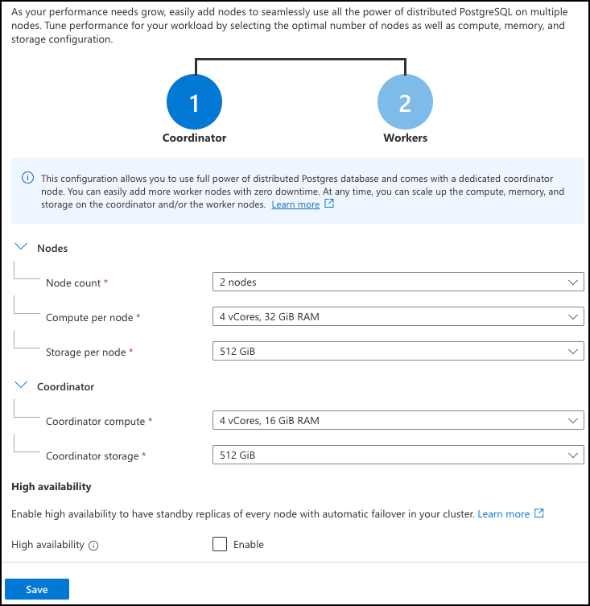

With the tables in the Tailspin Toys Azure Cosmos DB for PostgreSQL database now prepared for distribution, you are ready to move on to horizontally scaling the database and distributing the table data across the worker nodes.

## Horizontally scale the database

Azure Cosmos DB for PostgreSQL provides the ability to quickly scale your database to deal with increased load. For multi-tenant SaaS applications, guidance for selecting the initial cluster size is based on the number of worker vCores and RAM of your original instance.



On the **Scale** blade, you can configure the number of worker nodes and the compute and storage size for each. When migrating from a single-node database, you can typically start with two nodes and expand to more workers over time as application performance and growth requires.

It is essential to remember that this step only adds worker nodes. It does not distribute data to the new worker nodes. Depending on the size of the compute and storage assigned to the single-node cluster, scaling to multiple nodes may require a server restart, resulting in downtime, if the coordinator compute cores and storage size need to change. The single-node development database you created for Tailspin Toys uses a compute size of 4 vCores with 16 GiB and 512 GiB of storage. This configuration meets the minimum coordinator node size for a multi-node cluster, so you can horizontally scale the database without downtime.

## Distribute and co-locate table data

Distributing tables is the process of partitioning or sharding table data and moving those shards to be hosted on worker nodes. The database cannot enforce, and actually prohibits, foreign key constraints when the referenced rows do not reside on the same node, so moving from a single-node, non-distributed database to a multi-node, distributed database requires some planning around the order in which the tables are distributed. In addition, you should ensure table distribution is done in the least disruptive way possible.

Co-location of related table data should also be configured to allow tenant-specific queries to execute as efficiently as possible. When table data is distributed across nodes in the cluster, you ideally want rows across all tables relating to the same tenant to reside together on the same nodes, in what is referred to as table co-location.


Co-locating Tailspin Toys' tables by store has the following advantages:

- It provides SQL coverage for capabilities such as foreign keys and joins.
- Transactions for a single store are localized on the single worker node where the store's data is housed.
- It allows for single-digit millisecond query performance by routing queries for a single store to a single node, optimizing network hops while still scaling compute and memory.
- As the number of stores grows, you can scale the database by adding nodes and rebalancing tenant shards to the new nodes.
- Data for large stores can be isolated to dedicated nodes.

### Determine the order of table distribution

Tables that define or are referenced by foreign keys present some challenges that must be considered when distributing the table. The `orders`, `products`, and `line_items` tables in the Tailspin Toys database define foreign key relationships with one or more tables. The order in which you distribute each table matters, as you must account for these foreign key constraints. For example, running the following command to distribute the `orders` table results in an error.

```sql
SELECT create_distributed_table('orders', 'store_id');
```

When a table being distributed has foreign key constraints, you must first distribute the table referenced by the foreign key. Continuing with the example above, you must distribute `stores` before attempting to distribute `orders`. Trying to distribute the tables in reverse order raises the error displayed below.

```text
ERROR: referenced table "stores" must be a distributed table or a reference table
DETAIL: To enforce foreign keys, the referencing and referenced rows need to be stored on the same node.
HINT: You could use SELECT create_reference_table('stores') to replicate the referenced table to all nodes or consider dropping the foreign key
```

The error message indicates that the foreign key constraint relating to the `stores` table is causing the command to fail because `stores` is not a distributed or reference table.

One approach to resolving this issue is carefully considering the table relationships and any foreign key constraints. For Tailspin Toys, the tables would need to be distributed in the following order:

1. `stores`
2. `orders` and `products` (The specific order for distributing these tables does not matter, as long as they are distributed after `stores` and before `line_items`.)
3. `line_items`

### Review methods for distributing tables with minimal application disruption

There are two functions for distributing table data in Azure Cosmos DB for PostgreSQL, `create_distributed_table()` and `create_distributed_table_concurrently()`. Both of these methods have specific strengths and weaknesses when it comes to minimizing application disruption, and there are tradeoffs to using each.

The primary method for distributing table data in Azure Cosmos DB for PostgreSQL is to use the `created_distributed_table()` function. This method, however, results in table locking and can prevent writes against the table until the distribution process completes. Tailspin Toys asked for any database changes to have a minimal impact on the application, so this approach is not ideal.

To reduce disruption and prevent table locks, you can use the alternative `create_distributed_table_concurrently()` function. This function does the same thing as `create_distributed_table()`, but executes the operation without blocking table writes during the distribution operation. Running `create_distributed_table_concurrently()` takes longer to complete but is a safer option when working with production systems, where reducing the impact on ongoing application operations is essential.

Like running `create_distributed_table()`, distributing tables with foreign key constraints requires planning. You saw that `created_distributed_table()` checks foreign key constraints and dictates a specific table distribution order. With `create_distributed_table_concurrently()`, this is even more difficult because foreign key constraints prevent tables from being distributed entirely.

For example, consider the following command to distribute the `stores` table concurrently:

```sql
SELECT create_distributed_table_concurrently('stores', 'store_id');
```

With `create_distributed_table()`, you were required to distribute the `stores` table first because other tables have foreign key constraints referencing it. When attempting to distribute the `stores` table first with `create_distributed_table_concurrently()`, the command raises an error:

```text
ERROR: relation stores is referenced by a foreign key from line_items
DETAIL: foreign keys from a regular table to a distributed table are not supported.
```

When distributing tables concurrently, all relationships on the table are inspected. Table distribution is prevented for any tables with relationships to non-distributed or non-reference tables. Your only option to get around this constraint is to drop all foreign key constraints for each table and recreate them after the distribution process completes.

To use `create_distributed_table_concurrently()` to distribute the `stores` table, you must first drop any foreign key references from all other non-distributed tables, as follows:

```sql
BEGIN;

ALTER TABLE orders
      DROP CONSTRAINT orders_store_id_fkey;
ALTER TABLE products
      DROP CONSTRAINT products_store_id_fkey;
ALTER TABLE line_items
      DROP CONSTRAINT line_items_store_id_fkey;

COMMIT;
```

Once the foreign key constraints have been removed, you can then distribute the table:

```sql
SELECT create_distributed_table_concurrently('stores', 'store_id');
```

To complete the table distribution for the remaining tables, you must drop each foreign key constraint, distribute the tables, and recreate the foreign key constraints after all tables are distributed.

The `create_distributed_table_concurrently()` function allows write operations to the database to continue but can take substantially longer to execute than `create_distributed_table()`. The database will not enforce referential integrity during the time it takes to distribute the tables because you were forced to drop foreign key constraints.

To review the table distribution methods:

The `created_distributed_table()` function:

- Allows the tables with foreign key constraints to be distributed, but only if the order of table distribution is carefully considered.
- Creates a lock on the distributed table and will block any write operations until the distribution operation is completed.
- Does not honor transactions.
- Drawbacks include table writes being blocked during distribution and the order of table distribution matters.

The `create_distributed_table_concurrently()` function:

- Does not block table writes.
- Will not work if there are any foreign key constraints where the data does not reside on the same node. The workaround is to drop any foreign key constraints and recreate them after the data has been distributed.
- Cannot be executed inside of a transaction.
- Drawbacks include the loss of referential integrity during distribution and that it takes longer to execute.

### Combine distribution methods to minimize impact and reduce risk

Each distribution method has its advantages but also introduces some impacts on the operation of the production multi-tenant SaaS application. Using `create_distributed_table()` will block new transactions from entering the system while it runs but preserves referential integrity throughout the process. The `create_distributed_table_concurrently()` function allows the application to continue writing to the database but introduces the possibility of referential integrity not being enforced while table data is being distributed. To minimize application disruption and reduce risk, you can use a combination of the two methods to distribute the tables in the Tailspin Toys database.

`Stores` is a small table that is not updated often. Distributing this table using `create_distributed_table()` will block write operations. However, because they are infrequent and the table distribution will happen quickly, this might fall within the acceptable level of possible application disruption to take this approach. From above, you know that `stores` can be distributed using `create_distributed_table()` without needing to drop any foreign keys on the other tables. Given these conditions, a possible trade-off would be to distribute the `stores` table using `create_distributed_table()`.

```sql
SELECT create_distributed_table('stores', 'store_id');
```

With `stores` now distributed, you need to consider how to approach the other tables. Using `create_distributed_table_concurrently()` will still require dropping and recreating foreign keys on each table, so distributing the `stores` table has not eliminated that requirement.

Products is a larger table than `stores`, but may also be a candidate to distribute with `create_distributed_table()`. Like `stores`, the impact of blocking writes to this table is slight. You can distribute the `products` table data by running the following:

```sql
SELECT create_distributed_table('products', 'store_id', colocate_with => 'stores');
```

The `stores` and `products` tables share the same distribution column, so co-location happens implicitly. If desired, however, you can also explicitly specify co-location using the `colocate_with` option of the `create_distributed_table()` function, as in the above example.

The `orders` and `line_items` tables are the largest tables in the database and are the targets of most of the write operations in the database. Blocking writes to these tables would be detrimental to the use of the SaaS application, so you should take a more conservative approach to distribute these tables. Using `create_distributed_table_concurrently()`, you will have to drop the foreign key constraint between the `line_items`, `orders`, and `stores` tables, but it does limit the number of keys you need to drop and slightly decreases the risk of not enforcing referential integrity between tables. For example, to distribute the `orders` table, you would drop the foreign key constraints, distribute the table concurrently, and then recreate the foreign key reference to `stores`.

```sql
-- Drop the foreign key to the stores table
ALTER TABLE orders
    DROP CONSTRAINT orders_store_id_fkey;

-- Drop the foreign key reference in the line_items table
ALTER TABLE line_items
    DROP CONSTRAINT line_items_orders_fkey;

SELECT create_distributed_table_concurrently('orders', 'store_id', colocate_with => 'stores');

-- Recreate the foreign key to the stores table
ALTER TABLE orders
    ADD CONSTRAINT orders_store_id_fkey FOREIGN KEY (store_id) REFERENCES stores (store_id);
```

Usually, you would want to run the above statements in a transaction to reduce further the risk of not enforcing referential integrity when the table data is being distributed. However, `create_distributed_table_concurrently()` cannot be run inside a transaction, so this is not possible at this time.

Recreating the foreign key to the `line_items` table cannot happen until after that table is also distributed. Its distribution would follow the same pattern, dropping any foreign key constraints, distributing the table, and recreating the foreign keys.

A best practice to use after all of your tables are distributed is to truncate the local rows of those tables still residing on the coordinator node. You can do this by running `truncate_local_data_after_distributing_table()`. You cannot run this until after the related tables are all distributed because foreign key constraints cause an error.

```sql
SELECT truncate_local_data_after_distributing_table('stores');
```

You only need to run this on `stores`, as it will automatically cascade to other related local tables, truncating the `orders`, `products`, and `line_items` local tables. Truncating local coordinator node table data is safe for distributed tables because their rows, if any, are copied to worker nodes during distribution.

## Understand the impact of some tables being distributed while others are not

Neither of the distribution functions available in Azure Cosmos DB for PostgreSQL works within transactions, so some time will lapse between when the first and last tables are distributed. As you go about migrating Tailspin Toys' database to a multi-node cluster, you would like to understand whether queries involving multiple tables will break or become unacceptably inefficient during the interval when one or more tables are distributed, and others are not.

Queries that involve joins across distributed tables or are cross-partition can be planned efficiently because related data are typically co-located. However, when data is not co-located, or one of the joined tables is still a local table on the coordinator, the citus engine cannot optimize the query. As a result, performance can be degraded due to the need to shuffle large amounts of data. You should thoroughly test common queries against the Tailspin Toys' development database you created before migrating their production database to a multi-node cluster so you can assess the impact.
