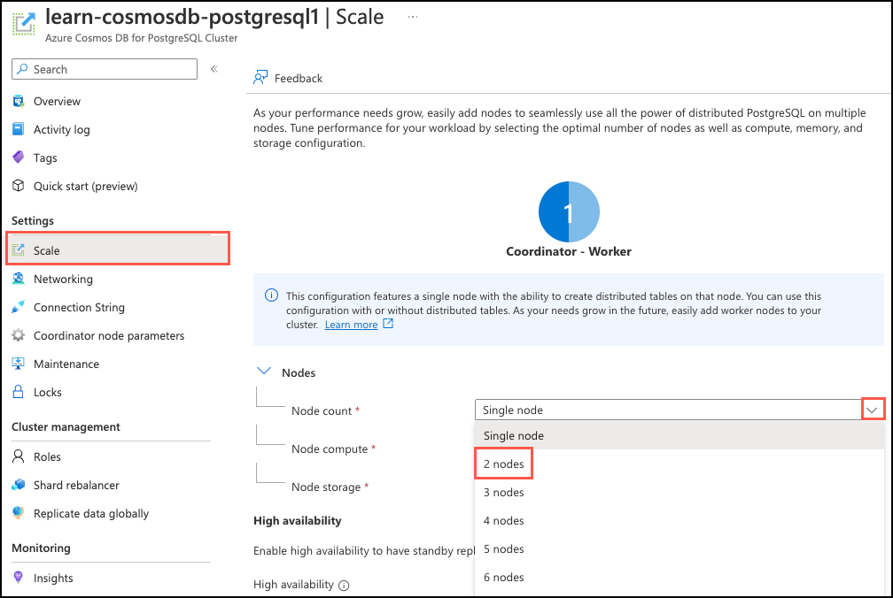
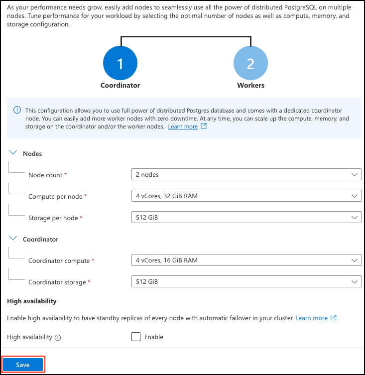

With the tables in the Tailspin Toys database now prepared for distribution, you're ready to scale the database horizontally and distribute the tables. In this exercise, you'll scale your single-node database to a multi-node cluster and then distribute the table data across the nodes using a combination of distribution methods to minimize the impact of the database changes on Tailspin Toys' multi-tenant SaaS application. In addition, you'll execute several popular queries from the multi-tenant SaaS application throughout the process to measure the impact of your changes on query execution time at various stages.

## Scale database

Scaling an Azure Cosmos DB for PostgreSQL database can be done quickly via the Azure portal. Typically, a database can be scaled without downtime. However, going from a single-node database to a multi-node cluster may require minimal downtime if the coordinator's compute core and storage sizes change. Once you are on a multi-node cluster, you can scale without downtime. It's also important to note that once you go from single to multi-node, you can't go back to single-node.

1. Open the [Azure portal](https://portal.azure.com/) in a web browser and navigate to your **Azure Cosmos DB for PostgreSQL Cluster** resource.

2. On the **Azure Cosmos DB for PostgreSQL Cluster** page, select **Scale** under **Settings** in the left-hand navigation menu, expand the **Node count** dropdown on the **Scale** blade, and select **2 nodes** from the list.

    

    Migrating to a multi-node cluster splits the coordinator and workers onto separate nodes. The node count dropdown indicates the number of worker nodes, so selecting **2 nodes** create two worker nodes in addition to the coordinator node.

3. Select **Save** to transition the database from a single-node to a multi-node cluster.

    

    The compute and storage sizes you selected when setting up the development database for Tailspin Toys are compatible with a multi-node cluster, so scaling the database won't cause any database downtime. The scaling process takes several minutes to complete, so you can move on to the next task while it is in progress.

## Enable citus_stat_statements monitoring

Queries statistics against PostgreSQL databases are maintained in the `pg_stat_statements` view. When transitioning to a multi-node distributed database, the Citus extension provides another view named `citus_stat_statements`, which includes the partition key, making it much more helpful in multi-tenant databases. The `citus_stat_statements` view should be enabled by default in your database, but it's a good idea to verify it's turned on, and if not, enable it.

1. To verify if monitoring is turned on, you must check the `citus.stat_statements_track` setting on your coordinator node. Run the following query to check if Citus statistics tracking is enabled:

    ```sql
    show citus.stat_statements_track;
    ```

    If the `citus.stat_statements_track` setting is `all`, you can skip to the next section and connect to your database. Otherwise, proceed to the next step to enable tracking.

2. On your **Azure Cosmos DB for PostgreSQL Cluster** page in the Azure portal, select **Coordinator node parameters** under **Settings** in the left-hand navigation menu. On the Coordinator node parameters page, enter "citus.stat" into the filter box and change the value of `citus.stat_statements_track` to **ALL**. If the value is already **ALL**, select **None**, then choose **ALL** again to enable the **Save** button.

    

3. Select **Save**.

4. Once the updated setting has been saved, rerun the verification query.

    ```sql
    show citus.stat_statements_track;
    ```

5. Ensure the output now displays as `all`.

    ```text
     citus.stat_statements_track 
    -----------------------------
     all
    ```

## Connect to the database using psql in the Azure Cloud Shell

You'll use `psql` from the command line to distribute the tables in your database. `psql` is a command line tool that allows you to interactively issue queries to a PostgreSQL database and view the query results.

1. From your Azure Cosmos DB for PostgreSQL resource in the [Azure portal](https://portal.azure.com/), select **Connection strings** under **Settings** from the left-hand navigation menu, and then copy the connection string labeled **psql**.

    

2. Paste the connection string into a text editor, such as Notepad.exe, and replace the `{your_password}` token with the password you assigned to the `citus` user when creating your cluster. Copy the updated connection string for use below.

3. From the **Connection strings** page in the Azure portal, open an Azure Cloud Shell dialog by selecting the Cloud Shell icon on the toolbar in the Azure portal.

    

    The Cloud Shell opens as an embedded panel at the bottom of your browser window. Alternatively, you can open the [Azure Cloud Shell](https://shell.azure.com/) in a different web browser.

4. In the Cloud Shell pane, ensure **Bash** is selected for the environment, then use the `psql` command-line utility to connect to your database. Paste your updated connection string (the one containing your correct password) at the prompt in the Cloud Shell, and then run the command, which should look similar to the following:

    ```bash
    psql "host=c.learn-cosmosdb-postgresql.postgres.database.azure.com port=5432 dbname=citus user=citus password={your_password} sslmode=require"
    ```

## Benchmark query execution times before table distribution

Before distributing any tables in the database, you want to take baseline measurements on execution times for a few popular queries from the Tailspin Toys multi-tenant SaaS application. These measurements help you understand the impact of table distribution on query performance.

1. In the Cloud Shell pane, enable the display of query execution times by running the following from the Citus prompt:

    ```sql
    \timing
    ```

    **As you execute each of the following queries, record its execution time for comparison throughout the table distribution process.**

2. The first query you want to examine retrieves the list of available products for an individual store. This query only hits the `products` table and filters on `store_id`. Execute the following and record the execution time:

    ```sql
    -- List products by store
    SELECT p.product_id, p.name FROM stores AS s
    INNER JOIN products AS p ON s.store_id = p.store_id
    WHERE s.store_id = 336;
    ```

3. The second query you want to measure is slightly more complex, querying for the top five products sold by a store. It includes aggregations that sum up the total quantity of each item sold and count the number of orders that contain the product. Run the query and record the execution time:

    ```sql
    -- 5 most ordered products by store
    SELECT p.product_id,
        p.name,
        SUM(l.quantity) AS total_ordered,
        COUNT(p.product_id) AS count_of_orders_containing_product
    FROM products AS p
    INNER JOIN line_items AS l ON p.store_id = l.store_id AND p.product_id = l.product_id
    WHERE p.store_id = 5
    GROUP BY p.store_id, p.product_id
    ORDER BY total_ordered DESC
    LIMIT 5;
    ```

4. The last application query you want to evaluate retrieves averages for the number of items purchased, number of line items, and order total for a store. Execute the query and record its execution time:

    ```sql
    -- Average order amounts by store
    WITH order_amounts AS (
        SELECT store_id, order_id, SUM(quantity) AS total_quantity, COUNT(*) AS order_lines, SUM(line_amount) AS order_amount
        FROM line_items
        WHERE store_id = 5
        GROUP BY store_id, order_id
    )
    SELECT s.name,
        AVG(o.total_quantity) AS avg_quantity,
        AVG(o.order_lines) AS avg_order_lines,
        AVG(o.order_amount) AS avg_order_amount
    FROM stores AS s
    INNER JOIN order_amounts AS o ON s.store_id = o.store_id
    WHERE s.store_id = 5
    GROUP BY s.store_id;
    ```

5. Tailspin Toys uses this final query for internal analytics, aggregating data across all stores. This query calculates each store's total number of orders, the average dollar amount of each order, and their total sales. Execute the cross-tenant query and record the execution time:

    ```sql
    -- Internal cross-tenant aggregation
    SELECT s.store_id,
        s.name,
        COUNT(l.order_id) AS order_count,
        AVG(line_amount) AS avg_order_amount,
        SUM(l.line_amount) AS total_sales
    FROM line_items AS l
    INNER JOIN stores AS s ON l.store_id = s.store_id
    GROUP BY s.store_id
    ORDER BY total_sales DESC
    LIMIT 25;
    ```

    Most queries in multi-tenant SaaS applications are for a single tenant. Still, SaaS providers may run cross-tenant queries to understand how the application is used across tenants or for other purposes, such as generating data for internal analytics. Understanding the impact of distributing table data across nodes on cross-tenant queries is also an essential metric to capture.

## Distribute the stores and products tables

In a single-node, non-distributed database, all tables live on the coordinator node. Horizontally scaling the database to a multi-node cluster doesn't automatically partition data across the new worker nodes, so next, you need to distribute the tables. You'll start with the `stores` and `products` tables.

1. After the database scaling operation finishes, you want to distribute the `stores` table first. This table is small and doesn't receive many updates, so you can use `create_distributed_table()` to handle distribution. At the Citus command prompt in your open Cloud Shell pane, run the following:

    ```sql
    SELECT create_distributed_table('stores', 'store_id');
    ```

2. You can use the same method to distribute the `products` table as you did for `stores`. Similarly, it's updated less frequently, so the risk of impacting users of the SaaS application is low. This time, the `colocate_with` option is specified to inform the `create_distributed_table()` function to explicitly place data with the same distribution key from both tables onto the same node in the cluster.

    ```sql
    SELECT create_distributed_table('products', 'store_id', colocate_with => 'stores');
    ```

## Reevaluate query execution times

Neither of the distribution functions available in Azure Cosmos DB for PostgreSQL works within transactions, so some time will lapse between when the first and last tables are distributed. To understand the potential impact of having a mix of local and distributed tables, you want to rerun the application queries from above to see if query times are affected by being in this state.

1. Execute the query to retrieve the products list for a store again and record the execution time.

    ```sql
    -- List products by store
    SELECT p.product_id, p.name FROM stores AS s
    INNER JOIN products AS p ON s.store_id = p.store_id
    WHERE s.store_id = 336;
    ```

2. Rerun the query that retrieves the top five products sold by a store and document its execution time.

    ```sql
    -- 5 most ordered products by store
    SELECT p.product_id,
        p.name,
        SUM(l.quantity) AS total_ordered,
        COUNT(p.product_id) AS count_of_orders_containing_product
    FROM products AS p
    INNER JOIN line_items AS l ON p.store_id = l.store_id AND p.product_id = l.product_id
    WHERE p.store_id = 5
    GROUP BY p.store_id, p.product_id
    ORDER BY total_ordered DESC
    LIMIT 5;
    ```

3. Execute the average order amount query again and record the execution time.

    ```sql
    -- Average order amounts by store
    WITH order_amounts AS (
        SELECT store_id, order_id, SUM(quantity) AS total_quantity, COUNT(*) AS order_lines, SUM(line_amount) AS order_amount
        FROM line_items
        WHERE store_id = 5
        GROUP BY store_id, order_id
    )
    SELECT s.name,
        AVG(o.total_quantity) AS avg_quantity,
        AVG(o.order_lines) AS avg_order_lines,
        AVG(o.order_amount) AS avg_order_amount
    FROM stores AS s
    INNER JOIN order_amounts AS o ON s.store_id = o.store_id
    WHERE s.store_id = 5
    GROUP BY s.store_id;
    ```

4. Run Tailspin Toys' internal cross-tenant aggregation query again and record the execution time.

    ```sql
    -- Internal cross-tenant aggregation
    SELECT s.store_id,
        s.name,
        COUNT(l.order_id) AS order_count,
        AVG(line_amount) AS avg_order_amount,
        SUM(l.line_amount) AS total_sales
    FROM line_items AS l
    INNER JOIN stores AS s ON l.store_id = s.store_id
    GROUP BY s.store_id
    ORDER BY total_sales DESC
    LIMIT 25;
    ```

    You'll notice a significant increase in the execution time of this query.

## Distribute the remaining tables

You've seen that having some of your tables distributed while others aren't can impact the performance of queries that join data between tables in different distribution states or read data across tenants. However, you still need to inspect how those queries perform after all tables have been distributed.

Using `create_distributed_table()` blocks write transactions while table data is being distributed, which could negatively impact perceived application performance. When distributing write-heavy tables in a production environment, it's safer to use `created_distributed_table_concurrently()` and allow table writes to continue.

To distribute the `orders` and `line_items` tables, you'll use the `create_distributed_table_concurrently()` function to prevent blocking incoming table writes and minimize application disruption. That function, however, doesn't allow foreign key constraints to exist while distributing the table, so first, you must drop any foreign key constraints on each table to be distributed.

1. To distribute the `orders` table, you must first drop all foreign key constraints associated with the table.

    ```sql
    BEGIN;

    -- Drop the foreign key to the stores table
    ALTER TABLE orders
        DROP CONSTRAINT orders_store_id_fkey;
    
    -- Drop the foreign key reference in the line_items table
    ALTER TABLE line_items
        DROP CONSTRAINT line_items_orders_fkey;

    COMMIT;
    ```

2. Once the foreign key references have been removed, you can use `create_distributed_table_concurrently()` to distribute the `orders` table.

    ```sql
    SELECT create_distributed_table_concurrently('orders', 'store_id');
    ```

    Using the `create_distributed_table_concurrently()` function takes longer than distributing with `create_distributed_table()`. This increase in time to execute is primarily because concurrently distributing a table allows table write operations to continue, so distribution is interrupted by any incoming table inserts and updates.

    If you receive an error while running this step, rerun the query to try again.

3. The last step for the `orders` table is to recreate the foreign key constraints to tables that have already been distributed, which is only the `stores` table in this case.

    ```sql
    ALTER TABLE orders
        ADD CONSTRAINT orders_store_id_fkey FOREIGN KEY (store_id) REFERENCES stores (store_id);
    ```

    You may notice that the above command didn't recreate the foreign key constraint between `line_items` and `orders` that you dropped in step 1. You'll recreate that relationship after distributing `line_items` to avoid errors.

4. Before distributing the `line_items` table, open the [Azure Cloud Shell](https://shell.azure.com/) in a second web browser or tab. You'll use this second Cloud Shell window to examine how table writes are handled when using `create_distributed_table_concurrently()`.

5. In the new Cloud Shell window, ensure **Bash** is selected for the environment, then use the `psql` command-line utility to connect to your database, as you've done previously. Paste your updated connection string (the one containing your correct password) at the prompt in the Cloud Shell, and then run the command, which should look similar to the following:

    ```bash
    psql "host=c.learn-cosmosdb-postgresql.postgres.database.azure.com port=5432 dbname=citus user=citus password={your_password} sslmode=require"
    ```

6. You can now distribute the `line_items` table in the same fashion as the `orders` table. Return to the Cloud Shell pane at the bottom of the Azure portal window, then copy and paste the code below to drop any foreign key references, distribute the table, and recreate the table relationships.

    ```sql
    ALTER TABLE line_items
        DROP CONSTRAINT line_items_products_fkey,
        DROP CONSTRAINT line_items_store_id_fkey;

    SELECT create_distributed_table_concurrently('line_items', 'store_id');

    -- Recreate a foreign key to the stores table
    ALTER TABLE line_items
        ADD CONSTRAINT line_items_store_id_fkey FOREIGN KEY (store_id) REFERENCES stores (store_id);
    
    -- Recreate the foreign key to the orders table
    ALTER TABLE line_items
        ADD CONSTRAINT line_items_orders_fkey FOREIGN KEY (store_id, order_id) REFERENCES orders (store_id, order_id);
    
    -- Recreate the foreign key to the products table
    ALTER TABLE line_items
        ADD CONSTRAINT line_items_products_fkey FOREIGN KEY (store_id, product_id) REFERENCES products (store_id, product_id);
    ```

7. After starting the above commands, return to your second open Cloud Shell window and run the following command to look for any table locks.  

    ```sql
    SELECT wait_event_type, count(*)
        FROM pg_stat_activity
    WHERE state != 'idle'
    GROUP BY 1
    ORDER BY 2 DESC;
    ```

    You'll likely need to rerun the above query multiple times until a lock appears in the output. It will look similar to the following:

    ```text
     wait_event_type | count 
    -----------------+-------
     Client          |     5
                     |     1
     Lock            |     1
    ```

8. When you see a `Lock` line, run `\x` at the command prompt to switch to the extended view, making the query output easier to read.

9. After enabling the extended view, execute the below query to examine the lock details:

    ```sql
    SELECT * FROM citus_lock_waits;
    ```

10. Examine the output of the above query, which should look similar to the following:

    ```text
    -[ RECORD 1 ]-------------------------+---------------------------------------------------------------------------------------------------
    waiting_gpid                          | 10000001997
    blocking_gpid                         | 10000019151
    blocked_statement                     | SELECT create_distributed_table_concurrently('line_items', 'store_id', colocate_with => 'stores');
    current_statement_in_blocking_process | SELECT create_orders(20000);
    waiting_nodeid                        | 1
    blocking_nodeid                       | 1
    ```

    The `citus_lock_waits` output reveals that the `create_distribute_table_concurrently` process is blocked by the write operations within `create_orders`. This information confirms that running the distribution process concurrently allows write operations to continue and indicates why the distribution process takes longer to complete.

11. You can now close the new Cloud Shell window, as you'll no longer need it. Return to the original Cloud Shell pane at the bottom of the Azure portal window.

12. To view details about your distributed tables, you can query the `citus_tables` metadata table.

    ```sql
    SELECT * FROM citus_tables;
    ```

13. Inspect the output from the above query, noting the `colocation_id` and `shard_count` for each table.

    ```text
     table_name | citus_table_type | distribution_column | colocation_id | table_size | shard_count
    ------------+------------------+---------------------+---------------+------------+-------------
     line_items | distributed      | store_id            |             2 | 465 MB     |          32
     orders     | distributed      | store_id            |             2 | 228 MB     |          32
     products   | distributed      | store_id            |             2 | 6616 kB    |          32
     stores     | distributed      | store_id            |             2 | 1024 kB    |          32
    ```

    Related data from each table has been co-located, and each table is now distributed across 32 shards.

14. If you want to view how the shards are distributed across the nodes in your cluster, you can run the following query against the `citus_shards` view:

    ```sql
    SELECT table_name, nodename, COUNT(shardid) AS shard_count, SUM(shard_size) AS size
    FROM citus_shards
    GROUP BY table_name, nodename 
    ORDER BY table_name;
    ```

## Measure post-distribution query execution times

After distributing all of your database tables, you want to take final execution time measurements to understand the impact of table distribution on query performance.

1. Ensure the display of query execution times is displayed in the Cloud Shell window. Run `\timing` at the Citus prompt if it isn't.

2. Execute the query to retrieve the products list for a store again and note the execution time.

    ```sql
    -- List products by store
    SELECT p.product_id, p.name FROM stores AS s
    INNER JOIN products AS p ON s.store_id = p.store_id
    WHERE s.store_id = 336;
    ```

3. Rerun the query that retrieves the top five products sold by a store and record the execution time.

    ```sql
    -- 5 most ordered products by store
    SELECT p.product_id,
        p.name,
        SUM(l.quantity) AS total_ordered,
        COUNT(p.product_id) AS count_of_orders_containing_product
    FROM products AS p
    INNER JOIN line_items AS l ON p.store_id = l.store_id AND p.product_id = l.product_id
    WHERE p.store_id = 5
    GROUP BY p.store_id, p.product_id
    ORDER BY total_ordered DESC
    LIMIT 5;
    ```

4. Execute the average order amount query again and document its execution time.

    ```sql
    -- Average order amounts by store
    WITH order_amounts AS (
        SELECT store_id, order_id, SUM(quantity) AS total_quantity, COUNT(*) AS order_lines, SUM(line_amount) AS order_amount
        FROM line_items
        WHERE store_id = 5
        GROUP BY store_id, order_id
    )
    SELECT s.name,
        AVG(o.total_quantity) AS avg_quantity,
        AVG(o.order_lines) AS avg_order_lines,
        AVG(o.order_amount) AS avg_order_amount
    FROM stores AS s
    INNER JOIN order_amounts AS o ON s.store_id = o.store_id
    WHERE s.store_id = 5
    GROUP BY s.store_id;
    ```

5. Run Tailspin Toys' internal cross-tenant aggregation query again and record the execution time.

    ```sql
    -- Internal cross-tenant aggregation
    SELECT s.store_id,
        s.name,
        COUNT(l.order_id) AS order_count,
        AVG(line_amount) AS avg_order_amount,
        SUM(l.line_amount) AS total_sales
    FROM line_items AS l
    INNER JOIN stores AS s ON l.store_id = s.store_id
    GROUP BY s.store_id
    ORDER BY total_sales DESC
    LIMIT 25;
    ```

## Compare query execution times

The table below shows representative query execution times. The columns display times before tables were distributed, when only `stores` and `products` were distributed, and after table distribution was complete.

| Query                             | Pre-distribution | Mid-distribution | Post-distribution |
| --------------------------------- | :--------------: | :--------------: | :---------------: |
| List products by store            | 63.997 ms        | 64.354 ms        | 63.877 ms         |
| 5 most ordered products by store  | 148.398 ms       | 1011.894 ms      | 163.850 ms        |
| Average order amounts by store    | 430.809 ms       | 703.425 ms       | 516.135 ms        |
| Internal cross-tenant aggregation | 653.436 ms       | 27150.778 ms     | 436.096 ms        |

Note your execution times may vary but should follow a similar pattern.

Comparing the execution times for the query to **list products by store**, you shouldn't have seen any real difference in the time this query takes throughout the entire distribution process. The query hits a single table, `products`, and filters on the distribution column, `store_id`, so it's expected to execute quickly.

For the **5 most ordered products by store** query, there was a marked increase in execution time when only `products` and `stores` were distributed. This query does a join between `products` and `line_items`. When the `products` table is distributed across the worker nodes, and `line_items` is still a local table on the coordinator, more data movement must happen to perform the join operation and collect the query results.

The **average order amounts by store** query joins `stores` with a common table expression (CTE) that queries the `line_items` table. There was a slight increase in query execution time when running this with only the `stores` table distributed. This query benefited from using a CTE, allowing the coordinator to execute the `line_items` query locally and pass query execution for the `stores` portion of the query on the worker node hosting the shard containing data for the store with a `store_id` of 5. The CTE reduced how much data needed to be shuffled to complete the query.

The **internal cross-tenant aggregation** query joins `stores` with `line_items` and then does several aggregations on different fields. Before distributing the tables, all data resided on the coordinator node, and joins between local tables could happen efficiently.
When `stores` was distributed, and `line_items` wasn't, the coordinator had to create query fragments for each shard, sending one to each of the 32 shards in the database to retrieve data for each store. The data returned from each shard had to be joined with data from the local `line_items` table on the coordinator. The database couldn't yet take advantage of the parallel execution possible when table data is distributed and co-located. Post-distribution, all data associated with each store is distributed and co-located so that the query can be parallelized, and execution time improved slightly compared to the pre-distribution time.

## Truncate local data

After distributing each of your tables, it's a best practice to truncate the local copy of those tables on the coordinator node to prevent constraints from failing due to outdated local records.

1. Run the following command to truncate the local rows of the `stores` table.

    ```sql
    SELECT truncate_local_data_after_distributing_table('stores');
    ```

    Truncation cascades to tables having a foreign key to the designated table. Because each table in the Tailspin Toys database is related to the `stores` table, the above statement truncates the local rows from all tables.

## Disconnect from the database

Congratulations! You've successfully migrated to a multi-node cluster and distributed your table data across nodes. You measured the performance impact of table distribution on several popular queries from the Tailspin Toys multi-tenant SaaS application. You also gained an understanding of how application queries might be impacted during the time in which some tables are distributed while others aren't. In the next exercise, you'll run queries to monitor the tenants in your database and isolate the tenant with the most database activity to a dedicated node.

In the Cloud Shell, run the following command to disconnect from your database:

```sql
\q
```

You can keep the Cloud Shell open and move on to Unit 6 - Monitoring.
