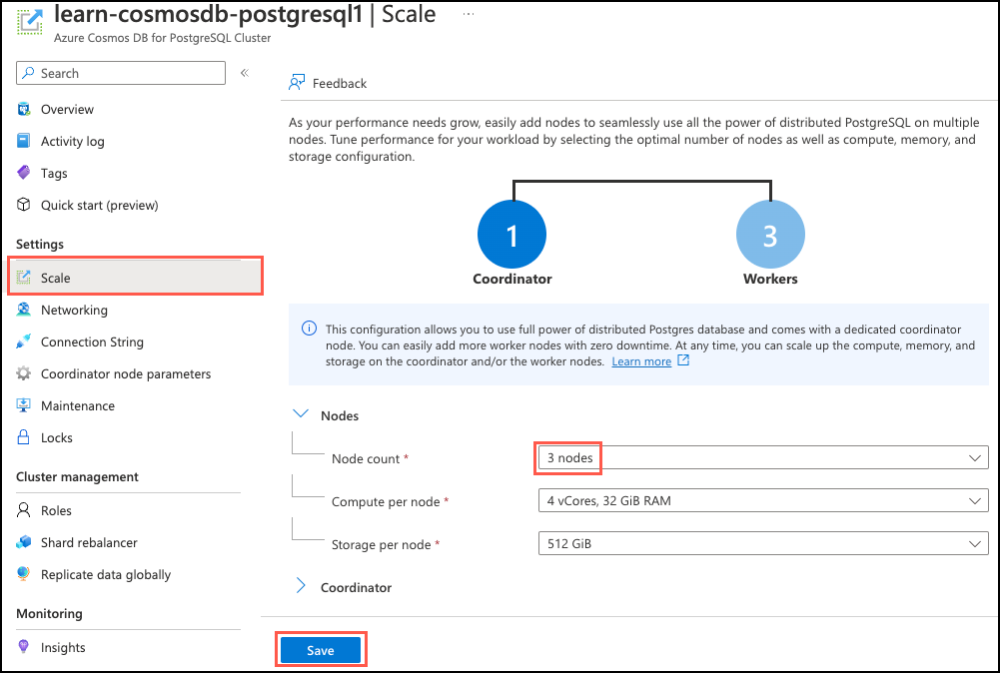
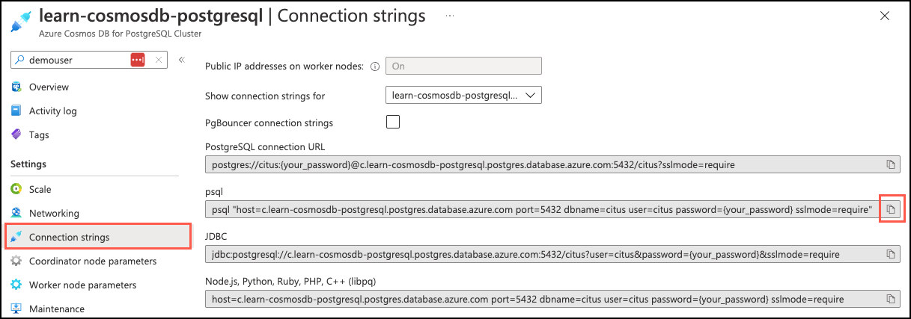
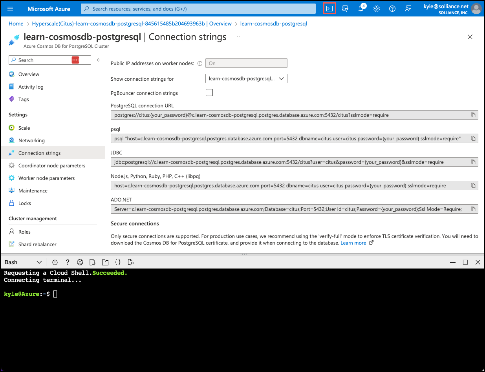

To improve resource allocation and make guarantees of tenant quality of service in the Tailspin Toys multi-tenant SaaS application, you want to isolate the largest stores onto dedicated nodes in the cluster. In this exercise, you'll add a new worker node to your cluster, separate the most prominent tenant's data into dedicated shards, and then move that store to the new worker node.

## Add a new node to the cluster

Now that you have completed migrating Tailspin Toys' database to a multi-node instance, you want to isolate their largest and most active tenant to a dedicated node in the cluster to reduce resource contention. You first want to scale your cluster by adding a new worker node to accomplish this.

1. Open the [Azure portal](https://portal.azure.com/) in a web browser and navigate to your **Azure Cosmos DB for PostgreSQL Cluster** resource.

2. On the **Azure Cosmos DB for PostgreSQL Cluster** page, select **Scale** under **Settings** in the left-hand navigation menu, expand the **Node count** dropdown on the **Scale** blade, and increase the node count **3 nodes**, then select **Save**.

    

    Once your new node has been successfully added, it will be available in the system. However, no tenants are stored on it yet, and no queries will be run there. You'll use built-in functions to relocate Tailspin Toys' most active tenant to the new worker node below.

## Connect to the database using psql in the Azure Cloud Shell

You'll use `psql` from the command line to make your database changes. `psql` is a command line tool that allows you to interactively issue queries to a PostgreSQL database and view the query results.

1. From your Azure Cosmos DB for PostgreSQL resource in the [Azure portal](https://portal.azure.com/), select **Connection strings** under **Settings** from the left-hand navigation menu, and then copy the connection string labeled **psql**.

    

2. Paste the connection string into a text editor, such as Notepad.exe, and replace the `{your_password}` token with the password you assigned to the `citus` user when creating your cluster. Copy the updated connection string for use below.

3. From the **Connection strings** page in the Azure portal, open an Azure Cloud Shell dialog by selecting the Cloud Shell icon on the toolbar in the Azure portal.

    

    The Cloud Shell opens as an embedded panel at the bottom of your browser window. Alternatively, you can open the [Azure Cloud Shell](https://shell.azure.com/) in a different web browser.

4. In the Cloud Shell pane, ensure **Bash** is selected for the environment, then use the `psql` command-line utility to connect to your database. Paste your updated connection string (the one containing your correct password) at the prompt in the Cloud Shell, and then run the command, which should look similar to the following:

    ```bash
    psql "host=c.learn-cosmosdb-postgresql.postgres.database.azure.com port=5432 dbname=citus user=citus password={your_password} sslmode=require"
    ```

## Identify a candidate tenant for isolation

To help reduce resource contention in the database, Tailspin Toys has requested that you identify candidate tenants for isolation. You want to evaluate which tenants consume the most resources and isolate them to a dedicated node in the database.

1. By querying the `citus_stat_statements` view, you can identify the tenant sending in the most queries and consuming the most processing time.

    ```sql
    SELECT partition_key AS store_id, 
        COUNT(*) AS unique_queries, 
        SUM(c.calls) AS total_queries,
        SUM(total_exec_time) AS total_query_time 
    FROM citus_stat_statements AS c
    INNER JOIN pg_stat_statements AS p ON c.queryid = p.queryid
    WHERE partition_key is not null
    GROUP BY store_id
    ORDER BY total_query_time DESC
    LIMIT 1;
    ```

2. You know from the table distribution process that `orders` and `line_items` are the largest tables in the database and receive the most table writes. You can use the total number of orders as a proxy for tenants placing the heaviest load on the database and taking up the most storage space. Run the following query to view the top five tenants based on order volume and annual sales:

    ```sql
    SELECT o.store_id,
        date_part('year', o.ordered_at) AS year,
        COUNT(o.order_id) AS order_volume,
        SUM(line_amount) AS annual_sales
    FROM orders AS o
    INNER JOIN line_items AS l ON o.store_id = l.store_id AND o.order_id = l.order_id
    WHERE  o.ordered_at BETWEEN '2022-10-01' AND '2022-12-30'
    GROUP BY o.store_id, year
    ORDER BY order_volume DESC
    LIMIT 5;
    ```

3. Another approach, which takes advantage of the `citus_shards` view and `get_shard_id_for_distribution_column()` function, is to calculate the percentage of table and shard sizes occupied by each tenant. For example, run the query below against the `orders` table to view the top five stores by space occupied:

    ```sql
    -- Get the percentage of table and shard size per tenant
    WITH order_percentage AS (
        SELECT 
            store_id,
            COUNT(store_id) / SUM(count(*)) OVER() AS pct_of_orders
        FROM orders
        GROUP BY store_id
        ORDER BY pct_of_orders DESC
    )
    SELECT store_id,
        (SELECT get_shard_id_for_distribution_column('orders', store_id)) AS shardid,
        pg_size_pretty(pct_of_orders * citus_table_size('orders')) AS storage_space_used,
        ROUND(pct_of_orders, 4) AS percent_of_table_size,
        ROUND((
            SELECT (pct_of_orders * citus_table_size('orders'))/SUM(shard_size)
            FROM citus_shards
            WHERE shardid = (SELECT get_shard_id_for_distribution_column('orders', store_id))
        ), 4) AS percent_of_shard_size
    FROM order_percentage
    LIMIT 5;
    ```

    Based on the output of this query and the others above, store `5` is the largest and most active tenant in the Tailspin Toys database. Viewing the percentages from the above query, that store makes up 21% of table space and 96% of the shard. Those values make it an ideal candidate for isolation.

## Isolate Tailspin Toys' largest tenant into a new shard

Now that you've identified the tenant storing the most data and sending a high percentage of traffic into the Tailspin Toys database, you want to isolate that tenant into a dedicated shard.

Use the `isolate_tenant_to_new_shard()` function to move the data for the tenant into a dedicated shard. The table has co-located data, so you're also required to use the `CASCADE` option to move co-located table data.

```sql
SELECT isolate_tenant_to_new_shard('orders', 5, 'CASCADE');
```

The output from running `isolate_tenant_to_new_shard()` provides the ID of the new shard into which the tenant was isolated.

```text
    isolate_tenant_to_new_shard 
-----------------------------
                        102145
```

## Move the tenant to a dedicated node in the cluster

To improve resource allocation and better provide guarantees of tenant quality of service in the Tailspin Toys multi-tenant SaaS application, you want to move the largest tenants to dedicated nodes.

1. Before moving a shard to a new node, you must determine what node currently holds that shard. Copy the `shardid` value returned in the previous step, replace the `{INSERT_NEW_SHARD_ID}` token in the query below with the copied value, and then run the query to determine which node holds the new shard.

    ```sql
    SELECT nodename, nodeport
    FROM citus_shards
    WHERE shardid = {INSERT_NEW_SHARD_ID};
    ```

2. When the scaling operation to add your new worker node has been completed successfully, use the following query to retrieve the list of active nodes from the metadata tables:

    ```sql
    SELECT * from citus_get_active_worker_nodes() ORDER BY node_name;
    ```

    The new node should have a name starting with "private-w2." If you don't see it, wait a minute or two and rerun the query.

3. Finally, call the `citus_move_shard_placement()` function to move the shard to the new worker node you created for this tenant. Before executing the query below, you should replace the following tokens:

   - `{INSERT_NEW_SHARD_ID}` with the `shardid` of the new shard
   - `{CURRENT_HOST_NODE_NAME}` with the name of the node where the shard currently resides (retrieved in step 1 above)
   - `{TARGET_HOST_NODE_NAME}` with the name of the node where you want to move the shard (retrieved in step 2 above)

    ```sql
    SELECT citus_move_shard_placement(
      {INSERT_NEW_SHARD_ID},
      '{CURRENT_HOST_NODE_NAME}', 5432,
      '{TARGET_HOST_NODE_NAME}', 5432);
    ```

4. Verify the shard was moved to the desired node by running the following, replacing `{INSERT_NEW_SHARD_ID}` with the `shardid` of the new shard.

    ```sql
    SELECT nodename, nodeport
    FROM citus_shards
    WHERE shardid = {INSERT_NEW_SHARD_ID};
    ```

    The output should show you moved the shard to the target node, similar to the following:

    ```text
                                  nodename                            | nodeport 
    ------------------------------------------------------------------+----------
     private-w2.learn-cosmosdb-postgresql.postgres.database.azure.com |     5432
    ```

5. You can view the shard details on the new node, including the sizes of table data in each shard. Before executing the following query, switch to the extended view by running `\x` at the command prompt.

    ```sql
    SELECT table_name, nodename, COUNT(shardid) AS shard_count , shardid, pg_size_pretty(SUM(shard_size)) AS size
    FROM citus_shards
    WHERE nodename LIKE('private-w2%')
    GROUP BY table_name, nodename, shardid
    ORDER BY table_name DESC;
    ```

    In the query output, note the `shard_count` and `size` values. Your new node contains a single shard for each table, and each of those shards has data for store ID `5` only.

    ```text
    -[ RECORD 1 ]--------------------------------------------------------------------
    table_name  | line_items
    nodename    | private-w2.learn-cosmosdb-postgresql.postgres.database.azure.com
    shard_count | 1
    shardid     | 102148
    size        | 240 MB
    -[ RECORD 2 ]--------------------------------------------------------------------
    table_name  | orders
    nodename    | private-w2.learn-cosmosdb-postgresql.postgres.database.azure.com
    shard_count | 1
    shardid     | 102145
    size        | 122 MB
    -[ RECORD 3 ]--------------------------------------------------------------------
    table_name  | products
    nodename    | private-w2.learn-cosmosdb-postgresql.postgres.database.azure.com
    shard_count | 1
    shardid     | 102142
    size        | 16 kB
    -[ RECORD 4 ]--------------------------------------------------------------------
    table_name  | stores
    nodename    | private-w2.learn-cosmosdb-postgresql.postgres.database.azure.com
    shard_count | 1
    shardid     | 102139
    size        | 8192 bytes
    ```

## Stop scheduled jobs and disconnect from the database

Congratulations! You've successfully isolated the largest tenant onto a dedicated node in Tailspin Toys' multi-tenant SaaS application's Azure Cosmos DB for PostgreSQL database.

1. In the Cloud Shell, disable the task creating orders in the database by using the following command:

    ```sql
    SELECT cron.unschedule('create_orders');
    ```

2. In the Cloud Shell, run the following command to disconnect from your database.

    ```sql
    \q
    ```

## Clean up

It's essential that you clean up any unused resources. You're charged for the configured capacity, not how much the database is used.

1. Open a web browser and navigate to the [Azure portal](https://portal.azure.com/).
2. In the left-hand navigation menu, select **Resource Groups**, and then select the `learn-cosmosdb-postgresql` resource group you created as part of the exercise in Unit 3.
3. In the **Overview** pane, select **Delete resource group**.
4. Enter the name of the resource group you created to confirm and then select **Delete**.
