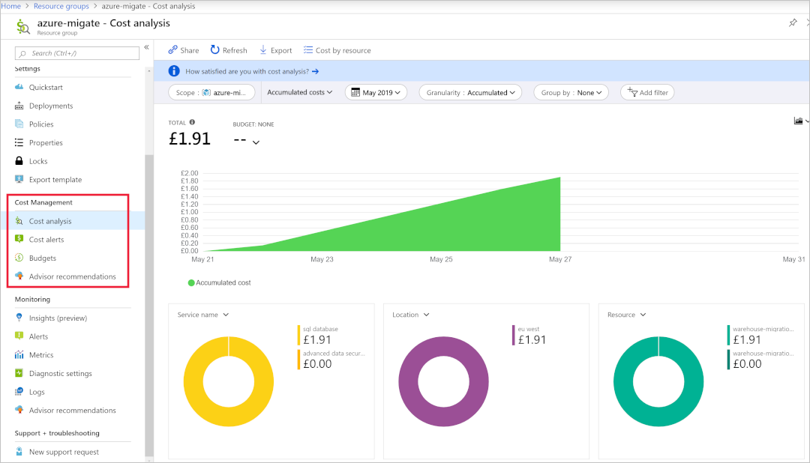

Your first task is to plan your company's migration to Azure. You have a set amount of time to put this plan together before presenting it to the IT Director and other leaders around the business.

In this unit, you'll cover some of the considerations and methods you can use to plan for your migration to Azure. Every situation is different, but by following some principles, you can achieve your goals in the best possible way in the shortest amount of time.

## Plan your migration to Azure

You can help improve the chances of a successful migration by assessing and planning the scope of work, before you begin any migration activity. Implementing the plan will reduce the likelihood of issues arising further down the line. Consider taking a four-phased approach to your company's migration planning.

### Migration scope and planning

Before you do anything, you should decide which servers, applications, and services are in the scope for migration. You may tie the migration work in to a data center consolidation project, and try to use the exercise to remove outdated hardware from your environment. Once you know what the goal is, you can start involving people across the business who will be affected, and have an interest in the work.

Work with your business areas to decide how to migrate these workloads, using the identified scope of what will be migrated:

**Rehost**: Simple recreate your existing infrastructure in Azure, choosing this approach will have the least impact as it needs minimal changes

**Refactor**: Take the opportunity to take advantage of Azure as a PaaS, reducing the time to release software, and reduce the ongoing maintenance costs. Small enhancements to run more efficiently in the cloud can have large impacts on performance

**Rearchitect**: You may be forced to rearchitect some systems to enable them to be migrated. Other apps could be changed to become cloud native, or take advantage of new approaches to software like containerization

**Rebuild**: You may need to rebuild software if the cost to rearchitect is more than starting again from scratch

**Replace**: While you're reviewing your estate, there are chances that third-party applications could completely replace your companies bespoke apps.

### Involve key stakeholders

In any modern business, the IT estate/services will be consumed by everyone in some way or another,  a prime example being line-of-business applications. Applications are used by specific sections of the business and include application owners and superusers, who have a wealth of experience to call on. Involving these people in the planning stage will help, as they can offer guidance in areas where the knowledge of the person running the project may have gaps. Often each area of the business will appoint business owners to manage specific sections.

### Discovery and evaluation

Now you can produce a full inventory and dependency map to determine how in scope servers and services communicate. A modern business could have hundreds of applications spread across the estate. Each application needs to be fully investigated before any work takes place.

Azure Migrate helps in this scenario, once run, it produces useful information about the underlying servers and their  profile information. You can garner information, such as compute usage and performance metrics, which you then use to feed in to your overall plan.

Once you have a full picture of the environment in scope for migration, an evaluation can be formed about best way to approach each stage. Run through the migration process end to end with a simple server or application first. Completing a migration on a small scale will give you an idea of the possible issues. You can then use the gained experience to preempt issues before moving on to more complex servers and applications.

### Estimate cost savings

Part of the business's plan to migrate to Azure could be to reduce costs, as moving to the cloud offers cost savings over running your own on-premises estate. Once the initial scoping exercise has been completed, use the Azure Total Cost of Ownership (TCO) Calculator to estimate the real work costs to support the project and the company's longer term financial goals.

### Identify tools

Microsoft provides lots of tools to help you plan and complete the four phases of migration. In some migrations, you may only need to use one or two of the tools. 

| Tool | Phase | Use |
|------|-------|-------|
|[Azure Migrate](https://docs.microsoft.com/azure/migrate/migrate-overview)                   | Assess   | If you're using VMWare vCenter Server (version greater than 5.5) running Windows or Linux on the VMs
|[Service Map](https://docs.microsoft.com/azure/azure-monitor/insights/service-map)           | Assess   | Maps communication between application components on Windows or Linux. Helps you identify dependencies when scoping what to migrate
|[Azure TCO Calculator](https://azure.microsoft.com/pricing/tco/calculator)                   | Assess   | Estimate your monthly running costs in Azure
|[Azure Site Recovery](https://docs.microsoft.com/azure/site-recovery/site-recovery-overview) | Migrate  | Move VMs from on-premise to Azure
|[Azure Database Migration Service](https://docs.microsoft.com/azure/dms/dms-overview)        | Migrate  | Uses the Data Migration Assistant and the Azure portal to manage the whole process of moving database workloads to Azure
|[Azure Data Box](https://docs.microsoft.com/azure/databox-family/)                           | Migrate  | Efficiently move large datasets either offline or online data to Azure (over the network or by shipping physical disks to an Azure datacenter)
|[Data Migration Assistant](https://docs.microsoft.com/sql/dma/dma-overview)                  | Migrate  | Assess SQL databases for compatibility, then used to perform the migration of schema and data
|[Data Migration Tool](https://docs.microsoft.com/azure/cosmos-db/import-data)                | Migrate  | Migrate existing databases to Azure Cosmos DB
|[Azure Cost Management](https://docs.microsoft.com/azure/cost-management/)                   | Optimize | Monitor, control, and optimize ongoing Azure costs
|[Azure Monitor](https://docs.microsoft.com/azure/azure-monitor/)                             | Monitor  | Monitor your entire estates performance, including app health via enhanced telemetry, and set up notifications
|[Azure Backup](https://docs.microsoft.com/azure/backup/)                                     | Monitor  | Backup all your VMs and SQL databases

### Deploy target cloud infrastructure

The scope for your migration has been defined as your company's current VMware machines and existing relational databases. In this scenario, you don't need to pre-create the resources in Azure. The two tools you'll use to do the migration **Azure Site Recovery** and the **Azure Database Migration Service** will create the required Azure resources for you.

In other situations, you may need to set up resources in Azure to have them available to be migrated to.

### Move on-premises workloads

Each tool will guide you through the migration, and the steps to complete them are covered in future units. At a high level these steps are:

1. Prepare the source (vCenter Server) and target (Azure) environments.
1. Set up and start the replication between the two.
1. Test that the replication has worked.
1. Failover from the source servers to Azure.

For the Database migrations, the high-level steps are:

1. Assess your on-premises databases.
1. Migrate the schemas.
1. Create and run an Azure Database Migration Service project to move the data.
1. Monitor the migration.

### Decommission on-premises infrastructure

Decommission all your on-premise systems once all the required workloads are proven, through testing, to have been successfully migrated to Azure. Your company could make the decision to retain the on-premise infrastructure and use it as a secondary location for disaster recovery.

### Analyze running costs

Using **Azure Cost Management** you can start analyzing your Azure costs at any level your choose. For example, by choosing subscriptions in the portal, you can see a breakdown of all the resources for that subscription. Or you could view a resource group, and again see all the costs associated with all the resources in just the selected group.

### Review opportunities to improve

Azure Cost Management shows you cost reduction advice from Azure Advisor. The advice includes suggestions like reducing the performance of underutilized VMs, making use of additional discounts, or reserving resources instead of paying as-you-go.

### Integrate health and performance monitoring

**Azure Monitor** can capture health and performance information from Azure VMs by installing a Log Analytics agent. The agent can be installed on machines running either Windows or Linux. With the agents installed on your VMs, you can set up alerting and reporting.

You can set up alerts based on a range of data sources, from specific metric values like CPU usage, specific text in log files, health metrics, or an autoscale metric.

### Set up data protection, backup, and disaster recovery

Once everything is up and running, and being monitored, Azure has a good set of tools to protect those workloads. From replicating the infrastructure to handle disaster recovery, to having VMs located around the world to improve performance.
