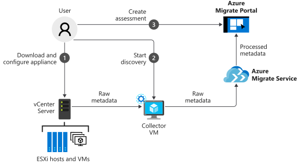

Azure Migrate helps you assess your current on-premises workloads. After the assessment, Azure Migrate makes recommendations for the size of VM you'll need to provision.

In your role, you've been asked to plan the migration of the business's on-premises environment to Azure. Because the server workloads are based primarily on VMware, you want to begin with those machines. You want to assess readiness for the move to Azure. You also want to identify estimated costs for the resources that those machines will consume, so the management team can set the budgets.

In this unit, you'll look at Azure Migrate, a service you use to assess readiness and assist with migration to Azure from an on-premises environment.

## What is Azure Migrate?

Azure Migrate is a free service, provided by Microsoft, that assesses on-premises VMware virtual machines for running in Azure. The service helps with performance-based sizing calculations (virtual machine sizing, compute/storage) for the machines that you'll migrate. so you can estimate the ongoing cost of running these machines in Azure. Finally, the Azure Migrate supports the visualization of dependencies for those machines. It helps you create groups of machines that can be assessed together and ultimately migrated to Azure at the same time. Understanding the dependencies gives you confidence that nothing will be left behind.

Azure Migrate has limitations: currently, it assesses only VMware-based virtual machines. When you use Azure Migrate, the assessments it produces are created within a *project* that is set up in the Azure portal. Each project has a collector appliance that discovers up to 1,500 VMs. You'll need to create additional projects if your company has more than 1,500 VMs or multiple vCenter Server instances. Up to 20 projects are supported per Azure subscription.

## Work with Azure Migrate

Before creating a project, you can group the VMs according to the various types of VM workloads that you have, assessing and potentially migrating them together. For example, you might group all servers that run a common application. After you've defined the groups you need, create your project.

After you create a project, Azure Migrate requires you to complete two steps to produce an assessment:

1. Discover your virtual machines.
1. Create assessments.

### Discover machines

The Azure portal guides you through downloading a collector appliance, which carries out the discovery of VMs in your environment. The collector appliance is available to download to your vCenter Server in the Open Virtualization Appliance (OVA) format. Import and spin up the collector appliance, and then complete its configuration to connect it to the Azure Migrate project.

The collector uses VMware PowerCLI cmdlets to do agentless data collection on your VMware estate. The collector gathers data about VM cores, memory, disk sizes, and network adapters. Where applicable, the collector also gathers performance data like CPU and memory usage, disk IOPS, disk throughput, and network output.

To receive and store the collected data, Azure Migrate requires that you open port 443 between your internal network and Azure for:

- The collector and the Azure Migrate service.
- The collector and the vCenter Server.
- The on-premises VM and Log Analytics workspace.

When the data collection is complete, it's pushed to your Azure Migrate project. On the Azure portal, you can now view all the discovered VMs or download a report to review.

If your company wants details about how the VMs are related to each other (via a visualization of dependencies), you can install agents to collect that data. Azure Migrate will prompt you to install the Microsoft Monitoring Agent and Dependency Agent on each VM. The agents are available for both Windows and Linux.

After these agents are installed and configured, they collect data like fully qualified domain name (FQDN), OS, IP addresses, MAC addresses, running processes, and incoming and outgoing TCP connections.

### Create an assessment

Azure Migrate can now assess your environment's readiness to be migrated to Azure. In the portal, select the **Assessments** section, and then select **Create assessment**. An assessment is created with default settings. You can change these settings later by editing the properties of the assessment.

