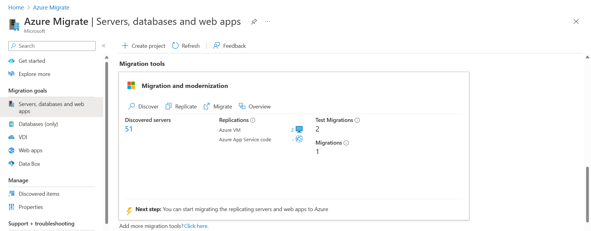
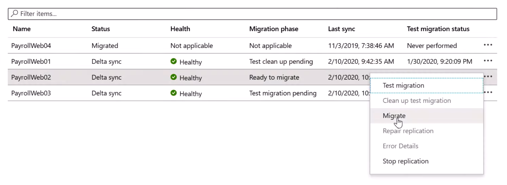

After using Azure Migrate for your assessment, you can decide which of your servers are good candidates to be migrated to Azure. You've presented your findings to the IT Director and now you want to continue with a test migration to assess the end-to-end process. Azure Migrate can also perform an agentless migration of virtual and physical servers into Azure. You've chosen to use Azure Migrate to complete the migration of virtual machines.

In this unit, you'll review Azure Migrate and how to use it to migrate specific workloads to Azure.

## Virtual machine replication
Add Azure Migrate: Server Migration to your Azure Migrate dashboard, which carries over machines and insights from the assessment. You can begin your replication by clicking Replicate in the tool window. Azure Migrate replicates up to 100 VMs simultaneously. If you need to do more, it’s recommended to create multiple batches. Times for replication will vary based on number and size of virtual machines along with connection speeds between your data center and Azure. 

> [!div class="mx-imgBorder"]
> 

## Test migrated virtual machines

Once all your targeted virtual machines are replicated and into Azure, before you migrate them into production, you can test your virtual machines to ensure everything works. 
The process runs a prerequisite check, prepares for the test, creates a new test virtual machine, and starts it. This process will take a few minutes.

## Migrating the virtual machines into production

Once you’re ready for the production migration, select **Migrate** from the replicating machines window. That process will prompt you to shut down the virtual machine to avoid any data loss and perform a final replication. It is recommended to do this during off peak business hours, because the virtual machine will be down for a few minutes.

> [!div class="mx-imgBorder"]
> 

Now it will run through the production migration process and you can check the status as it validates the pre-requisites, prepares for migration, creates the Azure VM and starts the Azure VM.

## Post-migration steps
After the migration has taken place, review the security settings of the virtual machine after the migration. Restrict network access for unused services by using network security groups. Deploy Azure Disk Encryption to secure the disks from data theft and unauthorized access.

Consider improving the resilience of the migrated machines by:
- Adding a backup schedule that uses Azure Backup.
- Replicating the machines to a secondary region using Azure Site Recovery.

Complete clean-up tasks for the remaining on-premises servers. Such tasks may include removing the servers from local backups and removing their raw disk files from storage-area network (SAN) storage to free up space. Update documentation related to the migrated servers to reflect their new IP addresses and locations in Azure.
