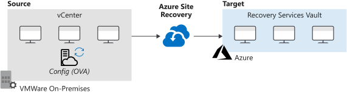

After running Azure Migrate, you can decide which of your servers are good candidates to be migrated to Azure. Azure Site Recovery is a service that can be used for disaster recovery for on-premises and Azure virtual machines, but can also be used to migrate virtual machines into Azure.

You've presented your findings to the IT Director and now you want to continue with a test migration to assess the end-to-end process. You've chosen to use Azure Site Recovery to complete the migration of virtual machines.

In this unit, you'll review Azure Site Recovery and how to use it to migrate specific workloads to Azure.

## What is Azure Site Recovery?

Azure Site Recovery is designed to manage a disaster-recovery plan. It can replicate workloads from a primary site to a secondary site if there's an outage. When an issue occurs at the primary site, the Site Recovery service can be invoked automatically and the protected virtual machines are replicated to a secondary location to continue running. The failover could be an on-premises-to-Azure failover, or a failover from one Azure region to another.

In support of your objective, you'll use the ability of Site Recovery to migrate VMware workloads to Azure. But unlike a failover, which can be reversed, a migration is a one-time operation.

## Preparation and prerequisites

Before you start to use Site Recovery for either a failover or a straight migration, make sure several things are in place so that you can use the service:

- **Account permissions**: Your Azure account must be either be the administrator account or an account with the permissions to do all of the following:
  - Create a VM in the selected resource group
  - Create a VM in the selected virtual network
  - Write to an Azure storage account
  - Write to an Azure managed disk
- **Recovery Services vault**: Create a Recovery Services vault in which to store your virtual machines.
- **Azure network**: The migrated virtual machines will connect to each other by using a virtual network. Routing and firewall rules should be in place so that the virtual network is reachable from your on-premises network.

## Prepare the VMware environment

For your company, you are focused on moving VMware and database workloads to Azure. While the preceding section focused on Azure tasks, this section details tasks to prepare the on-premises VMware estate to ensure connectivity to Azure.

- **Automatic discovery account**: Provide an account with access to VMware servers to discover virtual machines, and orchestrate replication, failover, and failback. This can be a user on the vCenter server or vSphere host with appropriate permissions.
- **Mobility service account**: Install the Mobility service on each virtual machine. You can do either a push installation from the Azure console or a manual installation. If you use the push installation, the account needs permission to install software on each of the virtual machines.
- **Connection after migration**: Enable Remote Desktop Protocol (RDP) on each virtual machine, and configure the Windows Firewall appropriately *before* migration.
- **Set up the configuration server**: The configuration server coordinates communication between the on-premises environment and Azure. Deploy the Open Virtualization Application (OVA) template to a highly available virtual machine in your VMware environment.

## Migrate on-premises VMs to Azure

There are also several settings that must be configured for the task of migrating on-premises virtual machines to Azure:

- **Set a protection goal**: For VMware environments, set the goal to on-premises migration to Azure by using the VMware vSphere Hypervisor.
- **Set up the target environment**: Set the target environment in the Azure portal by selecting the Azure subscription and Resource Manager deployment model you want to use. Select migrating VMware to Azure. Site Recovery will then verify that a valid network exists in Azure, to which the migrated virtual machines will connect.
- **Create a replication policy**: A replication policy contains settings such as a Recovery Point Objective (RPO) threshold. The policy is associated with the configuration server that has been deployed.
- **Enable replication**: Enable the replication at the Recovery Service vault level.
  - **Configure the source**:
    - The source is the configuration server.
    - The machine type is **virtual machines**.
    - The vSphere host is the vCenter Server on-premises.
    - The process server is the configuration server.
  - **Configure the target**: On the target selection:
    - The target is Azure.
    - The subscription is your Azure subscription.
    - The resource group is your target resource group.
    - The network selection is the target network that you want migrated virtual machines to connect to.
    - The subnet is that of the target network.
  - **Select the virtual machines to migrate**.
  - **Configure the properties**: Select the domain account used by the process server to install the Mobility service on the VMware machines. You can cancel the selection for any disks that aren't to be replicated. By default, all the disks used by a virtual machine are migrated.
  - **Select the replication policy**: The replication policy sets the **App-consistent snapshot frequency**, **RPO threshold**, and the **Recovery point retention** period.

## Start the migration

After the steps to configure the source and target environments are complete, the migration can take place.

In the Azure portal, select the recovery point from which the virtual machine should fail over or migrate, and then choose to have the machine shut down before beginning failover. After a period of time, check to ensure that the virtual machine appears in Azure. After it appears, right-click the virtual machine, and then select **Complete Migration**. This action will finish the current migration and tidy up any temporary migration data.

## Post-migration steps

After the migration has taken place, perform clean-up tasks to make sure that the migrated machines and the applications on them work as you expect.

Review the security settings of the virtual machine after the migration. Restrict network access for unused services by using network security groups. Deploy Azure Disk Encryption to secure the disks from data theft and unauthorized access.

Consider improving the resilience of the migrated machines by:

- Adding a backup schedule that uses Azure Backup.
- Replicating the machines to a secondary region.

Complete clean-up tasks for the remaining on-premises servers. Such tasks may include removing the servers from local backups and removing their raw disk files from storage-area network (SAN) storage to free up space. Update documentation related to the migrated servers to reflect their new IP addresses and locations in Azure.
