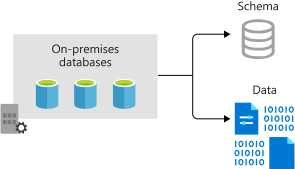

Azure Database Migration Service enables online and offline migrations from multiple database sources to Azure data platforms, all with minimal downtime. The service uses the Microsoft Data Migration Assistant to generate assessment reports. The Database Migration Service then performs the identified tasks.

During the early stages of the migration project, the IT Director requests that the current SQL Server cluster is included. The cluster hosts several line-of-business application databases.

In this unit, you'll see how to use the Data Migration Assistant and Database Migration Service together. They provide a way to move on-premises SQL Server databases efficiently to Azure.

## Offline vs. Online migration

The migration service provides two different ways to migrate SQL Server databases: offline migration or online migration. An offline migration requires shutting down the server at the start of the migration, which means downtime for the service. An online migration uses a continuous synchronization of live data, allowing a cutover to the Azure replica database at any time. The online option is the better of the two if you need to minimize downtime for your workload.

Azure Database Migration Service has two pricing tiers:

- **Standard**: Supports only offline migrations. There's no charge to use this tier.
- **Premium**: Supports both offline and online migrations. There's no charge for the first six months. After that period, you'll incur charges.

### Destinations

You can migrate your relational database to a number of different destinations in Azure:

- **Single Azure SQL Database instance**: A fully managed single SQL database
- **Azure SQL Database managed instance**: 100% compatible with SQL Server Enterprise Edition Database Engine, but missing some minor SQL Server features
- **SQL Server on Azure Virtual Machines**: An infrastructure-as-a-service (IaaS) offering that runs a full version of SQL Server and supports all the features of SQL Server
- **Azure Database for MySQL**: An Azure database service based on the MySQL Community Edition, versions 5.6, 5.7, and 8.0
- **Azure Database for PostgresSQL**: An Azure database service based on the community version of the PostgreSQL database engine
- **Azure Cosmos DB**: A globally distributed, multi-model, fully managed database service

Your company's database needs are simple, so the fastest and cheapest option is to migrate your database workloads to a single Azure SQL Database instance.

## Overview of database migrations

The Data Migration Assistant will guide you through the process of migrating your database. You'll take your existing relational databases, split out the database schemas, and then recreate them in the destination Azure SQL Database instance. With the new schema in place, the data for each database can then be copied to Azure. Finally, you'll check that the new databases are performing as expected.

### Prerequisites

Both offline and online migrations have the same prerequisite tasks:

- **Download the Data Migration Assistant**: Download and install the assistant locally on your on-premises servers running SQL Server.
- **Create an Azure Virtual Network instance**: This virtual network is for Azure Database Migration Service when it uses the Azure Resource Manager deployment model. The virtual network provides connectivity to the on-premises environment.
- **Configure the network security group**: The security group associated with the new virtual network should allow inbound connectivity to the service via ports 443, 53, 9354, 445, and 12000.
- **Configure the Windows Firewall**: You must configure the firewall to allow the Database Migration Service to connect over port 1433. You can also open port 1434 if multiple named instances on dynamic ports exist on the same server.
- **Configure credentials**:
  - Add CONTROL SERVER permissions to the credentials used to connect to the source SQL Server instance.
  - Add CONTROL DATABASE permissions to the credentials used to connect to the target Azure SQL Database instance.
- **Provision your target database in Azure**: Create the database that'll be the target of the migration. Size it appropriately for the migrated workload.

### Assess the on-premises databases

Ensure that all the communication ports are open and check the connectivity between the source and destination servers before the migration tasks begin. Using the Data Migration Assistant, create an **Assessment** project, give the project a name, and select the source and target servers. Provide the connection details for the source server, including credentials with permission to access it. On the database selection screen, choose the database you want to migrate.

The assessment will generate a report on completion, including a set of recommendations and alternative approaches that could be taken for the migration. You'll see any compatibility issues between the source and destination databases that could cause the migration to fail. Address the issues in the report, running it as many times as you need to make sure that the issues have been fixed.

A Data Migration Assistant report looks like this:

:::image type="content" source="../media/5-dma-assessment.png" alt-text="Screenshot of a sample Data Migration Assistant Report." loc-scope="azure-database-migration"::: <!-- no-loc -->

### Migrate the schema using the Data Migration Assistant

Each database has a schema that represents its entire structure. The schema defines the rules for how the data in it is organized and the relationships between data elements. You'll migrate the schema before you migrate all the data in the database. This creates an empty structure on the new Azure SQL database, and that structure matches that of the on-premises source database. Migrating the schema also validates the connectivity before you do the full data migration.

To use the Data Migration Assistant to migrate the schema, create a new **Migration** project. Select your on-premises SQL Server instance as the source server and your Azure SQL Database instance as the target server. Set the scope of the migration to **Schema Only**. After you connect to the source database, choose the schema objects to deploy to the new SQL database. The Data Migration Assistant will create a script to take the required actions. Then, select **Deploy Schema** to run the script. When the script is complete, check the target server to make sure the database has been configured correctly.

:::image type="content" source="../media/5-dma-migrate-schema.png" alt-text="Screenshot of the Data Migration Assistant exporting a schema." loc-scope="azure-database-migration":::

### Migrate your data with Database Migration Service

In the Azure portal, follow these steps to create an instance of Azure Database Migration Service, and then to run it to migrate the data in your databases:

1. Create an instance of Azure Database Migration Service. Choose the pricing tier based on whether you need an online or offline migration.
1. Create a new migration project. Choose the type of migration you want to perform, either offline or online.
1. Specify source and target server details, including the authentication information.
1. Identify the databases. Map the relevant target database on the target server to the source server.
1. Run and monitor the migration.
    1. Select the **Run migration** button to start the migration. The migration activity screen will appear.
    1. Track the progress until the process shows as completed.
1. After all the required databases are migrated, check them to make sure they're working.

When these steps are complete, your schema and data have been migrated to the Azure SQL Database instance. You can then shut down and decommission your on-premises databases and servers.
