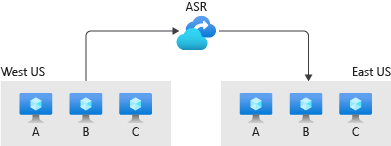
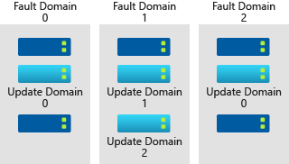
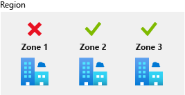

You need to develop a business continuity and disaster recovery (BCDR) plan so you can design an appropriate site recovery solution.

Your organization wants you to design a site recovery strategy for your applications. First, you need to understand the specific requirements involved in building site recovery for your hybrid environment. You need to also understand what tools are available in Azure to help you.

In this unit, you learn how to identify key infrastructures, recovery time objectives, and recovery point objectives. You learn what requirements might be relevant with any Platform-as-a-Service (PaaS) services you might be using. You also learn how to plan for backup and disaster recovery. Finally, you discover some of the Azure features that help you to build a site recovery solution.

### Business continuity and disaster recovery

Business continuity and disaster recovery (BCDR), refers to a process that helps you restore your applications to a functional state after a significant event. This event could be a natural disaster, such as an earthquake, or could be technical in nature, such as the deletion of a database. These events are typically broader in scope, and typically involve greater effort to recover from.

To devise a successful disaster recovery process, you first need to evaluate what kind of business impact any potential failures could have. Consider automating the recovery process as much as possible. Inevitably, some parts of your disaster recovery process involve human input, so you need to fully document the process. You also need to regularly simulate disasters, so your recovery process remains effective.

## Identify key stakeholders and infrastructure

Identify everyone who has a stake in your applications remaining functional. These stakeholders can be external or internal users. Your support staff, and anyone required for manual input in the BCDR process, have a stake in your applications remaining functional. Other applications and services that rely on your applications being functional can also be stakeholders.

Identify the infrastructure that composes the environment for your applications. This infrastructure is typically the virtual machines, network resources, storage resources, and any other services that run alongside them.

## Identify recovery point objectives and recovery time objectives

Recovery point objective (RPO) refers to how much data loss is acceptable for your application if there's a disaster. For example, if your application is down, you might find it's only acceptable for it to run on data that's less than half an hour old after recovery. Some applications can function with older data, but for others it's critical to always run on the freshest data possible.

Recovery time objective (RTO) is the maximum duration of acceptable downtime for your application. For example, you might find it unacceptable for your application to be down for longer than four hours because of the potential loss to the business after this time. Critical applications require a shorter RTO.

Contractual or regulatory requirements can often influence the RPO and RTO for your application. The RPO and RTO may also vary per application. Less critical applications may have larger values for RPO/RTO, while more business critical applications may have a smaller tolerance for downtime and data loss. You calculate RTO and RPO based on your organization's understanding of the risk and the cost incurred through the loss of data and downtime.

## Identify any PaaS requirements

While you may have control over downtime and recovery for the applications you manage, you may not have the same control over PaaS services. Any PaaS services you use may have their own availability guarantees and recovery plans that you need to consider in your BCDR plan.

Identify and inventory the services you depend on, so you can incorporate their recovery capabilities into your BCDR plan. It's important to understand the relevant requirements, so you know how they affect the BCDR process.

## Site Recovery

Azure Site Recovery is a service that provides BCDR features for your applications in Azure, on-premises, and in other cloud providers. Azure Site Recovery has plans that help automate your disaster recovery. It enables you to define how machines are failed over, and the order in which they're restarted after being successfully failed over. In this way, Azure Site Recovery helps to automate tasks and further reduce your recovery time objective. You also use Azure Site Recovery to periodically test failovers, and the overall effectiveness of the recovery process.

## Data backups

Backups protect applications from accidental deletion or corruption of data. Backups play an important role in any BCDR plan. Your recovery point objective depends on how often and how regularly you run backup processes. For example, if you have a backup process configured to execute every two hours, and you experience a disaster five minutes before the next backup, you'll lose 1 hour and 55 minutes of data. Having more frequent backups means you achieve a reduced RPO. In your overall plan, you must include a detailed backup process. 

You can use Azure Backups as your backup process. Azure Backup is a built-in Azure service that provides secure backup for all Azure-managed data assets. It uses zero-infrastructure solutions to enable self-service backups and restores, with at-scale management at a lower and predictable cost. Azure Backup offers specialized backup solutions for Azure and on-premises virtual machines (VMs). Azure Backup also enables workloads like SQL Server or SAP HANA running in Azure VMs to have enterprise-class backup and restore options.

Both Azure Backup and Azure Site Recovery aim to make the system more resilient to faults and failures. However, while the primary goal of Azure Backup is to maintain copies of stateful data that allow you to go back in time. Site-recovery replicates the data in almost real time and allows for a failover. [Learn more about Azure Backup](/training/modules/protect-virtual-machines-with-azure-backup/).

## Azure resilience features

Azure comes with features to help you ensure your applications and infrastructure are resilient.

### Region pairing

All Azure regions are paired with a different region. In a region pair, the regions are never updated simultaneously. Instead, the regions are updated one-by-one. If something happens to one region, another one becomes available.

These region pairs are also used for replication. Storage and many PaaS services are replicated and have failover pairs in the paired region. As part of your BCDR planning, it's important to use region pairing to take advantage of the isolation it provides. You can reduce the amount of time it takes to recover from a failure and increase your availability.

### Availability sets

An Availability Set is a logical grouping capability that you can use in Azure. It ensures that the VM resources you place within it are isolated from each other when they're deployed within an Azure datacenter. Availability sets are made up of *update domains* and *fault domains*.

Update domains ensure that a subset of your application's servers always remain running when the virtual machine hosts in an Azure datacenter require downtime for maintenance. Most updates to virtual machine hosts can be performed without affecting the VMs running on them, but there are occasions when this type of update isn't possible. To ensure that updates don't happen to all VMs simultaneously, the Azure datacenter is logically sectioned into update domains. When a maintenance event, such as a performance update and critical security patch that needs to be applied to the host, the update is sequenced through update domains. The use of sequencing updates using update domains ensures that the whole datacenter isn't unavailable during platform updates and patching.

Fault domains (FDs) represent physical sections of the datacenter and ensure rack diversity of servers in an availability set. FDs align to the physical separation of shared hardware in the datacenter, including power, cooling, and network hardware that supports the physical servers located in server racks. If the hardware that supports a server rack becomes unavailable, the outage only affects that server rack. When you place your VMs in an availability set, they're automatically spread across multiple FDs. So, if a hardware failure occurs only part of your VMs are affected.

### Availability zones

Availability zones are independent physical datacenter locations within a region that include their own power, cooling, and networking. By taking availability zones into account when deploying resources, you can protect workloads from datacenter outages while retaining presence in a particular region. *Zonal services*, are services (like virtual machines) that you can deploy to specific zones within a region. Other services are *zone-redundant services*, and replicate across the availability zones in the specific Azure region. Both types ensure that within an Azure region there are no single points of failure.

