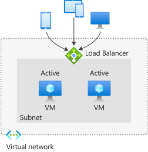
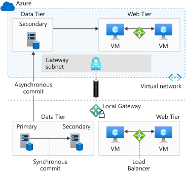

There are various measures you need to take to build resilience into your applications.

Your organization needs you to meet recovery requirements, while ensuring costs and complexity are kept down as much as possible.

In this unit, you'll learn how geo-redundancy and availability clusters can help. You'll see what's involved in failovers and failbacks for your applications. You'll understand why and how you should implement a monitoring and notification strategy.

## Add geo-redundancy for your applications

Your applications run on infrastructure. You need to be able to keep your applications running, regardless of what happens to the infrastructure running your applications. In an ideal scenario, you also want to keep running your applications even if something happens to an entire geographical region where your infrastructure operates. Occasionally, natural disasters and other issues could cause an entire geographical area to be without power or internet access. Respond to these issues gracefully and keep your applications running. Geo-redundancy should be in place, but it can be costly if it is not done right.

<!-- You can use Azure to make your on-premises applications geo-redundant. The benefit of running redundant infrastructure for your applications in Azure is that you don't need to maintain and secure a physical location you're responsible for. Also, you don't have to face any traditionally associated costs. In fact, with Azure you can add redundancy to your applications with regions that might be on the other side of the world and there's no maintenance for you to handle. Maintenance is done for you, which means you achieve geo-redundancy easily and cost effectively.

By using a VPN site-to-site connection, you can extend the on-premises network to a virtual network that's running a replica of your infrastructure in a different region inside Azure. Azure Traffic Manager can be used to monitor the health of your on-premises network. If something happens to the on-premises location, you could then use the replica infrastructure in Azure that's located in an entirely different geographical region. -->

Similarly, you could set up geo-redundancy for your applications running inside Azure. For example, if your applications run on a group of Azure virtual machines in a virtual network, you can replicate the same set-up in another region for geo-redundancy. Through virtual network peering, you connect two separate virtual networks that are treated as one. This process means that traffic for these two networks doesn't go though the public internet or a gateway. Resources can directly connect to other resources as though they were in the same network. In this case, Traffic Manager looks at both regions for you by monitoring the health of each endpoint. If something happens to your primary region, demand is routed to your secondary region.

## Add high availability clusters

High availability clustering helps you ensure your workloads remain available and running with minimal downtime. High availability clustering comes in different forms. You can achieve high availability clustering through active-active architectures, or through active-passive architectures.

An active-active architecture lets you distribute and load balance demand between multiple nodes, such as two identical Azure virtual machines. You can have these Azure virtual machines running together and sharing the demand. You can also distribute demand to these nodes based on different routing methods.

Shown above is a high-level example of an active-active cluster in action.

In contrast, with an active-passive cluster type architecture, you can run Azure virtual machines where one node is active and in use, and the other node is passive and not in use. You use the passive node only when the active node has a failure.

Because each of your nodes is running in an active-active scenario simultaneously, you are going to be facing more running costs on a day-to-day basis in an active-active scenario, if the machines have the same specifications as machines in an active/passive cluster. An active-passive cluster could comparatively help you lower daily running costs because the active node wouldn't be running continuously. However, because you'll only be running the active node in an active-passive cluster, you won't be as flexible to meet fluctuating demand as you would with an active-active cluster.

Resources like Azure availability sets help you to achieve high availability through multiple nodes. If something affects one machine, like hardware failures or network outages, another machine can be available to keep things running. You could also use Azure virtual machine scale sets to create an active-active cluster and run machines that work to scale up and down in direct response to demand. Azure Load Balancer, through its HA ports rules, will also help you to achieve active-active or active-passive clustering for your machines.

## Fail over and fail back your applications

Your organization has infrastructure for its applications running on-premises. You must help ensure that compliance requirements are met and business continuity goals are achieved. By using Azure Site Recovery and Traffic Manager together, you can fail over to Azure, then fail back, to ensure you keep the applications running.

If there's a failure, you can smoothly redirect client traffic to an infrastructure created for you in Azure. Use Traffic Manager to create a Traffic Manager profile and set a priority routing method. Then you create two endpoints, one for your on-premises environment and another for the environment that you want to set up on Azure.

Since you are normally running an on-premises environment and want another one in Azure only to fail over to, you can set priority 1 for the on-premises environment and priority 2 for your environment on Azure. This priority is how Traffic Manager knows how to route the traffic between the two environments. Traffic Manager keeps routing traffic to your on-premises environment until it notices that the endpoint isn't healthy anymore. If that's the case, Traffic Manager will route traffic to your second environment, in Azure. Azure Site Recovery only starts running your virtual machines in Azure if a failover is triggered. If a disaster occurs, you can use Azure Site Recovery to start a failover from the on-premises environment to the Azure environment.

Traffic Manager gives you the ability to set the frequency of probing to monitor your endpoints. You configure Traffic Manager to monitor the health of your endpoints between 30 seconds for regular probes, to 10-second intervals for faster probes.

After a failover is completed, clients are directed transparently to the new endpoint in Azure. When you've addressed the issue that caused the failover, you can use Azure Site Recovery to fail back again to your on-premises environment. Traffic Manager continues to probe for the health of your on-premises endpoint. When Traffic Manager identifies that the endpoint is healthy again, it directs traffic back to your on-premises environment.

<!-- ## Implement a monitoring and notification strategy

It's important to understand that your applications and the associated infrastructure will experience periodic pressures and must respond by changing appropriately. You could be dealing with security patches, updates, and other changes that affect your applications and their infrastructures. You may even need to occasionally change your applications' configurations and structure substantially in response to serious pressures.

You can't predict all the changes. Instead, you monitor for any changes so you can respond appropriately and timely and then learn from them.

First, you should understand the options that are available for monitoring. There are many solutions and tools to help you, including Azure Monitor, Azure Application Insights, and Azure Security Center.

You also need to know how the various tools available can help you. For example, you use Azure Security Center to analyze the security of your whole infrastructure to look for, and respond to, threats. Azure Security Center can notify you of security alerts, and send notifications through email.

Use Application Insights to monitor the health of all of your applications throughout their whole life cycles. Application Insights captures telemetry data from your applications running on-premises or in Azure. You can monitor response times, failure rates, and create your own custom metrics. Application Insights sends alerts on any of your applications by email or, for example, through the alert API. Collect all your telemetry data and store it somewhere for processing to gain insight and learn more.

You use Azure Monitor as a single solution to collect, analyze and take action, based on all the telemetry data collected on your applications and their infrastructures. Azure Monitor hooks into other tools, such as Application Insights, to help you learn and understand applications and their environments. Azure Monitor can also send you alerts or perform an automated process to address the issue that caused an alert. Azure Monitor also allows you to check your resources and will autoscale resources according to your metrics-based rules.

Use these Azure tools together to address monitoring and notifications for your applications. You'll make smarter applications, keep them secure, and rapidly respond to demand when needed. -->

