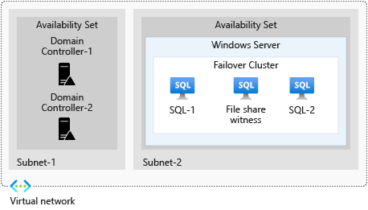

Your organization has multiple workloads spread across environments. All workloads rely on data that's kept safe and timely. You can take various measures to build resilience for your data.

In this unit, you learn how Always On availability groups help replicate your data. You see how automated backups and automatic failover in Azure SQL Database help keep data safe. You also learn how to use the Azure Cosmos DB geo-replication feature to transparently replicate data to other regions and have the data accessible for reading and writing.

## Replicate databases with Always On availability groups

Always On availability groups help you achieve high availability for SQL Server databases running on virtual machines.

You can store specified groups of databases in availability replicas:

- Your primary replica holds primary databases.
- Your secondary replica holds synchronized secondary copies of your primary databases.

If there's a failure, the secondary replica is a failover target. Your primary replica is readable and writeable. Data is synchronized between each primary database and each associated secondary database.

You can also set secondary replicas to be readable. This way, clients can access your data from multiple databases, and increased demand is distributed among multiple replicas.

Always On availability groups run on top of a Windows Server failover cluster that consists of a group of machines working in unison. This architecture gives you high availability for the workloads that run on those machines. With Always On availability groups, each node (machine) in your cluster hosts a replica, whether primary or secondary. Each replica holds a group of databases.

You can configure Always On availability groups in Azure by creating two availability sets: one for Windows Server failover cluster nodes, and another for domain controllers.

The Windows Server failover cluster needs to contain at least three machines. There should be one SQL Server machine for the primary replica and another for the secondary replica in the cluster. A third server should act as a file share witness, or you can use an Azure file share as a witness.

## Failover for Azure SQL Database

You can use SQL Database auto-failover groups to configure the failover and replication of database groups on a SQL Database server. You put together defined policies that can perform failovers based on your needs. If necessary, you can also manually trigger failovers. SQL Database can automatically fail over your databases to a secondary server in a secondary region if a failure occurs.

SQL Database auto-failover secondary databases can be used as readable databases. You can use these secondary databases to service read access to data for any connecting clients and spread usage and demand between primary and secondary databases.

If you're using automatic failover policies, and a failure occurs on at least one database in your primary database group, an automatic failover is triggered to the secondary databases. Your endpoints remain the same during failover. When the problem that caused the failure has been addressed and you're ready, you can fail back to your original location. You can manually fail over your groups to their original location.

Databases in one database server can be included in a single auto-failover group. You can also put all databases in an elastic pool in a single failover group. When primary databases are part of an elastic pool, your secondary databases are also provisioned in an elastic pool. This pool has the same name as the primary elastic pool.

## Automated backup for Azure SQL Database

Azure SQL Database can make backups of your databases that are stored from 7 to 35 days. SQL Database uses geo-redundant storage to store backups and provides read access to your data in a different region. Your databases are safe, even if something happens to a datacenter.

You can extend the retention of backups for up to 10 years by establishing long-term retention policies on single databases or elastic pools. All database backups in SQL Database are encrypted at rest. All SQL databases that you create have transparent data encryption enabled by default.

SQL Database does backups automatically for you in the background. It creates backups of your databases at different intervals, depending on the type of backup. For example, it creates:

- Backups for transaction logs at an interval of 5 to 10 minutes.
- Full backups of your databases every week. The first full backup happens as soon as your database is created. How long SQL Database takes to complete a full backup depends on the size of your database.
- Differential backups for any data that has changed since the last full backup every 12 hours.

SQL Database keeps backups in storage blobs that provide read access. It then copies those backups into a paired datacenter.

Databases can be restored to a backed-up version. If you configured long-term retention, this backup might be available for up to 10 years. You can restore deleted databases back to the time before their deletion and up to the retention limit in your retention policy.

SQL Database can restore databases to a different geographical region. This process is done through geo-restore, which enables the recovery of databases from one region to another if something happens to an entire region.

## Geo-replicate with Azure Cosmos DB

Azure Cosmos DB is a low-latency, multi-model database service that enables you to distribute data globally and to scale elastically and rapidly.

In Azure Cosmos DB, all data is replicated transparently in the regions that you set for your Azure Cosmos DB account. Azure Cosmos DB saves data inside containers that make up your database, and all your containers are partitioned.

All your partitions are replicated across each region. Inside every region, your partitions are copied before each copy is distributed between fault domains.

Your data is replicated at least four times. You can set up an Azure Cosmos DB account and configure your Azure Cosmos DB database to be distributed across five regions. When you configure this database for five regions, Azure Cosmos DB guarantees that you have at least 4 x 5 copies of all your data.

You should configure your Azure Cosmos DB database to span at least two regions. The more regions you have, the more resilient your data becomes. You should also explicitly set your Azure Cosmos DB database to have multiple write regions, so that you can perform read and write operations from all your regions.

You can also configure zone redundancy for some regions. With this feature, Azure Cosmos DB puts replicas of data across multiple availability zones in any single region, for extra resilience.
