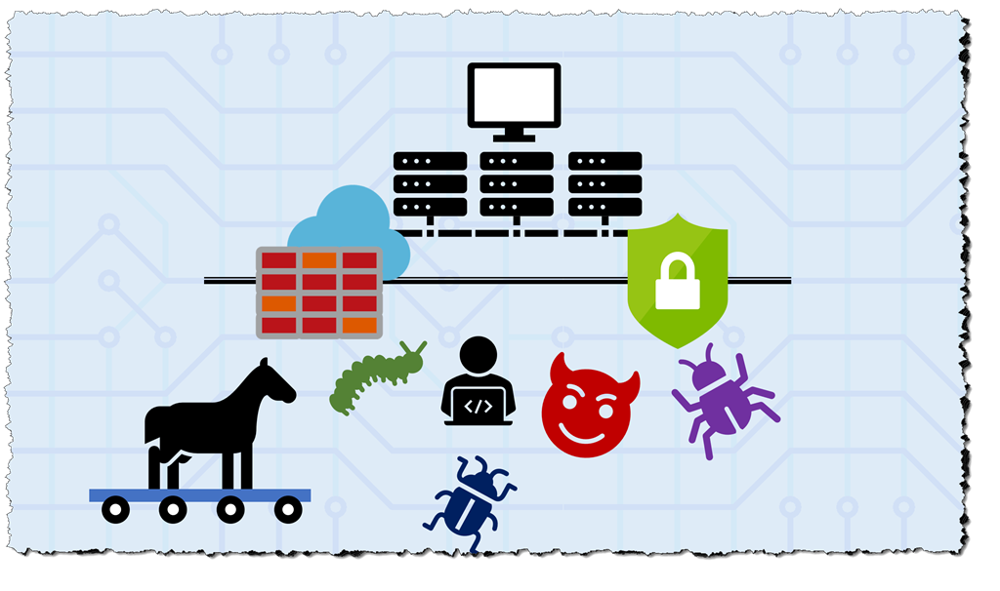

Azure Security Center provides a centralized monitoring dashboard for all your on-premises and cloud-based workloads. As a member of the Security Operations team in your company, you are responsible for helping to craft a security incident response plan and identifying and responding to active threats to your servers and network.

**Security Center** is a primary tool in that response plan and learning how to use all it's features can help you quickly identify real threats from false positives. Security Center helps you find & fix vulnerabilities, aids in blocking malicious access and alerts you when your resources are under attack.

## Learning objectives

In this module, you will:

- View security alerts in Azure Security Center
- Define an incident response plan
- Use a Security playbook to automate a security response

## Prerequisites

- Basic familiarity with Azure Security Center
