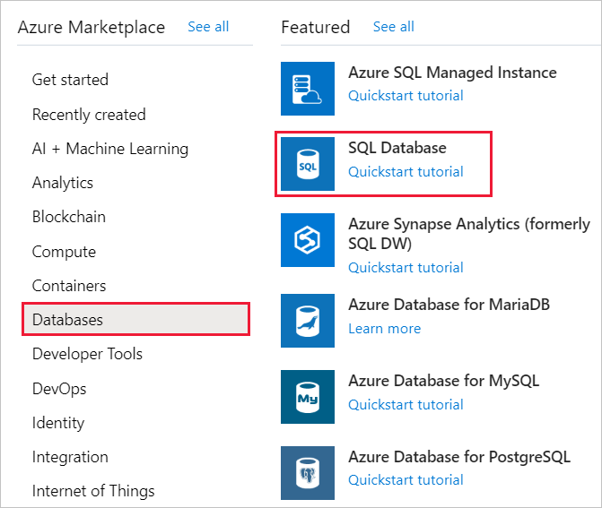
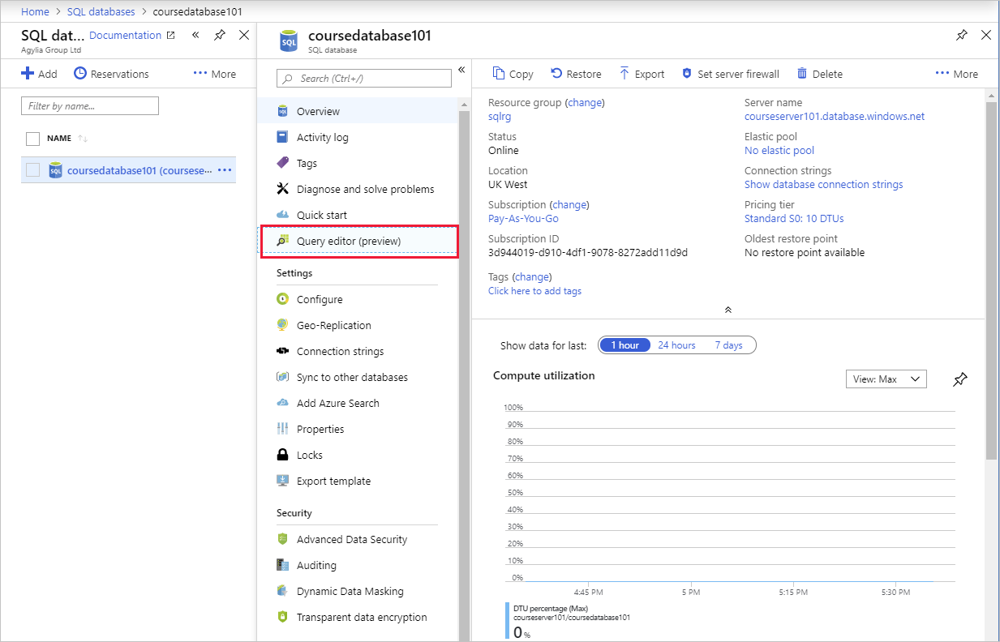
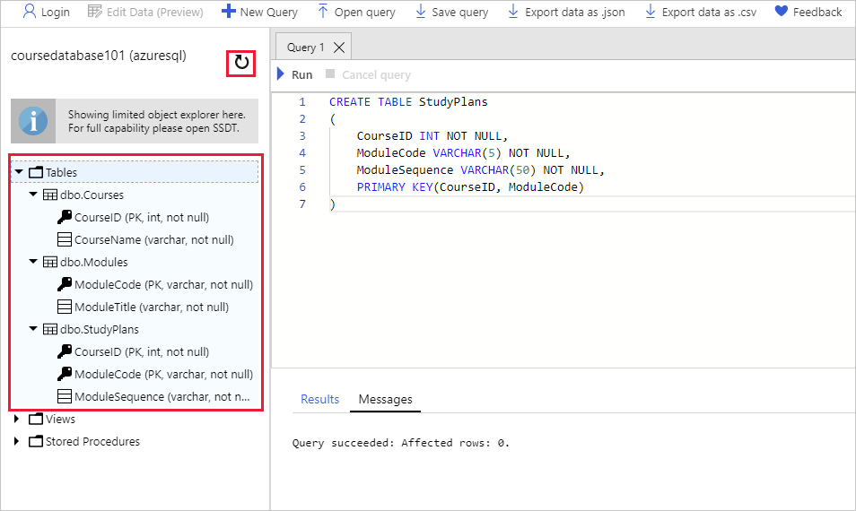
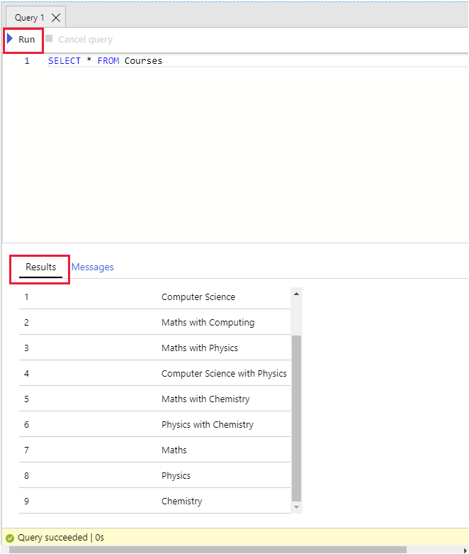

The university currently stores their data in a series of comma-delimited files. You need to migrate this data to Azure SQL Database.

In this exercise, you create a database server and a single database by using the SQL Database service. Next, you create tables and import data into the database. Finally, you use the query editor and the `sqlcmd` utility to query the data.

## Examine the existing comma-delimited data

1. In Azure Cloud Shell, run the following command to download the data files and application code for the university system.

    ```bash
    git clone https://github.com/MicrosoftDocs/mslearn-develop-app-that-queries-azure-sql education
    ```

1. Run the following commands to move the sample data to its own folder and list the files in the folder.

    ```bash
    mv ~/education/data ~/educationdata
    cd ~/educationdata
    ls
    ```

    This folder contains three files: *courses.csv*, *modules.csv*, and *studyplans.csv*.

1. View the contents of the *courses.csv* file.

    ```bash
    cat courses.csv
    ```

    This file contains the following comma-separated data. It includes a course name and ID for each course that the university offers.

    ```text
    ID,Course
    1,Computer Science
    2,Maths with Computing
    3,Maths with Physics
    4,Computer Science with Physics
    5,Maths with Chemistry
    6,Physics with Chemistry
    7,Maths
    8,Physics
    9,Chemistry
    ```

1. View the contents of the *modules.csv* file.

    ```bash
    cat modules.csv
    ```

    This file lists the various modules that students can take to fulfill the requirements of the courses. Each module has an identifying code and a name.

    ```text
    Module Code,Title
    CS101,Introduction to Computer Science
    CS102,Java Programming
    CS103,Distributed Applications
    CS104,Cloud-based systems
    MA101,Foundations of Applied Maths
    MA102,Advanced Calculus
    MA103,Number Theory
    MA104,String Theory
    PH101,Foundations of Physics
    PH102,Basic Experimental Phyics
    PH103,Basic Theoretical Physics
    PH104,Subatomic Physics
    CH101,Elements of Chemistry
    CH102,Basic Inorganic Chemistry
    CH103,Basic Organic Chemistry
    CH104,Chemical Engineering
    ```

1. View the contents of the *studyplans.csv* file.

    ```bash
    cat studyplans.csv
    ```

    This file contains the data that specifies which modules a student must pass to complete a course successfully. The *Sequence* column shows the order in which the student should take each module. For example, for course 1 (Computer Science), the student must take module CS101 before module MA101. Part of the data is shown here.

    ```text
    Course ID,Module Code,Sequence
    1,CS101,1
    1,MA101,2
    1,CS102,3
    1,CS103,4
    1,CS104,5
    2,MA101,1
    2,MA102,2
    2,CS101,3
    2,CS102,4
    2,CS103,5
    3,MA101,1
    3,MA102,2
    3,PH101,3
    3,PH102,4
    3,PH103,5
    ...
    ```

## Create a database server and database by using SQL Database

Let's create the database and server to store the data for the app.

1. Sign in to the [Azure portal](https://portal.azure.com/learn.docs.microsoft.com?azure-portal=true) by using the account that you used to activate the sandbox.

1. From the Azure portal menu, under **Azure services**, select **Create a resource**.

    

    The **Create a resource** pane appears.

1. In the left menu pane, select **Databases**, and under *Popular Azure services*, select **SQL Database**.

    

    The **Create SQL Database** pane appears.

1. On the **Basics** tab, enter the following values for each setting.

    | Setting  | Value  |
    |---|---|
    | **Projects details** |
    | Subscription | Concierge Subscription |
    | Resource Group | <rgn>[Sandbox resource group]</rgn> |
    | **Database details** |
    | Database name | The database must have a unique name. We suggest using something like *coursedatabase<em>NNN</em>*, where *NNN* is a random number. |
    | Server | Select the **Create new** link, and in the **New server** panel, enter the details that are in the following table. |
    | Want to use SQL elastic pool? | No |
    | Compute + storage | General purpose |

    For the server, enter the following values for each setting.

    | Setting  | Value  |
    |---|---|
    | Server name | *courseserver<em>NNN</em>*, where *NNN* is the same number that you selected for the database |
    | Server admin login | *azuresql* |
    | Password | Enter a password that meets the requirements. |
    | Confirm password | Confirm your password. |
    | Location | Central US |

1. Select **OK**.

1. Select **Next : Networking**.

1. On the **Networking** tab, enter the following values for each setting.

    | Setting  | Value  |
    |---|---|
    | **Network connectivity** |
    | Connectivity method | Public endpoint |
    | **Firewall rules** |
    | Allow Azure services and resources to access this server | Yes |
    | Add current client IP address | Yes |

1. Select **Review + create**.

1. Select **Create**. Wait for the server and database to be created before you continue.

## Create the tables

You can now create the tables to store the data from the .csv files.

1. Select **Go to resource**. Your **SQL database** for *coursedatabase<em>NNN</em>* appears.

1. In the left menu pane, select **Query editor (preview)**.

    

    The **Query editor** pane for *coursedatabase<em>NNN</em>* appears.

1. Enter the following values for each setting.

    | Setting  | Value  |
    |---|---|
    | **SQL server authentication** |
    | Login | *azuresql* |
    | Password | Specify the password that you used when you created this user. |

     > [!NOTE]
    > If you get an error signing in to the database, check the IP listed in the error, and make sure it is what was added as the client IP. You can do this by selecting **Overview** > **Set server firewall**.

1. Select **OK** to connect to the database service.

1. In the **Query 1** pane, enter the following Transact-SQL (T-SQL) statement, and then select **Run**. This statement creates a new table to hold the course information. Verify that the statement runs without any errors.

    ```SQL
    CREATE TABLE Courses
    (
        CourseID INT NOT NULL PRIMARY KEY,
        CourseName VARCHAR(50) NOT NULL
    )
    ```

    

1. Overwrite the existing statement with the following statement that creates a table to hold the modules. Select **Run**, and then verify that the statement runs without any errors.

    ```SQL
    CREATE TABLE Modules
    (
        ModuleCode VARCHAR(5) NOT NULL PRIMARY KEY,
        ModuleTitle VARCHAR(50) NOT NULL
    )
    ```

1. Change the statement to create a table named `StudyPlans`, and then select **Run**.

    ```SQL
    CREATE TABLE StudyPlans
    (
        CourseID INT NOT NULL,
        ModuleCode VARCHAR(5) NOT NULL,
        ModuleSequence INT NOT NULL,
        PRIMARY KEY(CourseID, ModuleCode)
    )
    ```

1. In the database window, select the **Refresh** icon on the toolbar. Expand **Tables**, and then expand each table in turn. You should see the three tables (`dbo.Courses`, `dbo.Modules`, and `dbo.StudyPlans`), together with the columns and primary key for each table.

    > [!NOTE]
    > *dbo* stands for *database owner*. It's the default schema in the database. All three tables were created in this schema.

    

## Import the data

1. Return to Cloud Shell, and make sure that you're in the `educationdata` folder.

    ```bash
    cd ~/educationdata
    ```

1. Create the variables that you use in the later steps. Replace `NNN` with the number that you used for your database and server.

    ```bash
    export DATABASE_NAME=coursedatabaseNNN
    export DATABASE_SERVER=courseserverNNN
    export AZURE_USER=azuresql
    export AZURE_PASSWORD=[enter your password]
    ```

1. Run the `bcp` utility to create a format file from the schema of the `dbo.Courses` table in the database. The format file specifies that the data is in character format (`-c`) and separated by commas (`-t,`).

    ```bash
    bcp "[$DATABASE_NAME].[dbo].[courses]" format nul -c -f courses.fmt -t, -S "$DATABASE_SERVER.database.windows.net" -U $AZURE_USER -P $AZURE_PASSWORD
    ```

1. In the code editor, open `courses.fmt`. The format file generated by the previous command.

    ```bash
    code courses.fmt
    ```

    The file should look like this:

    ```text
    14.0
    2
    1       SQLCHAR             0       12      ","    1     CourseID                                     ""
    2       SQLCHAR             0       50      "\n"   2     CourseName                                   SQL_Latin1_General_CP1_CI_AS
    ```

1. Review the file. The data in the first column of the comma-separated file goes into the `CourseID` column of the `dbo.Courses` table. The second field goes into the `CourseName` column. The second column is character-based and has a collation that's associated with it. The fields separator in the file is expected to be a comma. The row terminator (after the second field) should be a newline character. In a real-world scenario, your data might not be organized so neatly. You might have different field separators and fields in a different order from the columns. In that situation, you can edit the format file to change these items on a field-by-field basis. Press <kbd>Ctrl+Q</kbd> to close the editor.

1. Run the following command to import the data in the `courses.csv` file in the format specified by the amended `courses.fmt` file. The `-F 2` flag directs the `bcp` utility to start importing data from line 2 in the data file. The first line contains headers.

    ```bash
    bcp "[$DATABASE_NAME].[dbo].[courses]" in courses.csv -f courses.fmt -S "$DATABASE_SERVER.database.windows.net" -U $AZURE_USER -P $AZURE_PASSWORD -F 2
    ```

    Verify that `bcp` utility imports nine rows and doesn't report any errors.

1. Run the following sequence of operations to import the data for the `dbo.Modules` table from the `modules.csv` file.

    1. Generate a format file.

        ```bash
        bcp "[$DATABASE_NAME].[dbo].[modules]" format nul -c -f modules.fmt -t, -S "$DATABASE_SERVER.database.windows.net" -U $AZURE_USER -P $AZURE_PASSWORD
        ```

    1. Import the data from the `modules.csv` file into the `dbo.Modules` table in the database.

        ```bash
        bcp "[$DATABASE_NAME].[dbo].[modules]" in modules.csv -f modules.fmt -S "$DATABASE_SERVER.database.windows.net" -U $AZURE_USER -P $AZURE_PASSWORD -F 2
        ```

        Verify that this command imports 16 rows.

1. Perform the following sequence of operations to import the data for the `dbo.StudyPlans` table from the `studyplans.csv` file.

    1. Generate a format file.

        ```bash
        bcp "[$DATABASE_NAME].[dbo].[studyplans]" format nul -c -f studyplans.fmt -t, -S "$DATABASE_SERVER.database.windows.net" -U $AZURE_USER -P $AZURE_PASSWORD
        ```

    1. Import the data from the `studyplans.csv` file into the `dbo.StudyPlans` table in the database.

        ```bash
        bcp "[$DATABASE_NAME].[dbo].[studyplans]" in studyplans.csv -f studyplans.fmt -S "$DATABASE_SERVER.database.windows.net" -U $AZURE_USER -P $AZURE_PASSWORD -F 2
        ```

        Verify that this command imports 45 rows.

## Query the data in the database

1. Return to the Azure portal.

1. On the Azure portal menu, select **SQL databases**.

1. On the **SQL databases** pane, select **coursedatabase<em>NNN</em>**. The **coursedatabase<em>NNN</em>** pane appears.

1. In the left menu pane, select **Query editor**. The **Query editor** pane for *coursedatabase<em>NNN</em>* appears.

1. Enter the following values for each setting.

    | Setting  | Value  |
    |---|---|
    | **SQL server authentication** |
    | Login | *azuresql* |
    | Password | Enter the password for this user. |

1. Select **OK** to connect to the database service.

1. In the **Query 1** pane, enter the following T-SQL statement, and then select **Run**.

    ```SQL
    SELECT * FROM dbo.Courses
    ```

    This statement retrieves the data from the `dbo.Courses` table. The results window should display nine rows.

    

1. Change the query as follows, and then select **Run**.

    ```SQL
    SELECT * FROM dbo.Modules
    ```

    This time you should see the modules in the **Results** window. There are 16 rows.

1. Return to Cloud Shell, and run the following command to connect to the database.

    ```bash
    sqlcmd -S "$DATABASE_SERVER.database.windows.net" -d "$DATABASE_NAME" -U $AZURE_USER -P $AZURE_PASSWORD
    ```

1. At the `1>` prompt, run the following T-SQL command to fetch the data from the `dbo.StudyPlans` table.

    ```SQL
    SELECT * FROM StudyPlans;  
    GO
    ```

    This query should return 45 rows.

1. At the `1>` prompt, enter `exit` to close the **sqlcmd** utility.

You created a single database by using SQL Database. Next, you used the query editor in the Azure portal to create tables. You then used the `bcp` utility to upload data from a series of comma-delimited data files. Finally, you ran queries against the tables in the database from the query editor in the Azure portal and from the `sqlcmd` utility in Cloud Shell.
