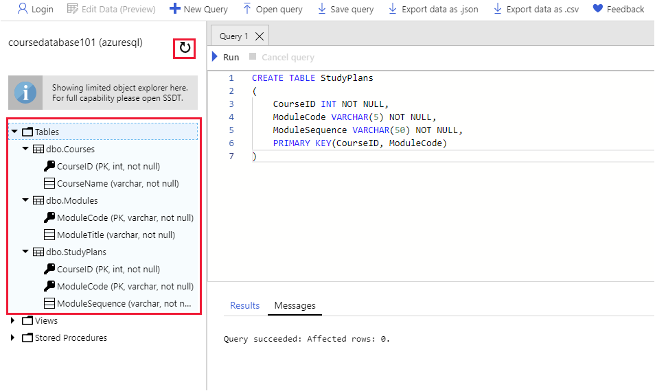

Azure SQL Database runs as a cloud service. The simplest way to create a database is to use the Azure portal. You can import data to a database in many different ways, but if you want to insert a large number of rows quickly, use the bulk copy command, **bcp**. Once you have the data in your tables, you can run some queries. The Azure portal provides the Query Editor for defining queries graphically, or you can use the **sqlcmd** utility from the Cloud Shell if you're familiar with SQL.

The educational institute currently stores their data in a series of comma-delimited files. You must migrate this data to Azure SQL Database.

In this exercise, you'll create an instance of the Azure SQL Database service and a database. Next, you'll create tables and import data into the database. Finally, you'll query the data using the Query Editor and the **sqlcmd** utility.

## Examine the existing comma-delimited data

[!include[](../../../includes/azure-sandbox-activate.md)]

1. In the Cloud Shell window on the right, run the following command to download the data files and application code for the educational institute system:

    <!-- TODO: Replace <location of repository> with the name of the repository containing the sample code in GitHub. The source code is currently supplied in the code folder for this module -->

    ```bash
    git clone http://github.com/<location of repository> education
    ```

2. Move to the **education/data** folder:

    ```bash
    cd ~/education/data
    ```

3. Browse the files in this folder:

    ```bash
    ls
    ```

    This folder contains three files; **courses.csv**, **modules.csv**, and **studyplans.csv**.

4. View the contents of the **courses.csv** file:

    ```bash
    cat courses.csv
    ```

    The file contains the following comma-separated data:

    ```text
    Course,ID
    Computer Science,1
    Maths with Computing,2
    Maths with Physics,3
    Computer Science with Physics,4
    Maths with Chemistry,5
    Physics with Chemistry,6
    Maths,7
    Physics,8
    Chemistry,9
    ```

    The data comprises a course name and an ID for each course the educational institute offers.

5. View the **modules.csv** file:

    ```bash
    cat modules.csv
    ```

    This file lists the various modules that students can take to fulfill the requirements of the courses. Each module has an identifying code and a name:

    ```text
    Module Code,Title
    CS101,Introduction to Computer Science
    CS102,Java Programming
    CS103,Distributed Applications
    CS104,Cloud-based systems
    MA101,Foundations of Applied Maths
    MA102,Advanced Calculus
    MA103,Number Theory
    MA104,String Theory
    PH101,Foundations of Physics
    PH102,Basic Experimental Phyics
    PH103,Basic Theoretical Physics
    PH104,Subatomic Physics
    CH101,Elements of Chemistry
    CH102,Basic Inorganic Chemistry
    CH103,Basic Organic Chemistry
    CH104,Chemical Engineering
    ```

6. View the **studyplans.csv** file:

    ```bash
    cat studyplans.csv
    ```

    This file contains the data that specifies which modules a student must pass to complete a course successfully. The **Sequence** column specifies the order in which the student should take each module. For example, for course 1 (Computer Science) the student should take module CS101 before taking module MA101. Part of the data is shown below:

    ```text
    Course ID,Module Code,Sequence
    1,CS101,1
    1,MA101,2
    1,CS102,3
    1,CS103,4
    1,CS104,5
    2,MA101,1
    2,MA102,2
    2,CS101,3
    2,CS102,4
    2,CS103,5
    3,MA101,1
    3,MA102,2
    3,PH101,3
    3,PH102,4
    3,PH103,5
    ...
    ```

## Create an Azure SQL Database instance and database

1. Sign in to the [Azure portal](https://portal.azure.com/learn.docs.microsoft.com?azure-portal=true) using your MSLearn account.

2. In the left-hand pane, click **+ Create a resource**, select **Databases**, and then click **SQL Database**.

    [!include[](../../../includes/azure-sandbox-regions-first-mention-note-friendly.md)]

    

3. On the **Create SQL Database** page, specify the values in the following table for the properties of the database.

    > [!NOTE]
    > The database must have a unique name. We suggest using something like **coursedatabase*nnn*** where *nnn* is a random number. Use this name wherever you see *\<your-database-name\>* in this exercise.

    | Property  | Value  |
    |---|---|
    | Subscription | Concierge Subscription  |
    | Resource Group | Use the existing resource group |
    | Database name | *\<your-database-name\>* |
    | Server | Click **Create new**, and enter the details shown in the table below |
    | Want to use SQL elastic pool? | No |
    | Compute + storage | Standard S0 |

    For the server, specify the following details in the **New server** pane, and then click **Select**:

    | Property  | Value  |
    |---|---|
    | Server name | courseserver*nnn*  (use the same number that you selected for the database) |
    | Server admin login | azuresql |
    | Password | Pa55w.rd |
    | Confirm password | Pa55w.rd |
    | Location | Accept the default location |
    | Allow Azure services to access server | Selected |

4. Click **Review + create**.

5. Click **Create**, and wait for the server and database to be created before continuing.

## Create the tables

1. In the left-hand pane of the Azure portal, click **SQL databases**

1. On the **SQL databases** page, click ***\<your-database-name\>***

1. On the ***\<your-database-name\>*** page, under **Overview**, click **Query editor**.

    

1. On the ***\<your-database-name\>* - Query editor** page, enter the following details, and then click **OK** to connect to database service:

    | Property  | Value  |
    |---|---|
    | Authorization type | SQL server authentication |
    | Login | azuresql |
    | Password | Pa55w.rd |

1. In the **Query 1** pane, enter the following SQL statement, and then click **Run**. This statement creates a new table for holding course information. Verify that the statement runs without any errors:

    ```SQL
    CREATE TABLE Courses
    (
        CourseID INT NOT NULL PRIMARY KEY,
        CourseName VARCHAR(50) NOT NULL
    )
    ```

    

1. Overwrite the existing statement with the following statement that creates a table for holding modules. Click **Run** and verify that the statement runs without any errors.

    ```SQL
    CREATE TABLE Modules
    (
        ModuleCode VARCHAR(5) NOT NULL PRIMARY KEY,
        ModuleTitle VARCHAR(50) NOT NULL
    )
    ```

1. Change the statement to create another table named **StudyPlans**, and then click **Run**.

    ```SQL
    CREATE TABLE StudyPlans
    (
        CourseID INT NOT NULL,
        ModuleCode VARCHAR(5) NOT NULL,
        ModuleSequence VARCHAR(50) NOT NULL,
        PRIMARY KEY(CourseID, ModuleCode)
    )
    ```

1. In the database window, click the **Refresh** button in the toolbar. Then expand **Tables**, and expand each table in turn. You should see the three tables, **dbo.Courses**, **dbo.Modules**, and **dbo.StudyPlans**, together with the columns and primary key for each table.

    > [NOTE!]
    > *dbo* stands for *database owner*, and is the default schema in the database. All three tables were created in this schema.

    

## Import the data

1. Return to the Cloud Shell window and make sure you are in the **education/data** folder:

    ```bash
    cd ~/education/data
    ```

1. Run the **bcp** utility to create a format file from the schema of the **courses** table in the database. The format file specifies that the data will be in character format (-c), and separated by commas (-t,). Replace \<*nnn\>* with the number that you used for your database and server.

    ```bash
    bcp coursedatabase<nnn>.dbo.courses format nul -c -f courses.fmt -t, -S courseserver<nnn>.database.windows.net -U azuresql -P Pa55w.rd
    ```

1. Open the format file, **courses.fmt** that was generated by the previous command, with the Code editor:

    ```bash
    code courses.fmt
    ```

    The file should look like this:

    ```text
    14.0
    2
    1       SQLCHAR             0       12      ","    1     CourseID                                     ""
    2       SQLCHAR             0       50      "\n"   2     CourseName                                   SQL_Latin1_General_CP1_CI_AS
    ```

1. The ID and name fields in the **courses.csv** data file are in a different order to the columns in the table. Change the field numbers in the **courses.fmt** file so that the data will be imported into the correct columns. Additionally, change the field separator for the **CourseName** field to **\r\n**. The data file is a DOS format text file:

    ```text
    14.0
    2
    1       SQLCHAR             0       12      ","      2     CourseID                                     ""
    2       SQLCHAR             0       50      "\r\n"   1     CourseName                                   SQL_Latin1_General_CP1_CI_AS
    ```

1. Save the file, and then close the editor.

1. Run the following command to import the data in the **courses.csv** file using format specified in the amended **courses.fmt** file. The **-F 2** flag causes the bcp to start importing data from line 2 in the data file; the first line contains headers.

    ```bash
    bcp coursedatabase<nnn>.dbo.courses in courses.csv -f courses.fmt -S courseserver<nnn>.database.windows.net -U azuresql -P Pa55w.rd -F 2
    ```

    Verify that bcp imports nine rows, and doesn't report any errors.

1. Perform the following sequence of operations to import the data for the **dbo.Modules** table from the **modules.csv** file:

    1. Generate a format file:

        ```bash
        bcp coursedatabase<nnn>.dbo.modules format nul -c -f modules.fmt -t, -S courseserver<nnn>.database.windows.net -U azuresql -P Pa55w.rd
        ```

    1. Open the **modules.fmt** file in the code editor, and change the field separator for the **ModuleTitle** field to "\r\n". This time you don't need to change the field order as the columns in the **Modules** table are in the same order as the fields in the **modules.csv** file:

        ```text
        14.0
        2
        1       SQLCHAR             0       5       ","      1     ModuleCode                                       SQL_Latin1_General_CP1_CI_AS
        2       SQLCHAR             0       50      "\r\n"   2     ModuleTitle                                      SQL_Latin1_General_CP1_CI_AS
        ```

    1. Import the data from the **modules.csv** file into the **Modules** table in the database:

        ```bash
        bcp coursedatabase<nnn>.dbo.modules in modules.csv -f modules.fmt -S courseserver<nnn>.database.windows.net -U azuresql -P Pa55w.rd -F 2
        ```

        Verify that this command imports 16 rows.

1. Perform the following sequence of operations to import the data for the **dbo.StudyPlans** table from the **studyplans.csv** file:

    1. Generate a format file:

        ```bash
        bcp coursedatabase<nnn>.dbo.studyplans format nul -c -f studyplans.fmt -t, -S courseserver<nnn>.database.windows.net -U azuresql -P Pa55w.rd
        ```

    1. Open the **studyplans.fmt** file in the code editor, and change the field separator for the **ModuleSequence** field to "\r\n":

        ```text
        14.0
        3
        1       SQLCHAR             0       12      ","      1     CourseID                                                     ""
        2       SQLCHAR             0       5       ","      2     ModuleCode                                                   SQL_Latin1_General_CP1_CI_AS
        3       SQLCHAR             0       50      "\r\n"   3     ModuleSequence                                               SQL_Latin1_General_CP1_CI_AS
        ```

    1. Import the data from the **studyplans.csv** file into the **StudyPlans** table in the database:

        ```bash
        bcp coursedatabase<nnn>.dbo.studyplans in studyplans.csv -f studyplans.fmt -S courseserver<nnn>.database.windows.net -U azuresql -P Pa55w.rd -F 2
        ```

        Verify that this command imports 45 rows.

## Query the data in the database

1. Return to the Azure portal.

1. In the left-hand pane of the Azure portal, click **SQL databases**

1. On the **SQL databases** page, click ***\<your-database-name\>***

1. On the ***\<your-database-name\>*** page, under **Overview**, click **Query editor**.

1. On the ***\<your-database-name\>* - Query editor** page, enter the following details, and then click **OK** to connect to database service:

    | Property  | Value  |
    |---|---|
    | Authorization type | SQL server authentication |
    | Login | azuresql |
    | Password | Pa55w.rd |

1. In the **Query 1** pane, enter the following SQL statement, and then click **Run**:

    ```SQL
    SELECT  * FROM dbo.Courses
    ```

    This statement retrieves the data from the **Courses** table. The results window should display nine rows.

    

1. Change the query as follows, and then click **Run**:

    ```SQL
    SELECT * FROM dbo.Modules
    ```

    This time you should see the modules in the **Results** window; there are 16 rows.

1. Switch back to the Cloud Shell, and run the following command to connect to the database:

    ```bash
    sqlcmd -S courseserver<nnn>.database.windows.net -d coursedatabase<nnn> -U azuresql -P Pa55w.rd
    ```

1. At the **1>** prompt, enter the following SQL command to fetch the data in the **StudyPlans** table:

    ```SQL
    SELECT * FROM StudyPlans;  
    GO
    ```

    This query should return 45 rows.

1. At the **1>** prompt, type `exit` to close the **sqlcmd** utility.

You have now created a database using Azure SQL Database. You created tables by using the Query Editor in the Azure portal. You used the **bcp** utility to upload data from a series of comma-delimited data files. Finally, you ran queries against the tables in the database from the Query Editor in the Azure portal, and from the **sqlcmd** utility in the Cloud Shell.
