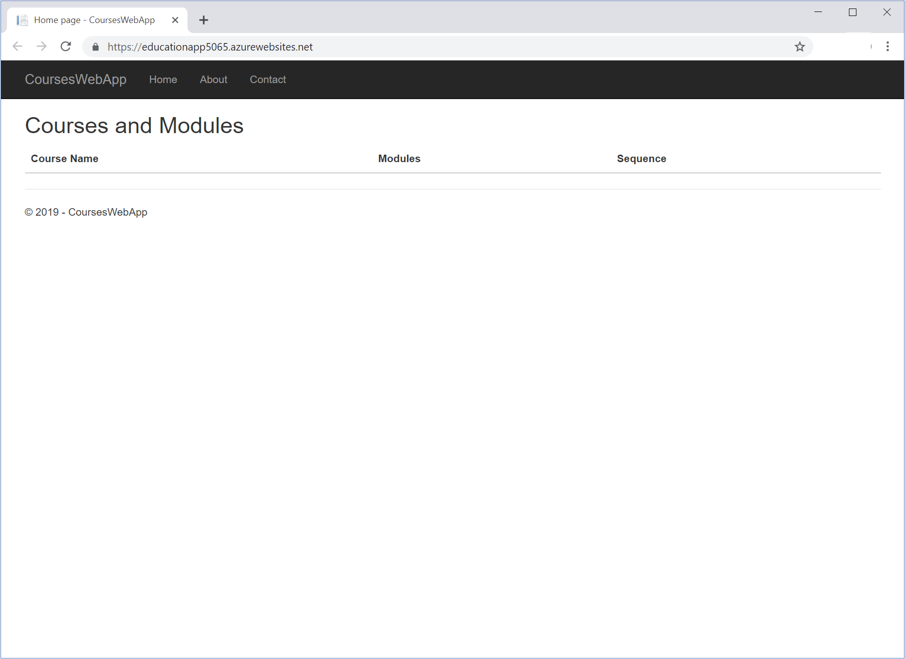
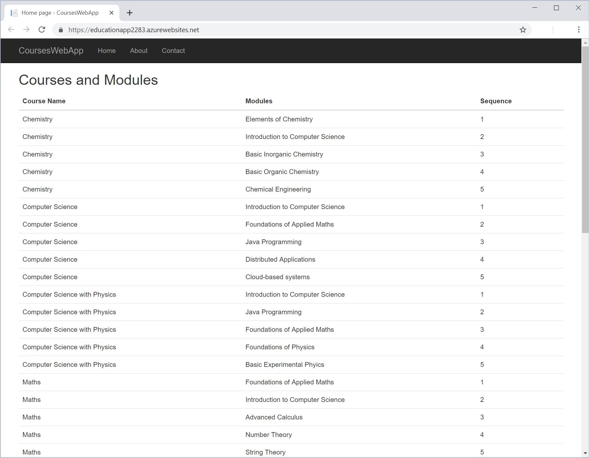

With your database created, you'll now configure and deploy a web application that the academic advisors for the educational institution can use to discuss courses and plans of study with students. The application will use the `System.Data.SqlClient` library to retrieve and display the details of courses, and the modules that a student must pass to complete a course.

To save time, you'll work with a pre-existing web application. You'll add the code that connects this application to your database. The following diagram shows the primary components of this application:


You'll perform the following tasks:

- Create a class that holds the course name, module title, and sequence for each module in the database.
- Create a data access controller class that retrieves the information from the database.
- Edit the code behind the index page in the web application, to create a data access controller object and fetch the data.
- Edit the index page to display the data.

## Deploy and run the pre-existing web application

1. Change your working directory to the **education** folder.

    ```bash
    cd ~/education
    ```

1. Run the following commands to build and deploy the initial web app.

    ```bash
    WEBAPPNAME=educationapp-$RANDOM
    az webapp up \
        --resource-group <rgn>[Sandbox resource group]</rgn> \
        --sku B1 \
        --name $WEBAPPNAME
    ```

1. When the web application has been deployed, the output will show an **App_url** with the URL of the web site. Open this site in a new tab.

    

    You'd like to have the web application display a list of courses and the modules that make up this course. Currently, the application doesn't retrieve or display this data, so you'll need to update the code to get this data from the database and display it to the user.

## Add code to the web application to retrieve data

Now let's add the code to the application that will retrieve the course data from the database.

1. In the Cloud Shell, go to the **education/Models** folder.

    ```bash
    cd ~/education/Models
    ```

    This folder contains two files, **CoursesAndModules.cs** and **DataAccessController.cs**.

1. Open the **CoursesAndModules.cs** file using the **Code** editor.

    ```bash
    code CoursesAndModules.cs
    ```

    This file contains an empty class named `CoursesAndModules`.

    ```C#
    namespace CoursesWebApp.Models
    {
        public class CoursesAndModules
        {
            // TODO: Define the CourseName, ModuleTitle, and Sequence read-only properties

            // TODO: Create a constructor that initializes the fields behind the properties
        }
    }
    ```

1. Replace the comment `// TODO: Define the CourseName, ModuleTitle, and Sequence read-only properties` with the following code.

    ```C#
    public string CourseName { get; }
    public string ModuleTitle { get; }
    public int Sequence { get; }
    ```

    This code defines a set of read-only fields that will contain the data for each row displayed by the web application.

1. Replace the comment `// TODO: Create a constructor that initializes the fields behind the properties` with the following constructor.

    ```C#
    public CoursesAndModules(string courseName, string moduleTitle, int sequence)
    {
        this.CourseName = courseName;
        this.ModuleTitle = moduleTitle;
        this.Sequence = sequence;
    }
    ```

    This constructor populates the fields with the data to be displayed. The complete file should contain the following code.

    ```C#
    namespace CoursesWebApp.Models
    {
        public class CoursesAndModules
        {
            public string CourseName { get; }
            public string ModuleTitle { get; }
            public int Sequence { get; }

            public CoursesAndModules(string courseName, string moduleTitle, int sequence)
            {
                this.CourseName = courseName;
                this.ModuleTitle = moduleTitle;
                this.Sequence = sequence;
            }
        }
    }
    ```

1. Save the file, and close the **Code** editor.

1. Open the **DataAccessController.cs** file using the **Code** editor.

    ```bash
    code DataAccessController.cs
    ```

    This file contains a class named `DataAccessController`. This class will contain the data access logic for connecting to the database and retrieving the course and module data. It will populate a list of `CoursesAndModules` objects with this data.

    ```C#
    using Microsoft.Extensions.Options;
    using System;
    using System.Collections.Generic;
    using System.Data;
    using System.Data.SqlClient;
    using System.Linq;
    using System.Threading.Tasks;

    namespace CoursesWebApp.Models
    {
        public class DataAccessController
        {
            // TODO: Add your connection string in the following statements
            private string connectionString = "<Azure SQL Database Connection String>";

            // Retrieve all details of courses and their modules
            public IEnumerable<CoursesAndModules> GetAllCoursesAndModules()
            {
                List<CoursesAndModules> courseList = new List<CoursesAndModules>();

                // TODO: Connect to the database
                //using ()
                {
                    // TODO: Specify the SQL query to run

                    // TODO: Execute the query

                    // TODO: Read the data a row at a time

                    // TODO: Close the database connection
                }
                return courseList;
            }
        }
    }
    ```

1. Leave the **Code** editor open, and switch to the Azure portal. In the left-hand pane, click **SQL databases**, and select your database.

1. Under **Settings**, click **Connection strings**. Copy the ADO.NET connection string to the clipboard.

    

1. Return to the code editor, and replace the value of the connectionString variable with the value from the clipboard. In the connection string, replace the text `{your_username}` with the value `azuresql`, and replace the text `{your_password}` with the password for this account.

    ```C#
    private string connectionString = "Server=tcp:courseservernnn.database.windows.net,1433;Initial Catalog=coursedatabasennn;Persist Security Info=False;User ID=azuresql;Password=<password>;MultipleActiveResultSets=False;Encrypt=True;TrustServerCertificate=False;Connection Timeout=30;";
    ```

1. After the comment `//TODO: Connect to the database`, replace the commented out `using` statement with the following code.

    ```C#
    using (SqlConnection con = new SqlConnection(connectionString))
    ```

    This code creates a new `SqlConnection` object that connects to the database using your connection string.

1. Replace the comment `// TODO: Specify the SQL query to run` with the following statements.

    ```C#
    SqlCommand cmd = new SqlCommand(
        @"SELECT c.CourseName, m.ModuleTitle, s.ModuleSequence
        FROM dbo.Courses c JOIN dbo.StudyPlans s
        ON c.CourseID = s.CourseID
        JOIN dbo.Modules m
        ON m.ModuleCode = s.ModuleCode
        ORDER BY c.CourseName, s.ModuleSequence", con);
    cmd.CommandType = CommandType.Text;
    ```

    The `SqlCommand` object contains an SQL statement that retrieves the data for all courses and modules, joining them using the information in the **StudyPlan** table.

1. Replace the comment `// TODO: Execute the query` with the following code.

    ```C#
    con.Open();
    SqlDataReader rdr = cmd.ExecuteReader();
    ```

    These statements open the connection to the database and run the SQL statement. You can use the `SqlDataReader` object to fetch the results a row at a time.

1. Replace the comment `// TODO: Read the data a row at a time` with the following block of code.

    ```C#
    while (rdr.Read())
    {
        string courseName = rdr["CourseName"].ToString();
        string moduleTitle = rdr["ModuleTitle"].ToString();
        int moduleSequence = Convert.ToInt32(rdr["ModuleSequence"]);
        CoursesAndModules course = new CoursesAndModules(courseName, moduleTitle, moduleSequence);
        courseList.Add(course);
    }
    ```

    This block iterates through the rows returned in the `SqlDataReader` object. The code extracts the data in the fields in each row and uses them to populate a new `CoursesAndModules` object. This object is then added to a list.

1. Replace the comment `// TODO: Close the database connection` with the following statement.

    ```C#
    con.Close();
    ```

    This statement closes the connection to the database and releases and resources held.

1. The completed class should contain the following code, with the connection string for your database.

    ```C#
    using Microsoft.Extensions.Options;
    using System;
    using System.Collections.Generic;
    using System.Data;
    using System.Data.SqlClient;
    using System.Linq;
    using System.Threading.Tasks;

    namespace CoursesWebApp.Models
    {
        public class DataAccessController
        {
            // Add your connection string in the following statements
            private string connectionString = "Server=tcp:courseserver101.database.windows.net,1433;Initial Catalog=coursedatabase101;Persist Security Info=False;User ID=azuresql;Password=<password>;MultipleActiveResultSets=False;Encrypt=True;TrustServerCertificate=False;Connection Timeout=30;";

            // Retrieve all details of courses and their modules    
            public IEnumerable<CoursesAndModules> GetAllCoursesAndModules()
            {
                List<CoursesAndModules> courseList = new List<CoursesAndModules>();

                // Connect to the database
                using (SqlConnection con = new SqlConnection(connectionString))
                {
                    // Specify the SQL query to run
                    SqlCommand cmd = new SqlCommand(
                        @"SELECT c.CourseName, m.ModuleTitle, s.ModuleSequence
                        FROM dbo.Courses c JOIN dbo.StudyPlans s
                        ON c.CourseID = s.CourseID
                        JOIN dbo.Modules m
                        ON m.ModuleCode = s.ModuleCode
                        ORDER BY c.CourseName, s.ModuleSequence", con);
                    cmd.CommandType = CommandType.Text;

                    // Execute the query
                    con.Open();
                    SqlDataReader rdr = cmd.ExecuteReader();

                    // Read the data a row at a time
                    while (rdr.Read())
                    {
                        string courseName = rdr["CourseName"].ToString();
                        string moduleTitle = rdr["ModuleTitle"].ToString();
                        int moduleSequence = Convert.ToInt32(rdr["ModuleSequence"]);
                        CoursesAndModules course = new CoursesAndModules(courseName, moduleTitle, moduleSequence);
                        courseList.Add(course);
                    }

                    // Close the database connection
                    con.Close();
                }
                return courseList;
            }
        }
    }
    ```

    Save the file, and close the **Code** editor.

## Add code to the web application to display the data

The application can now retrieve the data, now let's update the application to display the course data to the user.

1. In the Cloud Shell, move to the **education/Pages** folder.

    ```bash
    cd ~/education/Pages
    ```

    This folder contains the .cshtml pages and code files that the web application uses to display information.

1. Using the **Code** editor, open the **Index.cshtml.cs** file.

    ```bash
    code Index.cshtml.cs
    ```

    This file contains code that the **Index** page runs when it's displayed. The code defines a class named `CoursesAndModulesModel`. The **Index** page will display the details of courses and modules using this model. In this file, you need to add the code that uses a `DataAccessController` object to fetch this data.

    ```C#
    using System;
    using System.Collections.Generic;
    using System.Linq;
    using System.Threading.Tasks;
    using CoursesWebApp.Models;
    using Microsoft.AspNetCore.Mvc;
    using Microsoft.AspNetCore.Mvc.RazorPages;

    namespace CoursesWebApp.Pages
    {
        public class CoursesAndModulesModel : PageModel
        {
            // TODO: Create a DataAccessController object

            // TODO: Create a collection for holding CoursesAndModules object

            public void OnGet()
            {
                // TODO: Retrieve the data using the DataAccessController object and populate the CoursesAndModules object
            }
        }
    }
    ```

1. In **Index.cshtml.cs** replace the comment `// TODO: Create a DataAccessController object` with the following code to create a new `DataAccessController` object.

    ```C#
    DataAccessController dac = new DataAccessController();
    ```

1. Replace the comment `// TODO: Create a collection for holding CoursesAndModules object` with the following code.

    ```C#
    public List<CoursesAndModules> CoursesAndModules;
    ```

1. In the `OnGet` method, replace the comment `// TODO: Retrieve the data using the DataAccessController object and populate the CoursesAndModules object` with the following code. This code uses the `DataAcessController` object to populate the list with the data from the database.

    ```C#
    CoursesAndModules = dac.GetAllCoursesAndModules().ToList();
    ```

1. The completed file should contain the following code. Save the file and close the **Code** editor.

    ```C#
    using System;
    using System.Collections.Generic;
    using System.Linq;
    using System.Threading.Tasks;
    using CoursesWebApp.Models;
    using Microsoft.AspNetCore.Mvc;
    using Microsoft.AspNetCore.Mvc.RazorPages;

    namespace CoursesWebApp.Pages
    {
        public class CoursesAndModulesModel : PageModel
        {
            // Create a DataAccessController object
            DataAccessController dac = new DataAccessController();

            // Create a collection for holding CoursesAndModules object
            public List<CoursesAndModules> CoursesAndModules;

            public void OnGet()
            {
                // Retrieve the data using the DataAccessController object and populate the CoursesAndModules object
                CoursesAndModules = dac.GetAllCoursesAndModules().ToList();
            }
        }
    }
    ```

1. Open the file **Index.cshtml** using the **Code** editor.

    ```bash
    code Index.cshtml
    ```

    This file contains the display logic for the Index page. It specifies `CoursesAndModulesModel` as the data source. The code you've added creates and populates this model.

    The page uses an HTML data to display the data from the model. Currently, the page just displays the table headings, but the table body (`<tbody>`) is empty.

    ```cshtml
    <h2>Courses and Modules</h2>
    <div>
        <table class="table">
            <thead>
                <tr>
                    <th>
                        Course Name
                    </th>
                    <th>
                        Modules
                    </th>
                    <th>
                        Sequence
                    </th>
                </tr>
            </thead>
            <tbody>
                <!-- TODO: Display the data from the CoursesAndModules collection -->
            </tbody>
        </table>
    </div>
    ```

1. Replace the comment `<!-- TODO: Display the data from the CoursesAndModules collection --\>` with the following markup.

    ```cshtml
    @foreach(var courseAndModule in Model.CoursesAndModules)
    {
    <tr>
        <td>
            @Html.DisplayFor(courseName => courseAndModule.CourseName)
        </td>
        <td>
            @Html.DisplayFor(moduleTitle => courseAndModule.ModuleTitle)
        </td>
        <td>
            @Html.DisplayFor(sequence => courseAndModule.Sequence)
        </td>
    </tr>
    }
    ```

    This code iterates through the rows in the model, and outputs the data in each field.

1. The completed **Index.cshtml** file should contain the following code.

    ```cshtml
    @page
    @model CoursesAndModulesModel
    @{
        ViewData["Title"] = "Home page";
    }

    <h2>Courses and Modules</h2>
    <div>
        <table class="table">
            <thead>
                <tr>
                    <th>
                        Course Name
                    </th>
                    <th>
                        Modules
                    </th>
                    <th>
                        Sequence
                    </th>
                </tr>
            </thead>
            <tbody>
                @foreach(var courseAndModule in Model.CoursesAndModules)
                {
                <tr>
                    <td>
                        @Html.DisplayFor(courseName => courseAndModule.CourseName)
                    </td>
                    <td>
                        @Html.DisplayFor(moduleTitle => courseAndModule.ModuleTitle)
                    </td>
                    <td>
                        @Html.DisplayFor(sequence => courseAndModule.Sequence)
                    </td>
                </tr>
                }
            </tbody>
        </table>
    </div>
    ```

    Save the file and close the **Code** editor.

## Deploy and test the updated web application

With the application fully configured to retrieve and display the course data to the user, you can deploy the updated version to the 

1. In the Cloud Shell, return to the **education** folder.

    ```bash
    cd ~/education
    ```

2. Run the following commands to build and deploy the updated web application.

    ```bash
    az webapp up \
        --resource-group <rgn>[Sandbox resource group]</rgn> \
        --name $WEBAPPNAME
    ```

3. When the web application has been deployed, click the link for the new web app. The web application should now display a list of courses and modules using the data stored in the database.

    
