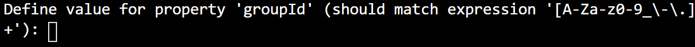
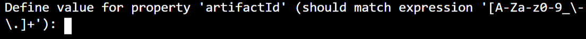

In the previous unit, you learned how to set up your development environment, and we discussed how you can use Maven's archetypes to create an Azure Function project.

You want to create a quick Java API to help you understand the steps you need to take to move Java application code into Azure Functions. You're experience of Java development and using Maven has led you to using the `azure-functions-archetype` to quickly create an Azure Function project.

In this exercise, you'll create an Azure Function using the Maven archetype using the Azure Cloud Shell, and ensure that all the build files are correctly configured.

[!include[](../../../includes/azure-sandbox-activate.md)]

## Create an Azure Function with Maven

You're now going to create an Azure Function using Maven.  This exercise will use the Azure Cloud Shell available from your sandbox.

1. Activate the sandbox, and wait for the Azure Cloud Shell terminal to open.

1. Run the following command:

    ```bash
    mvn archetype:generate "-DarchetypeGroupId=com.microsoft.azure" "-DarchetypeArtifactId=azure-functions-archetype"
    ```

    The image below shows what it will look like in the CLI.

    
    This will instruct Maven to build a new project using the azure-functions-archetype.  Maven will now download all associated artifacts and libraries.

    You will be prompted to enter in values.  The table below shows the values you will need to use.

    | Field | Value |
    | ---- | ---- |
    | groupId | com.contoso.functions |
    | artifactId | contoso-functions |
    | version | Accept the default supplied |
    | package | Accept the default supplied |
    | appName | Accept the default supplied |
    | appRegion | Accept the default supplied |
    | resourceGroup | <rgn>[sandbox resource group name]</rgn> |

1. You'll now be asked to enter in the groupId.

    

1. Enter in: **com.contoso.functions** and press return.

1. You'll now be asked to enter in the artifactId.

    

1. Enter in: **contoso-functions** and press return.

1. For the version, package, appName, appRegion, and ResourceGroup, accept the default and press return.

1. You'll be asked to confirm the properties for the configuration of the Azure Function. Enter: **Y** to confirm and press return.

1. When Maven has finished building the archetype project, you'll see a summary of the parameters used and a confirmation message.  

    ```console
    [INFO] ----------------------------------------------------------------------------
    [INFO] Using following parameters for creating project from Archetype: azure-functions-archetype:1.24
    [INFO] ----------------------------------------------------------------------------
    [INFO] Parameter: groupId, Value: com.contoso.functions
    [INFO] Parameter: artifactId, Value: contoso-functions
    [INFO] Parameter: version, Value: 1.0-SNAPSHOT
    [INFO] Parameter: package, Value: com.contoso.functions
    [INFO] Parameter: packageInPathFormat, Value: com/contoso/functions
    [INFO] Parameter: appName, Value: contoso-functions-20191015135337794
    [INFO] Parameter: resourceGroup, Value: Learn-9b071e66-308b-4dcb-a993-007c25b06191
    [INFO] Parameter: package, Value: com.contoso.functions
    [INFO] Parameter: version, Value: 1.0-SNAPSHOT
    [INFO] Parameter: groupId, Value: com.contoso.functions
    [INFO] Parameter: appRegion, Value: westus
    [INFO] Parameter: artifactId, Value: contoso-functions
    [INFO] Project created from Archetype in dir: /home/phillip/contoso-functions
    [INFO] ------------------------------------------------------------------------
    [INFO] BUILD SUCCESS
    [INFO] ------------------------------------------------------------------------
    [INFO] Total time: 01:17 min
    [INFO] Finished at: 2019-10-15T13:54:02+00:00
    [INFO] Final Memory: 19M/152M
    [INFO] ------------------------------------------------------------------------
    ```

1. The Azure Function has been created.
