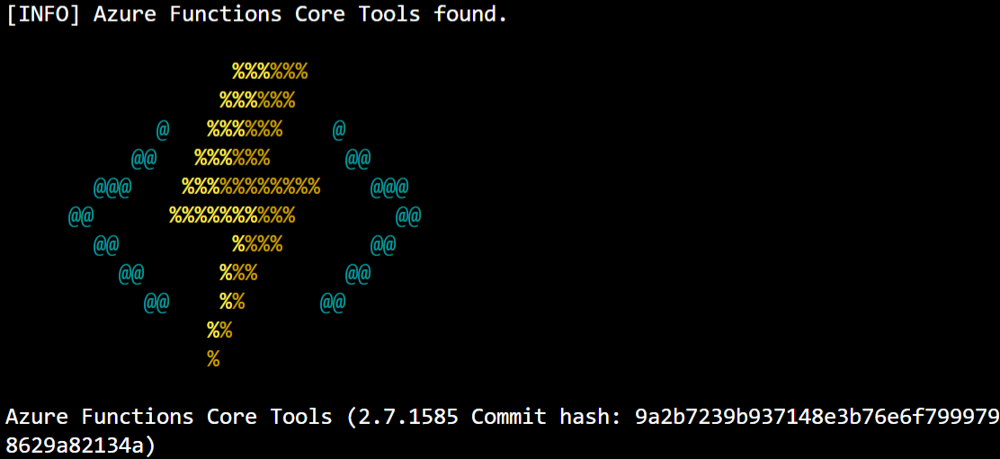

In the previous exercise, you created an Azure Function project using an Azure Maven archetype. Your next task is to build your function and run it locally to verify that it works.

In this unit, you learn about the Azure Functions Core Tools, which help you run and test your functions locally. You also learn how to open an HTTP port for testing, how to run your function in the Cloud Shell, and how to test your function in a web browser.

## About Azure Functions Core Tools

Azure Functions Core Tools are a suite of utilities for building and testing Azure Functions locally using a terminal emulator or command prompt. Even though the Azure Functions you create are running locally, they can access live Azure services during your testing. When you complete your testing and your function is ready to publish, you can deploy your function application to your Azure subscription.

At this time, there are three versions of the Azure Functions Core Tools. However, as a general rule, unless you have a specific need to use an earlier version, you should always use the latest version when you're developing functions for deployment to Azure. For this module, you use the Azure Cloud Shell in the Learn sandbox, which has the latest version of the Azure Functions Core Tools.

> [!NOTE]
>
> If you used your personal Azure account instead of the Cloud Shell in the Learn sandbox, you would need to consult [Work with Azure Functions Core Tools](/azure/azure-functions/functions-run-local) for descriptions, requirements, and installation instructions for the different versions of the Azure Functions Core Tools.
>

## Configuring the Cloud Shell environment for testing

When you're testing a web-based application that runs in the Cloud Shell, you have two different ways of testing the application:

1. You can use the Cloud Shell to open an external port for testing, which routes HTTP requests to the localhost port of your Cloud Shell instance:

    - To open port 7071 from the Cloud Shell, use the following cURL command:

        ```bash
        curl -X POST http://localhost:8888/openPort/7071
        ```

    - When you complete your testing, use the following cURL command to close the port:

        ```bash
        curl -X POST http://localhost:8888/closePort/7071
        ```

1. You can open multiple instances of the Cloud Shell to test the application locally:

    - You would run the application in the first instance.

    - You would use cURL to test the application from the second instance.

In the next exercise, you use the first method to open a port.

## Running your function in the Cloud Shell

Once you open a port for testing, your next task is to build and execute your function. To do so, use the following steps:

1. In the Cloud Shell, change directory to the root folder of your project.

1. To build your application, use the following Maven command:

    ```bash
    mvn clean package
   ```

1. To run the application, use the following Maven command:

    ```bash
    mvn azure-functions:run
    ```

    While Maven is preparing the runtime environment for your function, you see the Azure Functions Core Tools logo displayed:

    

1. Once you complete your testing, use the <kbd>CTRL+C</kbd> command from the Azure Cloud Shell to stop the server.

## Testing your function using HTTP requests

In this module, you use a single instance of the Cloud Shell. As a result, you need to test your application by opening a new tab in your web browser. In the browser's address bar, enter a URL that resembles the following example:

```
https://gateway.westus.console.azure.com/n/cc-12345678/cc-12345678/proxy/7071/api/HttpExample?name=Bob
```

However, if you're using multiple instances of the Cloud Shell, you could use the following cURL command to test your application from a separate instance of the shell:

```bash
curl http://localhost:7071/api/HttpExample?name=Bob
```

In the next exercise, you use what you learned in this unit. You open a testing port, run your function in the Cloud Shell, and determine the URL that you need to use in order to test your function from a web browser.