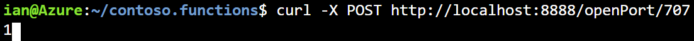
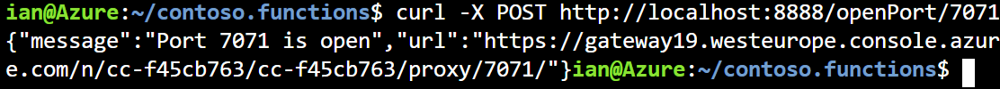
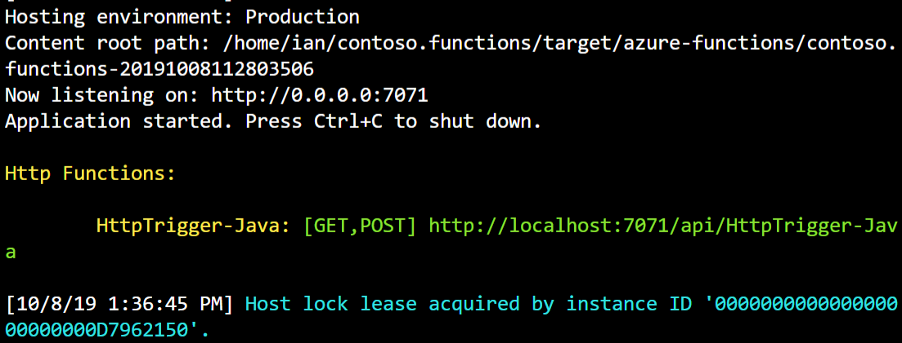

The creation of the serverless web service Azure Function from a Maven archetype has been created. You have checked the configuration to be certain it is using the azure-functions-tools, and the extension bundes.

Now you will learn how to run the function using the Azure Cloud Shell and test that it behavies as a serverless web function.

In this unit, you'll learn how to open a port for your Azure function, run the appllication locally through the Azure Cloud Shell and test that the function runs as expected.

## Opening port 7071

Before you can run the function, first you need to open port 7071.  This is the port assicated with the function and the serverless web function will not work unless it has been enabled.

1. Return to you sandbox, and the Azure Cloud Shell.
1. Use the following curl command to open the port.

    ```BASH
    curl -X POST http://localhost:8888/openPort/7071;
    ```

    It should look like this:

    

    When the port is open, you will see a message displayed.  It will look something like this:

    

    Here is a plantext version of the above.

    ```JSON
    {"message":"Port 7071 is open","url":"https://gateway19.westeurope.console.azure.com/n/cc-f45cb763/cc-f45cb763/proxy/7071/"}
    ```

    Make a note of the url as you will need it later.  In the above example the url is: https://gateway19.westeurope.console.azure.com/n/cc-f45cb763/cc-f45cb763/proxy/7071/

## Running the function in Azure Cloud Shell

Now that the port has been opened, you are able to run the function.  There is one step to carry out before you run the function and that is to perform a clean build.  This will ensure the latest changes are used.  This is useful if you had to make any changes during the previous exercise.

1. From the Azure cloud shell, run the following Maven command from root.

    ```BASH
    cd ~/contoso-functions
    mvn clean package
    ```

1. When the function has been built successfully you are ready to run it.  Use this Maven command to run the function.

    ```BASH
    mvn azure-functions:run
    ```

This Maven command will execute the function.  You will notice the first time that it runs, that it downloads dozens of files.  These are the dependencies listed in the POM and host.json files.

During the build process you will see the Azure Functions Core Tools logo displayed:


When the build process is completed, the function is run automatically creating a serverless web function that will wait for a trigger.  

When the function is running you will this on the screen.



## Testing the function from your web browser

To test the function is running correctly, you'll:

1. Open a new tab in your web browser.

1. You will need to build the test URL.

1. The first part of this comes from the the http address displayed when you opened the port.  Using the above example we have this:

    ```URL
    https://gateway19.westeurope.console.azure.com/n/cc-f45cb763/cc-f45cb763/proxy/7071/
    ```

1. To this, you need to append:

    ```TXT
    api/HttpTrigger-Java?name=[DISPLAYNAME]
    ```

    You should replace [DISPLAYNAME] with a suitable alternative, like Bill. 

1. This will give you the URL you can use to test the function.

    ```URL
    https://gateway19.westeurope.console.azure.com/n/cc-f45cb763/cc-f45cb763/proxy/7071/api/HttpTrigger-Java?name=Bill
    ```

1. Copy the constructed URL to the URL address line of your browser and press return.
1. You will see a plain message appear in the browser view that says "Hello, Bill".  You can change the name in the URL as often as you like and the resulting page should echo back the name you used.
